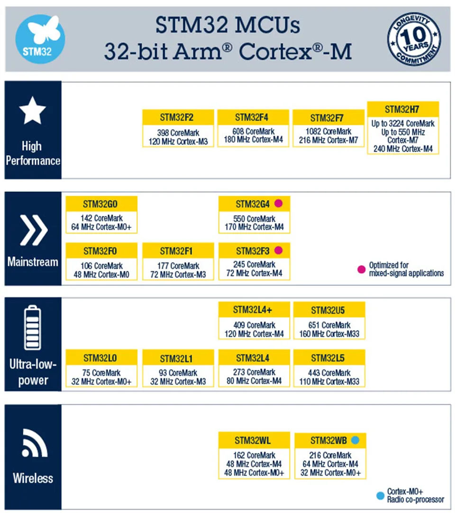
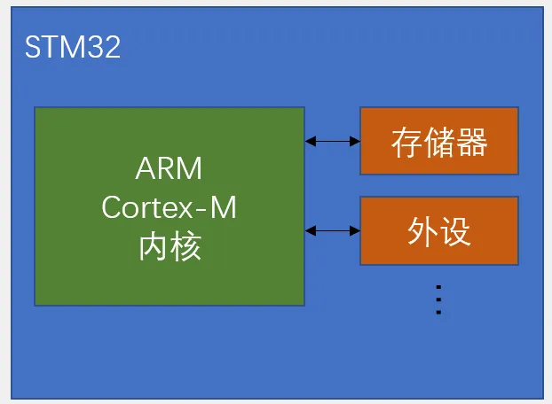
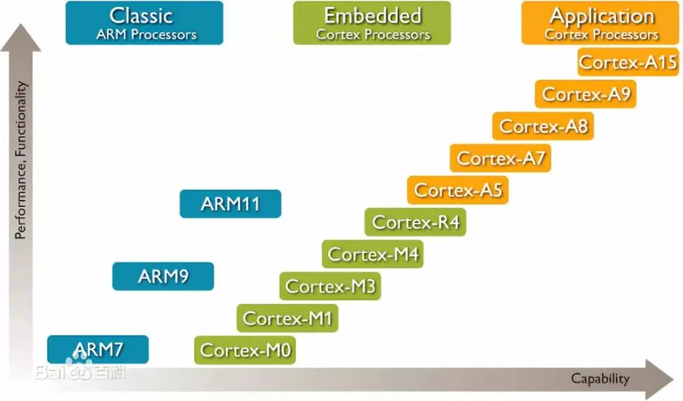
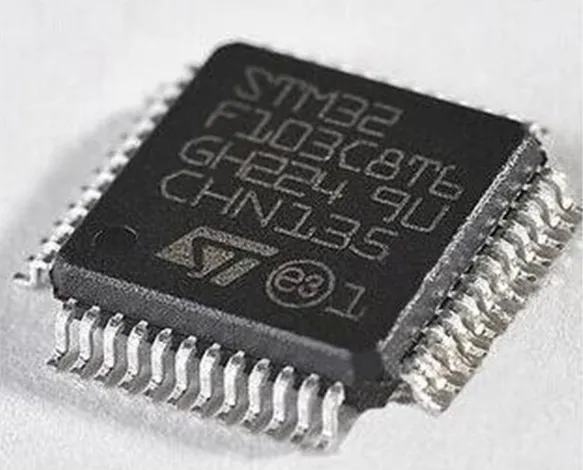
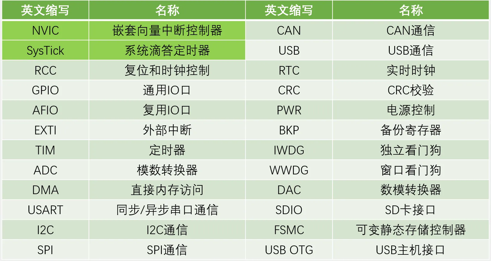
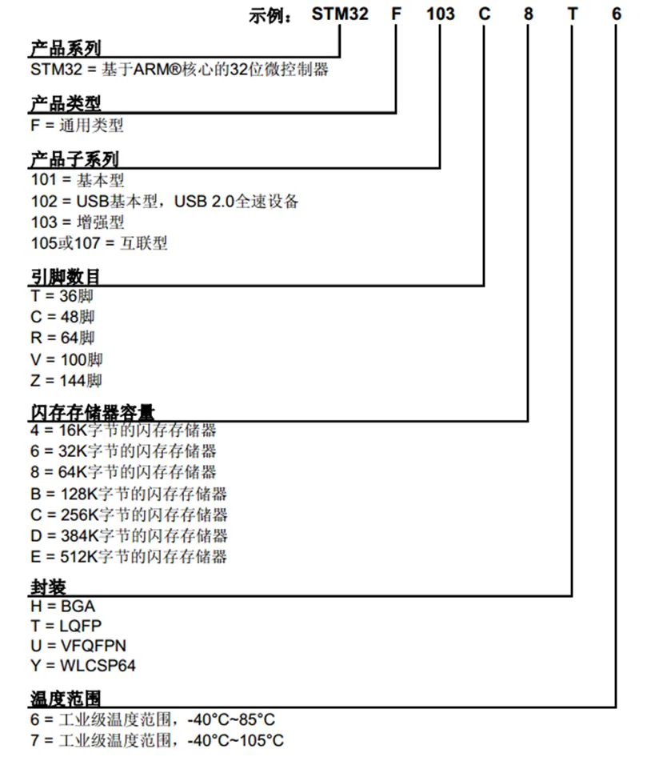
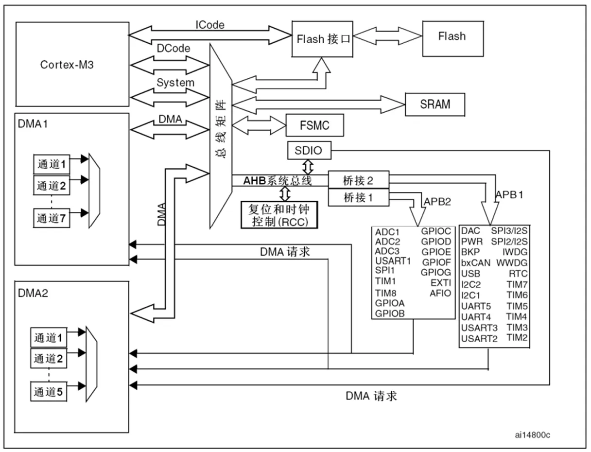
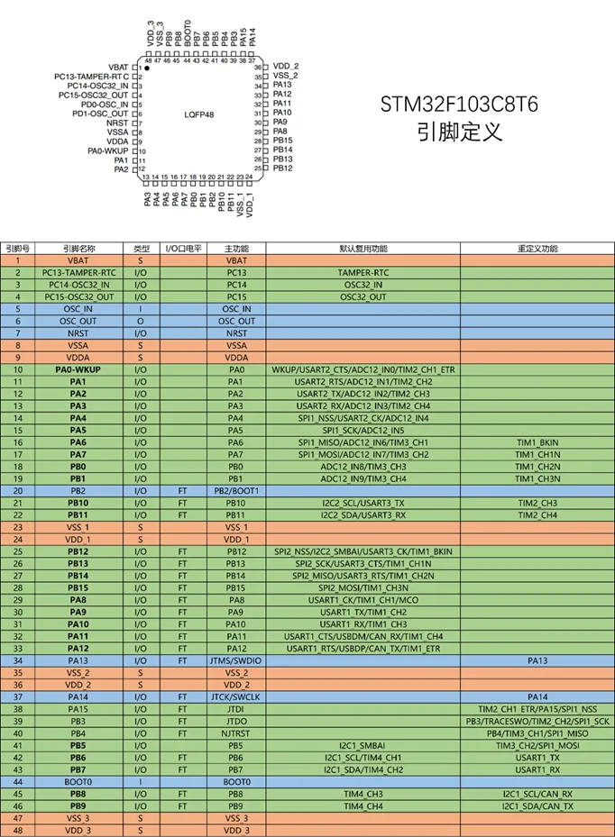
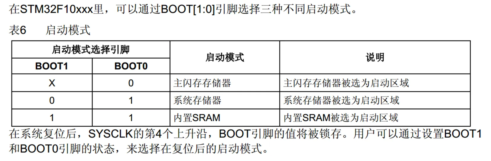
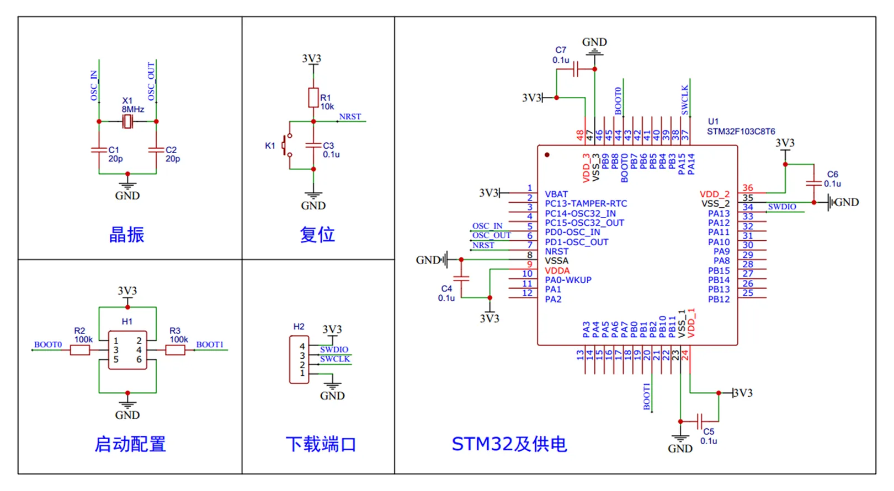

## [1-1]课程简介
### **硬件设备**
STM32面包板入门套件

Windows电脑

万用表、示波器、镊子、剪刀等

### **软件设备**
Keil5 MDK

## [1-2] STM32简介
### STM32简介
STM32是ST公司基于ARM Cortex-M内核开发的32位微控制器

STM32常应用在嵌入式领域，如智能车、无人机、机器人、无线通信、物联网、工业控制、娱乐电子产品等

STM32功能强大、性能优异、片上资源丰富、功耗低，是一款经典的嵌入式微控制器

### **ARM**
ARM既指ARM公司，也指ARM处理器内核

ARM公司是全球领先的半导体知识产权（IP）提供商，全世界超过95%的智能手机和平板电脑都采用ARM架构

ARM公司设计ARM内核，半导体厂商完善内核周边电路并生产芯片

### STM32F103C8T6
系列：主流系列STM32F1

内核：ARM Cortex-M3

主频：72MHz

RAM：20K（SRAM）

ROM：64K（Flash）

供电：2.0~3.6V（标准3.3V）

封装：LQFP48

### 片上资源/外设

### 命名规则

### 系统结构

### 引脚定义

### 启动配置

### 最小系统电路
