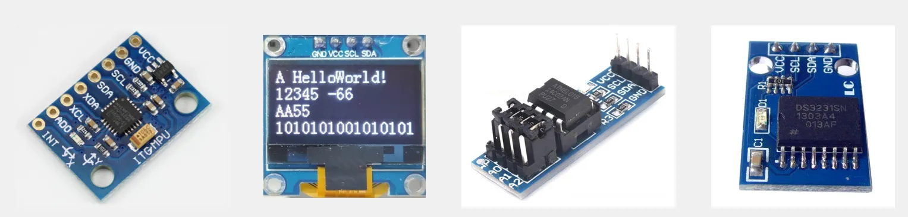
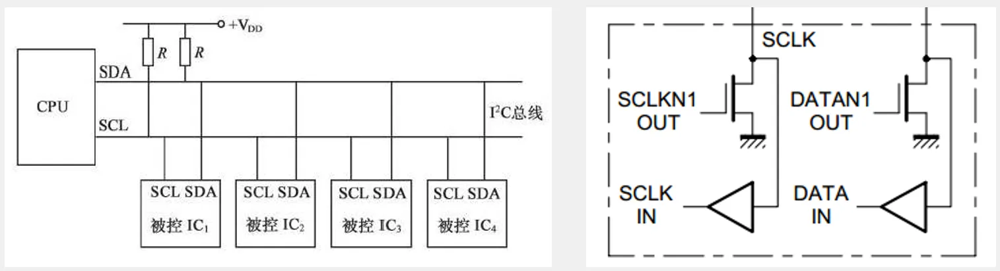
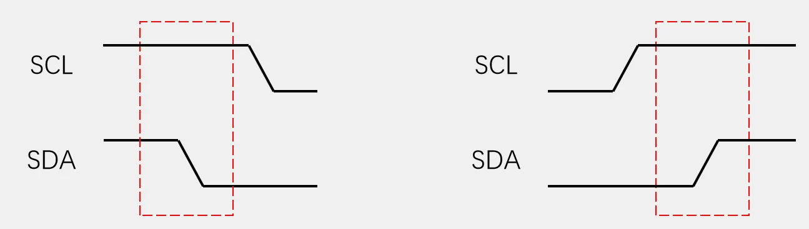
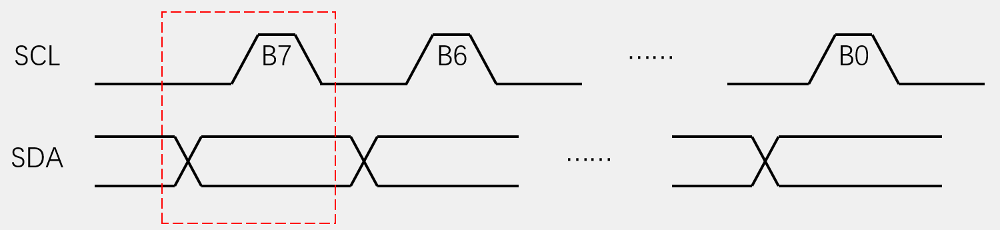
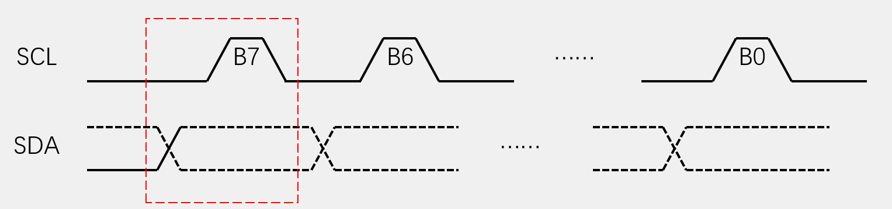
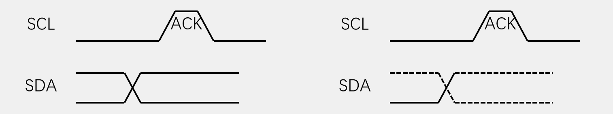
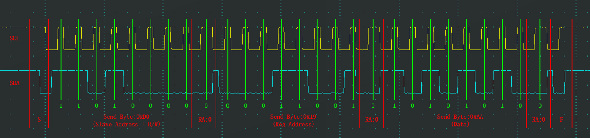
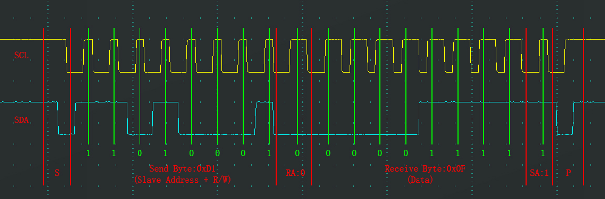
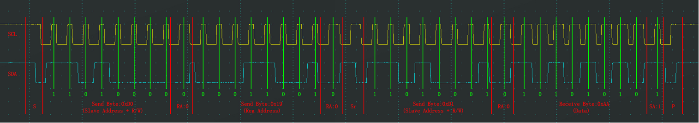

# 第十章 I2C通信
## [10-1] I2C通信协议
### I2C通信
I2C（Inter IC Bus）是由Philips公司开发的一种通用数据总线

两根通信线：SCL（Serial Clock）、SDA（Serial Data）

同步，半双工

带数据应答

支持总线挂载多设备（一主多从、多主多从）

### 硬件电路
所有I2C设备的SCL连在一起，SDA连在一起

设备的SCL和SDA均要配置成开漏输出模式

SCL和SDA各添加一个上拉电阻，阻值一般为4.7KΩ左右

### I2C时序基本单元
起始条件：SCL高电平期间，SDA从高电平切换到低电平

终止条件：SCL高电平期间，SDA从低电平切换到高电平

发送一个字节：SCL低电平期间，主机将数据位依次放到SDA线上（高位先行），然后释放SCL，从机将在SCL高电平期间读取数据位，所以SCL高电平期间SDA不允许有数据变化，依次循环上述过程8次，即可发送一个字节

接收一个字节：SCL低电平期间，从机将数据位依次放到SDA线上（高位先行），然后释放SCL，主机将在SCL高电平期间读取数据位，所以SCL高电平期间SDA不允许有数据变化，依次循环上述过程8次，即可接收一个字节（主机在接收之前，需要释放SDA）

发送应答：主机在接收完一个字节之后，在下一个时钟发送一位数据，数据0表示应答，数据1表示非应答接收应答：主机在发送完一个字节之后，在下一个时钟接收一位数据，判断从机是否应答，数据0表示应答，数据1表示非应答（主机在接收之前，需要释放SDA）

### I2C时序
指定地址写

对于指定设备（Slave Address），在指定地址（Reg Address）下，写入指定数据（Data）

当前地址读

对于指定设备（Slave Address），在当前地址指针指示的地址下，读取从机数据（Data）

指定地址读

对于指定设备（Slave Address），在指定地址（Reg Address）下，读取从机数据（Data）

**总结**

+ **谁控制SCL频率？** **主机**，且**始终**是主机。
+ **从机如何知道频率？** **不需要知道具体数值**，它只需要在硬件上能够**实时响应**主机产生的SCL时钟沿。
+ **数据传输方向改变（读操作）会影响SCL控制权吗？** **不会**。即使是从机在向主机发送数据位，那个“读数据的时钟”依然是主机在提供。