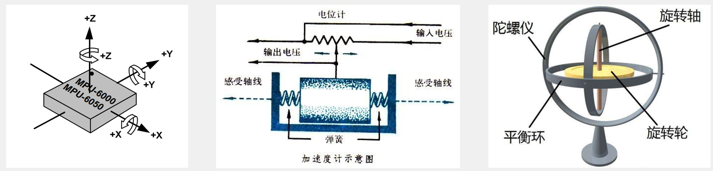
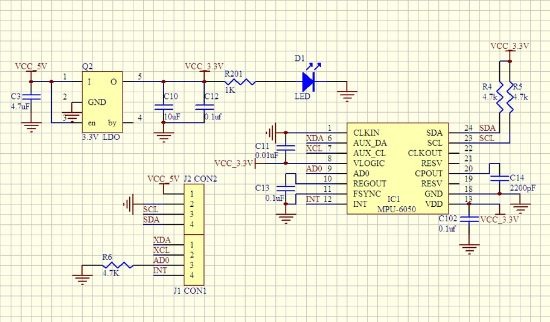
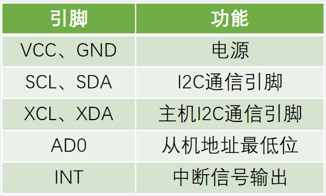
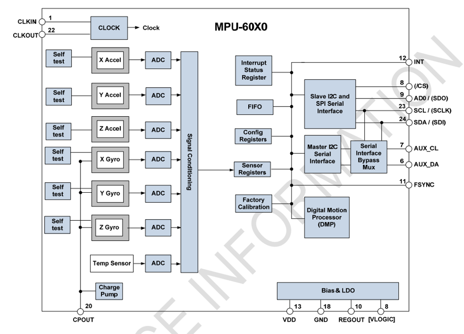

## [10-2] MPU6050简介
### MPU6050简介
MPU6050是一个6轴姿态传感器，可以测量芯片自身X、Y、Z轴的加速度、角速度参数，通过数据融合，可进一步得到姿态角，常应用于平衡车、飞行器等需要检测自身姿态的场景

3轴加速度计（Accelerometer）：测量X、Y、Z轴的加速度

3轴陀螺仪传感器（Gyroscope）：测量X、Y、Z轴的角速度

### MPU6050参数
16位ADC采集传感器的模拟信号，量化范围：-32768~32767

加速度计满量程选择：±2、±4、±8、±16（g）

陀螺仪满量程选择： ±250、±500、±1000、±2000（°/sec）

可配置的数字低通滤波器

可配置的时钟源

可配置的采样分频I

2C从机地址：1101000（AD0=0）

                   1101001（AD0=1）

### 硬件电路

### MPU6050框图

