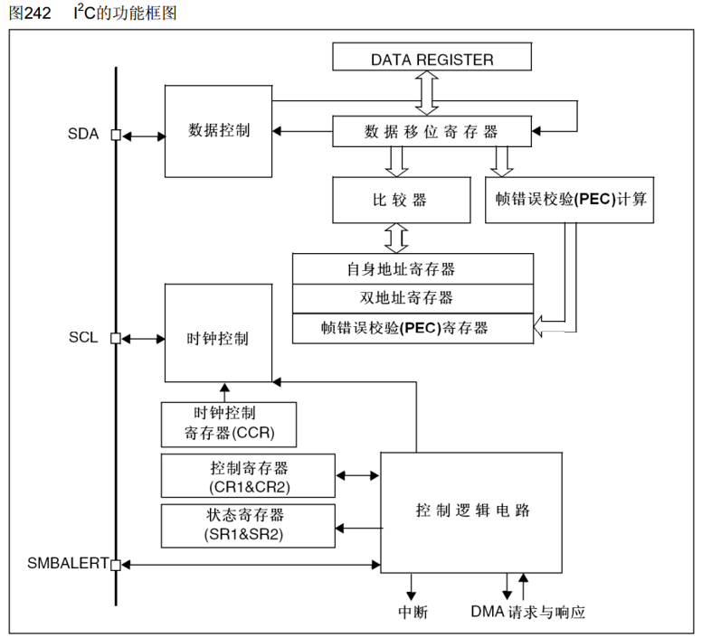
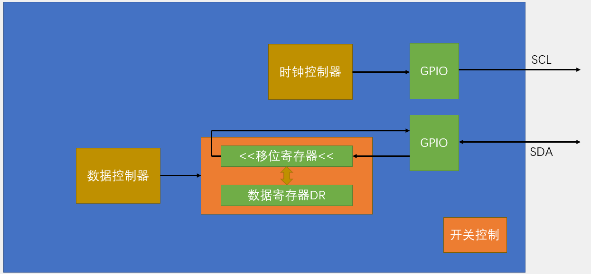
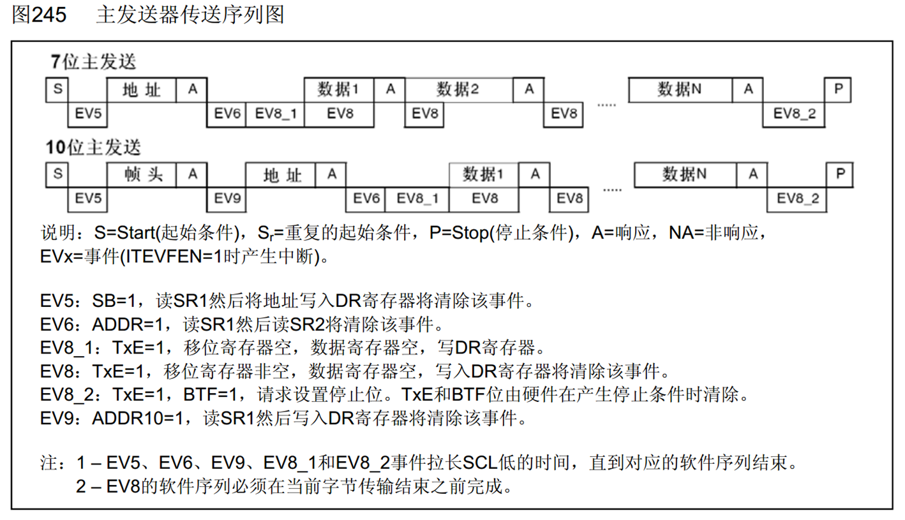
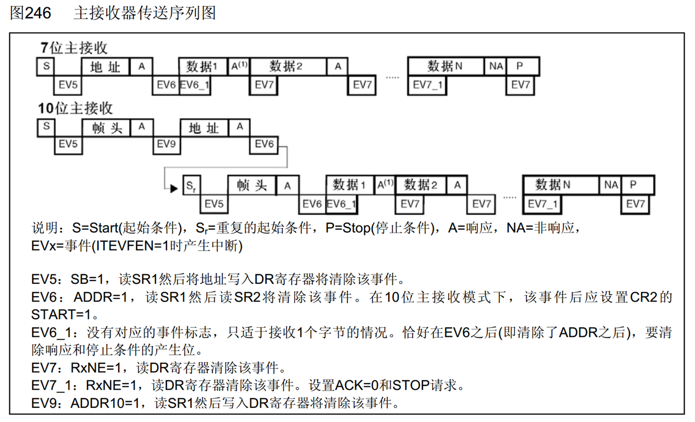
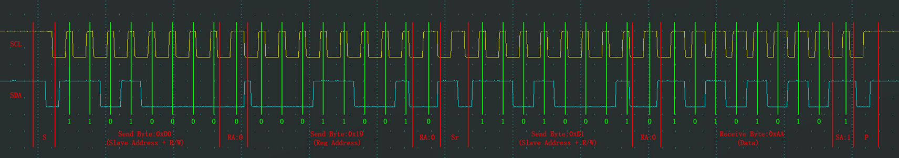
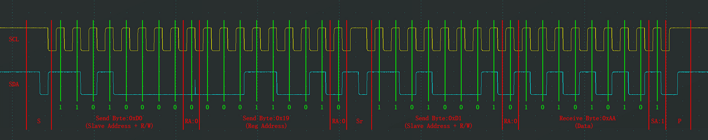

## [10-4] I2C通信外设
### I2C外设简介
STM32内部集成了硬件I2C收发电路，可以由硬件自动执行时钟生成、起始终止条件生成、应答位收发、数据收发等功能，减轻CPU的负担

支持多主机模型

支持7位/10位地址模式

支持不同的通讯速度，标准速度(高达100 kHz)，快速(高达400 kHz)

支持DMA

兼容SMBus协议

STM32F103C8T6 硬件I2C资源：I2C1、I2C2

### I2C框图

### I2C基本结构

### 主机发送

### 主机接收

### 软件/硬件波形对比

