# 第十一章 SPI通信
## [11-1] SPI通信协议
### SPI通信
SPI（Serial Peripheral Interface）是由Motorola公司开发的一种通用数据总线

四根通信线：SCK（Serial Clock）、MOSI（Master Output Slave Input）、MISO（Master Input Slave Output）、SS（Slave Select）

同步，全双工

支持总线挂载多设备（一主多从）

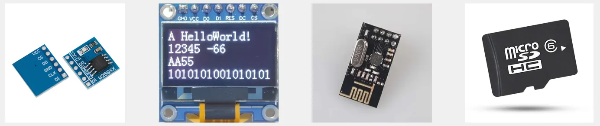

### 硬件电路
所有SPI设备的SCK、MOSI、MISO分别连在一起

主机另外引出多条SS控制线，分别接到各从机的SS引脚

输出引脚配置为推挽输出，输入引脚配置为浮空或上拉输入

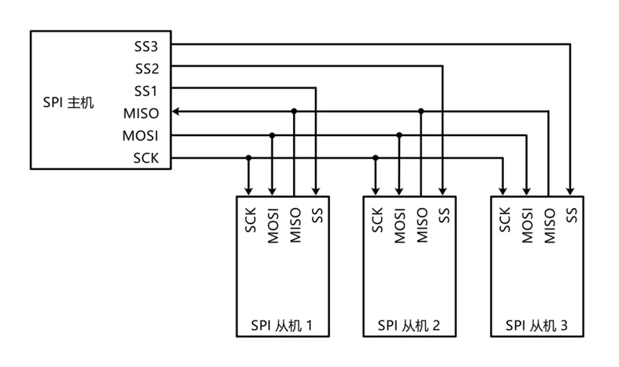

### 移位示意图

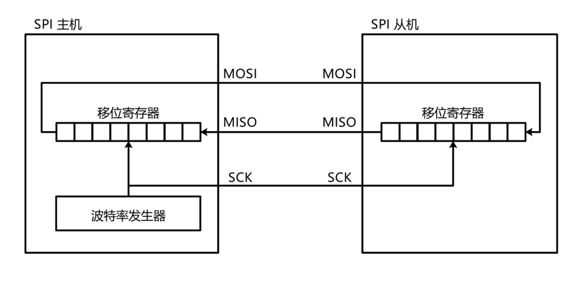

### SPI时序基本单元
起始条件：SS从高电平切换到低电平

终止条件：SS从低电平切换到高电平

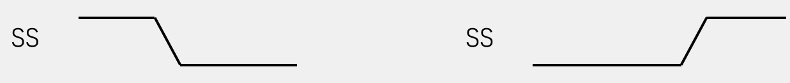

交换一个字节（模式0）

CPOL=0：空闲状态时，SCK为低电平

CPHA=0：SCK第一个边沿移入数据，第二个边沿移出数据

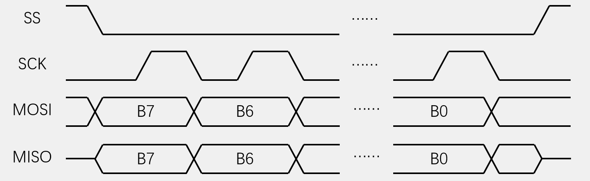

交换一个字节（模式1）

CPOL=0：空闲状态时，SCK为低电平

CPHA=1：SCK第一个边沿移出数据，第二个边沿移入数据

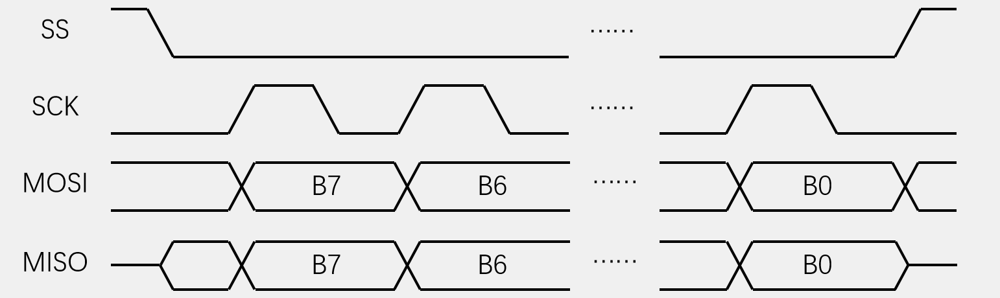

交换一个字节（模式2）

CPOL=1：空闲状态时，SCK为高电平

CPHA=0：SCK第一个边沿移入数据，第二个边沿移出数据

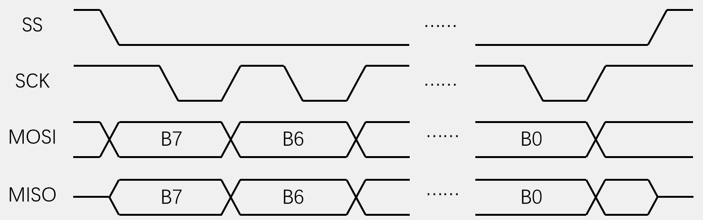

交换一个字节（模式3）

CPOL=1：空闲状态时，SCK为高电平

CPHA=1：SCK第一个边沿移出数据，第二个边沿移入数据

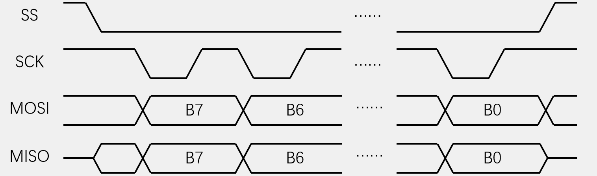

### SPI时序
发送指令

向SS指定的设备，发送指令（0x06）

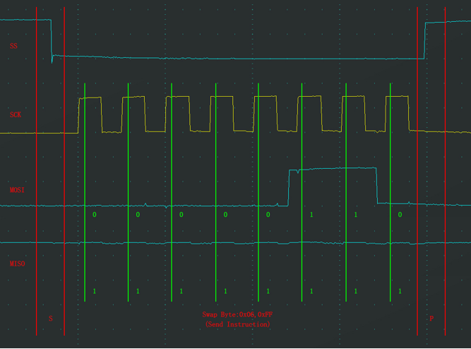

指定地址写

向SS指定的设备，发送写指令（0x02），

随后在指定地址（Address[23:0]）下，写入指定数据（Data）

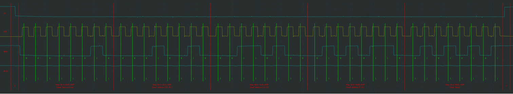

指定地址读

向SS指定的设备，发送读指令（0x03），

随后在指定地址（Address[23:0]）下，读取从机数据（Data）

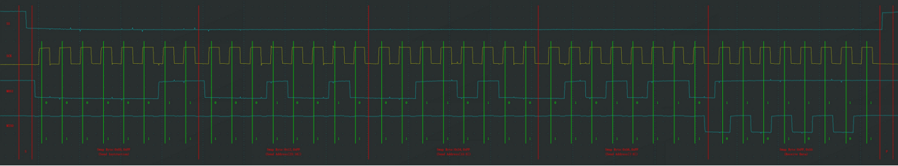