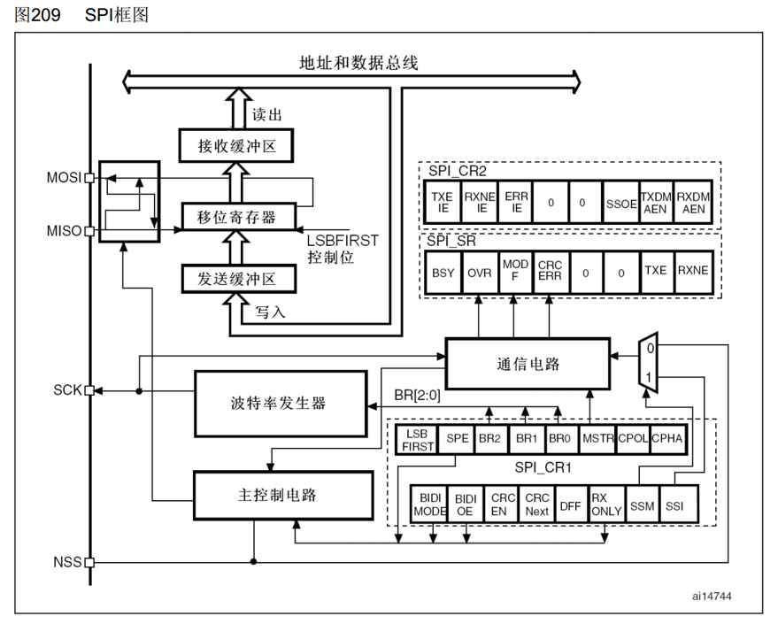
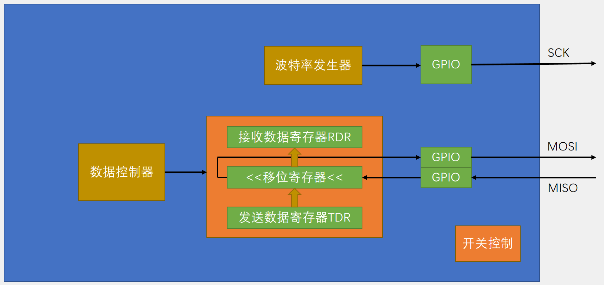
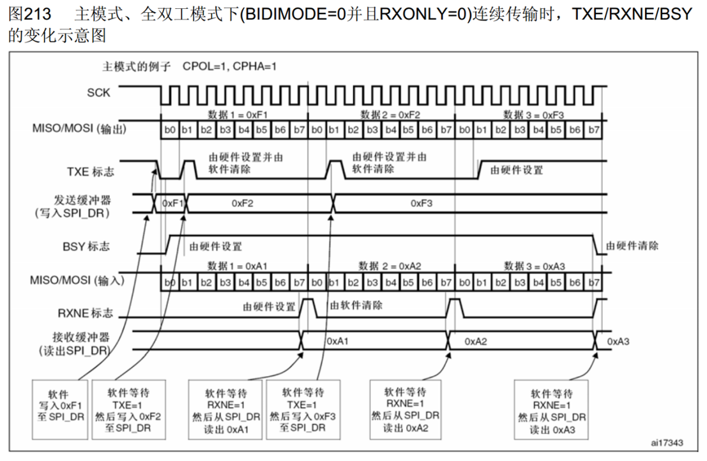
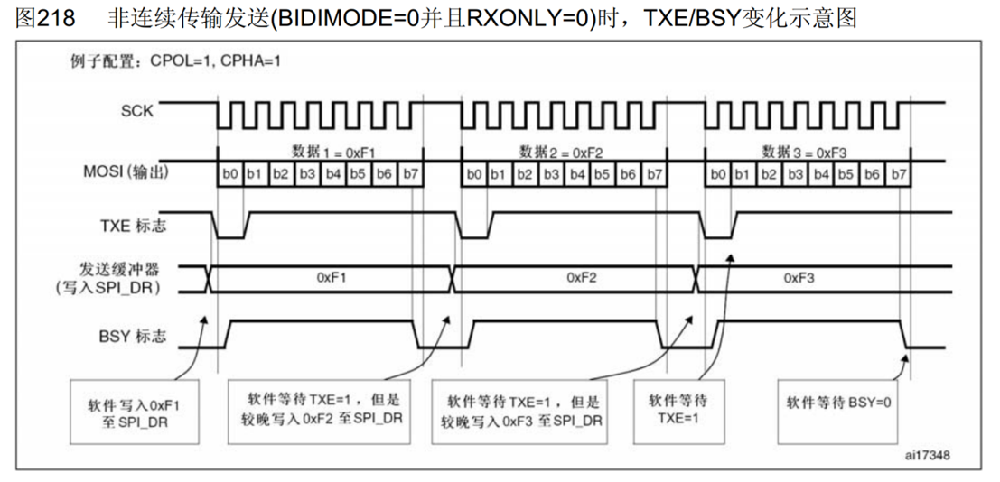
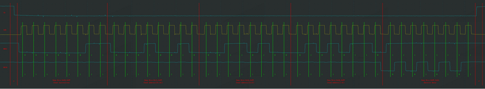
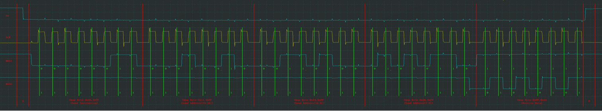

## [11-4] SPI通信外设
### SPI外设简介
STM32内部集成了硬件SPI收发电路，可以由硬件自动执行时钟生成、数据收发等功能，减轻CPU的负担

可配置8位/16位数据帧、高位先行/低位先行

时钟频率： fPCLK / (2, 4, 8, 16, 32, 64, 128, 256)

支持多主机模型、主或从操作

可精简为半双工/单工通信

支持DMA兼容

I2S协议

STM32F103C8T6 硬件SPI资源：SPI1、SPI2

### SPI框图

### SPI基本结构

### 主模式全双工连续传输

### 非连续传输

### 软件/硬件波形对比

