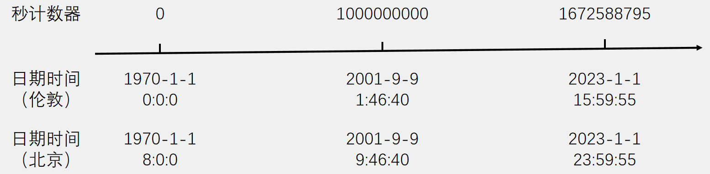
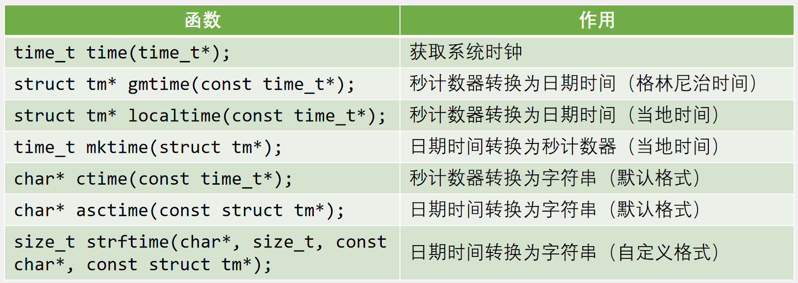
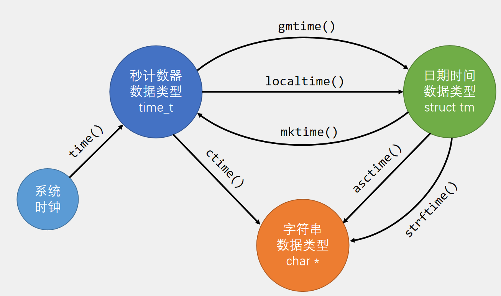

# 第十二章 RTC实时时钟
## [12-1] Unix时间戳
### Unix时间戳
Unix 时间戳（Unix Timestamp）定义为从UTC/GMT的1970年1月1日0时0分0秒开始所经过的秒数，不考虑闰秒

时间戳存储在一个秒计数器中，秒计数器为32位/64位的整型变量

世界上所有时区的秒计数器相同，不同时区通过添加偏移来得到当地时间



### UTC/GMT
GMT（Greenwich Mean Time）格林尼治标准时间是一种以地球自转为基础的时间计量系统。它将地球自转一周的时间间隔等分为24小时，以此确定计时标准

UTC（Universal Time Coordinated）协调世界时是一种以原子钟为基础的时间计量系统。它规定铯133原子基态的两个超精细能级间在零磁场下跃迁辐射9,192,631,770周所持续的时间为1秒。当原子钟计时一天的时间与地球自转一周的时间相差超过0.9秒时，UTC会执行闰秒来保证其计时与地球自转的协调一致

### 时间戳转换
C语言的time.h模块提供了时间获取和时间戳转换的相关函数，可以方便地进行秒计数器、日期时间和字符串之间的转换



### 时间戳转换



```c
#include <stdio.h>
#include <time.h>

time_t time_cnt;
struct tm time_date;
char *time_str;

int main(void)
{
    // time_cnt = time(NULL);
    // time(&time_cnt);
    time_cnt = 1672588795;
    printf("%d\n", time_cnt);

    time_date = *gmtime(&time_cnt);
    printf("%d\n", time_date.tm_year);
    printf("%d\n", time_date.tm_mon);
    printf("%d\n", time_date.tm_mday);
    printf("%d\n", time_date.tm_hour);
    printf("%d\n", time_date.tm_min);
    printf("%d\n", time_date.tm_sec);
    printf("%d\n", time_date.tm_wday);

    return 0;
}
```