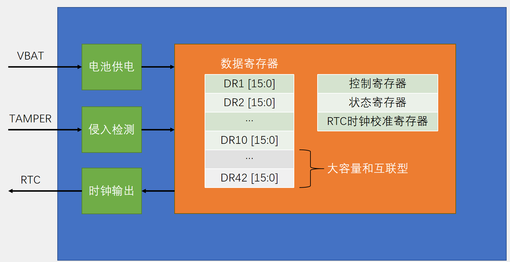
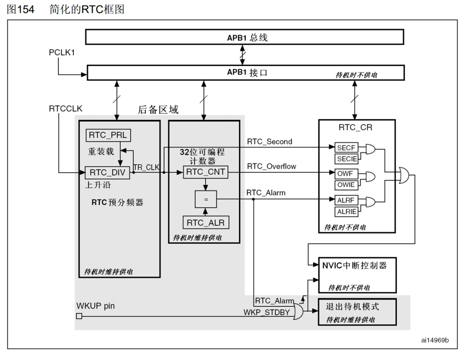
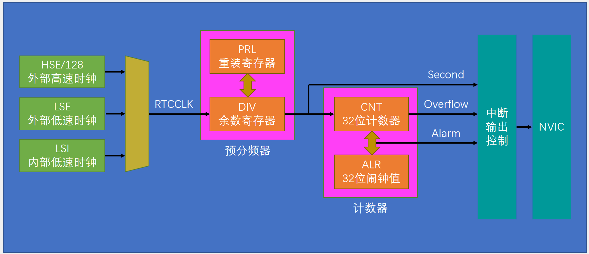
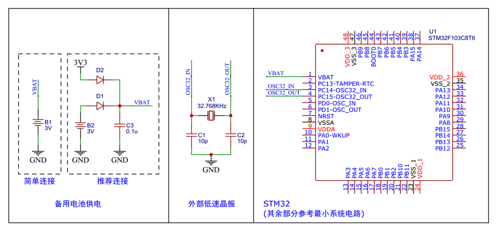
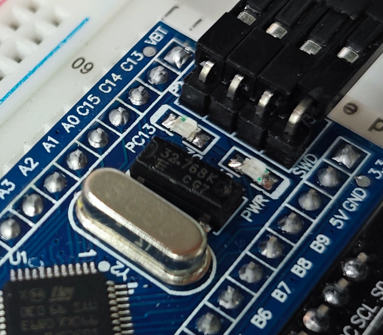

## [12-2] BKP备份寄存器&RTC实时时钟
### BKP简介
BKP（Backup Registers）备份寄存器

BKP可用于存储用户应用程序数据。当VDD（2.0~3.6V）电源被切断，他们仍然由VBAT（1.8~3.6V）维持供电。当系统在待机模式下被唤醒，或系统复位或电源复位时，他们也不会被复位

TAMPER引脚产生的侵入事件将所有备份寄存器内容清除

RTC引脚输出RTC校准时钟、RTC闹钟脉冲或者秒脉冲

存储RTC时钟校准寄存器

用户数据存储容量：

	20字节（中容量和小容量）/ 84字节（大容量和互联型）

### BKP基本结构

### RTC简介
RTC（Real Time Clock）实时时钟

RTC是一个独立的定时器，可为系统提供时钟和日历的功能

RTC和时钟配置系统处于后备区域，系统复位时数据不清零，VDD（2.0~3.6V）断电后可借助VBAT（1.8~3.6V）供电继续走时

32位的可编程计数器，可对应Unix时间戳的秒计数器

20位的可编程预分频器，可适配不同频率的输入时钟

可选择三种RTC时钟源：

	HSE时钟除以128（通常为8MHz/128）

	LSE振荡器时钟（通常为32.768KHz）

	LSI振荡器时钟（40KHz）

### RTC框图

### RTC基本结构

### 硬件电路

### RTC操作注意事项
执行以下操作将使能对BKP和RTC的访问：

- 设置RCC_APB1ENR的PWREN和BKPEN，使能PWR和BKP时钟

- 设置PWR_CR的DBP，使能对BKP和RTC的访问

若在读取RTC寄存器时，RTC的APB1接口曾经处于禁止状态，则软件首先必须等待RTC_CRL寄存器中的RSF位（寄存器同步标志）被硬件置1

必须设置RTC_CRL寄存器中的CNF位，使RTC进入配置模式后，才能写入RTC_PRL、RTC_CNT、RTC_ALR寄存器

对RTC任何寄存器的写操作，都必须在前一次写操作结束后进行。可以通过查询RTC_CR寄存器中的RTOFF状态位，判断RTC寄存器是否处于更新中。仅当RTOFF状态位是1时，才可以写入RTC寄存器