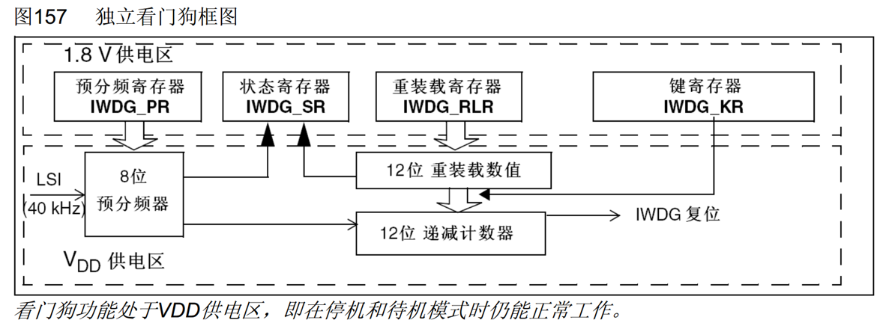
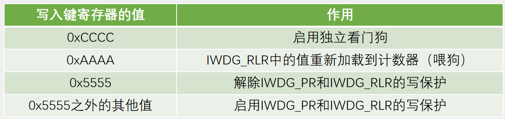
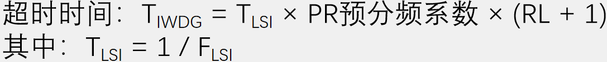
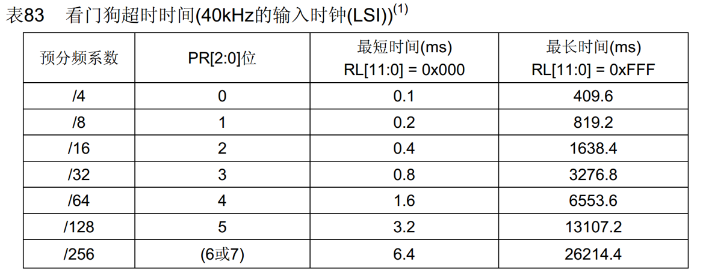
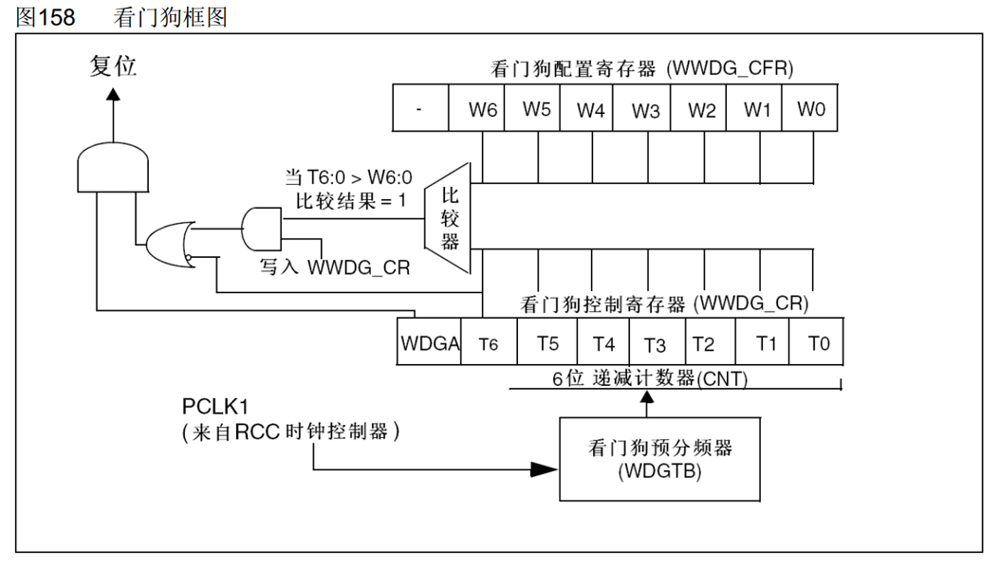
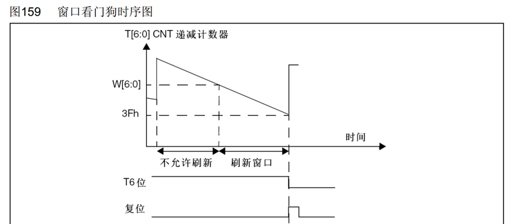
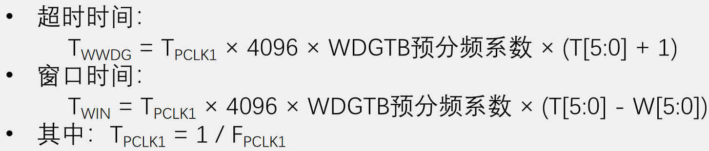
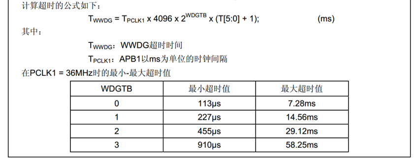
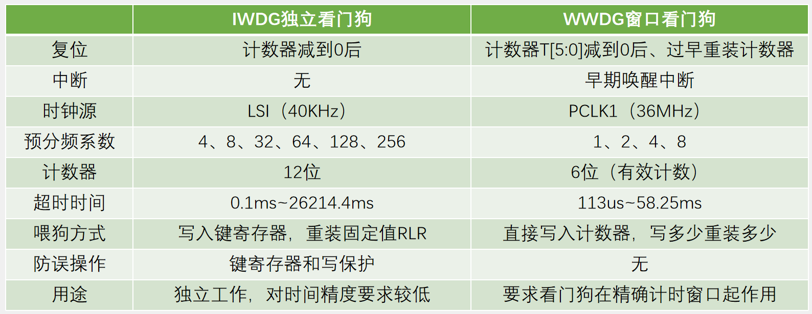

# 第十四章 WDG看门狗
## [14-1] WDG看门狗
### WDG简介
WDG（Watchdog）看门狗看门狗

可以监控程序的运行状态，当程序因为设计漏洞、硬件故障、电磁干扰等原因，出现卡死或跑飞现象时，看门狗能及时复位程序，避免程序陷入长时间的罢工状态，保证系统的可靠性和安全性

看门狗本质上是一个定时器，当指定时间范围内，程序没有执行喂狗（重置计数器）操作时，看门狗硬件电路就自动产生复位信号

STM32内置两个看门狗	

-  独立看门狗（IWDG）：独立工作，对时间精度要求较低

-	窗口看门狗（WWDG）：要求看门狗在精确计时窗口起作用

### IWDG框图

### IWDG键寄存器
键寄存器本质上是控制寄存器，用于控制硬件电路的工作

在可能存在干扰的情况下，一般通过在整个键寄存器写入特定值来代替控制寄存器写入一位的功能，以降低硬件电路受到干扰的概率

### IWDG超时时间

### WWDG框图

### WWDG工作特性
递减计数器T[6:0]的值小于0x40时，WWDG产生复位

递减计数器T[6:0]在窗口W[6:0]外被重新装载时，WWDG产生复位

递减计数器T[6:0]等于0x40时可以产生早期唤醒中断（EWI），用于重装载计数器以避免WWDG复位

定期写入WWDG_CR寄存器（喂狗）以避免WWDG复位

### WWDG超时时间

### IWDG和WWDG对比

