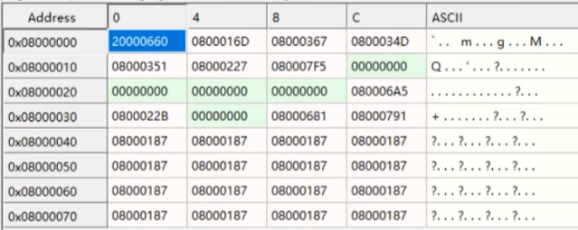
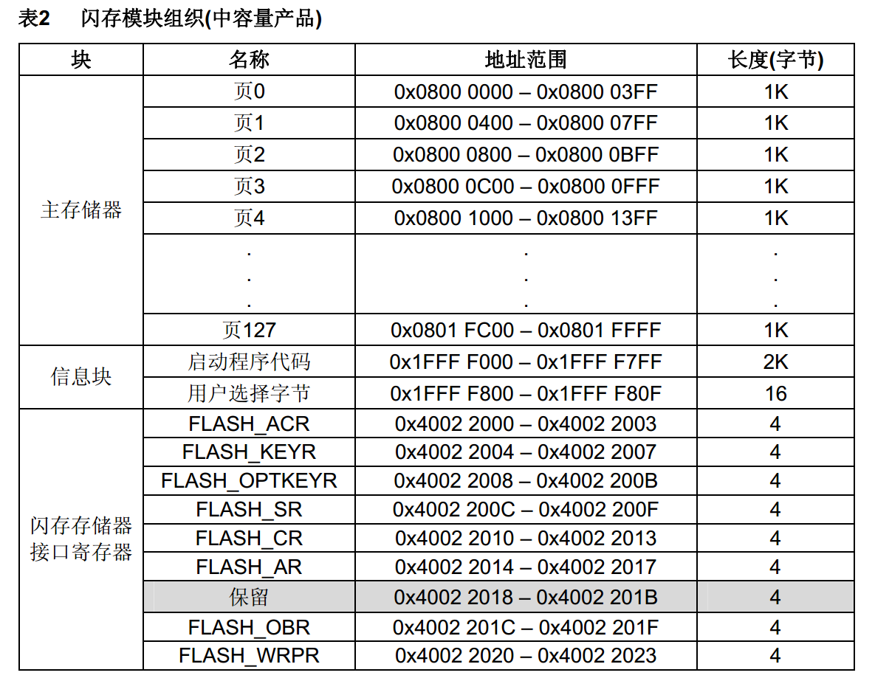
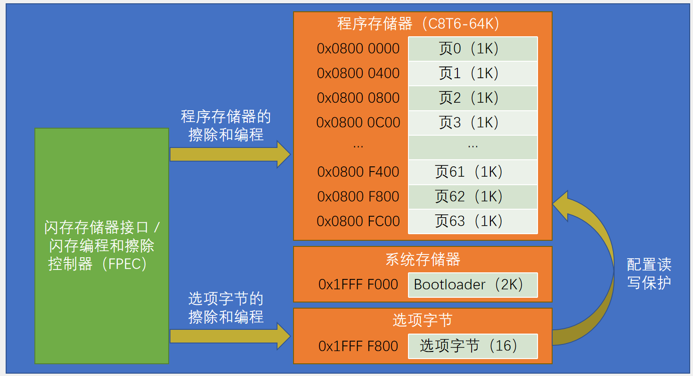
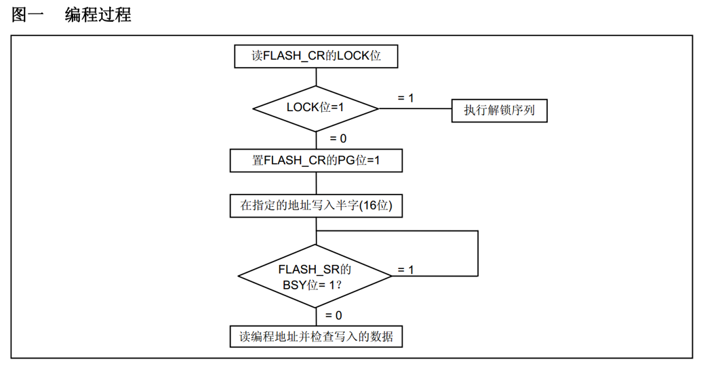
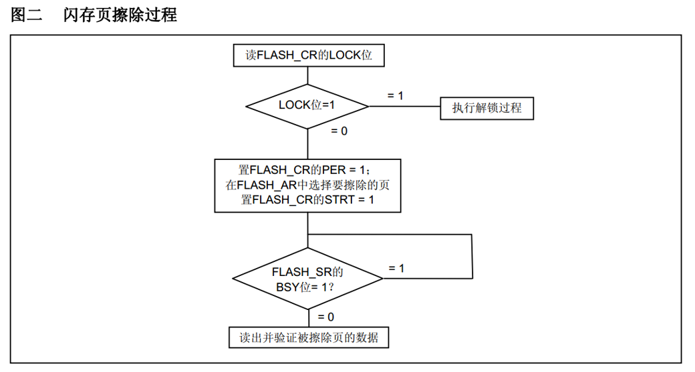
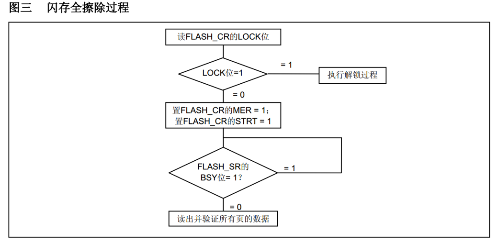
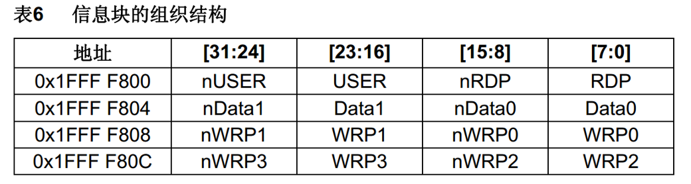

# 第十五章 FLASH闪存
## [15-1] FLASH闪存
### FLASH简介
STM32F1系列的FLASH包含程序存储器、系统存储器和选项字节三个部分，通过闪存存储器接口（外设）可以对程序存储器和选项字节进行擦除和编程

读写FLASH的用途：

	利用程序存储器的剩余空间来保存掉电不丢失的用户数据

	通过在程序中编程（IAP），实现程序的自我更新

在线编程（In-Circuit Programming – ICP）用于更新程序存储器的全部内容，它通过JTAG、SWD协议或系统加载程序（Bootloader）下载程序

在程序中编程（In-Application Programming – IAP）可以使用微控制器支持的任一种通信接口下载程序

### 闪存模块组织



这一行：

```plain
Address        0        4        8        C
0x08000000  20000660 0800016D 08000367 0800034D
```

含义是：

| 列 | 实际地址 |
| --- | --- |
| 0 | 0x08000000 |
| 4 | 0x08000004 |
| 8 | 0x08000008 |
| C | 0x0800000C |


👉 **每一格是 4 个字节（32 位）**

**那 **`0x08000001`** 在哪？**

**我们把 **`0x08000000`** 这一格 拆成字节**👇

```plain
地址         数据（32位） = 0x20000660
------------------------------------
0x08000000 → 0x60
0x08000001 → 0x06   👈 就在这
0x08000002 → 0x00
0x08000003 → 0x20
```



| 特性 | **系统存储器 (2KB)** | **选项字节 (16字节)** |
| --- | --- | --- |
| **大小** | 2KB | 16字节 |
| **可写性** | 出厂固化，只读 | 可编程（需特殊解锁） |
| **内容** | Bootloader程序 | 配置参数 |
| **作用** | 系统引导、ISP升级 | 芯片功能配置 |
| **访问方式** | 通过启动模式选择 | 通过Flash编程接口 |
| **修改风险** | 无法修改 | 错误配置可能导致芯片锁死 |


### FLASH基本结构



### FLASH解锁
FPEC共有三个键值：

	RDPRT键 = 0x000000A5

  KEY1 = 0x45670123

	KEY2 = 0xCDEF89AB

解锁：

	复位后，FPEC被保护，不能写入FLASH_CR

	在FLASH_KEYR先写入KEY1，再写入KEY2，解锁

	错误的操作序列会在下次复位前锁死FPEC和FLASH_CR

加锁：

	设置FLASH_CR中的LOCK位锁住FPEC和FLASH_CR

RDPRT键 = 0x000000A5这个是用来干嘛的？

`RDPRT键 = 0x000000A5` 是STM32中一个**非常重要的安全相关密钥**，主要用于**解除读保护（Read Protection）**。

### 使用指针访问存储器
使用指针读指定地址下的存储器：

	uint16_t Data = *((__IO uint16_t *)(0x08000000));

使用指针写指定地址下的存储器：

	*((__IO uint16_t *)(0x08000000)) = 0x1234;

其中：

	#define    __IO    volatile

#### 分解步骤：
1. `0x08000000` - 一个具体的十六进制地址
2. `(__IO uint16_t *)` - 强制类型转换，将这个地址转换为指向 `uint16_t` 类型的指针，并带有 `__IO` 修饰符
3. 最外层的 `*` - 解引用这个指针，访问该地址处的数据

`(__IO uint16_t *)(0x08000000)`**等于一个 **`volatile uint16_t`** 类型的指针，其值为 **`0x08000000`**。**

### 程序存储器编程



### 程序存储器页擦除



### 程序存储器全擦除



### 选项字节



RDP：写入RDPRT键（0x000000A5）后解除读保护

USER：配置硬件看门狗和进入停机/待机模式是否产生复位

Data0/1：用户可自定义使用

WRP0/1/2/3：配置写保护，每一个位对应保护4个存储页（中容量）

带n的：写入对应的反码

### 选项字节编程
检查FLASH_SR的BSY位，以确认没有其他正在进行的编程操作

解锁FLASH_CR的OPTWRE位

设置FLASH_CR的OPTPG位为1

写入要编程的半字到指定的地址

等待BSY位变为0

读出写入的地址并验证数据

### 选项字节擦除
检查FLASH_SR的BSY位，以确认没有其他正在进行的闪存操作

解锁FLASH_CR的OPTWRE位

设置FLASH_CR的OPTER位为1

设置FLASH_CR的STRT位为1

等待BSY位变为0

读出被擦除的选择字节并做验证

### 器件电子签名
电子签名存放在闪存存储器模块的系统存储区域，包含的芯片识别信息在出厂时编写，不可更改，使用指针读指定地址下的存储器可获取电子签名

闪存容量寄存器：

基地址：0x1FFF F7E0	

大小：16位产品

唯一身份标识寄存器：

	基地址： 0x1FFF F7E8

	大小：96位