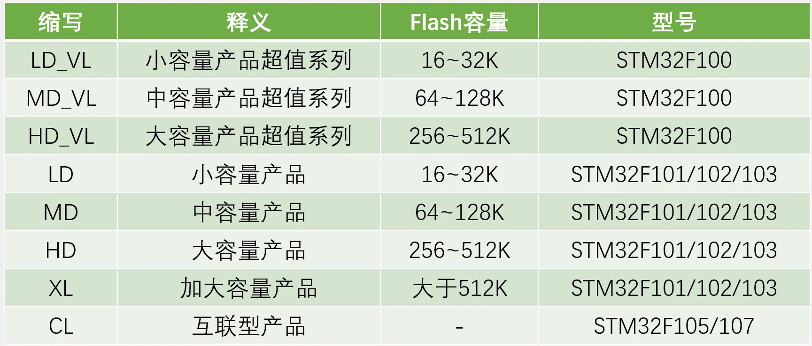
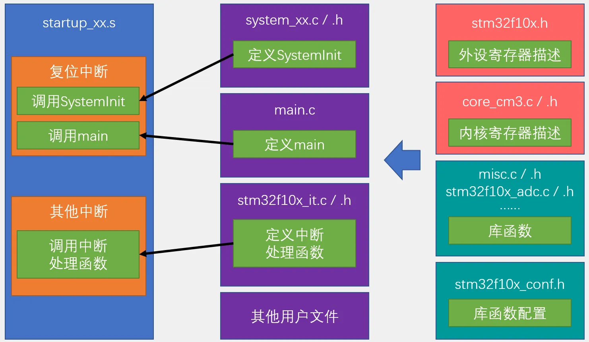

## [2-2] 新建工程
```c
#include "stm32f10x.h"                  // Device header

int main(void)
{
    /*开启时钟*/
    RCC_APB2PeriphClockCmd(RCC_APB2Periph_GPIOC, ENABLE);	//开启GPIOC的时钟
    //使用各个外设前必须开启时钟，否则对外设的操作无效

    /*GPIO初始化*/
    GPIO_InitTypeDef GPIO_InitStructure;					//定义结构体变量

    GPIO_InitStructure.GPIO_Mode = GPIO_Mode_Out_PP;		//GPIO模式，赋值为推挽输出模式
    GPIO_InitStructure.GPIO_Pin = GPIO_Pin_13;				//GPIO引脚，赋值为第13号引脚
    GPIO_InitStructure.GPIO_Speed = GPIO_Speed_50MHz;		//GPIO速度，赋值为50MHz

    GPIO_Init(GPIOC, &GPIO_InitStructure);					//将赋值后的构体变量传递给GPIO_Init函数
    //函数内部会自动根据结构体的参数配置相应寄存器
    //实现GPIOC的初始化

    /*设置GPIO引脚的高低电平*/
    /*若不设置GPIO引脚的电平，则在GPIO初始化为推挽输出后，指定引脚默认输出低电平*/
    //	GPIO_SetBits(GPIOC, GPIO_Pin_13);						//将PC13引脚设置为高电平
    GPIO_ResetBits(GPIOC, GPIO_Pin_13);						//将PC13引脚设置为低电平

    while (1)
    {

    }
}

```

### 型号分类及缩写



### 新建工程步骤
建立工程文件夹，Keil中新建工程，选择型号

工程文件夹里建立Start、Library、User等文件夹，复制固件库里面的文件到工程文件夹

工程里对应建立Start、Library、User等同名称的分组，然后将文件夹内的文件添加到工程分组里

工程选项，C/C++，Include Paths内声明所有包含头文件的文件夹

工程选项，C/C++，Define内定义USE_STDPERIPH_DRIVER

工程选项，Debug，下拉列表选择对应调试器，Settings，Flash Download里勾选Reset and Run

### 工程架构

