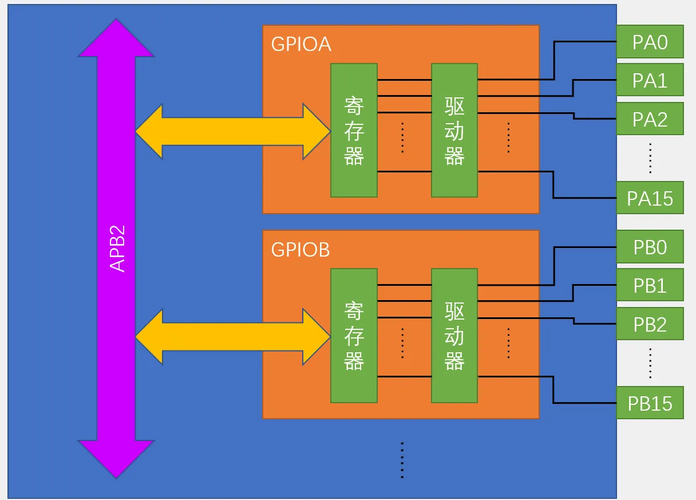
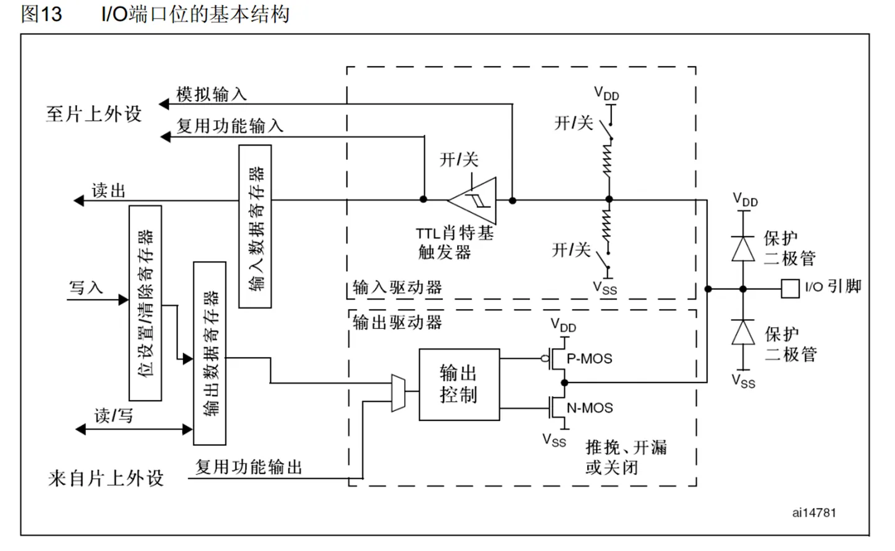
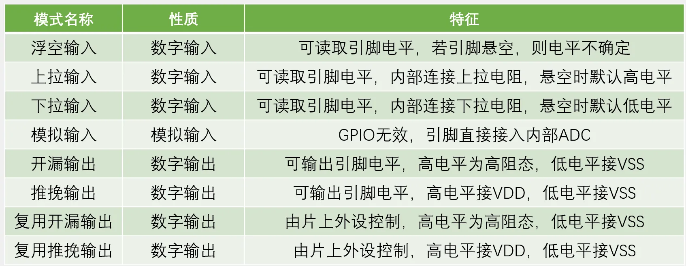
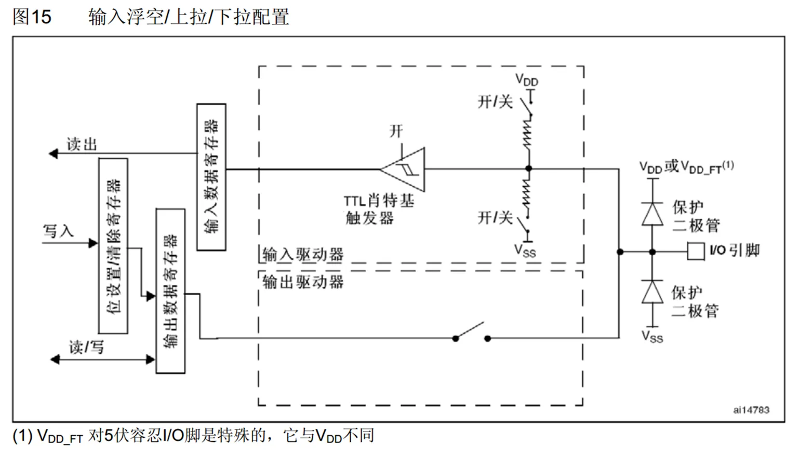
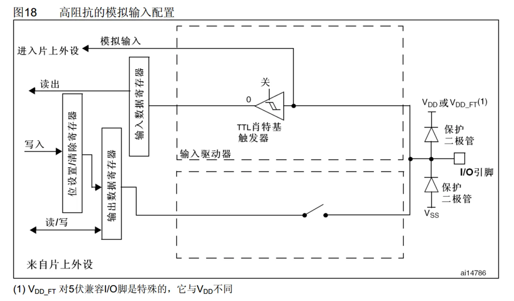
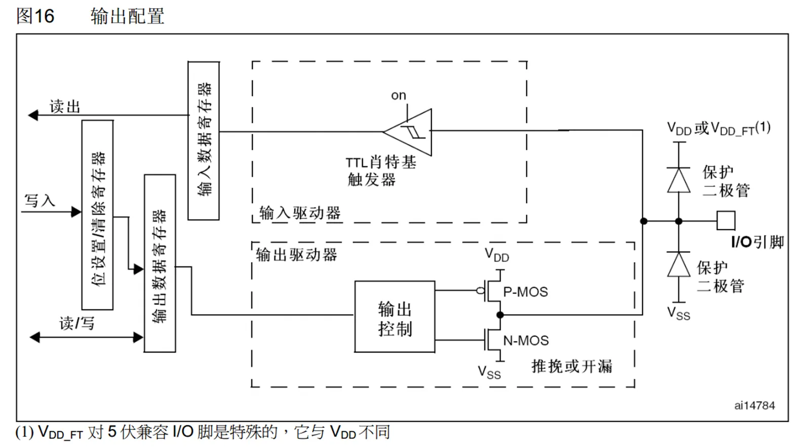
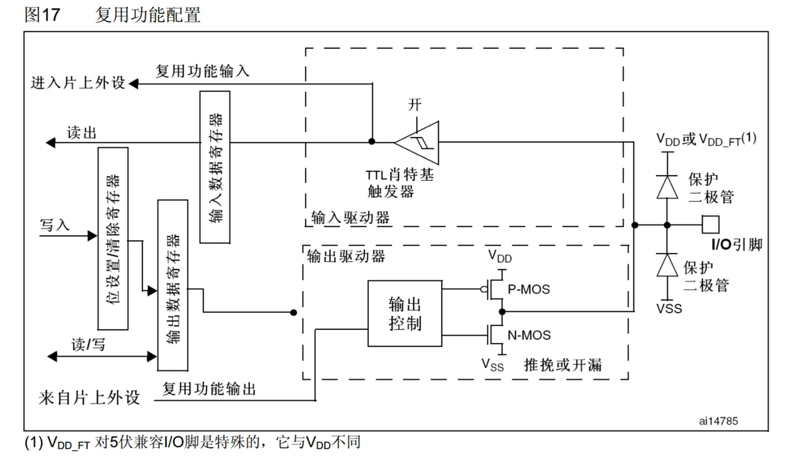

# 第三章 GPIO通用输入输出口
## [3-1] GPIO输出
### GPIO简介
GPIO（General Purpose Input Output）通用输入输出口

可配置为8种输入输出模式

引脚电平：0V~3.3V，部分引脚可容忍5V（带FT）

输出模式下可控制端口输出高低电平，用以驱动LED、控制蜂鸣器、模拟通信协议输出时序等

输入模式下可读取端口的高低电平或电压，用于读取按键输入、外接模块电平信号输入、ADC电压采集、模拟通信协议接收数据等

### GPIO基本结构

### GPIO位结构

### GPIO模式
通过配置GPIO的端口配置寄存器，端口可以配置成以下8种模式

浮空/上拉/下拉输入

模拟输入

开漏/推挽输出

复用开漏/推挽输出

