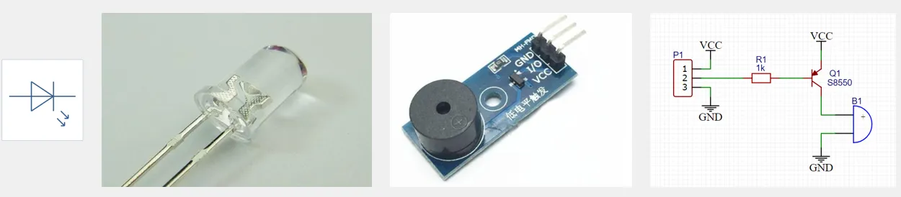
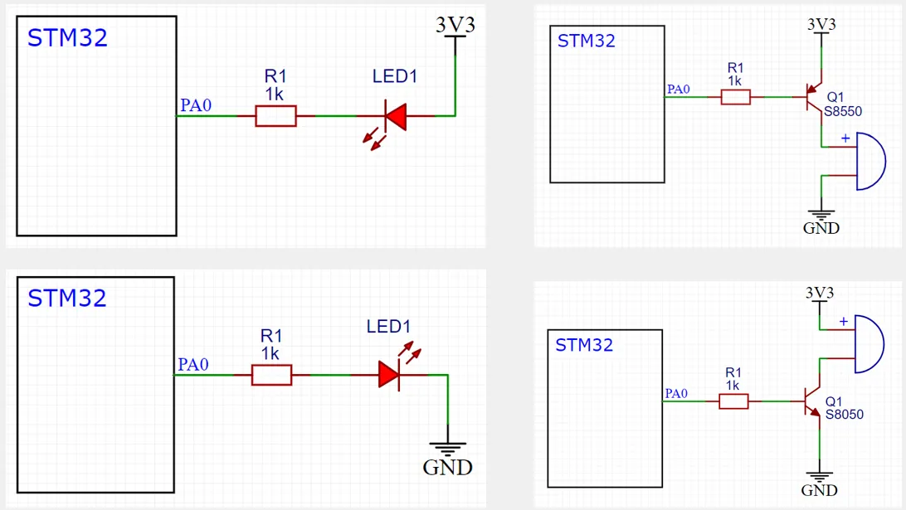
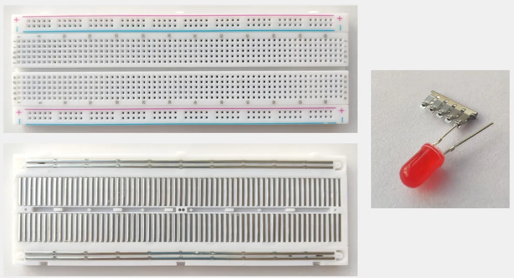

## [3-2] LED闪烁&LED流水灯&蜂鸣器
### LED和蜂鸣器简介
LED：发光二极管，正向通电点亮，反向通电不亮

有源蜂鸣器：内部自带振荡源，将正负极接上直流电压即可持续发声，频率固定

无源蜂鸣器：内部不带振荡源，需要控制器提供振荡脉冲才可发声，调整提供振荡脉冲的频率，可发出不同频率的声音



### 硬件电路



### 面包板



delay.h

```c
#ifndef __DELAY_H
#define __DELAY_H

void Delay_us(uint32_t us);
void Delay_ms(uint32_t ms);
void Delay_s(uint32_t s);

#endif

```

delay.c

```c
#include "stm32f10x.h"

/**
  * @brief  微秒级延时
  * @param  xus 延时时长，范围：0~233015
  * @retval 无
  */
void Delay_us(uint32_t xus)
{
	SysTick->LOAD = 72 * xus;				//设置定时器重装值
	SysTick->VAL = 0x00;					//清空当前计数值
	SysTick->CTRL = 0x00000005;				//设置时钟源为HCLK，启动定时器
	while(!(SysTick->CTRL & 0x00010000));	//等待计数到0
	SysTick->CTRL = 0x00000004;				//关闭定时器
}

/**
  * @brief  毫秒级延时
  * @param  xms 延时时长，范围：0~4294967295
  * @retval 无
  */
void Delay_ms(uint32_t xms)
{
	while(xms--)
	{
		Delay_us(1000);
	}
}
 
/**
  * @brief  秒级延时
  * @param  xs 延时时长，范围：0~4294967295
  * @retval 无
  */
void Delay_s(uint32_t xs)
{
	while(xs--)
	{
		Delay_ms(1000);
	}
} 
```

LED闪烁

```c
#include "stm32f10x.h"                  // Device header
#include "Delay.h"

int main(void)
{
	/*开启时钟*/
	RCC_APB2PeriphClockCmd(RCC_APB2Periph_GPIOA, ENABLE);	//开启GPIOA的时钟
															//使用各个外设前必须开启时钟，否则对外设的操作无效
	
	/*GPIO初始化*/
	GPIO_InitTypeDef GPIO_InitStructure;					//定义结构体变量
	
	GPIO_InitStructure.GPIO_Mode = GPIO_Mode_Out_PP;		//GPIO模式，赋值为推挽输出模式
	GPIO_InitStructure.GPIO_Pin = GPIO_Pin_0;				//GPIO引脚，赋值为第0号引脚
	GPIO_InitStructure.GPIO_Speed = GPIO_Speed_50MHz;		//GPIO速度，赋值为50MHz
	
	GPIO_Init(GPIOA, &GPIO_InitStructure);					//将赋值后的构体变量传递给GPIO_Init函数
															//函数内部会自动根据结构体的参数配置相应寄存器
															//实现GPIOA的初始化
	
	/*主循环，循环体内的代码会一直循环执行*/
	while (1)
	{
		/*设置PA0引脚的高低电平，实现LED闪烁，下面展示3种方法*/
		
		/*方法1：GPIO_ResetBits设置低电平，GPIO_SetBits设置高电平*/
		GPIO_ResetBits(GPIOA, GPIO_Pin_0);					//将PA0引脚设置为低电平
		Delay_ms(500);										//延时500ms
		GPIO_SetBits(GPIOA, GPIO_Pin_0);					//将PA0引脚设置为高电平
		Delay_ms(500);										//延时500ms
		
		/*方法2：GPIO_WriteBit设置低/高电平，由Bit_RESET/Bit_SET指定*/
		GPIO_WriteBit(GPIOA, GPIO_Pin_0, Bit_RESET);		//将PA0引脚设置为低电平
		Delay_ms(500);										//延时500ms
		GPIO_WriteBit(GPIOA, GPIO_Pin_0, Bit_SET);			//将PA0引脚设置为高电平
		Delay_ms(500);										//延时500ms
		
		/*方法3：GPIO_WriteBit设置低/高电平，由数据0/1指定，数据需要强转为BitAction类型*/
		GPIO_WriteBit(GPIOA, GPIO_Pin_0, (BitAction)0);		//将PA0引脚设置为低电平
		Delay_ms(500);										//延时500ms
		GPIO_WriteBit(GPIOA, GPIO_Pin_0, (BitAction)1);		//将PA0引脚设置为高电平
		Delay_ms(500);										//延时500ms
	}
}
```

 LED流水灯

```c
#include "stm32f10x.h"                  // Device header
#include "Delay.h"

int main(void)
{
	/*开启时钟*/
	RCC_APB2PeriphClockCmd(RCC_APB2Periph_GPIOA, ENABLE);	//开启GPIOA的时钟
															//使用各个外设前必须开启时钟，否则对外设的操作无效
	
	/*GPIO初始化*/
	GPIO_InitTypeDef GPIO_InitStructure;					//定义结构体变量
	
	GPIO_InitStructure.GPIO_Mode = GPIO_Mode_Out_PP;		//GPIO模式，赋值为推挽输出模式
	GPIO_InitStructure.GPIO_Pin = GPIO_Pin_All;				//GPIO引脚，赋值为所有引脚
	GPIO_InitStructure.GPIO_Speed = GPIO_Speed_50MHz;		//GPIO速度，赋值为50MHz
	
	GPIO_Init(GPIOA, &GPIO_InitStructure);					//将赋值后的构体变量传递给GPIO_Init函数
															//函数内部会自动根据结构体的参数配置相应寄存器
															//实现GPIOA的初始化
	
	/*主循环，循环体内的代码会一直循环执行*/
	while (1)
	{
		/*使用GPIO_Write，同时设置GPIOA所有引脚的高低电平，实现LED流水灯*/
		GPIO_Write(GPIOA, ~0x0001);	//0000 0000 0000 0001，PA0引脚为低电平，其他引脚均为高电平，注意数据有按位取反
		Delay_ms(100);				//延时100ms
		GPIO_Write(GPIOA, ~0x0002);	//0000 0000 0000 0010，PA1引脚为低电平，其他引脚均为高电平
		Delay_ms(100);				//延时100ms
		GPIO_Write(GPIOA, ~0x0004);	//0000 0000 0000 0100，PA2引脚为低电平，其他引脚均为高电平
		Delay_ms(100);				//延时100ms
		GPIO_Write(GPIOA, ~0x0008);	//0000 0000 0000 1000，PA3引脚为低电平，其他引脚均为高电平
		Delay_ms(100);				//延时100ms
		GPIO_Write(GPIOA, ~0x0010);	//0000 0000 0001 0000，PA4引脚为低电平，其他引脚均为高电平
		Delay_ms(100);				//延时100ms
		GPIO_Write(GPIOA, ~0x0020);	//0000 0000 0010 0000，PA5引脚为低电平，其他引脚均为高电平
		Delay_ms(100);				//延时100ms
		GPIO_Write(GPIOA, ~0x0040);	//0000 0000 0100 0000，PA6引脚为低电平，其他引脚均为高电平
		Delay_ms(100);				//延时100ms
		GPIO_Write(GPIOA, ~0x0080);	//0000 0000 1000 0000，PA7引脚为低电平，其他引脚均为高电平
		Delay_ms(100);				//延时100ms
	}
}
```

蜂鸣器

```c
#include "stm32f10x.h"                  // Device header
#include "Delay.h"

int main(void)
{
	/*开启时钟*/
	RCC_APB2PeriphClockCmd(RCC_APB2Periph_GPIOB, ENABLE);	//开启GPIOB的时钟
															//使用各个外设前必须开启时钟，否则对外设的操作无效
	
	/*GPIO初始化*/
	GPIO_InitTypeDef GPIO_InitStructure;					//定义结构体变量
	
	GPIO_InitStructure.GPIO_Mode = GPIO_Mode_Out_PP;		//GPIO模式，赋值为推挽输出模式
	GPIO_InitStructure.GPIO_Pin = GPIO_Pin_12;				//GPIO引脚，赋值为第12号引脚
	GPIO_InitStructure.GPIO_Speed = GPIO_Speed_50MHz;		//GPIO速度，赋值为50MHz
	
	GPIO_Init(GPIOB, &GPIO_InitStructure);					//将赋值后的构体变量传递给GPIO_Init函数
															//函数内部会自动根据结构体的参数配置相应寄存器
															//实现GPIOB的初始化
	
	/*主循环，循环体内的代码会一直循环执行*/
	while (1)
	{
		GPIO_ResetBits(GPIOB, GPIO_Pin_12);		//将PB12引脚设置为低电平，蜂鸣器鸣叫
		Delay_ms(100);							//延时100ms
		GPIO_SetBits(GPIOB, GPIO_Pin_12);		//将PB12引脚设置为高电平，蜂鸣器停止
		Delay_ms(100);							//延时100ms
		GPIO_ResetBits(GPIOB, GPIO_Pin_12);		//将PB12引脚设置为低电平，蜂鸣器鸣叫
		Delay_ms(100);							//延时100ms
		GPIO_SetBits(GPIOB, GPIO_Pin_12);		//将PB12引脚设置为高电平，蜂鸣器停止
		Delay_ms(700);							//延时700ms
	}
}
```