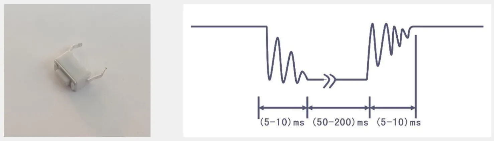
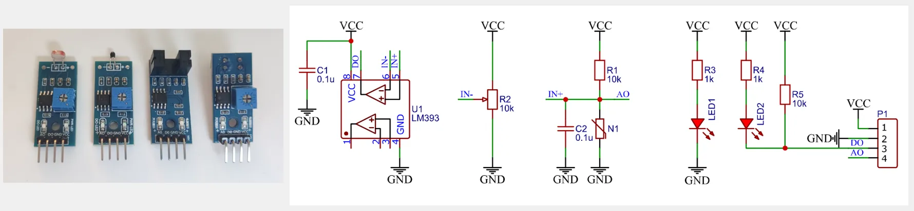
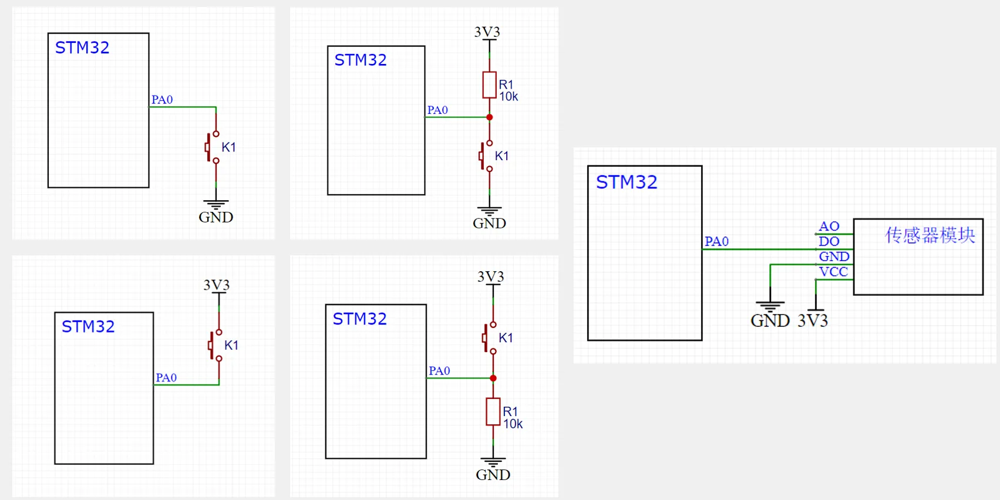
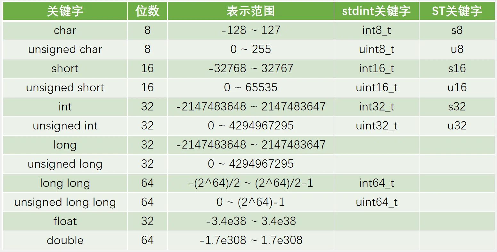

## [3-3] GPIO输入
### 按键简介
按键：常见的输入设备，按下导通，松手断开

按键抖动：由于按键内部使用的是机械式弹簧片来进行通断的，所以在按下和松手的瞬间会伴随有一连串的抖动



### 传感器模块简介
传感器模块：传感器元件（光敏电阻/热敏电阻/红外接收管等）的电阻会随外界模拟量的变化而变化，通过与定值电阻分压即可得到模拟电压输出，再通过电压比较器进行二值化即可得到数字电压输出



### 硬件电路



### C语言数据类型


### C语言宏定义
关键字：`#define`

用途：用一个字符串代替一个数字，便于理解，防止出错；提取程序中经常出现的参数，便于快速修改

定义宏定义：	`#define ABC 12345`

引用宏定义：	`int a = ABC;	//等效于int a = 12345;`

### C语言typedef
关键字：typedef

用途：将一个比较长的变量类型名换个名字，便于使用

定义typedef：

	typedef unsigned char uint8_t;

引用typedef：

	 uint8_t a;	//等效于unsigned char a;

C++:using NavigationAction = nav2_msgs::action::NavigateToPose;

### C语言结构体
关键字：struct

用途：数据打包，不同类型变量的集合

定义结构体变量：

	struct{char x; int y; float z;} StructName;

	因为结构体变量类型较长，所以通常用typedef更改变量类型名

引用结构体成员：

	StructName.x = 'A';

	StructName.y = 66;

	StructName.z = 1.23;

或	pStructName->x = 'A';	//pStructName为结构体的地址，也就是结构体指针

	pStructName->y = 66;

	pStructName->z = 1.23;

```c
int main(void)
{
    int a;
    a = 66;
    printf("a = %d\n", a);

    int b[5];
    b[0] = 66;
    b[1] = 77;
    b[2] = 88;
    printf("b[0] = %d\n", b[0]);
    printf("b[1] = %d\n", b[1]);
    printf("b[2] = %d\n", b[2]);

    struct { 
        char x; 
        int y; 
        float z; 
    } c;

    c.x = 'A';
    c.y = 66;
    c.z = 1.23;
    printf("c.x = %c\n", c.x);
    printf("c.y = %d\n", c.y);
    printf("c.z = %f\n", c.z);

    printf("Helloworld!\n");

    return 0;
}
```

**因为结构体变量类型较长，所以通常用typedef更改变量类型名**

```c
#include <stdio.h>

typedef struct {
    char x;
    int y;
    float z;
} StructName_t;

int main(void)
{
    StructName_t c;
    StructName_t d;

    c.x = 'A';
    c.y = 66;
    c.z = 1.23;
    printf("c.x = %c\n", c.x);

    return 0;
}
```

### C语言枚举
关键字：enum

用途：定义一个取值受限制的整型变量，用于限制变量取值范围；宏定义的集合

定义枚举变量：

	enum{FALSE = 0, TRUE = 1} EnumName;

	因为枚举变量类型较长，所以通常用typedef更改变量类型名

引用枚举成员：

	EnumName = FALSE;	EnumName = TRUE;

```c
#include <stdio.h>

typedef enum {
    MONDAY = 1,
    TUESDAY,
    WEDNESDAY
} Week_t;

int main(void)
{
    Week_t week;
    week = MONDAY;    // week = 1;
    week = TUESDAY;   // week = 2;
    week = 8;

    printf("HelloWorld!\n");

    return 0;
}
```

### C++枚举
使用`#define` 和 `const` 创建符号常量，使用enum 不仅能够创建符号常量，还能定义新的数据类型

枚举类型enum(enumeration)的声明和定义：

例:

`enum wT { Monday, Tuesday, Wednesday, Thursday, Friday,Saturday, Sunday};`

`wT weekday;`

wT类似int、float、double

```cpp
#include"stdafx.h"
#include<iostream>
using namespace std;
int main()
enum wT{Monday, Tuesday, Wednesday,Thursday, Friday, Saturday, Sunday}: // 声明wT类型
wT weekday:
weekday = Monday;
weekday = Tuesday;
//weekday =1;
//不能直接给int值，只能赋值成wT定义好的类型值wT(1)
cout << weekday << endl;
//Monday = 0;
//类型值不能做左值
int a = Wednesday;
cout <<a<< endl;
return 0;
```

使用细节:

1.枚举值不可以做左值;

2.非枚举变量不可以赋值给枚举变量

3.枚举变量可以赋值给非枚举变量;

4.可以强制类型转换，weekday=wT(1);