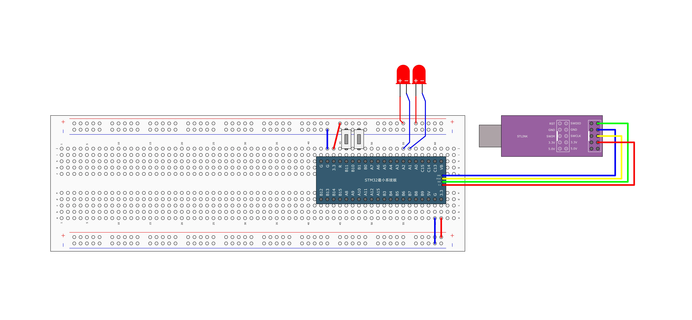
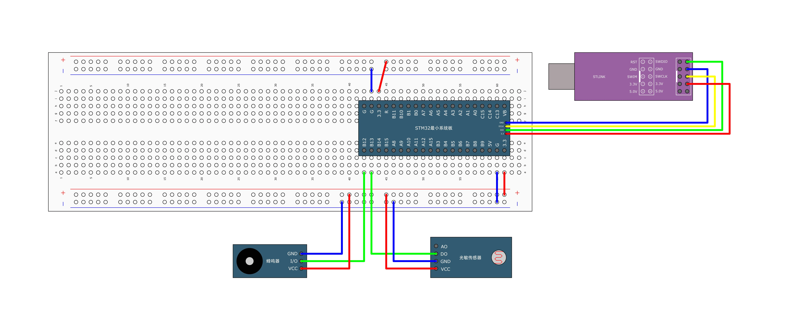

## [3-4] 按键控制LED&光敏传感器控制蜂鸣器
### 按键控制LED



led.h

```c
#ifndef __LED_H
#define __LED_H

void LED_Init(void);
void LED1_ON(void);
void LED1_OFF(void);
void LED1_Turn(void);
void LED2_ON(void);
void LED2_OFF(void);
void LED2_Turn(void);

#endif
```

led.c

```c
#include "stm32f10x.h"                  // Device header

/**
  * 函    数：LED初始化
  * 参    数：无
  * 返 回 值：无
  */
void LED_Init(void)
{
	/*开启时钟*/
	RCC_APB2PeriphClockCmd(RCC_APB2Periph_GPIOA, ENABLE);		//开启GPIOA的时钟
	
	/*GPIO初始化*/
	GPIO_InitTypeDef GPIO_InitStructure;
	GPIO_InitStructure.GPIO_Mode = GPIO_Mode_Out_PP;
	GPIO_InitStructure.GPIO_Pin = GPIO_Pin_1 | GPIO_Pin_2;
	GPIO_InitStructure.GPIO_Speed = GPIO_Speed_50MHz;
	GPIO_Init(GPIOA, &GPIO_InitStructure);						//将PA1和PA2引脚初始化为推挽输出
	
	/*设置GPIO初始化后的默认电平*/
	GPIO_SetBits(GPIOA, GPIO_Pin_1 | GPIO_Pin_2);				//设置PA1和PA2引脚为高电平
}

/**
  * 函    数：LED1开启
  * 参    数：无
  * 返 回 值：无
  */
void LED1_ON(void)
{
	GPIO_ResetBits(GPIOA, GPIO_Pin_1);		//设置PA1引脚为低电平
}

/**
  * 函    数：LED1关闭
  * 参    数：无
  * 返 回 值：无
  */
void LED1_OFF(void)
{
	GPIO_SetBits(GPIOA, GPIO_Pin_1);		//设置PA1引脚为高电平
}

/**
  * 函    数：LED1状态翻转
  * 参    数：无
  * 返 回 值：无
  */
void LED1_Turn(void)
{
	if (GPIO_ReadOutputDataBit(GPIOA, GPIO_Pin_1) == 0)		//获取输出寄存器的状态，如果当前引脚输出低电平
	{
		GPIO_SetBits(GPIOA, GPIO_Pin_1);					//则设置PA1引脚为高电平
	}
	else													//否则，即当前引脚输出高电平
	{
		GPIO_ResetBits(GPIOA, GPIO_Pin_1);					//则设置PA1引脚为低电平
	}
}

/**
  * 函    数：LED2开启
  * 参    数：无
  * 返 回 值：无
  */
void LED2_ON(void)
{
	GPIO_ResetBits(GPIOA, GPIO_Pin_2);		//设置PA2引脚为低电平
}

/**
  * 函    数：LED2关闭
  * 参    数：无
  * 返 回 值：无
  */
void LED2_OFF(void)
{
	GPIO_SetBits(GPIOA, GPIO_Pin_2);		//设置PA2引脚为高电平
}

/**
  * 函    数：LED2状态翻转
  * 参    数：无
  * 返 回 值：无
  */
void LED2_Turn(void)
{
	if (GPIO_ReadOutputDataBit(GPIOA, GPIO_Pin_2) == 0)		//获取输出寄存器的状态，如果当前引脚输出低电平
	{                                                  
		GPIO_SetBits(GPIOA, GPIO_Pin_2);               		//则设置PA2引脚为高电平
	}                                                  
	else                                               		//否则，即当前引脚输出高电平
	{                                                  
		GPIO_ResetBits(GPIOA, GPIO_Pin_2);             		//则设置PA2引脚为低电平
	}
}
```

key.h

```c
#ifndef __KEY_H
#define __KEY_H

void Key_Init(void);
uint8_t Key_GetNum(void);

#endif
```

key.c

```c
#include "stm32f10x.h"                  // Device header
#include "Delay.h"

/**
  * 函    数：按键初始化
  * 参    数：无
  * 返 回 值：无
  */
void Key_Init(void)
{
	/*开启时钟*/
	RCC_APB2PeriphClockCmd(RCC_APB2Periph_GPIOB, ENABLE);		//开启GPIOB的时钟
	
	/*GPIO初始化*/
	GPIO_InitTypeDef GPIO_InitStructure;
	GPIO_InitStructure.GPIO_Mode = GPIO_Mode_IPU;
	GPIO_InitStructure.GPIO_Pin = GPIO_Pin_1 | GPIO_Pin_11;
	GPIO_InitStructure.GPIO_Speed = GPIO_Speed_50MHz;
	GPIO_Init(GPIOB, &GPIO_InitStructure);						//将PB1和PB11引脚初始化为上拉输入
}

/**
  * 函    数：按键获取键码
  * 参    数：无
  * 返 回 值：按下按键的键码值，范围：0~2，返回0代表没有按键按下
  * 注意事项：此函数是阻塞式操作，当按键按住不放时，函数会卡住，直到按键松手
  */
uint8_t Key_GetNum(void)
{
	uint8_t KeyNum = 0;		//定义变量，默认键码值为0
	
	if (GPIO_ReadInputDataBit(GPIOB, GPIO_Pin_1) == 0)			//读PB1输入寄存器的状态，如果为0，则代表按键1按下
	{
		Delay_ms(20);											//延时消抖
		while (GPIO_ReadInputDataBit(GPIOB, GPIO_Pin_1) == 0);	//等待按键松手
		Delay_ms(20);											//延时消抖
		KeyNum = 1;												//置键码为1
	}
	
	if (GPIO_ReadInputDataBit(GPIOB, GPIO_Pin_11) == 0)			//读PB11输入寄存器的状态，如果为0，则代表按键2按下
	{
		Delay_ms(20);											//延时消抖
		while (GPIO_ReadInputDataBit(GPIOB, GPIO_Pin_11) == 0);	//等待按键松手
		Delay_ms(20);											//延时消抖
		KeyNum = 2;												//置键码为2
	}
	
	return KeyNum;			//返回键码值，如果没有按键按下，所有if都不成立，则键码为默认值0
}
```

main.c

```c
#include "stm32f10x.h"                  // Device header
#include "Delay.h"
#include "LED.h"
#include "Key.h"

uint8_t KeyNum;		//定义用于接收按键键码的变量

int main(void)
{
	/*模块初始化*/
	LED_Init();		//LED初始化
	Key_Init();		//按键初始化
	
	while (1)
	{
		KeyNum = Key_GetNum();		//获取按键键码
		
		if (KeyNum == 1)			//按键1按下
		{
			LED1_Turn();			//LED1翻转
		}
		
		if (KeyNum == 2)			//按键2按下
		{
			LED2_Turn();			//LED2翻转
		}
	}
}
```

**一句话总览**

| 函数 | 读哪里 | 读多少 | 返回值 |
| --- | --- | --- | --- |
| `GPIO_ReadInputDataBit` | 输入寄存器（IDR） | 单个引脚 | 0 / 1 |
| `GPIO_ReadInputData` | 输入寄存器（IDR） | 整个端口 | 16 位 |
| `GPIO_ReadOutputDataBit` | 输出寄存器（ODR） | 单个引脚 | 0 / 1 |
| `GPIO_ReadOutputData` | 输出寄存器（ODR） | 整个端口 | 16 位 |


### 光敏传感器控制蜂鸣器


buzzer.h

```c
#ifndef __BUZZER_H
#define __BUZZER_H

void Buzzer_Init(void);
void Buzzer_ON(void);
void Buzzer_OFF(void);
void Buzzer_Turn(void);

#endif
```

buzzer.c

```c
#include "stm32f10x.h"                  // Device header

/**
  * 函    数：蜂鸣器初始化
  * 参    数：无
  * 返 回 值：无
  */
void Buzzer_Init(void)
{
	/*开启时钟*/
	RCC_APB2PeriphClockCmd(RCC_APB2Periph_GPIOB, ENABLE);		//开启GPIOB的时钟
	
	/*GPIO初始化*/
	GPIO_InitTypeDef GPIO_InitStructure;
	GPIO_InitStructure.GPIO_Mode = GPIO_Mode_Out_PP;
	GPIO_InitStructure.GPIO_Pin = GPIO_Pin_12;
	GPIO_InitStructure.GPIO_Speed = GPIO_Speed_50MHz;
	GPIO_Init(GPIOB, &GPIO_InitStructure);						//将PB12引脚初始化为推挽输出
	
	/*设置GPIO初始化后的默认电平*/
	GPIO_SetBits(GPIOB, GPIO_Pin_12);							//设置PB12引脚为高电平
}

/**
  * 函    数：蜂鸣器开启
  * 参    数：无
  * 返 回 值：无
  */
void Buzzer_ON(void)
{
	GPIO_ResetBits(GPIOB, GPIO_Pin_12);		//设置PB12引脚为低电平
}

/**
  * 函    数：蜂鸣器关闭
  * 参    数：无
  * 返 回 值：无
  */
void Buzzer_OFF(void)
{
	GPIO_SetBits(GPIOB, GPIO_Pin_12);		//设置PB12引脚为高电平
}

/**
  * 函    数：蜂鸣器状态翻转
  * 参    数：无
  * 返 回 值：无
  */
void Buzzer_Turn(void)
{
	if (GPIO_ReadOutputDataBit(GPIOB, GPIO_Pin_12) == 0)		//获取输出寄存器的状态，如果当前引脚输出低电平
	{
		GPIO_SetBits(GPIOB, GPIO_Pin_12);						//则设置PB12引脚为高电平
	}
	else														//否则，即当前引脚输出高电平
	{
		GPIO_ResetBits(GPIOB, GPIO_Pin_12);						//则设置PB12引脚为低电平
	}
}

```

LightSensor.h

```c
#ifndef __LIGHT_SENSOR_H
#define __LIGHT_SENSOR_H

void LightSensor_Init(void);
uint8_t LightSensor_Get(void);

#endif
```

LightSensor.c

```c
#include "stm32f10x.h"                  // Device header

/**
  * 函    数：光敏传感器初始化
  * 参    数：无
  * 返 回 值：无
  */
void LightSensor_Init(void)
{
	/*开启时钟*/
	RCC_APB2PeriphClockCmd(RCC_APB2Periph_GPIOB, ENABLE);		//开启GPIOB的时钟
	
	/*GPIO初始化*/
	GPIO_InitTypeDef GPIO_InitStructure;
	GPIO_InitStructure.GPIO_Mode = GPIO_Mode_IPU;
	GPIO_InitStructure.GPIO_Pin = GPIO_Pin_13;
	GPIO_InitStructure.GPIO_Speed = GPIO_Speed_50MHz;
	GPIO_Init(GPIOB, &GPIO_InitStructure);						//将PB13引脚初始化为上拉输入
}

/**
  * 函    数：获取当前光敏传感器输出的高低电平
  * 参    数：无
  * 返 回 值：光敏传感器输出的高低电平，范围：0/1
  */
uint8_t LightSensor_Get(void)
{
	return GPIO_ReadInputDataBit(GPIOB, GPIO_Pin_13);			//返回PB13输入寄存器的状态
}

```

main.c

```c
#include "stm32f10x.h"                  // Device header
#include "Delay.h"
#include "Buzzer.h"
#include "LightSensor.h"

int main(void)
{
	/*模块初始化*/
	Buzzer_Init();			//蜂鸣器初始化
	LightSensor_Init();		//光敏传感器初始化
	
	while (1)
	{
		if (LightSensor_Get() == 1)		//如果当前光敏输出1
		{
			Buzzer_ON();				//蜂鸣器开启
		}
		else							//否则
		{
			Buzzer_OFF();				//蜂鸣器关闭
		}
	}
}
```