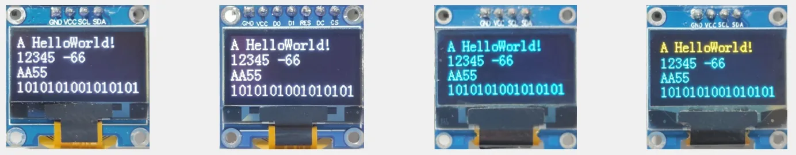
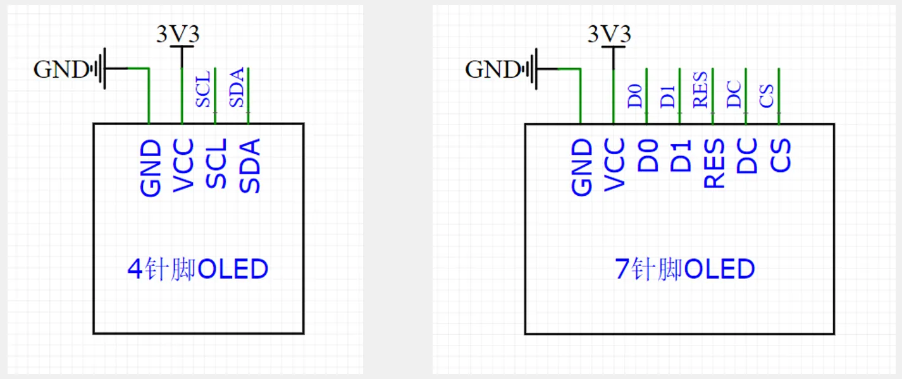
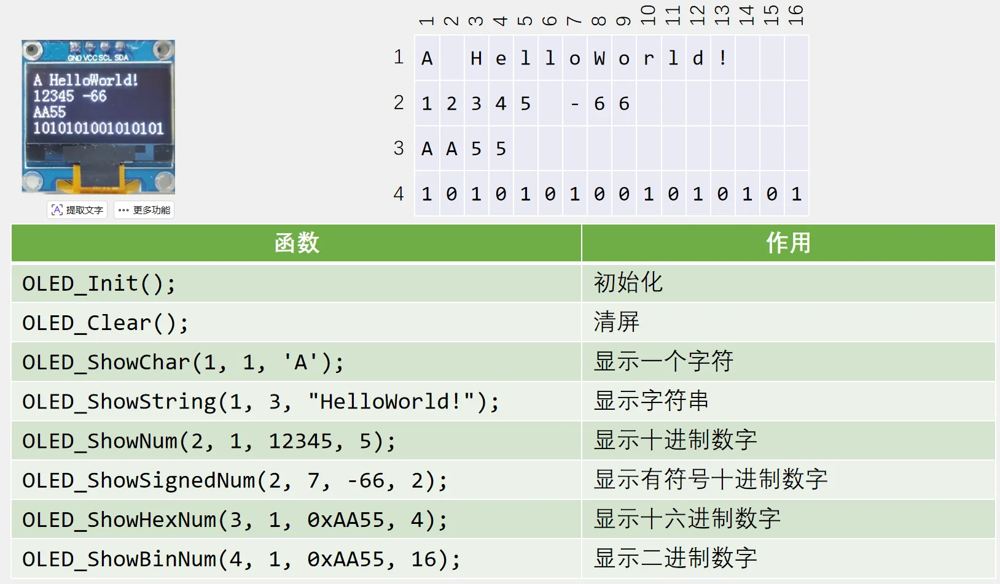

# 第四章 OLED调试工具
## [4-1] OLED调试工具
### 调试方式
串口调试：通过串口通信，将调试信息发送到电脑端，电脑使用串口助手显示调试信息

显示屏调试：直接将显示屏连接到单片机，将调试信息打印在显示屏上

Keil调试模式：借助Keil软件的调试模式，可使用单步运行、设置断点、查看寄存器及变量等功能

### OLED简介
OLED（Organic Light Emitting Diode）：有机发光二极管

OLED显示屏：性能优异的新型显示屏，具有功耗低、相应速度快、宽视角、轻薄柔韧等特点

0.96寸OLED模块：小巧玲珑、占用接口少、简单易用，是电子设计中非常常见的显示屏模块

供电：3~5.5V，通信协议：I2C/SPI，分辨率：128*64

### 硬件电路

### OLED驱动函数

