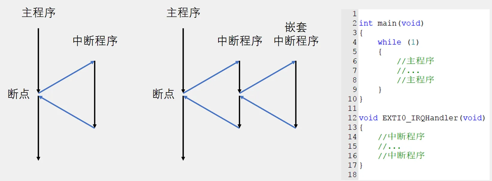
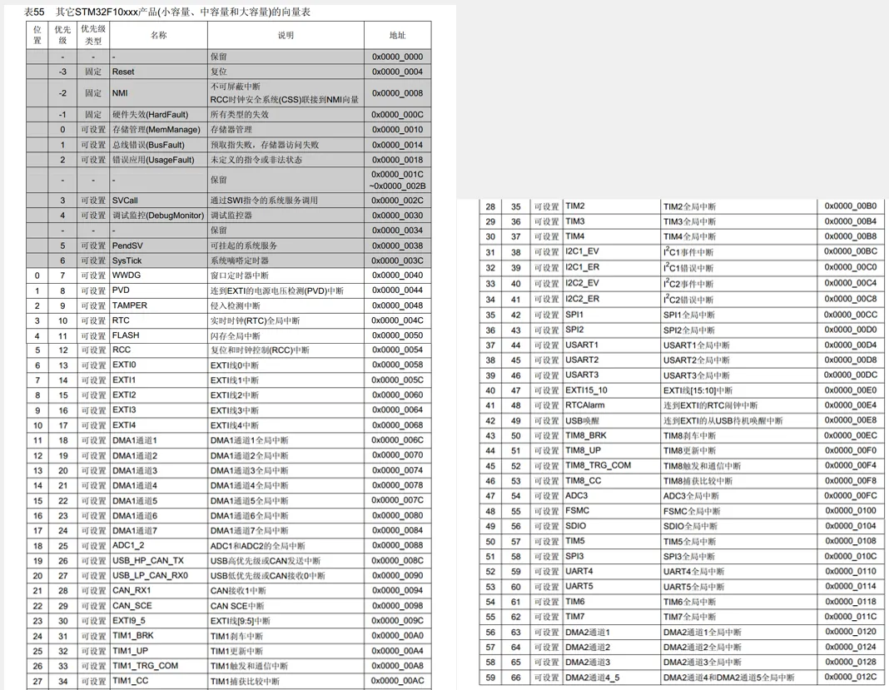
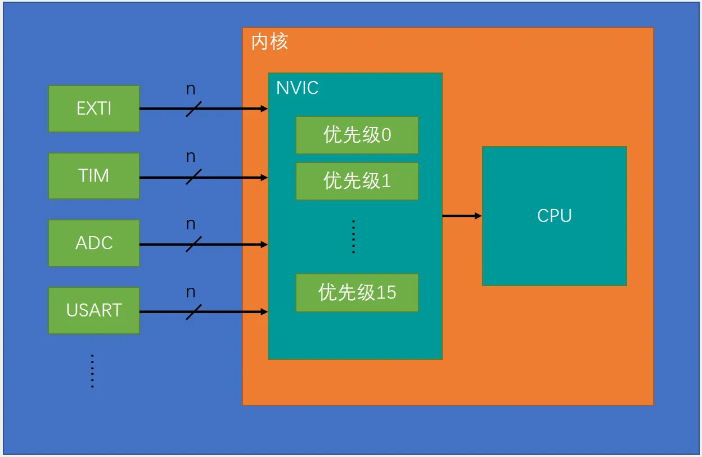
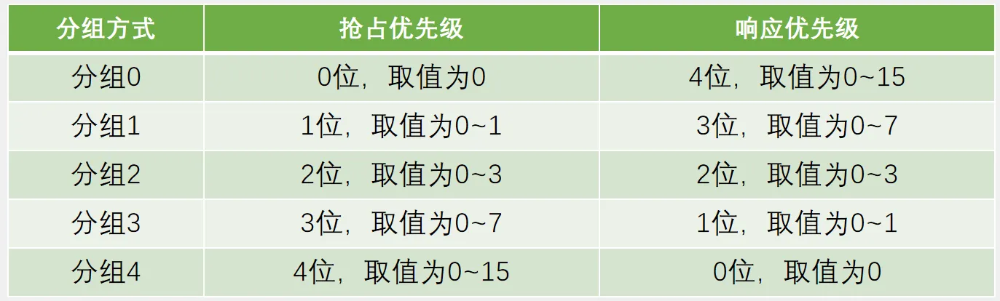
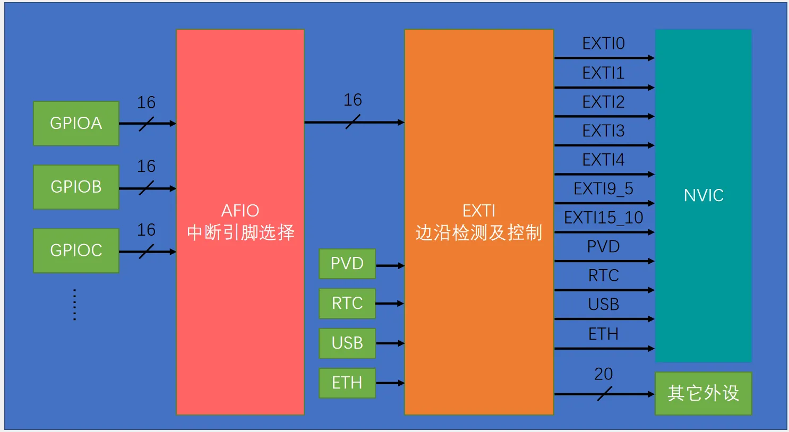
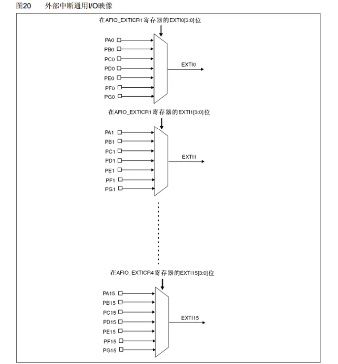
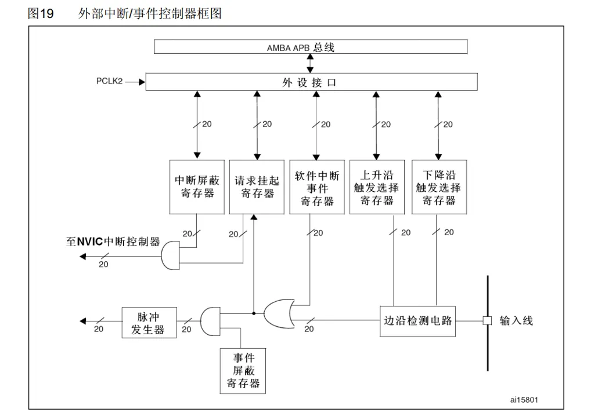
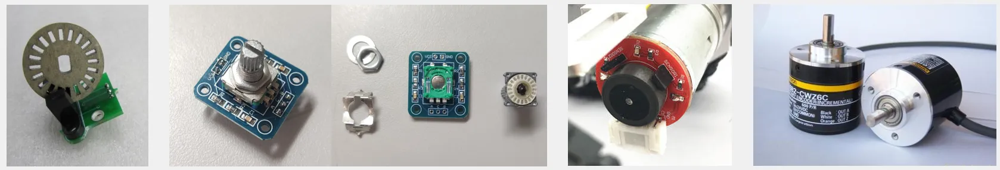
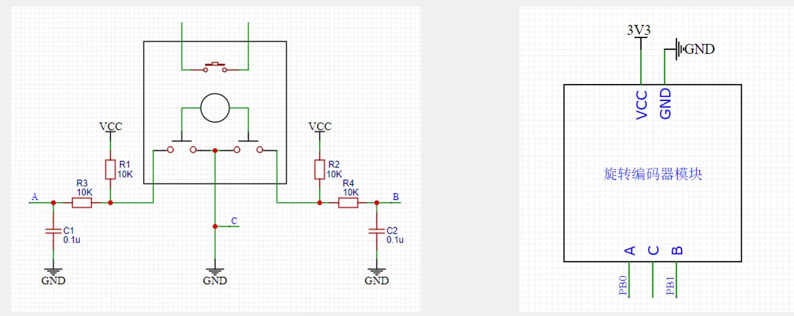

# 第五章 EXTI外部中断
## [5-1] EXTI外部中断
### 中断系统
中断：在主程序运行过程中，出现了特定的中断触发条件（中断源），使得CPU暂停当前正在运行的程序，转而去处理中断程序，处理完成后又返回原来被暂停的位置继续运行

中断优先级：当有多个中断源同时申请中断时，CPU会根据中断源的轻重缓急进行裁决，优先响应更加紧急的中断源

中断嵌套：当一个中断程序正在运行时，又有新的更高优先级的中断源申请中断，CPU再次暂停当前中断程序，转而去处理新的中断程序，处理完成后依次进行返回

### 中断执行流程



### STM32中断
68个可屏蔽中断通道，包含EXTI、TIM、ADC、USART、SPI、I2C、RTC等多个外设

使用NVIC统一管理中断，每个中断通道都拥有16个可编程的优先等级，可对优先级进行分组，进一步设置抢占优先级和响应优先级



### NVIC基本结构
NVIC是Nested Vectored Interrupt Controller的缩写，中文全称为嵌套向量中断控制器。



### NVIC优先级分组
NVIC的中断优先级由优先级寄存器的4位（0~15）决定，这4位可以进行切分，分为高n位的抢占优先级和低4-n位的响应优先级

抢占优先级高的可以中断嵌套，响应优先级高的可以优先排队，抢占优先级和响应优先级均相同的按中断号排队



### EXTI简介
EXTI（Extern Interrupt）外部中断

EXTI可以监测指定GPIO口的电平信号，当其指定的GPIO口产生电平变化时，EXTI将立即向NVIC发出中断申请，经过NVIC裁决后即可中断CPU主程序，使CPU执行EXTI对应的中断程序

支持的触发方式：上升沿/下降沿/双边沿/软件触发

支持的GPIO口：**所有GPIO口，但相同的Pin不能同时触发中断**

通道数：16个GPIO_Pin，外加PVD输出、RTC闹钟、USB唤醒、以太网唤醒

触发响应方式：中断响应/事件响应

### EXTI基本结构



### AFIO复用IO口
AFIO主要用于引脚复用功能的选择和重定义

在STM32中，AFIO主要完成两个任务：复用功能引脚重映射、中断引脚选择



### EXTI框图



1. 最右边：输入线

图右边的 输入线 就是外部信号来源，比如：
```
PA0
PB5
PC13
```
这些 GPIO 引脚可以被配置成 EXTI 输入。

例如你按下一个按键，GPIO 电平可能从：
```
高电平 -> 低电平
```
或者：
```
低电平 -> 高电平
```
EXTI 就是检测这种变化的。

2. 边沿检测电路

输入线进入 边沿检测电路。

边沿检测电路负责判断信号有没有发生变化：
```
上升沿：0 -> 1
下降沿：1 -> 0
```
对应图中的两个寄存器：
```
上升沿触发选择寄存器
下降沿触发选择寄存器
```
也就是：
```
EXTI_RTSR   // Rising Trigger Selection Register
EXTI_FTSR   // Falling Trigger Selection Register
```
如果你配置了上升沿触发：
```
信号从 0 变成 1 时触发
```
如果配置了下降沿触发：
```
信号从 1 变成 0 时触发
```
如果两个都配置：
```
上升沿和下降沿都会触发
```
比如按键常见配置：
```
按下：高 -> 低，下降沿触发
松开：低 -> 高，上升沿触发
```
3. 软件中断事件寄存器

中间还有一个：
```
软件中断事件寄存器
```
它的作用是：
不依赖外部引脚，也可以通过软件主动触发一次 EXTI。

也就是你可以在程序里人为制造一个中断/事件。

对应寄存器一般叫：
```
EXTI_SWIER
```
例如：
```
EXTI->SWIER |= (1 << 0);
```
表示软件触发 EXTI0。

这个常用于调试，或者某些软件模拟触发场景。

4. 请求挂起寄存器

图中有：
```
请求挂起寄存器
```
它表示某条 EXTI 线已经产生了请求，但还没有被清除。

对应寄存器一般是：
```
EXTI_PR
```
当边沿触发成功后，对应位会被置 1。

例如 EXTI0 被触发：
```
EXTI_PR0 = 1
```
进入中断服务函数后，必须手动清除这个挂起标志：
```
EXTI->PR = (1 << 0);
```
否则可能会反复进入中断。

5. 中断屏蔽寄存器

图中左上是：
```
中断屏蔽寄存器
```
它决定某条 EXTI 线是否允许产生中断。

对应寄存器一般是：
```
EXTI_IMR
```
可以理解成一个开关：
```
IMR = 1：允许产生中断
IMR = 0：屏蔽中断
```
注意，屏蔽不是说边沿检测完全没发生，而是说不会把中断请求送到 NVIC。

6. 事件屏蔽寄存器

图中左下是：
```
事件屏蔽寄存器
```
它决定某条 EXTI 线是否允许产生事件。

对应寄存器一般是：
```
EXTI_EMR
```
事件和中断不一样。

中断会进入中断服务函数：
```
void EXTI0_IRQHandler(void)
{
    // 中断处理代码
}
```
事件通常不会进入中断函数，而是给内部模块使用，例如唤醒、触发某些外设动作等。

简单区分：
```
中断：通知 CPU 去执行中断服务函数
事件：产生一个内部触发信号，不一定打断 CPU
```
7. 脉冲发生器

图中左下有：
```
脉冲发生器
```
它主要用于事件路径。

当 EXTI 检测到触发条件后，如果事件没有被屏蔽，就会产生一个短脉冲事件信号。

可以理解为：
```
检测到边沿变化
    ↓
生成一个事件脉冲
    ↓
送给内部电路使用
```
8. 到 NVIC 中断控制器

图中左侧有：
```
至 NVIC 中断控制器
```
EXTI 自己只负责检测外部信号并产生中断请求。

真正管理 CPU 中断优先级、响应中断的是：
```
NVIC
```
完整流程是：
```
GPIO 输入变化
    ↓
EXTI 检测到边沿
    ↓
EXTI_PR 挂起标志置位
    ↓
EXTI_IMR 判断是否允许中断
    ↓
请求送到 NVIC
    ↓
CPU 跳转到中断服务函数
```
9. AMBA APB 总线和外设接口

图最上方是：
```
AMBA APB 总线
外设接口
PCLK2
```
这部分表示 CPU 可以通过 APB 总线访问 EXTI 的寄存器。

也就是说，你写代码配置 EXTI，本质上就是通过总线修改这些寄存器：
```
EXTI_IMR
EXTI_EMR
EXTI_RTSR
EXTI_FTSR
EXTI_SWIER
EXTI_PR
```
例如配置上升沿触发，本质就是写：
```
EXTI->RTSR |= (1 << line);
```
10. 图中反复出现的 “20” 是什么意思？

图中很多地方标了：
```
20
```
这表示 EXTI 有多条线，一般是 20 条左右。

比如 STM32 中常见：
```
EXTI0  ~ EXTI15：对应 GPIO 外部中断线
EXTI16：PVD
EXTI17：RTC Alarm
EXTI18：USB Wakeup
EXTI19：Ethernet Wakeup 等
```
不同芯片具体数量可能不同，但图里表示的是 多条 EXTI 线并行工作。

### 旋转编码器简介
旋转编码器：用来测量位置、速度或旋转方向的装置，当其旋转轴旋转时，其输出端可以输出与旋转速度和方向对应的方波信号，读取方波信号的频率和相位信息即可得知旋转轴的速度和方向

类型：机械触点式/霍尔传感器式/光栅式



### 硬件电路

