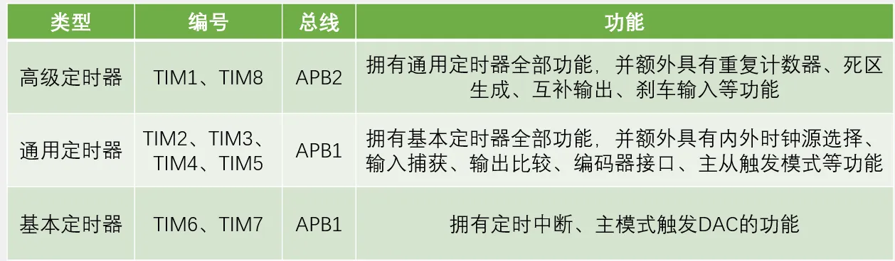
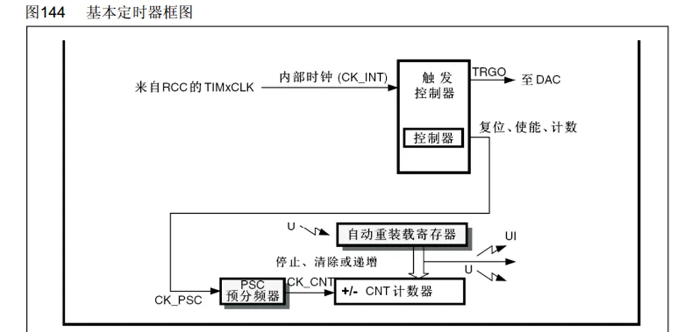
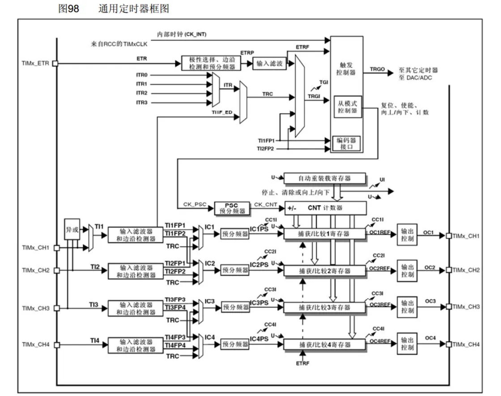
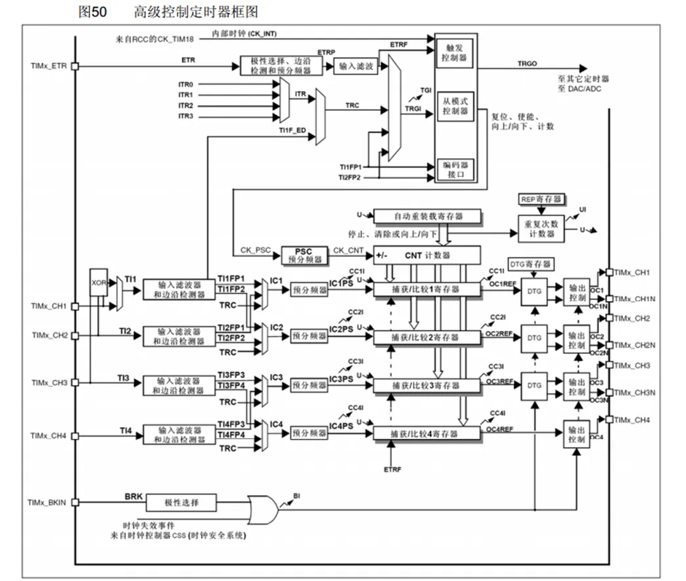
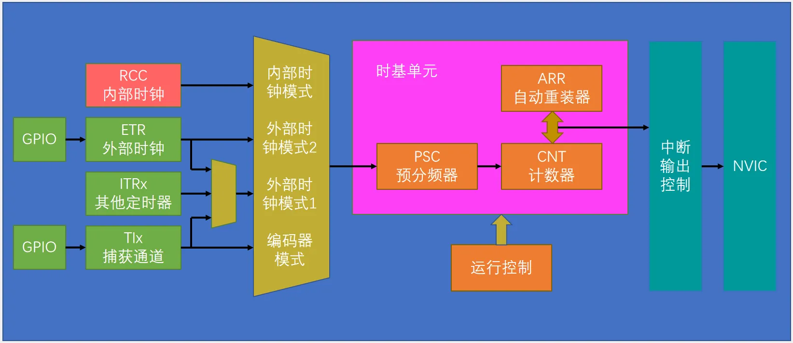
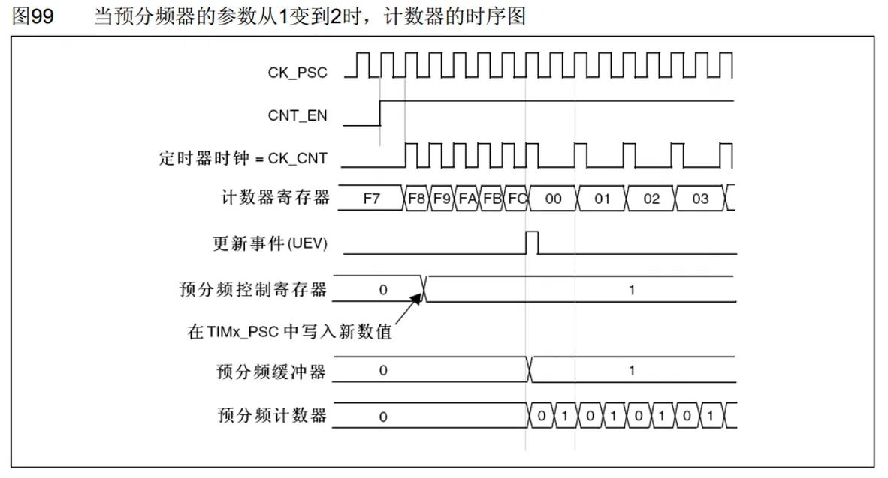
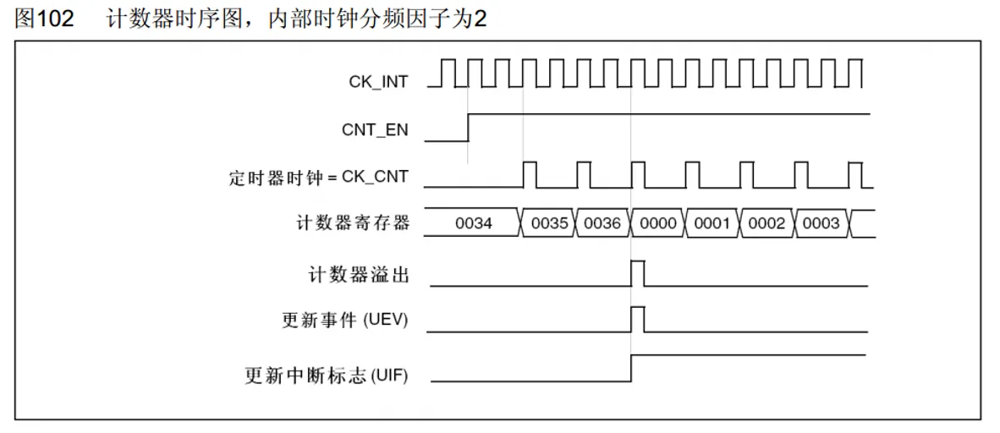
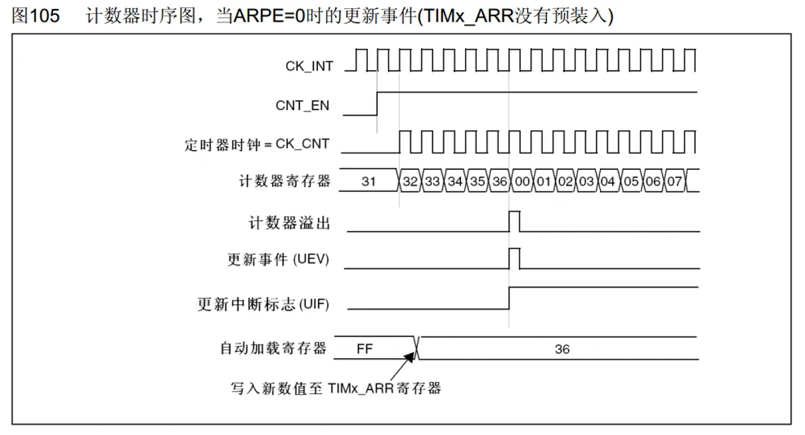
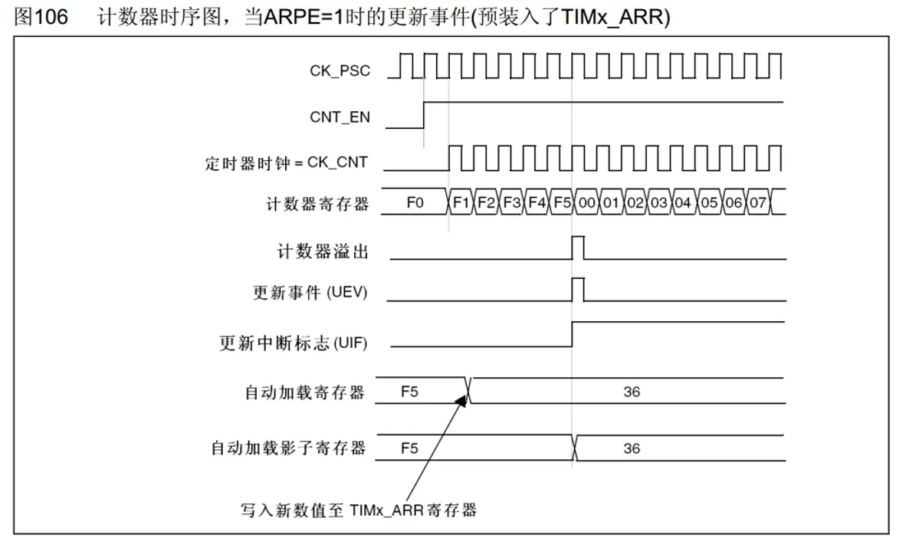
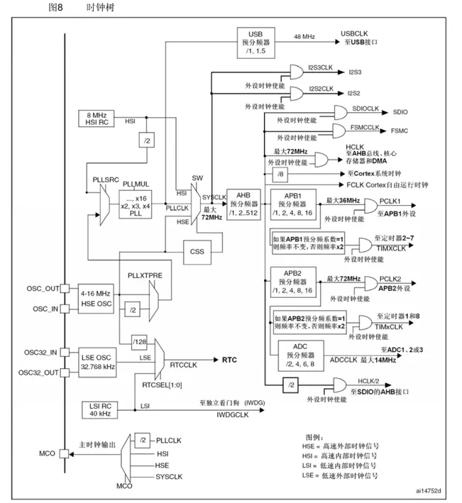

# 第六章 TIM定时器
## [6-1] TIM定时中断
### TIM简介
TIM（Timer）定时器

定时器可以对输入的时钟进行计数，并在计数值达到设定值时触发中断

16位计数器、预分频器、自动重装寄存器的时基单元，在72MHz计数时钟下可以实现最大59.65s的定时

不仅具备基本的定时中断功能，而且还包含内外时钟源选择、输入捕获、输出比较、编码器接口、主从触发模式等多种功能

根据复杂度和应用场景分为了高级定时器、通用定时器、基本定时器三种类型

### 定时器类型

STM32F103C8T6定时器资源：TIM1、TIM2、TIM3、TIM4

### 基本定时器

### 通用定时器 

### 高级定时器

### 定时中断基本结构

### 预分频器时序

计数器计数频率：CK_CNT = CK_PSC / (PSC + 1)

### 计数器时序

计数器溢出频率：

CK_CNT_OV = CK_CNT / (ARR + 1) = CK_PSC / (PSC + 1) / (ARR + 1)

### 计数器无预装时序

### 计数器有预装时序

### RCC时钟树

