## [6-3] TIM输出比较
### 输出比较简介
OC（Output Compare）输出比较输出比较

可以通过比较CNT与CCR寄存器值的关系，来对输出电平进行置1、置0或翻转的操作，用于输出一定频率和占空比的PWM波形

每个高级定时器和通用定时器都拥有4个输出比较通道高级定时器的前3个通道额外拥有死区生成和互补输出的功能

### PWM简介
PWM（Pulse Width Modulation）脉冲宽度调制

在具有惯性的系统中，可以通过对一系列脉冲的宽度进行调制，来等效地获得所需要的模拟参量，常应用于电机控速等领域

PWM参数：     频率 = 1 / TS            占空比 = TON / TS           分辨率 = 占空比变化步距

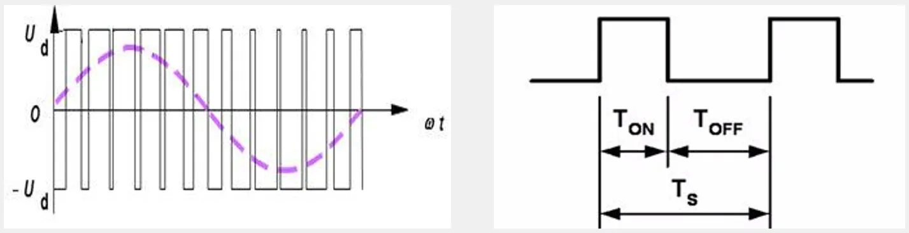

### 输出比较通道(通用)

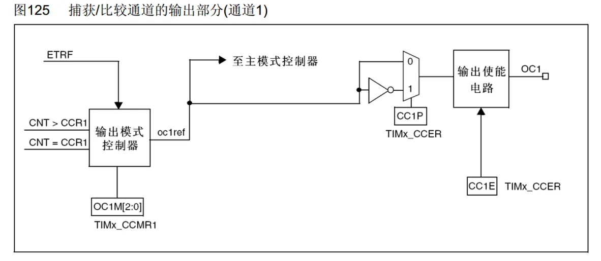

### 输出比较通道(高级)

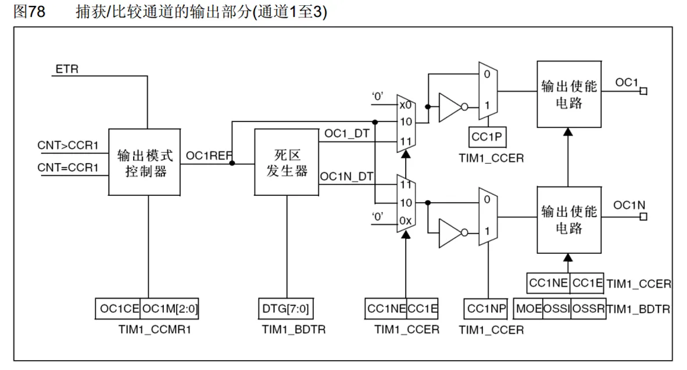

### 输出比较模式

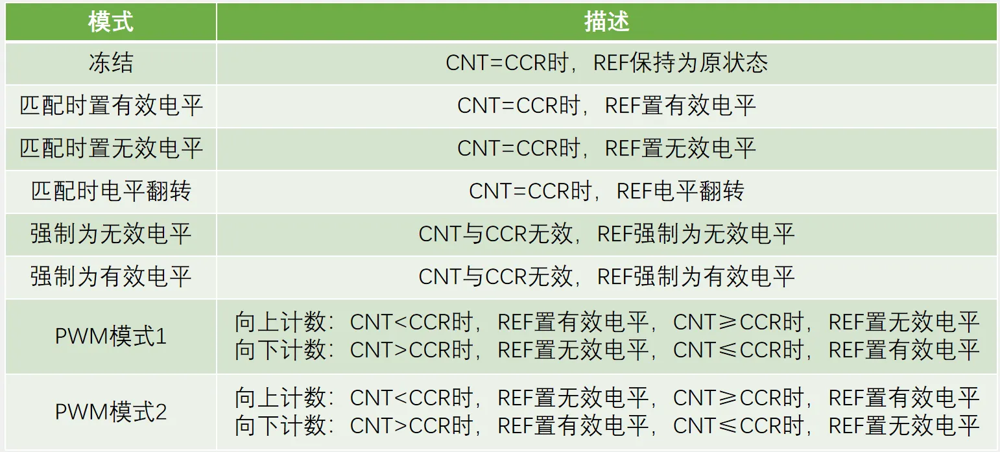

### PWM基本结构

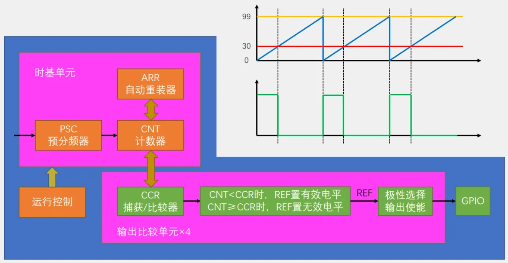

### 参数计算

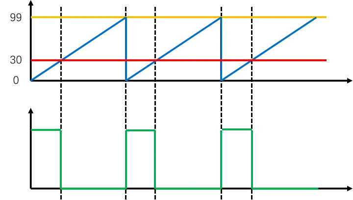

PWM频率：	Freq = CK_PSC / (PSC + 1) / (ARR + 1)

PWM占空比：	Duty = CCR / (ARR + 1)

PWM分辨率：	Reso = 1 / (ARR + 1)（定义的分辨率最小距离，不是实际分辨率）

### 舵机简介
舵机是一种根据输入PWM信号占空比来控制输出角度的装置

输入PWM信号要求：周期为20ms，高电平宽度为0.5ms~2.5ms

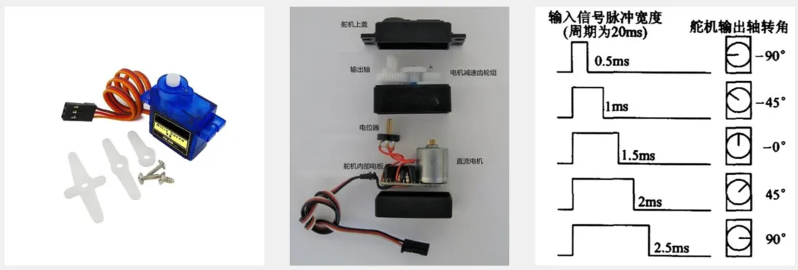

### 硬件电路

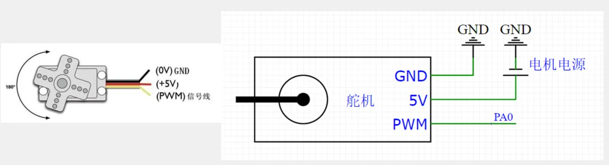

### 直流电机及驱动简介
直流电机是一种将电能转换为机械能的装置，有两个电极，当电极正接时，电机正转，当电极反接时，电机反转

直流电机属于大功率器件，GPIO口无法直接驱动，需要配合电机驱动电路来操作

TB6612是一款双路H桥型的直流电机驱动芯片，可以驱动两个直流电机并且控制其转速和方向

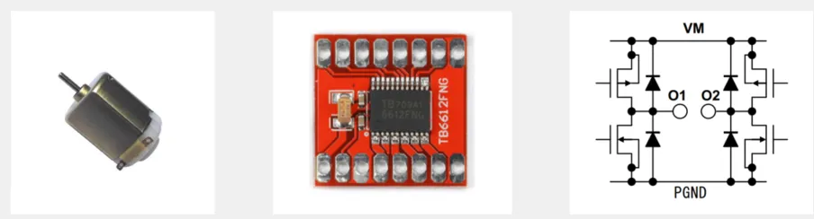

### 硬件电路

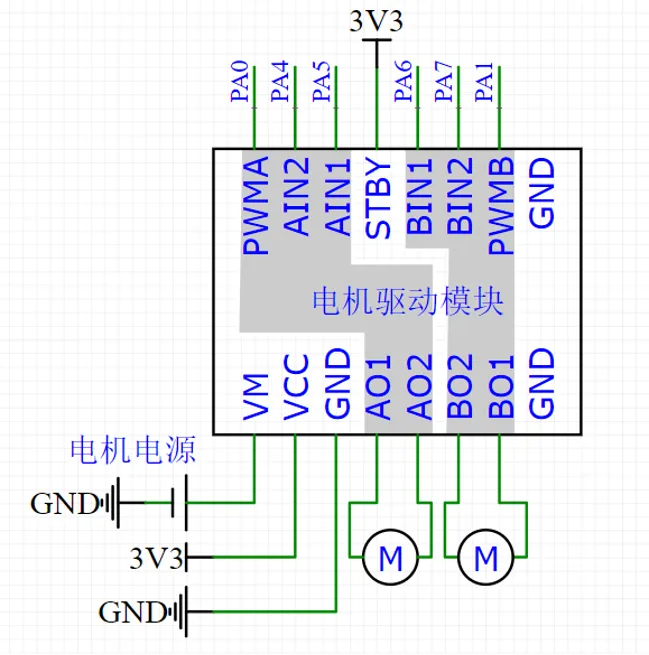

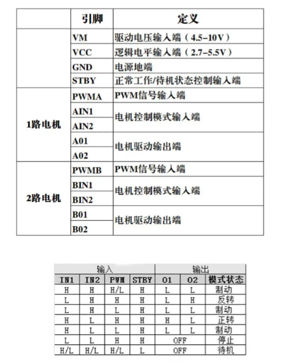
