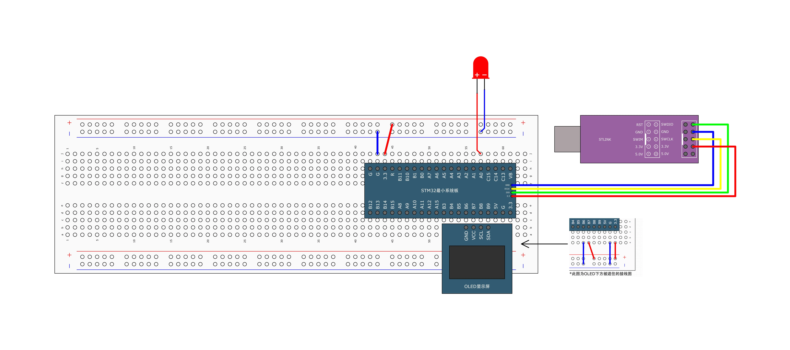
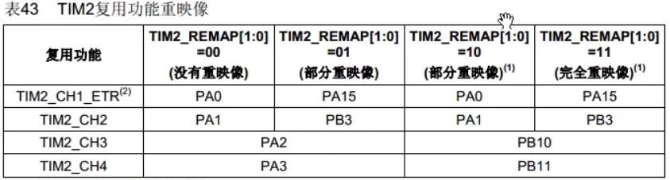
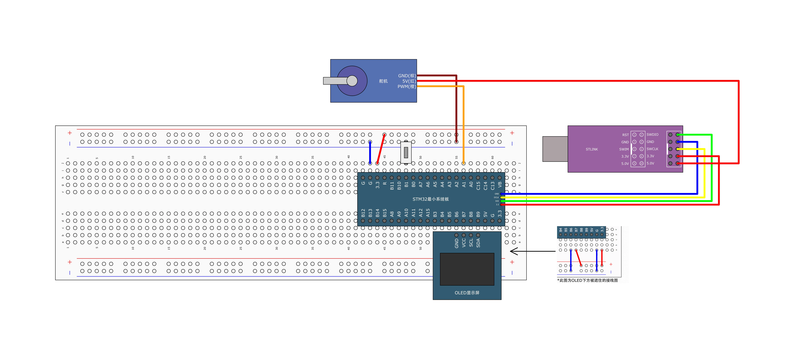
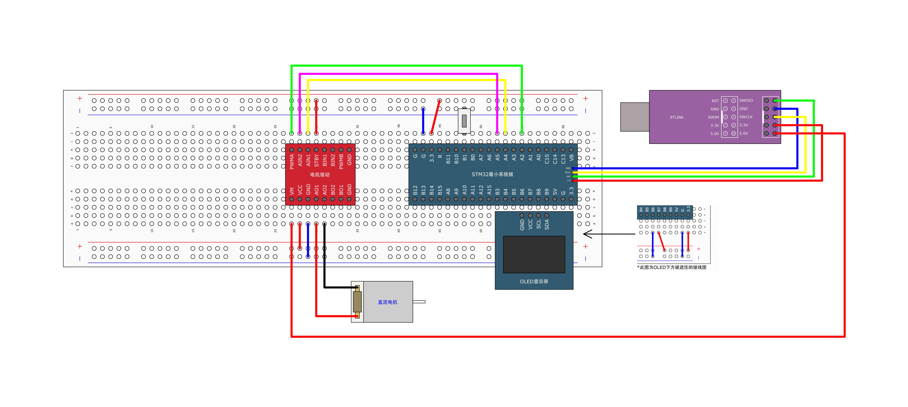

## [6-4] PWM驱动LED呼吸灯&PWM驱动舵机&PWM驱动直流电机
### PWM驱动LED呼吸灯+引脚重映射



```c
#include "stm32f10x.h"                  // Device header
#include "Delay.h"
#include "OLED.h"
#include "PWM.h"

uint8_t i;			//定义for循环的变量

int main(void)
{
	/*模块初始化*/
	OLED_Init();		//OLED初始化
	PWM_Init();			//PWM初始化
	
	while (1)
	{
		for (i = 0; i <= 100; i++)
		{
			PWM_SetCompare1(i);			//依次将定时器的CCR寄存器设置为0~100，PWM占空比逐渐增大，LED逐渐变亮
			Delay_ms(10);				//延时10ms
		}
		for (i = 0; i <= 100; i++)
		{
			PWM_SetCompare1(100 - i);	//依次将定时器的CCR寄存器设置为100~0，PWM占空比逐渐减小，LED逐渐变暗
			Delay_ms(10);				//延时10ms
		}
	}
}

```

```c
#ifndef __PWM_H
#define __PWM_H

void PWM_Init(void);
void PWM_SetCompare1(uint16_t Compare);

#endif

```

```c
#include "stm32f10x.h"                  // Device header

/**
  * 函    数：PWM初始化
  * 参    数：无
  * 返 回 值：无
  */
void PWM_Init(void)
{
	/*开启时钟*/
	RCC_APB1PeriphClockCmd(RCC_APB1Periph_TIM2, ENABLE);			//开启TIM2的时钟
	RCC_APB2PeriphClockCmd(RCC_APB2Periph_GPIOA, ENABLE);			//开启GPIOA的时钟
	
	/*GPIO重映射*/
//	RCC_APB2PeriphClockCmd(RCC_APB2Periph_AFIO, ENABLE);			//开启AFIO的时钟，重映射必须先开启AFIO的时钟
//	GPIO_PinRemapConfig(GPIO_PartialRemap1_TIM2, ENABLE);			//将TIM2的引脚部分重映射，具体的映射方案需查看参考手册
//	GPIO_PinRemapConfig(GPIO_Remap_SWJ_JTAGDisable, ENABLE);		//将JTAG引脚失能，作为普通GPIO引脚使用
	
	/*GPIO初始化*/
	GPIO_InitTypeDef GPIO_InitStructure;
	GPIO_InitStructure.GPIO_Mode = GPIO_Mode_AF_PP;
	GPIO_InitStructure.GPIO_Pin = GPIO_Pin_0;		//GPIO_Pin_15;
	GPIO_InitStructure.GPIO_Speed = GPIO_Speed_50MHz;
	GPIO_Init(GPIOA, &GPIO_InitStructure);							//将PA0引脚初始化为复用推挽输出	
																	//受外设控制的引脚，均需要配置为复用模式		
	
	/*配置时钟源*/
	TIM_InternalClockConfig(TIM2);		//选择TIM2为内部时钟，若不调用此函数，TIM默认也为内部时钟
	
	/*时基单元初始化*/
	TIM_TimeBaseInitTypeDef TIM_TimeBaseInitStructure;				//定义结构体变量
	TIM_TimeBaseInitStructure.TIM_ClockDivision = TIM_CKD_DIV1;     //时钟分频，选择不分频，此参数用于配置滤波器时钟，不影响时基单元功能
	TIM_TimeBaseInitStructure.TIM_CounterMode = TIM_CounterMode_Up; //计数器模式，选择向上计数
	TIM_TimeBaseInitStructure.TIM_Period = 100 - 1;					//计数周期，即ARR的值
	TIM_TimeBaseInitStructure.TIM_Prescaler = 720 - 1;				//预分频器，即PSC的值
	TIM_TimeBaseInitStructure.TIM_RepetitionCounter = 0;            //重复计数器，高级定时器才会用到
	TIM_TimeBaseInit(TIM2, &TIM_TimeBaseInitStructure);             //将结构体变量交给TIM_TimeBaseInit，配置TIM2的时基单元
	
	/*输出比较初始化*/
	TIM_OCInitTypeDef TIM_OCInitStructure;							//定义结构体变量
	TIM_OCStructInit(&TIM_OCInitStructure);							//结构体初始化，若结构体没有完整赋值
																	//则最好执行此函数，给结构体所有成员都赋一个默认值
																	//避免结构体初值不确定的问题
	TIM_OCInitStructure.TIM_OCMode = TIM_OCMode_PWM1;				//输出比较模式，选择PWM模式1
	TIM_OCInitStructure.TIM_OCPolarity = TIM_OCPolarity_High;		//输出极性，选择为高，若选择极性为低，则输出高低电平取反
	TIM_OCInitStructure.TIM_OutputState = TIM_OutputState_Enable;	//输出使能
	TIM_OCInitStructure.TIM_Pulse = 0;								//初始的CCR值
	TIM_OC1Init(TIM2, &TIM_OCInitStructure);						//将结构体变量交给TIM_OC1Init，配置TIM2的输出比较通道1
	
	/*TIM使能*/
	TIM_Cmd(TIM2, ENABLE);			//使能TIM2，定时器开始运行
}

/**
  * 函    数：PWM设置CCR
  * 参    数：Compare 要写入的CCR的值，范围：0~100
  * 返 回 值：无
  * 注意事项：CCR和ARR共同决定占空比，此函数仅设置CCR的值，并不直接是占空比
  *           占空比Duty = CCR / (ARR + 1)
  */
void PWM_SetCompare1(uint16_t Compare)
{
	TIM_SetCompare1(TIM2, Compare);		//设置CCR1的值
}
```



### PWM驱动舵机



```c
#ifndef __SERVO_H
#define __SERVO_H

void Servo_Init(void);
void Servo_SetAngle(float Angle);

#endif
```

```c
#include "stm32f10x.h"                  // Device header
#include "PWM.h"

/**
  * 函    数：舵机初始化
  * 参    数：无
  * 返 回 值：无
  */
void Servo_Init(void)
{
	PWM_Init();									//初始化舵机的底层PWM
}

/**
  * 函    数：舵机设置角度
  * 参    数：Angle 要设置的舵机角度，范围：0~180
  * 返 回 值：无
  */
void Servo_SetAngle(float Angle)
{
	PWM_SetCompare2(Angle / 180 * 2000 + 500);	//设置占空比
												//将角度线性变换，对应到舵机要求的占空比范围上
}

```

```c
#include "stm32f10x.h"                  // Device header
#include "Delay.h"
#include "OLED.h"
#include "Servo.h"
#include "Key.h"

uint8_t KeyNum;			//定义用于接收键码的变量
float Angle;			//定义角度变量

int main(void)
{
	/*模块初始化*/
	OLED_Init();		//OLED初始化
	Servo_Init();		//舵机初始化
	Key_Init();			//按键初始化
	
	/*显示静态字符串*/
	OLED_ShowString(1, 1, "Angle:");	//1行1列显示字符串Angle:
	
	while (1)
	{
		KeyNum = Key_GetNum();			//获取按键键码
		if (KeyNum == 1)				//按键1按下
		{
			Angle += 30;				//角度变量自增30
			if (Angle > 180)			//角度变量超过180后
			{
				Angle = 0;				//角度变量归零
			}
		}
		Servo_SetAngle(Angle);			//设置舵机的角度为角度变量
		OLED_ShowNum(1, 7, Angle, 3);	//OLED显示角度变量
	}
}

```

### PWM驱动直流电机



```c
#ifndef __MOTOR_H
#define __MOTOR_H

void Motor_Init(void);
void Motor_SetSpeed(int8_t Speed);

#endif
```

```c
#include "stm32f10x.h"                  // Device header
#include "PWM.h"

/**
  * 函    数：直流电机初始化
  * 参    数：无
  * 返 回 值：无
  */
void Motor_Init(void)
{
	/*开启时钟*/
	RCC_APB2PeriphClockCmd(RCC_APB2Periph_GPIOA, ENABLE);		//开启GPIOA的时钟
	
	GPIO_InitTypeDef GPIO_InitStructure;
	GPIO_InitStructure.GPIO_Mode = GPIO_Mode_Out_PP;
	GPIO_InitStructure.GPIO_Pin = GPIO_Pin_4 | GPIO_Pin_5;
	GPIO_InitStructure.GPIO_Speed = GPIO_Speed_50MHz;
	GPIO_Init(GPIOA, &GPIO_InitStructure);						//将PA4和PA5引脚初始化为推挽输出	
	
	PWM_Init();													//初始化直流电机的底层PWM
}

/**
  * 函    数：直流电机设置速度
  * 参    数：Speed 要设置的速度，范围：-100~100
  * 返 回 值：无
  */
void Motor_SetSpeed(int8_t Speed)
{
	if (Speed >= 0)							//如果设置正转的速度值
	{
		GPIO_SetBits(GPIOA, GPIO_Pin_4);	//PA4置高电平
		GPIO_ResetBits(GPIOA, GPIO_Pin_5);	//PA5置低电平，设置方向为正转
		PWM_SetCompare3(Speed);				//PWM设置为速度值
	}
	else									//否则，即设置反转的速度值
	{
		GPIO_ResetBits(GPIOA, GPIO_Pin_4);	//PA4置低电平
		GPIO_SetBits(GPIOA, GPIO_Pin_5);	//PA5置高电平，设置方向为反转
		PWM_SetCompare3(-Speed);			//PWM设置为负的速度值，因为此时速度值为负数，而PWM只能给正数
	}
}

```

```c
#include "stm32f10x.h"                  // Device header
#include "Delay.h"
#include "OLED.h"
#include "Motor.h"
#include "Key.h"

uint8_t KeyNum;		//定义用于接收按键键码的变量
int8_t Speed;		//定义速度变量

int main(void)
{
	/*模块初始化*/
	OLED_Init();		//OLED初始化
	Motor_Init();		//直流电机初始化
	Key_Init();			//按键初始化
	
	/*显示静态字符串*/
	OLED_ShowString(1, 1, "Speed:");		//1行1列显示字符串Speed:
	
	while (1)
	{
		KeyNum = Key_GetNum();				//获取按键键码
		if (KeyNum == 1)					//按键1按下
		{
			Speed += 20;					//速度变量自增20
			if (Speed > 100)				//速度变量超过100后
			{
				Speed = -100;				//速度变量变为-100
											//此操作会让电机旋转方向突然改变，可能会因供电不足而导致单片机复位
											//若出现了此现象，则应避免使用这样的操作
			}
		}
		Motor_SetSpeed(Speed);				//设置直流电机的速度为速度变量
		OLED_ShowSignedNum(1, 7, Speed, 3);	//OLED显示速度变量
	}
}
```