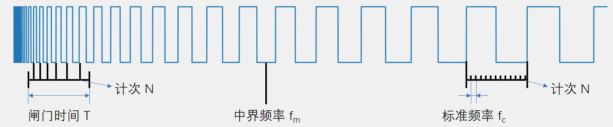
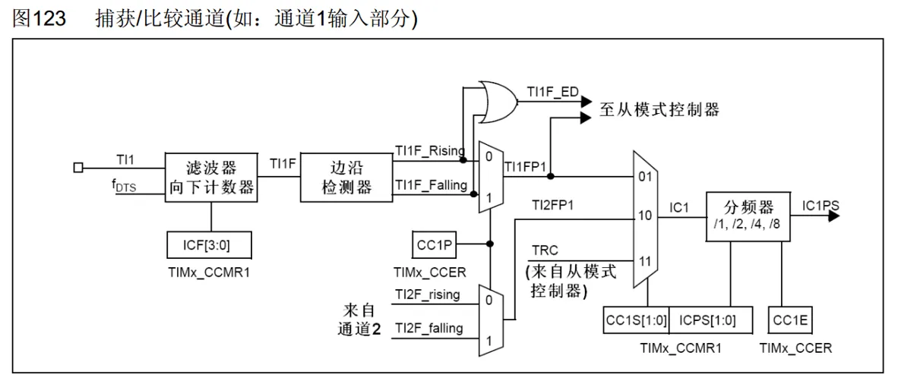
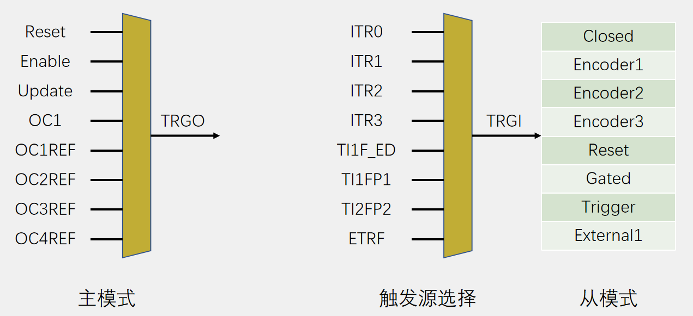
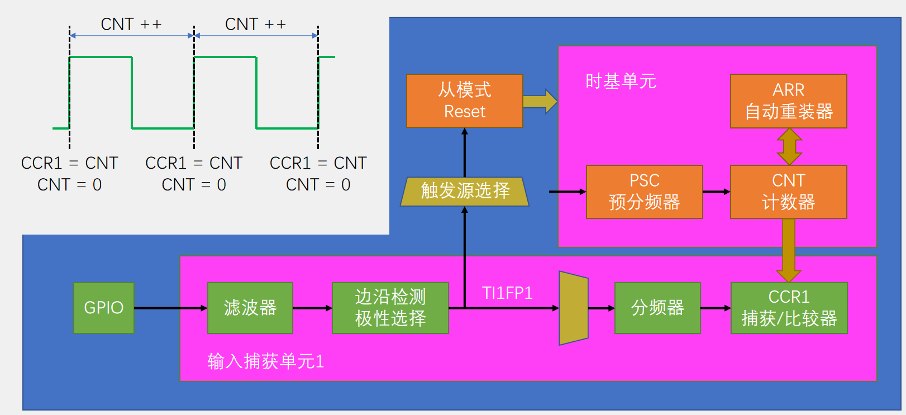
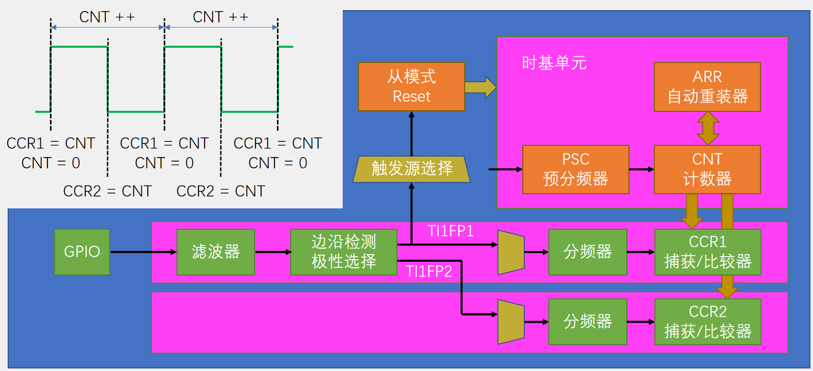

## [6-5] TIM输入捕获
### 输入捕获简介
IC（Input Capture）输入捕获输入

捕获模式下，当通道输入引脚出现指定电平跳变时，当前CNT的值将被锁存到CCR中，可用于测量PWM波形的频率、占空比、脉冲间隔、电平持续时间等参数

每个高级定时器和通用定时器都拥有4个输入捕获通道

可配置为PWMI模式，同时测量频率和占空比

可配合主从触发模式，实现硬件全自动测量

### 频率测量

测频法：在闸门时间T内，对上升沿计次，得到N，则频率（高频）（跳频慢）

f_x=N / T

测周法：两个上升沿内，以标准频率fc计次，得到N ，则频率（低频，跳频快）

f_x=f_c / N

中界频率：测频法与测周法误差相等的频率点

fm=(fc/T)^(1/2)

### 输入捕获通道

### 主从触发模式

### 输入捕获基本结构

### PWMI基本结构

