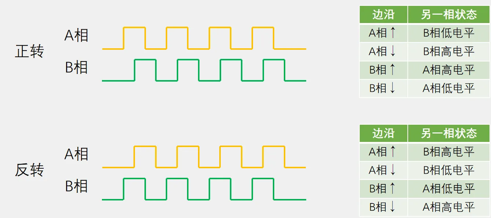
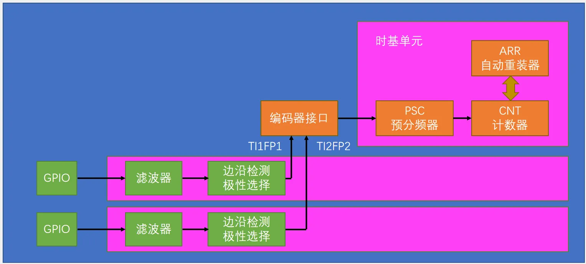
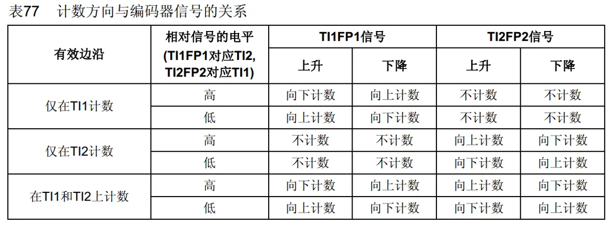
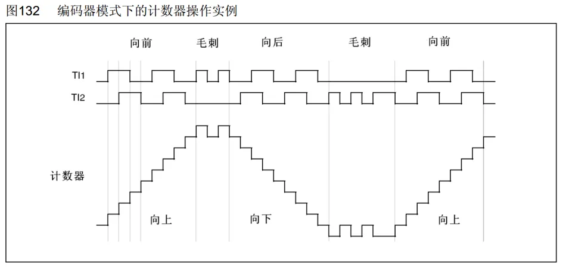
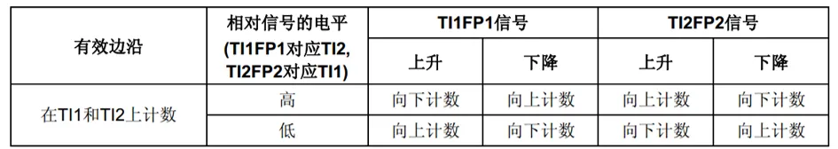
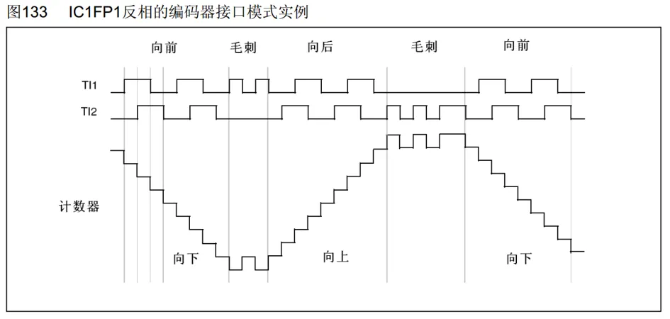

## [6-7] TIM编码器接口
### 编码器接口简介
Encoder Interface 编码器接口

编码器接口可接收增量（正交）编码器的信号，根据编码器旋转产生的正交信号脉冲，自动控制CNT自增或自减，从而指示编码器的位置、旋转方向和旋转速度

每个高级定时器和通用定时器都拥有1个编码器接口

两个输入引脚借用了输入捕获的通道1和通道2

### 正交编码器

### 编码器接口基本结构

### 工作模式

### 实例（均不反相）

### 实例（TI1反相）

