# 第七章 ADC模数转换器
## [7-1] ADC模数转换器
### ADC简介
ADC（Analog-Digital Converter）模拟-数字转换器

ADC可以将引脚上连续变化的模拟电压转换为内存中存储的数字变量，建立模拟电路到数字电路的桥梁

12位逐次逼近型ADC，1us转换时间

输入电压范围：`0~3.3V`，转换结果范围：`0~4095`

18个输入通道，可测量16个外部和2个内部信号源

规则组和注入组两个转换单元

模拟看门狗自动监测输入电压范围

STM32F103C8T6 ADC资源：ADC1、ADC2，10个外部输入通道

### 逐次逼近型ADC

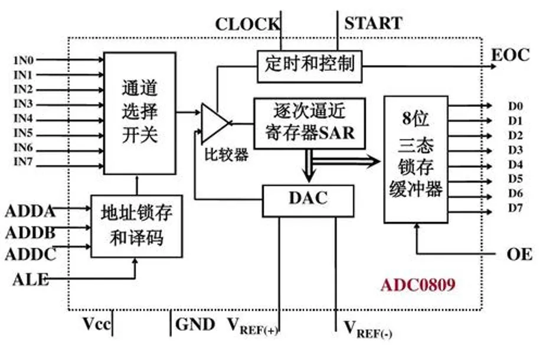

### ADC框图

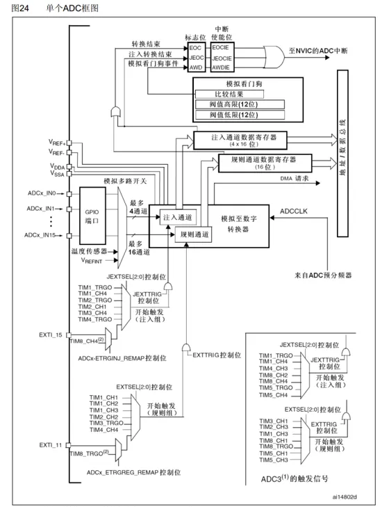

### ADC基本结构

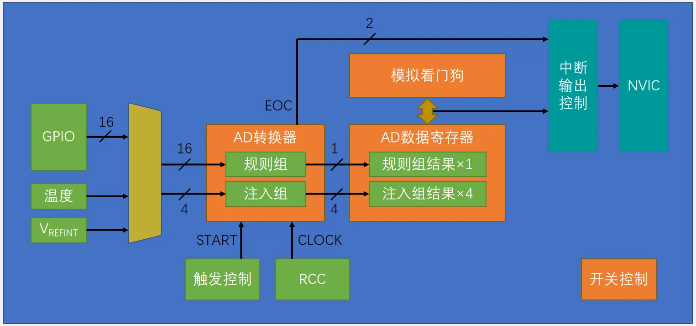

### 输入通道

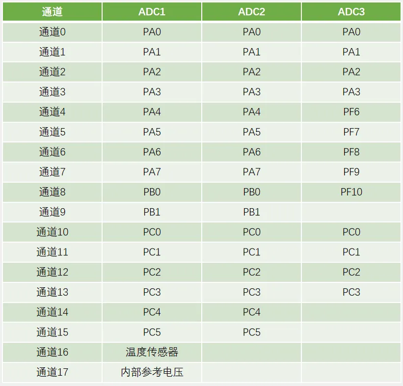

### 转换模式
**单次转换，非扫描模式**

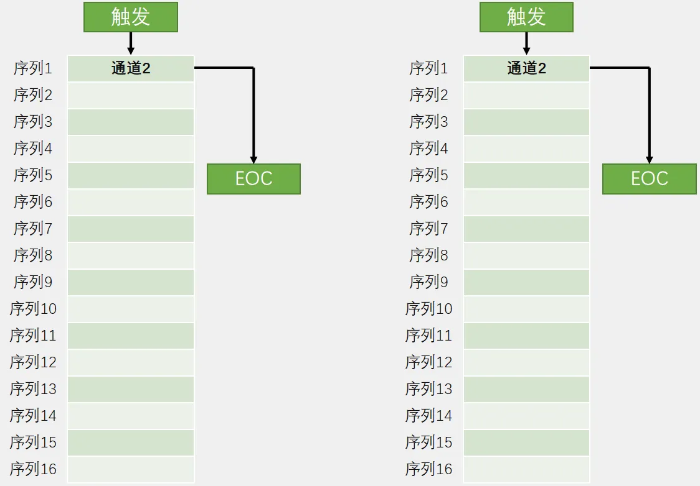

**连续转换，非扫描模式**

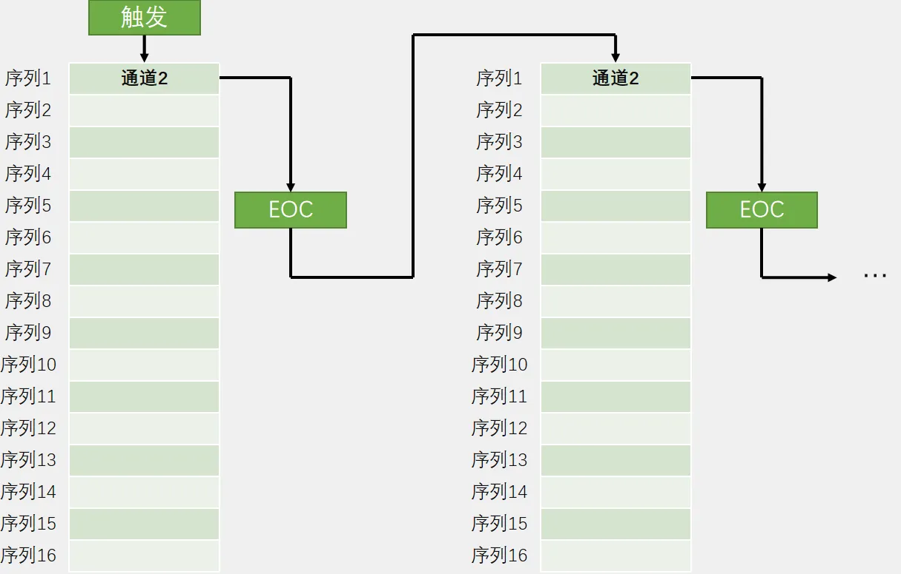

**单次转换，扫描模式**

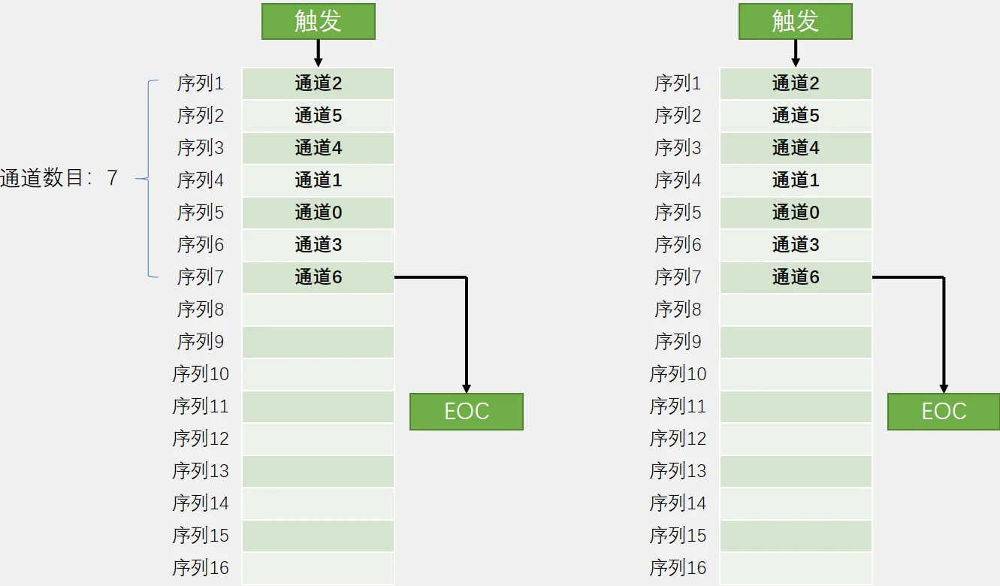

**连续转换，扫描模式**

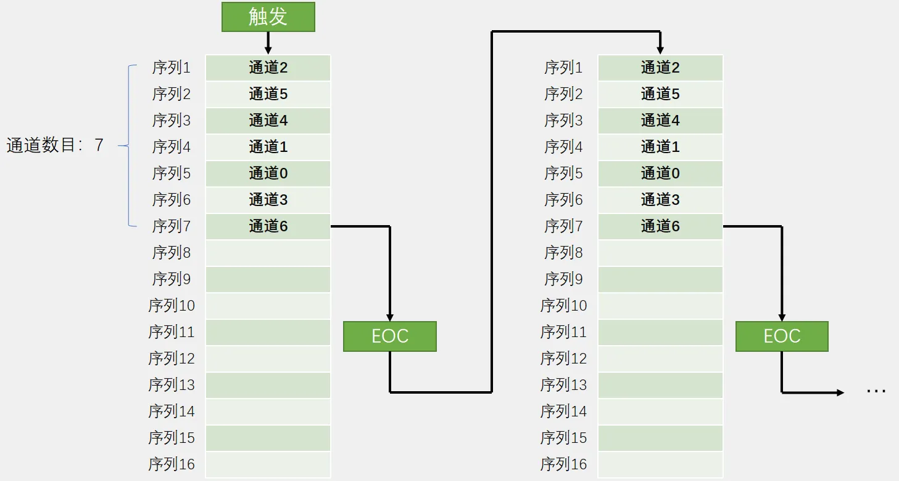

### 触发控制

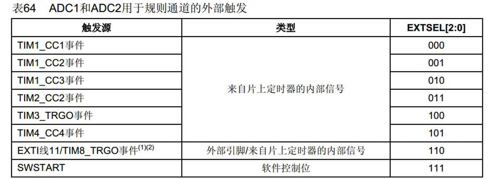

### 数据对齐
数据右对齐：

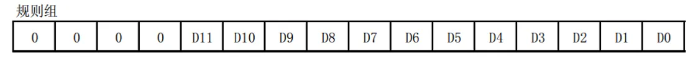

数据左对齐：

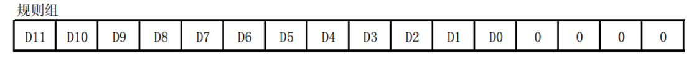

### 转换时间
AD转换的步骤：采样，保持，量化，编码

STM32 ADC的总转换时间为：

	TCONV = 采样时间 + 12.5个ADC周期

例如：当ADCCLK=14MHz，采样时间为1.5个ADC周期

	TCONV = 1.5 + 12.5 = 14个ADC周期 = 1μs

### 校准
ADC有一个内置自校准模式。校准可大幅减小因内部电容器组的变化而造成的准精度误差。校准期间，在每个电容器上都会计算出一个误差修正码(数字值)，这个码用于消除在随后的转换中每个电容器上产生的误差

建议在每次上电后执行一次校准启动校准前， ADC必须处于关电状态超过至少两个ADC时钟周期

### 硬件电路

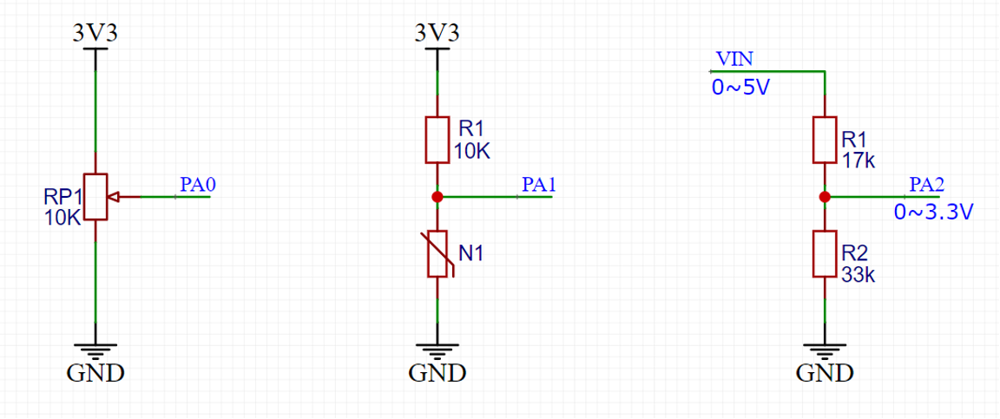