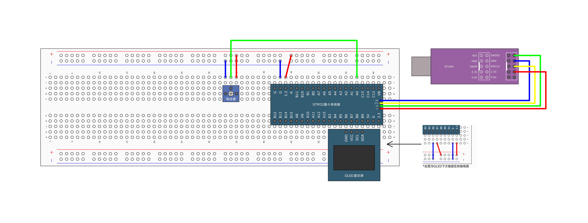
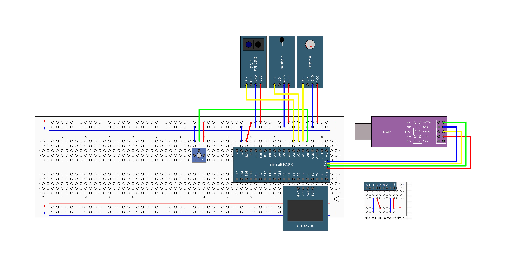

## [7-2] AD单通道&AD多通道
### AD单通道



```c
#ifndef __AD_H
#define __AD_H

void AD_Init(void);
uint16_t AD_GetValue(void);

#endif
```

```c
#include "stm32f10x.h"                  // Device header

/**
  * 函    数：AD初始化
  * 参    数：无
  * 返 回 值：无
  */
void AD_Init(void)
{
	/*开启时钟*/
	RCC_APB2PeriphClockCmd(RCC_APB2Periph_ADC1, ENABLE);	//开启ADC1的时钟
	RCC_APB2PeriphClockCmd(RCC_APB2Periph_GPIOA, ENABLE);	//开启GPIOA的时钟
	
	/*设置ADC时钟*/
	RCC_ADCCLKConfig(RCC_PCLK2_Div6);						//选择时钟6分频，ADCCLK = 72MHz / 6 = 12MHz
	
	/*GPIO初始化*/
	GPIO_InitTypeDef GPIO_InitStructure;
	GPIO_InitStructure.GPIO_Mode = GPIO_Mode_AIN;
	GPIO_InitStructure.GPIO_Pin = GPIO_Pin_0;
	GPIO_InitStructure.GPIO_Speed = GPIO_Speed_50MHz;
	GPIO_Init(GPIOA, &GPIO_InitStructure);					//将PA0引脚初始化为模拟输入
	
	/*规则组通道配置*/
	ADC_RegularChannelConfig(ADC1, ADC_Channel_0, 1, ADC_SampleTime_55Cycles5);		//规则组序列1的位置，配置为通道0
	                               //pin0            //采样时间
	/*ADC初始化*/
	ADC_InitTypeDef ADC_InitStructure;						//定义结构体变量
	ADC_InitStructure.ADC_Mode = ADC_Mode_Independent;		//模式，选择独立模式，即单独使用ADC1
	ADC_InitStructure.ADC_DataAlign = ADC_DataAlign_Right;	//数据对齐，选择右对齐
	ADC_InitStructure.ADC_ExternalTrigConv = ADC_ExternalTrigConv_None;	//外部触发，使用软件触发，不需要外部触发
	ADC_InitStructure.ADC_ContinuousConvMode = DISABLE;		//连续转换，失能，每转换一次规则组序列后停止
	ADC_InitStructure.ADC_ScanConvMode = DISABLE;			//扫描模式，失能，只转换规则组的序列1这一个位置
	ADC_InitStructure.ADC_NbrOfChannel = 1;					//通道数，为1，仅在扫描模式下，才需要指定大于1的数，在非扫描模式下，只能是1
	ADC_Init(ADC1, &ADC_InitStructure);						//将结构体变量交给ADC_Init，配置ADC1
	
	/*ADC使能*/
	ADC_Cmd(ADC1, ENABLE);									//使能ADC1，ADC开始运行
	
	/*ADC校准*/
	ADC_ResetCalibration(ADC1);//复位校准			    	//固定流程，内部有电路会自动执行校准
	while (ADC_GetResetCalibrationStatus(ADC1) == SET);
	ADC_StartCalibration(ADC1);
	while (ADC_GetCalibrationStatus(ADC1) == SET);
}

/**
  * 函    数：获取AD转换的值
  * 参    数：无
  * 返 回 值：AD转换的值，范围：0~4095
  */
uint16_t AD_GetValue(void)
{
	ADC_SoftwareStartConvCmd(ADC1, ENABLE);					//软件触发AD转换一次
	while (ADC_GetFlagStatus(ADC1, ADC_FLAG_EOC) == RESET);	//等待EOC标志位，即等待AD转换结束
	return ADC_GetConversionValue(ADC1);					//读数据寄存器，得到AD转换的结果
}
```

```c
#include "stm32f10x.h"                  // Device header
#include "Delay.h"
#include "OLED.h"
#include "AD.h"

uint16_t ADValue;			//定义AD值变量
float Voltage;				//定义电压变量

int main(void)
{
	/*模块初始化*/
	OLED_Init();			//OLED初始化
	AD_Init();				//AD初始化
	
	/*显示静态字符串*/
	OLED_ShowString(1, 1, "ADValue:");
	OLED_ShowString(2, 1, "Voltage:0.00V");
	
	while (1)
	{
		ADValue = AD_GetValue();					//获取AD转换的值
		Voltage = (float)ADValue / 4095 * 3.3;		//将AD值线性变换到0~3.3的范围，表示电压
		
		OLED_ShowNum(1, 9, ADValue, 4);				//显示AD值
		OLED_ShowNum(2, 9, Voltage, 1);				//显示电压值的整数部分
		OLED_ShowNum(2, 11, (uint16_t)(Voltage * 100) % 100, 2);	//显示电压值的小数部分
		
		Delay_ms(100);			//延时100ms，手动增加一些转换的间隔时间
	}
}
```

<font style="color:rgb(15, 17, 21);"> 1.</font>**<font style="color:rgb(15, 17, 21);">轮询方式（你的代码当前方式）</font>**

**<font style="color:rgb(15, 17, 21);">工作原理</font>**<font style="color:rgb(15, 17, 21);">：每次调用这个函数时，手动触发一次转换，然后等待EOC标志位，转换完成后返回结果。</font>

<font style="color:rgb(15, 17, 21);">2.</font>**<font style="color:rgb(15, 17, 21);">连续转换模式</font>**

<font style="color:rgb(15, 17, 21);">ADC_InitStructure.ADC_ContinuousConvMode = ENABLE;        // 使能连续转换模式</font>

<font style="color:rgb(15, 17, 21);">放在init中</font>

<font style="color:rgb(15, 17, 21);">ADC_SoftwareStartConvCmd(ADC1, ENABLE);                    // 启动连续转换</font>

### AD多通道



```c
#include "stm32f10x.h"                  // Device header
#include "Delay.h"
#include "OLED.h"
#include "AD.h"

uint16_t AD0, AD1, AD2, AD3;	//定义AD值变量

int main(void)
{
	/*模块初始化*/
	OLED_Init();				//OLED初始化
	AD_Init();					//AD初始化
	
	/*显示静态字符串*/
	OLED_ShowString(1, 1, "AD0:");
	OLED_ShowString(2, 1, "AD1:");
	OLED_ShowString(3, 1, "AD2:");
	OLED_ShowString(4, 1, "AD3:");
	
	while (1)
	{
		AD0 = AD_GetValue(ADC_Channel_0);		//单次启动ADC，转换通道0
		AD1 = AD_GetValue(ADC_Channel_1);		//单次启动ADC，转换通道1
		AD2 = AD_GetValue(ADC_Channel_2);		//单次启动ADC，转换通道2
		AD3 = AD_GetValue(ADC_Channel_3);		//单次启动ADC，转换通道3
		
		OLED_ShowNum(1, 5, AD0, 4);				//显示通道0的转换结果AD0
		OLED_ShowNum(2, 5, AD1, 4);				//显示通道1的转换结果AD1
		OLED_ShowNum(3, 5, AD2, 4);				//显示通道2的转换结果AD2
		OLED_ShowNum(4, 5, AD3, 4);				//显示通道3的转换结果AD3
		
		Delay_ms(100);			//延时100ms，手动增加一些转换的间隔时间
	}
}
```

```c
#include "stm32f10x.h"                  // Device header

/**
  * 函    数：AD初始化
  * 参    数：无
  * 返 回 值：无
  */
void AD_Init(void)
{
	/*开启时钟*/
	RCC_APB2PeriphClockCmd(RCC_APB2Periph_ADC1, ENABLE);	//开启ADC1的时钟
	RCC_APB2PeriphClockCmd(RCC_APB2Periph_GPIOA, ENABLE);	//开启GPIOA的时钟
	
	/*设置ADC时钟*/
	RCC_ADCCLKConfig(RCC_PCLK2_Div6);						//选择时钟6分频，ADCCLK = 72MHz / 6 = 12MHz
	
	/*GPIO初始化*/
	GPIO_InitTypeDef GPIO_InitStructure;
	GPIO_InitStructure.GPIO_Mode = GPIO_Mode_AIN;
	GPIO_InitStructure.GPIO_Pin = GPIO_Pin_0 | GPIO_Pin_1 | GPIO_Pin_2 | GPIO_Pin_3;
	GPIO_InitStructure.GPIO_Speed = GPIO_Speed_50MHz;
	GPIO_Init(GPIOA, &GPIO_InitStructure);					//将PA0、PA1、PA2和PA3引脚初始化为模拟输入
	
	/*不在此处配置规则组序列，而是在每次AD转换前配置，这样可以灵活更改AD转换的通道*/
	
	/*ADC初始化*/
	ADC_InitTypeDef ADC_InitStructure;						//定义结构体变量
	ADC_InitStructure.ADC_Mode = ADC_Mode_Independent;		//模式，选择独立模式，即单独使用ADC1
	ADC_InitStructure.ADC_DataAlign = ADC_DataAlign_Right;	//数据对齐，选择右对齐
	ADC_InitStructure.ADC_ExternalTrigConv = ADC_ExternalTrigConv_None;	//外部触发，使用软件触发，不需要外部触发
	ADC_InitStructure.ADC_ContinuousConvMode = DISABLE;		//连续转换，失能，每转换一次规则组序列后停止
	ADC_InitStructure.ADC_ScanConvMode = DISABLE;			//扫描模式，失能，只转换规则组的序列1这一个位置
	ADC_InitStructure.ADC_NbrOfChannel = 1;					//通道数，为1，仅在扫描模式下，才需要指定大于1的数，在非扫描模式下，只能是1
	ADC_Init(ADC1, &ADC_InitStructure);						//将结构体变量交给ADC_Init，配置ADC1
	
	/*ADC使能*/
	ADC_Cmd(ADC1, ENABLE);									//使能ADC1，ADC开始运行
	
	/*ADC校准*/
	ADC_ResetCalibration(ADC1);								//固定流程，内部有电路会自动执行校准
	while (ADC_GetResetCalibrationStatus(ADC1) == SET);
	ADC_StartCalibration(ADC1);
	while (ADC_GetCalibrationStatus(ADC1) == SET);
}

/**
  * 函    数：获取AD转换的值
  * 参    数：ADC_Channel 指定AD转换的通道，范围：ADC_Channel_x，其中x可以是0/1/2/3
  * 返 回 值：AD转换的值，范围：0~4095
  */
uint16_t AD_GetValue(uint8_t ADC_Channel)
{
	ADC_RegularChannelConfig(ADC1, ADC_Channel, 1, ADC_SampleTime_55Cycles5);	//在每次转换前，根据函数形参灵活更改规则组的通道1
	ADC_SoftwareStartConvCmd(ADC1, ENABLE);					//软件触发AD转换一次
	while (ADC_GetFlagStatus(ADC1, ADC_FLAG_EOC) == RESET);	//等待EOC标志位，即等待AD转换结束
	return ADC_GetConversionValue(ADC1);					//读数据寄存器，得到AD转换的结果
}

```