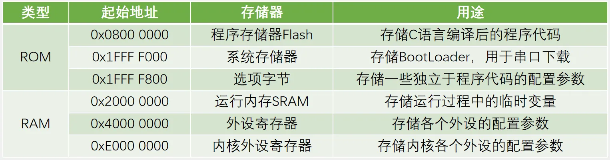
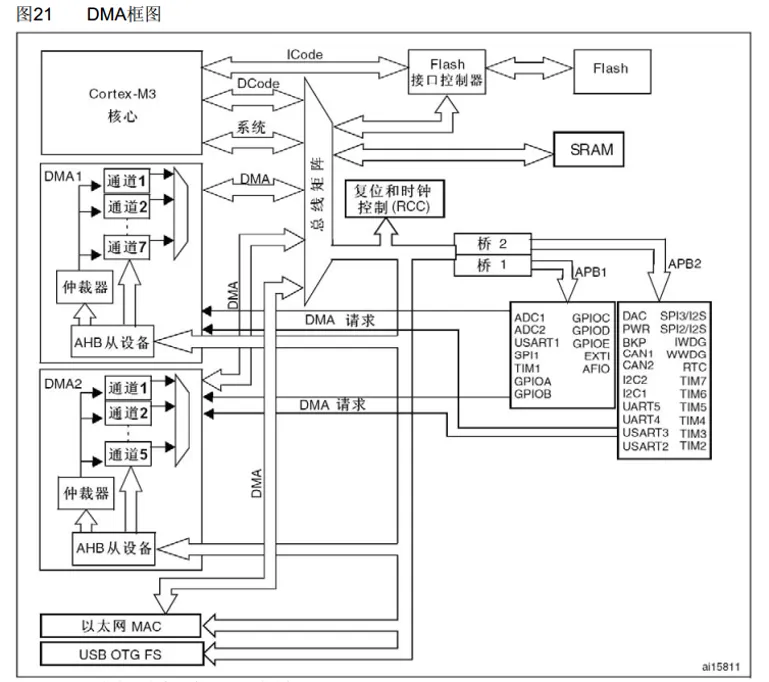
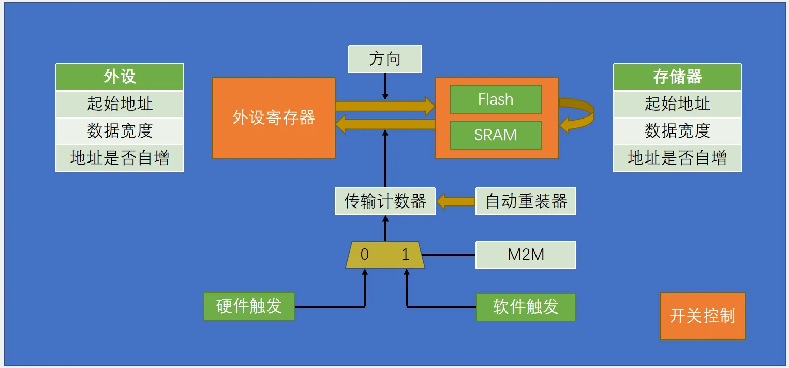
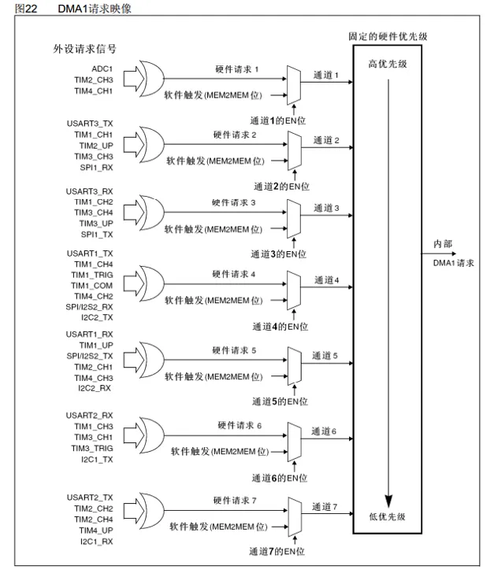
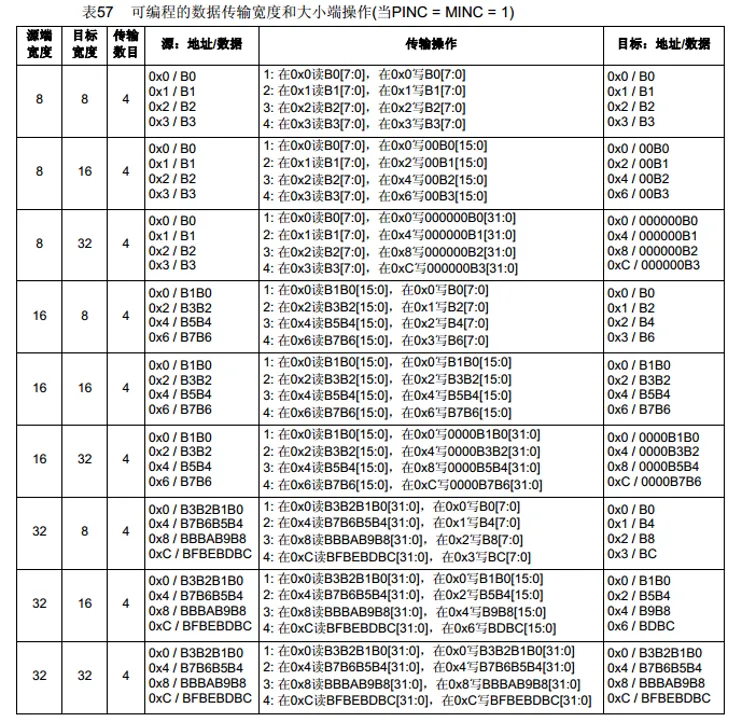
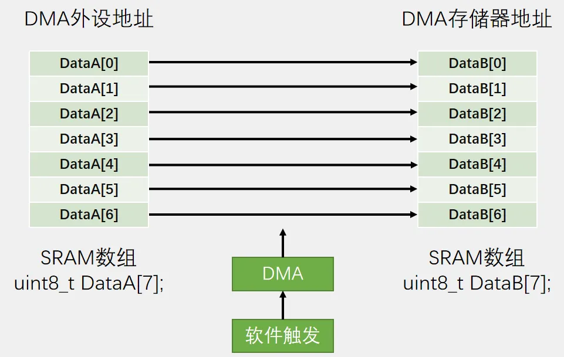
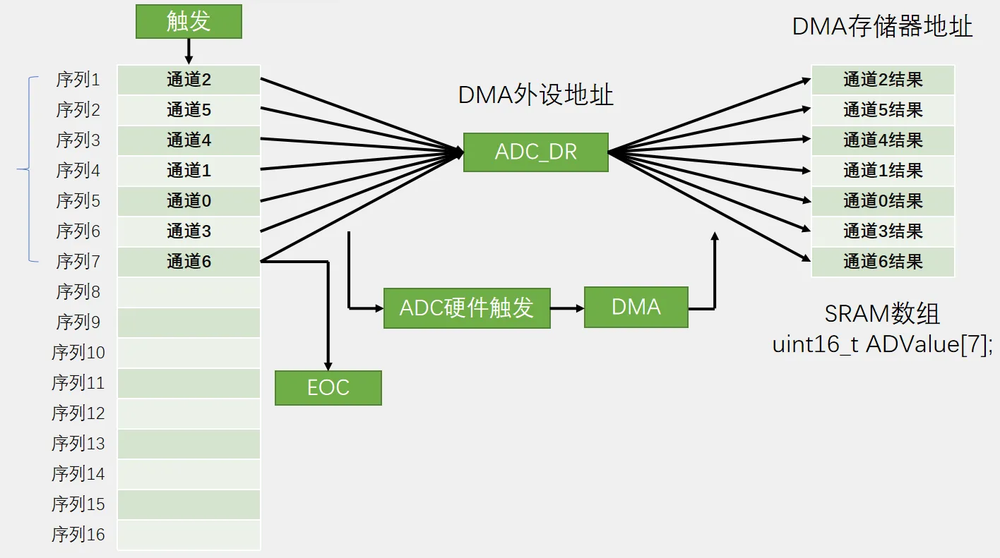

# 第八章 DMA直接存储器存取
## [8-1] DMA直接存储器存取
### DMA简介
DMA（Direct Memory Access）直接存储器存取

DMA可以提供外设和存储器或者存储器和存储器之间的高速数据传输，无须CPU干预，节省了CPU的资源

12个独立可配置的通道： DMA1（7个通道）， DMA2（5个通道）

每个通道都支持软件触发和特定的硬件触发

STM32F103C8T6 DMA资源：DMA1（7个通道）

### 存储器映像

### DMA框图

### DMA基本结构

### DMA请求

### 数据宽度与对齐

### 数据转运+DMA

### ADC扫描模式+DMA

