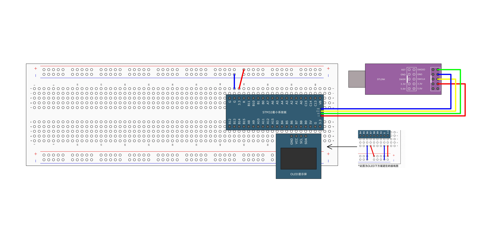
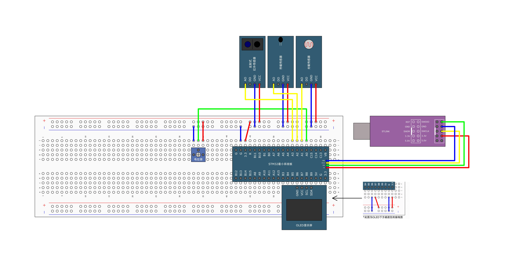
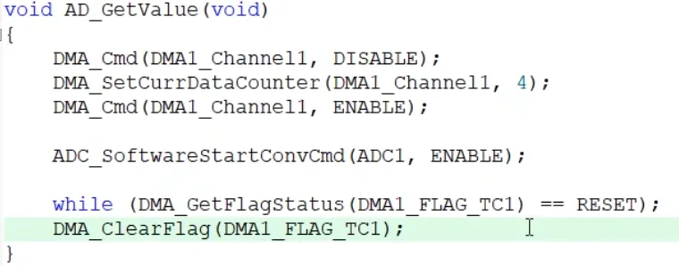

## [8-2] DMA数据转运&DMA+AD多通道
### DMA数据转运



```c
#ifndef __MYDMA_H
#define __MYDMA_H

void MyDMA_Init(uint32_t AddrA, uint32_t AddrB, uint16_t Size);
void MyDMA_Transfer(void);

#endif
```

```c
#include "stm32f10x.h"                  // Device header

uint16_t MyDMA_Size;					//定义全局变量，用于记住Init函数的Size，供Transfer函数使用

/**
  * 函    数：DMA初始化
  * 参    数：AddrA 原数组的首地址
  * 参    数：AddrB 目的数组的首地址
  * 参    数：Size 转运的数据大小（转运次数）
  * 返 回 值：无
  */
void MyDMA_Init(uint32_t AddrA, uint32_t AddrB, uint16_t Size)
{
	MyDMA_Size = Size;					//将Size写入到全局变量，记住参数Size
	
	/*开启时钟*/
	RCC_AHBPeriphClockCmd(RCC_AHBPeriph_DMA1, ENABLE);						//开启DMA的时钟
	
	/*DMA初始化*/
	DMA_InitTypeDef DMA_InitStructure;										//定义结构体变量
	DMA_InitStructure.DMA_PeripheralBaseAddr = AddrA;						//外设基地址，给定形参AddrA
	DMA_InitStructure.DMA_PeripheralDataSize = DMA_PeripheralDataSize_Byte;	//外设数据宽度，选择字节
	DMA_InitStructure.DMA_PeripheralInc = DMA_PeripheralInc_Enable;			//外设地址自增，选择使能
	DMA_InitStructure.DMA_MemoryBaseAddr = AddrB;							//存储器基地址，给定形参AddrB
	DMA_InitStructure.DMA_MemoryDataSize = DMA_MemoryDataSize_Byte;			//存储器数据宽度，选择字节
	DMA_InitStructure.DMA_MemoryInc = DMA_MemoryInc_Enable;					//存储器地址自增，选择使能
	DMA_InitStructure.DMA_DIR = DMA_DIR_PeripheralSRC;						//数据传输方向，选择由外设到存储器
	DMA_InitStructure.DMA_BufferSize = Size;								//转运的数据大小（转运次数）
	DMA_InitStructure.DMA_Mode = DMA_Mode_Normal;							//模式，选择正常模式
	DMA_InitStructure.DMA_M2M = DMA_M2M_Enable;								//存储器到存储器，选择使能
	DMA_InitStructure.DMA_Priority = DMA_Priority_Medium;					//优先级，选择中等
	DMA_Init(DMA1_Channel1, &DMA_InitStructure);							//将结构体变量交给DMA_Init，配置DMA1的通道1
	
	/*DMA使能*/
	DMA_Cmd(DMA1_Channel1, DISABLE);	//这里先不给使能，初始化后不会立刻工作，等后续调用Transfer后，再开始
}

/**
  * 函    数：启动DMA数据转运
  * 参    数：无
  * 返 回 值：无
  */
void MyDMA_Transfer(void)
{
	DMA_Cmd(DMA1_Channel1, DISABLE);					//DMA失能，在写入传输计数器之前，需要DMA暂停工作
	DMA_SetCurrDataCounter(DMA1_Channel1, MyDMA_Size);	//写入传输计数器，指定将要转运的次数
	DMA_Cmd(DMA1_Channel1, ENABLE);						//DMA使能，开始工作
	
	while (DMA_GetFlagStatus(DMA1_FLAG_TC1) == RESET);	//等待DMA工作完成
	DMA_ClearFlag(DMA1_FLAG_TC1);						//清除工作完成标志位
}
```

```c
#include "stm32f10x.h"                  // Device header
#include "Delay.h"
#include "OLED.h"
#include "MyDMA.h"

uint8_t DataA[] = {0x01, 0x02, 0x03, 0x04};				//定义测试数组DataA，为数据源
uint8_t DataB[] = {0, 0, 0, 0};							//定义测试数组DataB，为数据目的地

int main(void)
{
	/*模块初始化*/
	OLED_Init();				//OLED初始化
	
	MyDMA_Init((uint32_t)DataA, (uint32_t)DataB, 4);	//DMA初始化，把源数组和目的数组的地址传入
	
	/*显示静态字符串*/
	OLED_ShowString(1, 1, "DataA");
	OLED_ShowString(3, 1, "DataB");
	
	/*显示数组的首地址*/
	OLED_ShowHexNum(1, 8, (uint32_t)DataA, 8);
	OLED_ShowHexNum(3, 8, (uint32_t)DataB, 8);
		
	while (1)
	{
		DataA[0] ++;		//变换测试数据
		DataA[1] ++;
		DataA[2] ++;
		DataA[3] ++;
		
		OLED_ShowHexNum(2, 1, DataA[0], 2);		//显示数组DataA
		OLED_ShowHexNum(2, 4, DataA[1], 2);
		OLED_ShowHexNum(2, 7, DataA[2], 2);
		OLED_ShowHexNum(2, 10, DataA[3], 2);
		OLED_ShowHexNum(4, 1, DataB[0], 2);		//显示数组DataB
		OLED_ShowHexNum(4, 4, DataB[1], 2);
		OLED_ShowHexNum(4, 7, DataB[2], 2);
		OLED_ShowHexNum(4, 10, DataB[3], 2);
		
		Delay_ms(1000);		//延时1s，观察转运前的现象
		
		MyDMA_Transfer();	//使用DMA转运数组，从DataA转运到DataB
		
		OLED_ShowHexNum(2, 1, DataA[0], 2);		//显示数组DataA
		OLED_ShowHexNum(2, 4, DataA[1], 2);
		OLED_ShowHexNum(2, 7, DataA[2], 2);
		OLED_ShowHexNum(2, 10, DataA[3], 2);
		OLED_ShowHexNum(4, 1, DataB[0], 2);		//显示数组DataB
		OLED_ShowHexNum(4, 4, DataB[1], 2);
		OLED_ShowHexNum(4, 7, DataB[2], 2);
		OLED_ShowHexNum(4, 10, DataB[3], 2);

		Delay_ms(1000);		//延时1s，观察转运后的现象
	}
}
```

### DMA+AD多通道



```c
#ifndef __AD_H
#define __AD_H

extern uint16_t AD_Value[4];

void AD_Init(void);

#endif
```

```c
#include "stm32f10x.h"                  // Device header

uint16_t AD_Value[4];					//定义用于存放AD转换结果的全局数组

/**
  * 函    数：AD初始化
  * 参    数：无
  * 返 回 值：无
  */
void AD_Init(void)
{
	/*开启时钟*/
	RCC_APB2PeriphClockCmd(RCC_APB2Periph_ADC1, ENABLE);	//开启ADC1的时钟
	RCC_APB2PeriphClockCmd(RCC_APB2Periph_GPIOA, ENABLE);	//开启GPIOA的时钟
	RCC_AHBPeriphClockCmd(RCC_AHBPeriph_DMA1, ENABLE);		//开启DMA1的时钟
	
	/*设置ADC时钟*/
	RCC_ADCCLKConfig(RCC_PCLK2_Div6);						//选择时钟6分频，ADCCLK = 72MHz / 6 = 12MHz
	
	/*GPIO初始化*/
	GPIO_InitTypeDef GPIO_InitStructure;
	GPIO_InitStructure.GPIO_Mode = GPIO_Mode_AIN;
	GPIO_InitStructure.GPIO_Pin = GPIO_Pin_0 | GPIO_Pin_1 | GPIO_Pin_2 | GPIO_Pin_3;
	GPIO_InitStructure.GPIO_Speed = GPIO_Speed_50MHz;
	GPIO_Init(GPIOA, &GPIO_InitStructure);					//将PA0、PA1、PA2和PA3引脚初始化为模拟输入
	
	/*规则组通道配置*/
	ADC_RegularChannelConfig(ADC1, ADC_Channel_0, 1, ADC_SampleTime_55Cycles5);	//规则组序列1的位置，配置为通道0
	ADC_RegularChannelConfig(ADC1, ADC_Channel_1, 2, ADC_SampleTime_55Cycles5);	//规则组序列2的位置，配置为通道1
	ADC_RegularChannelConfig(ADC1, ADC_Channel_2, 3, ADC_SampleTime_55Cycles5);	//规则组序列3的位置，配置为通道2
	ADC_RegularChannelConfig(ADC1, ADC_Channel_3, 4, ADC_SampleTime_55Cycles5);	//规则组序列4的位置，配置为通道3
	
	/*ADC初始化*/
	ADC_InitTypeDef ADC_InitStructure;											//定义结构体变量
	ADC_InitStructure.ADC_Mode = ADC_Mode_Independent;							//模式，选择独立模式，即单独使用ADC1
	ADC_InitStructure.ADC_DataAlign = ADC_DataAlign_Right;						//数据对齐，选择右对齐
	ADC_InitStructure.ADC_ExternalTrigConv = ADC_ExternalTrigConv_None;			//外部触发，使用软件触发，不需要外部触发
	ADC_InitStructure.ADC_ContinuousConvMode = ENABLE;							//连续转换，使能，每转换一次规则组序列后立刻开始下一次转换
	ADC_InitStructure.ADC_ScanConvMode = ENABLE;								//扫描模式，使能，扫描规则组的序列，扫描数量由ADC_NbrOfChannel确定
	ADC_InitStructure.ADC_NbrOfChannel = 4;										//通道数，为4，扫描规则组的前4个通道
	ADC_Init(ADC1, &ADC_InitStructure);											//将结构体变量交给ADC_Init，配置ADC1
	
	/*DMA初始化*/
	DMA_InitTypeDef DMA_InitStructure;											//定义结构体变量
	DMA_InitStructure.DMA_PeripheralBaseAddr = (uint32_t)&ADC1->DR;				//外设基地址，给定形参AddrA
	DMA_InitStructure.DMA_PeripheralDataSize = DMA_PeripheralDataSize_HalfWord;	//外设数据宽度，选择半字，对应16为的ADC数据寄存器
	DMA_InitStructure.DMA_PeripheralInc = DMA_PeripheralInc_Disable;			//外设地址自增，选择失能，始终以ADC数据寄存器为源
	DMA_InitStructure.DMA_MemoryBaseAddr = (uint32_t)AD_Value;					//存储器基地址，给定存放AD转换结果的全局数组AD_Value
	DMA_InitStructure.DMA_MemoryDataSize = DMA_MemoryDataSize_HalfWord;			//存储器数据宽度，选择半字，与源数据宽度对应
	DMA_InitStructure.DMA_MemoryInc = DMA_MemoryInc_Enable;						//存储器地址自增，选择使能，每次转运后，数组移到下一个位置
	DMA_InitStructure.DMA_DIR = DMA_DIR_PeripheralSRC;							//数据传输方向，选择由外设到存储器，ADC数据寄存器转到数组
	DMA_InitStructure.DMA_BufferSize = 4;										//转运的数据大小（转运次数），与ADC通道数一致
	DMA_InitStructure.DMA_Mode = DMA_Mode_Circular;								//模式，选择循环模式，与ADC的连续转换一致
	DMA_InitStructure.DMA_M2M = DMA_M2M_Disable;								//存储器到存储器，选择失能，数据由ADC外设触发转运到存储器
	DMA_InitStructure.DMA_Priority = DMA_Priority_Medium;						//优先级，选择中等
	DMA_Init(DMA1_Channel1, &DMA_InitStructure);								//将结构体变量交给DMA_Init，配置DMA1的通道1
	
	/*DMA和ADC使能*/
	DMA_Cmd(DMA1_Channel1, ENABLE);							//DMA1的通道1使能
	ADC_DMACmd(ADC1, ENABLE);								//ADC1触发DMA1的信号使能
	ADC_Cmd(ADC1, ENABLE);									//ADC1使能
	
	/*ADC校准*/
	ADC_ResetCalibration(ADC1);								//固定流程，内部有电路会自动执行校准
	while (ADC_GetResetCalibrationStatus(ADC1) == SET);
	ADC_StartCalibration(ADC1);
	while (ADC_GetCalibrationStatus(ADC1) == SET);
	
	/*ADC触发*/
	ADC_SoftwareStartConvCmd(ADC1, ENABLE);	//软件触发ADC开始工作，由于ADC处于连续转换模式，故触发一次后ADC就可以一直连续不断地工作
}

```

```c
#include "stm32f10x.h"                  // Device header
#include "Delay.h"
#include "OLED.h"
#include "AD.h"

int main(void)
{
	/*模块初始化*/
	OLED_Init();				//OLED初始化
	AD_Init();					//AD初始化
	
	/*显示静态字符串*/
	OLED_ShowString(1, 1, "AD0:");
	OLED_ShowString(2, 1, "AD1:");
	OLED_ShowString(3, 1, "AD2:");
	OLED_ShowString(4, 1, "AD3:");
	
	while (1)
	{
		OLED_ShowNum(1, 5, AD_Value[0], 4);		//显示转换结果第0个数据
		OLED_ShowNum(2, 5, AD_Value[1], 4);		//显示转换结果第1个数据
		OLED_ShowNum(3, 5, AD_Value[2], 4);		//显示转换结果第2个数据
		OLED_ShowNum(4, 5, AD_Value[3], 4);		//显示转换结果第3个数据
		
		Delay_ms(100);							//延时100ms，手动增加一些转换的间隔时间
	}
}
```

ADC单次扫描+DMA单次转运的模式

DMA_InitStructure.DMA_Mode = DMA_Mode_Normal;



<font style="color:#DF2A3F;"> stm32，在我们写好代码在编程软件，编译为bin文件，烧录在flash然后呢</font>？  

 bin 文件烧进 Flash 以后，STM32 上电/复位 → CPU 从 Flash 取指 → 初始化 → 跳到 `main()` → 程序开始

1️⃣ 上电 / 复位（Reset）

当你：

+ 给 STM32 上电
+ 按下复位键
+ 或软件触发复位

👉 **CPU 会进入 Reset 状态**

此时：

+ 所有寄存器回到默认值
+ PC（程序计数器）不知道要执行哪一行代码
+ STM32 会去一个**固定的地址取启动信息**

2️⃣ 从 Flash 的起始地址取“启动向量”

默认情况下（BOOT0 = 0）：

📍 **Flash 起始地址：**`**0x08000000**`

这个地址里存的不是普通代码，而是：

| 地址 | 内容 |
| --- | --- |
| 0x08000000 | **初始栈指针 MSP** |
| 0x08000004 | **Reset_Handler 地址** |


STM32 会做两件事：

1. 把 **MSP** 设置成第 1 个字
2. 把 **PC** 跳转到 `Reset_Handler`

3️⃣ 执行 Reset_Handler（启动代码）

`Reset_Handler` 是 **启动文件（startup_xxx.s）** 里的代码。

它干的事非常重要，但你平时几乎看不到：

+ 设置栈
+ 初始化 `.data`（Flash → RAM）
+ 清零 `.bss`
+ 配置向量表
+ 调用 `SystemInit()`（时钟配置）
+ 最后：👇

main();

📌 **这一步之前，你写的 C 代码还没开始执行**

4️⃣ SystemInit()：系统级初始化

这个函数通常在 `system_stm32xxx.c` 里：

常见工作：

+ 配置系统时钟（HSE / PLL / SYSCLK）
+ 设置 Flash 等待周期
+ 初始化 FPU（如果有）
+ 更新 `SystemCoreClock`

⚠️ 如果这里配置错了：

+ 程序会“假死”
+ 下载成功但不跑
+ 串口波特率全乱

5️⃣ 进入 main() —— 你熟悉的世界

终于到了你写的代码 😄

6️⃣ 中断是怎么来的？

当外设触发中断时：

1. 硬件产生中断请求
2. NVIC 查 **中断向量表**
3. 跳转到你写的 `xxx_IRQHandler()`

📍 向量表默认也在 Flash 里（`0x08000000`）

7️⃣ 程序会一直跑到什么时候？

通常是 **永远**：

+ 没有操作系统 → `while(1)`
+ 有 RTOS → `vTaskStartScheduler()`

除非：

+ 掉电
+ 复位
+ 跑飞（HardFault）