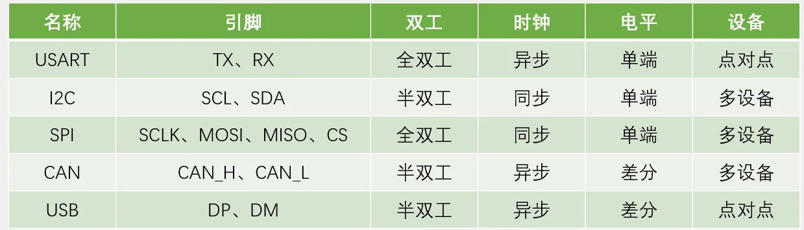
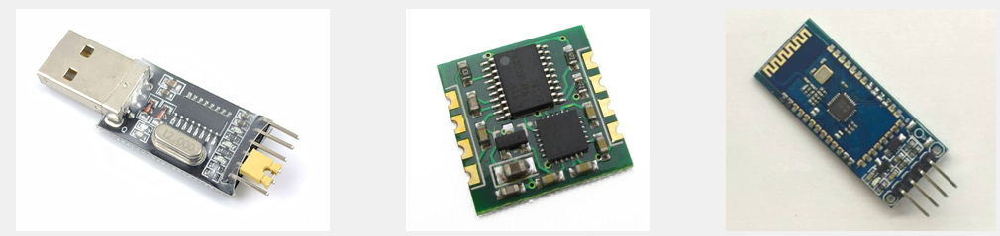
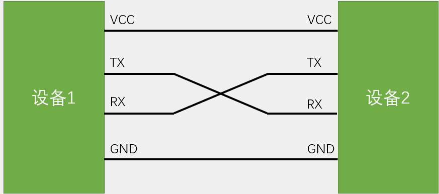
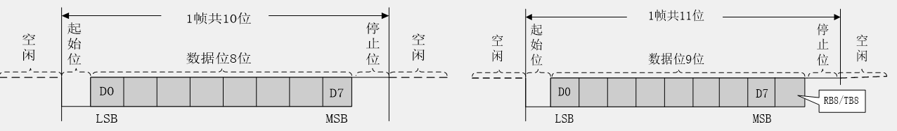
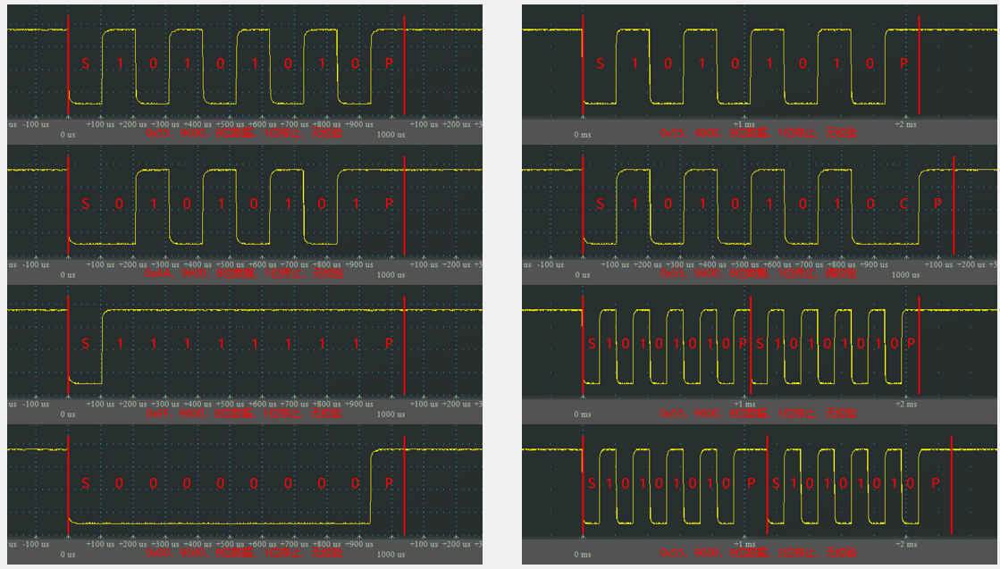

# 第九章 USART串口
## [9-1] USART串口协议
### 通信接口
通信的目的：将一个设备的数据传送到另一个设备，扩展硬件系统

通信协议：制定通信的规则，通信双方按照协议规则进行数据收发

### 串口通信
串口是一种应用十分广泛的通讯接口，串口成本低、容易使用、通信线路简单，可实现两个设备的互相通信

单片机的串口可以使单片机与单片机、单片机与电脑、单片机与各式各样的模块互相通信，极大地扩展了单片机的应用范围，增强了单片机系统的硬件实力

### 硬件电路
简单双向串口通信有两根通信线（发送端TX和接收端RX）

TX与RX要交叉连接

当只需单向的数据传输时，可以只接一根通信线

当电平标准不一致时，需要加电平转换芯片

### 电平标准
电平标准是数据1和数据0的表达方式，是传输线缆中人为规定的电压与数据的对应关系，串口常用的电平标准有如下三种：

TTL电平：+3.3V或+5V表示1，0V表示0

RS232电平：`-3~-15V`表示1，`+3~+15V`表示0

RS485电平：两线压差`+2~+6V`表示1，`-2~-6V`表示0（差分信号）

### 串口参数及时序
波特率：串口通信的速率

起始位：标志一个数据帧的开始，固定为低电平

数据位：数据帧的有效载荷，1为高电平，0为低电平，低位先行

校验位：用于数据验证，根据数据位计算得来

停止位：用于数据帧间隔，固定为高电平

### 串口时序

