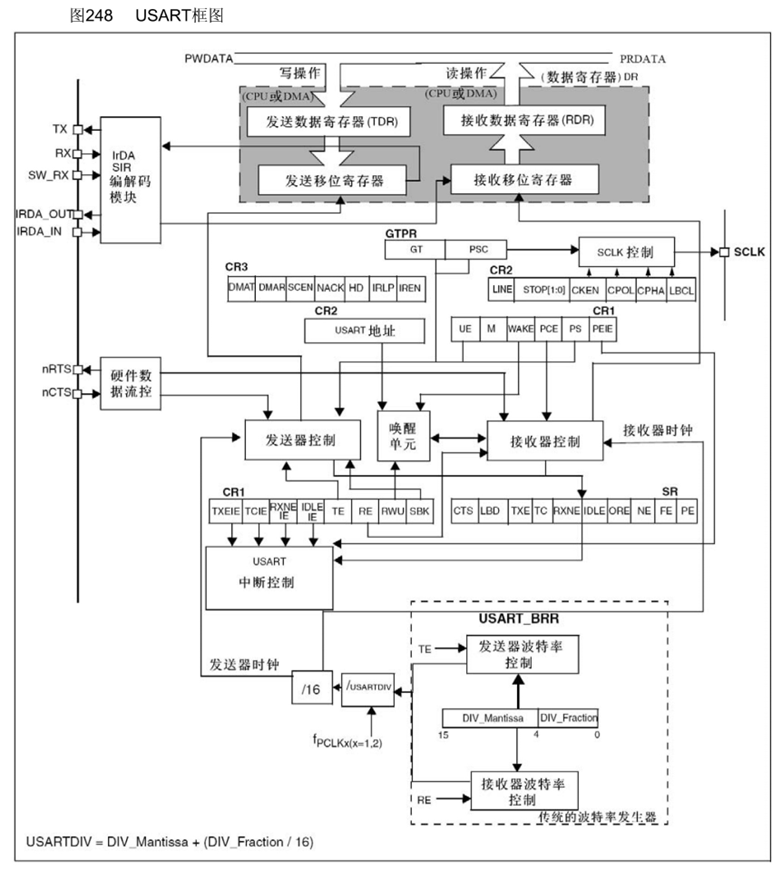
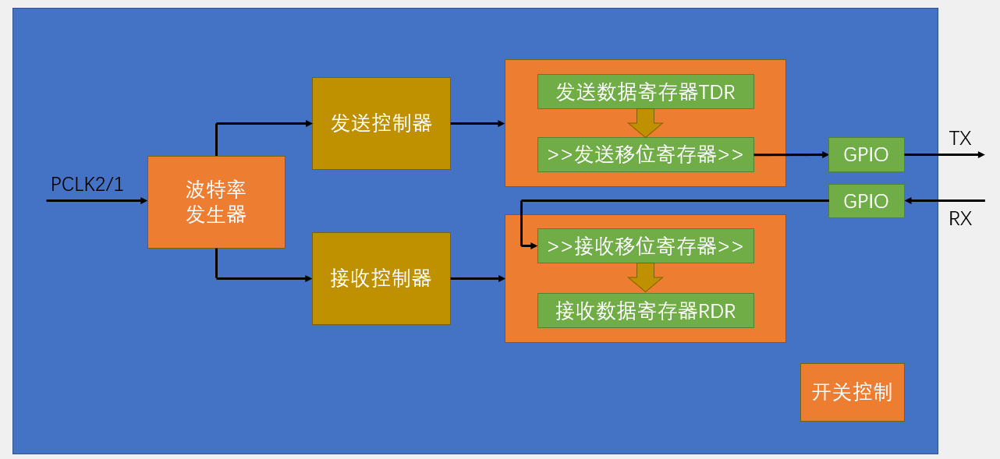
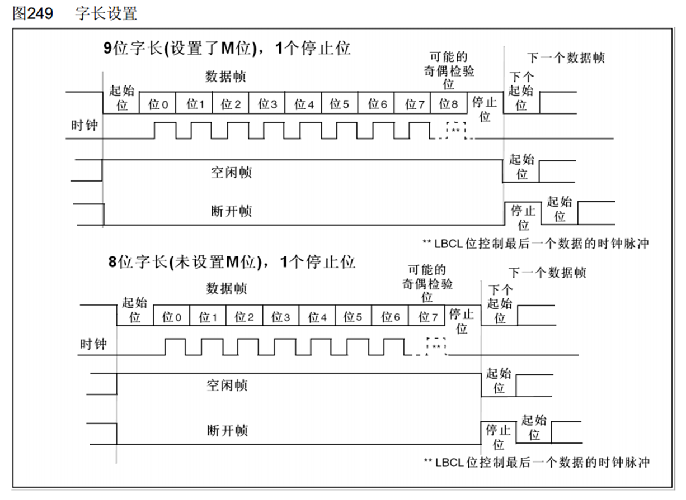
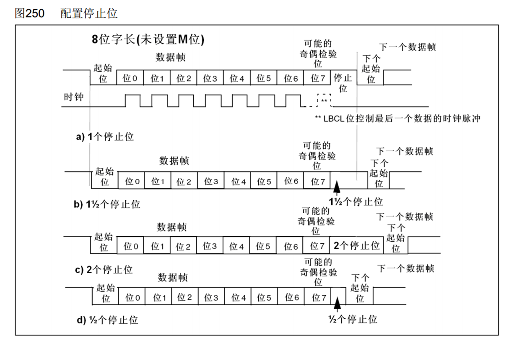
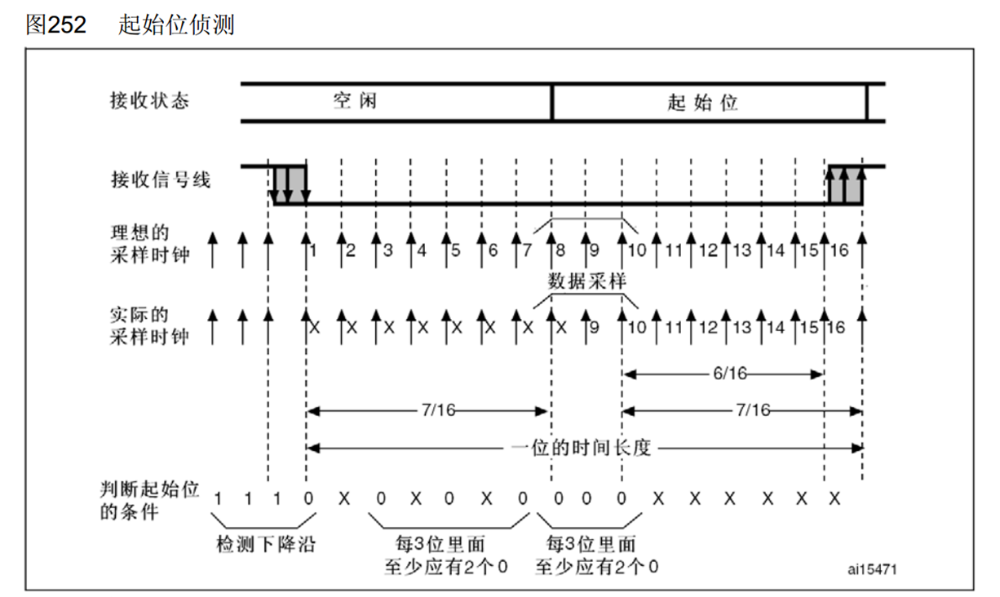
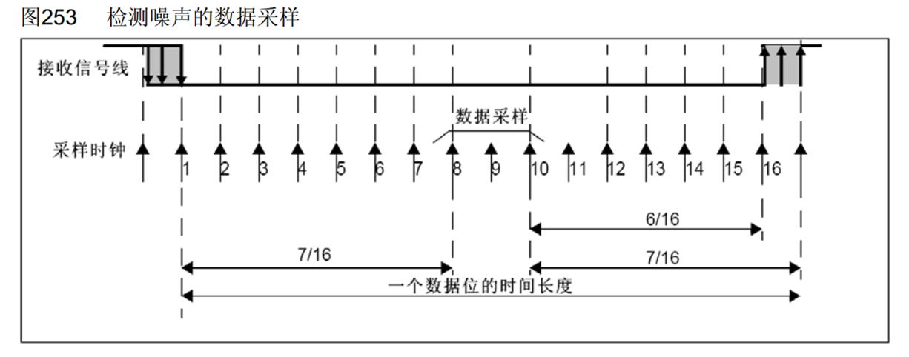
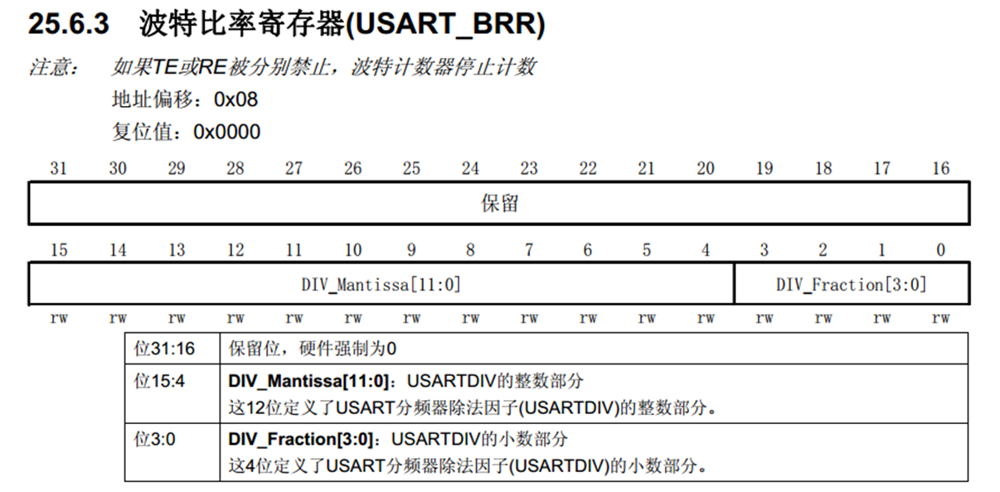
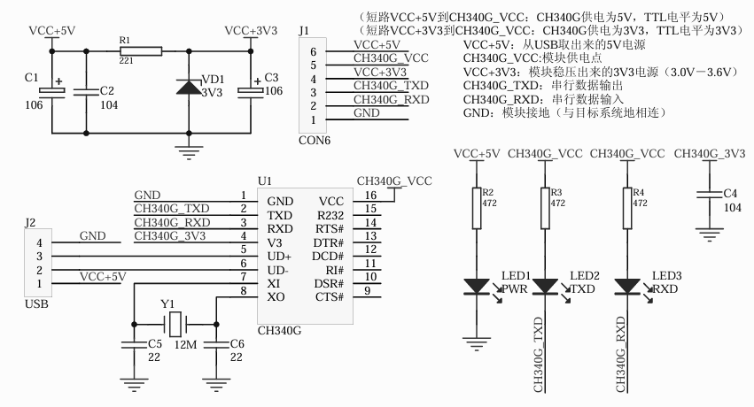

## [9-2] USART串口外设
### USART简介
USART（Universal Synchronous/Asynchronous Receiver/Transmitter）通用同步/异步收发器

USART是STM32内部集成的硬件外设，可根据数据寄存器的一个字节数据自动生成数据帧时序，从TX引脚发送出去，也可自动接收RX引脚的数据帧时序，拼接为一个字节数据，存放在数据寄存器里

自带波特率发生器，最高达4.5Mbits/s

可配置数据位长度（8/9）、停止位长度（0.5/1/1.5/2）

可选校验位（无校验/奇校验/偶校验）

支持同步模式、硬件流控制、DMA、智能卡、IrDA、LIN

STM32F103C8T6 USART资源： USART1、 USART2、 USART3

### USART框图

APB1总线时钟为PCLK1,是AHB总线时钟在APB1分频器二分频得到,因此为36MHz

### USART基本结构

### 数据帧

### 起始位侦测

### 数据采样

### 波特率发生器
发送器和接收器的波特率由波特率寄存器BRR里的DIV确定

计算公式：波特率 = fPCLK2/1 / (16 * DIV)

### ch340

