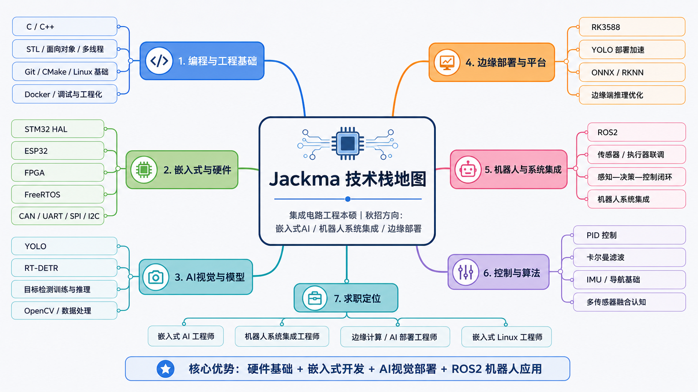

# 嵌入式学习笔记

## 目录

### 编程基础

- [C语言指针的详解与应用](./编程基础/C语言指针的详解与应用/readme.md)
- [CMake入门](./编程基础/CMake/readme.md)
- [嵌入式C语言高阶版](./编程基础/嵌入式C语言高阶版/readme.md)
- [现代C++11核心特性详解](./编程基础/现代C++11核心特性详解/readme.md)

### 工程能力

- [Git代码管理](./工程能力/Git代码管理/readme.md)
- [CAN总线入门](./工程能力/CAN总线入门/readme.md)
- [PID入门教程](./工程能力/PID入门教程/readme.md)

### 计算机系统

- [现代操作系统](./计算机系统/现代操作系统/readme.md)
- [操作系统实战45讲](./计算机系统/操作系统实战45讲/readme.md)

### MCU开发

- [STM32标准库](./MCU开发/STM32标准库/readme.md)
- [STM32HAL库](./MCU开发/STM32HAL库/readme.md)
- [FreeRTOS](./MCU开发/FreeRTOS/readme.md)

### Linux&系统开发

暂无内容。

### 机器人&感知

- [ROS2(Fishros)](./机器人&感知/ROS2(Fishros)/readme.md)

### 刷题

- [阿秀的CPP](./刷题/阿秀的CPP/随机抽题.md)

## 学习目标

记录 C/C++、操作系统、Linux、嵌入式底层相关知识。
