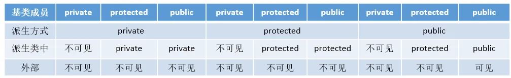
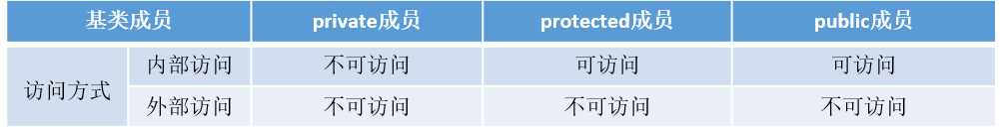
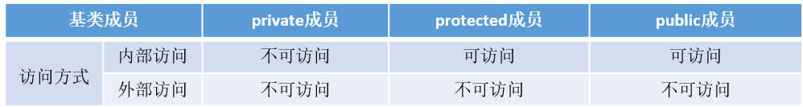
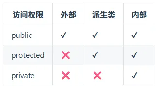
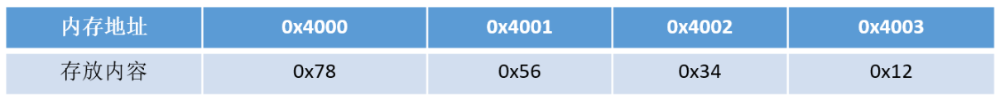
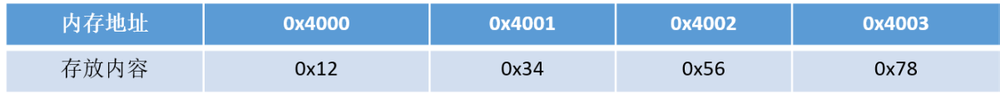

## **21、C++与Java的区别**
语言特性

+ Java语言给开发人员提供了更为简洁的语法；完全面向对象，由于JVM可以安装到任何的操作系统上，所以说它的可移植性强
+ Java语言中没有指针的概念，引入了真正的数组。不同于C++中利用指针实现的“伪数组”，Java引入了真正的数组，同时将容易造成麻烦的指针从语言中去掉，这将有利于防止在C++程序中常见的因为数组操作越界等指针操作而对系统数据进行非法读写带来的不安全问题
+ C++也可以在其他系统运行，但是需要不同的编码（这一点不如Java，只编写一次代码，到处运行），例如对一个数字，在windows下是大端存储，在unix中则为小端存储。Java程序一般都是生成字节码，在JVM里面运行得到结果
+ Java用接口(Interface)技术取代C++程序中的抽象类。接口与抽象类有同样的功能，但是省却了在实现和维护上的复杂性

垃圾回收

+ C++用析构函数回收垃圾，写C和C++程序时一定要注意内存的申请和释放
+ Java语言不使用指针，内存的分配和回收都是自动进行的，程序员无须考虑内存碎片的问题

应用场景

+ Java在桌面程序上不如C++实用，C++可以直接编译成exe文件，指针是c++的优势，可以直接对内存的操作，但同时具有危险性 。（操作内存的确是一项非常危险的事情，一旦指针指向的位置发生错误，或者误删除了内存中某个地址单元存放的重要数据，后果是可想而知的）
+ Java在Web 应用上具有C++ 无可比拟的优势，具有丰富多样的框架
+ 对于底层程序的编程以及控制方面的编程，C++很灵活，因为有句柄的存在

## **22、C++中struct和class的区别**
相同点

+ 两者都拥有成员函数、公有和私有部分
+ 任何可以使用class完成的工作，同样可以使用struct完成

不同点

+ 两者中如果不对成员不指定公私有，struct默认是公有的，class则默认是私有的
+ class默认是private继承， 而struct默认是public继承

引申：C++和C的struct区别

+ C语言中：struct是用户自定义数据类型（UDT）；C++中struct是抽象数据类型（ADT），支持成员函数的定义，（C++中的struct能继承，能实现多态）
+ C中struct是没有权限的设置的，且struct中只能是一些变量的集合体，可以封装数据却不可以隐藏数据，而且成员不可以是函数
+  C++中，struct增加了访问权限，且可以和类一样有成员函数，成员默认访问说明符为public（为了与C兼容）
+  struct作为类的一种特例是用来自定义数据结构的。一个结构标记声明后，在C中必须在结构标记前加上struct，才能做结构类型名（除：typedef struct class{};）;C++中结构体标记（结构体名）可以直接作为结构体类型名使用，此外结构体struct在C++中被当作类的一种特例

```cpp
#include <iostream>
using namespace std;

/**************************************
 * 1. struct 与 class 默认权限区别
 **************************************/

struct StudentStruct
{
// 默认 public
int age;

void show()
{
    cout << "Struct age = " << age << endl;
}
};

class StudentClass
{
// 默认 private
int age;

public:
void setAge(int a)
{
    age = a;
}

void show()
{
    cout << "Class age = " << age << endl;
}
};


/**************************************
 * 2. struct 与 class 默认继承区别
 **************************************/

struct BaseStruct
{
int x = 100;
};

struct ChildStruct : BaseStruct
{
// struct 默认 public 继承
};

class BaseClass
{
public:
int y = 200;
};

class ChildClass : BaseClass
{
// class 默认 private 继承
};


/**************************************
 * 3. C++ struct 支持成员函数
 **************************************/

struct Bird
{
int speed;

void fly()
{
    cout << "Bird flying, speed = "
        << speed << endl;
}
};


/**************************************
 * 4. C++ struct 支持构造函数
 **************************************/

struct Dog
{
string name;

// 构造函数
Dog(string n)
{
    name = n;
}

void bark()
{
    cout << name << " wang wang!" << endl;
}
};


/**************************************
 * 5. C++ struct 支持继承
 **************************************/

struct Animal
{
void eat()
{
    cout << "Animal eating" << endl;
}
};

struct Cat : Animal
{
void meow()
{
    cout << "Cat meow" << endl;
}
};


/**************************************
 * main
 **************************************/

int main()
{
    /******** struct 默认 public ********/
    StudentStruct s1;
    s1.age = 18;     // 可以直接访问
    s1.show();

    /******** class 默认 private ********/
    StudentClass s2;

    // s2.age = 20;
    // 错误：age 是 private

    s2.setAge(20);
    s2.show();


    /******** struct 默认 public 继承 ********/
    ChildStruct cs;
    cout << "cs.x = " << cs.x << endl;
    // 可以访问，因为默认 public 继承


    /******** class 默认 private 继承 ********/
    ChildClass cc;

    // cout << cc.y << endl;
    // 错误：默认 private 继承


    /******** struct 支持成员函数 ********/
    Bird b;
    b.speed = 50;
    b.fly();


    /******** struct 支持构造函数 ********/
    Dog d("旺财");
    d.bark();


    /******** struct 支持继承 ********/
    Cat c;
    c.eat();
    c.meow();

    return 0;
}

//输出结果
Struct age = 18
Class age = 20
cs.x = 100
Bird flying, speed = 50
旺财 wang wang!
Animal eating
Cat meow
```

## **23、define宏定义和const的区别**
编译阶段

+ define是在编译的预处理阶段起作用，而const是在编译、运行的时候起作用

安全性

+ define只做替换，不做类型检查和计算，也不求解，容易产生错误，一般最好加上一个大括号包含住全部的内容，要不然很容易出错
+ const常量有数据类型，编译器可以对其进行类型安全检查

内存占用

+ define只是将宏名称进行替换，在内存中会产生多份相同的备份。const在程序运行中只有一份备份，且可以执行常量折叠，能将复杂的的表达式计算出结果放入常量表
+ 宏替换发生在编译阶段之前，属于文本插入替换；const作用发生于编译过程中。
+ 宏不检查类型；const会检查数据类型。
+ 宏定义的数据没有分配内存空间，只是插入替换掉；const定义的变量只是值不能改变，但要分配内存空间。

```cpp
#include <iostream>
using namespace std;


/****************************************
 * 1. define 宏定义
 ****************************************/

#define PI 3.14159

// 宏函数（没有类型检查）
#define SQUARE(x) x * x

// 正确写法（建议加括号）
#define SAFE_SQUARE(x) ((x) * (x))


/****************************************
 * 2. const 常量
 ****************************************/

const double CONST_PI = 3.14159;

const int MAX_SIZE = 100;


/****************************************
 * main
 ****************************************/

int main()
{
    /******** define 与 const ********/

    cout << "PI = " << PI << endl;
    cout << "CONST_PI = " << CONST_PI << endl;


    /****************************************
     * 3. 宏的危险示例
     ****************************************/

    int a = 3;

    // 实际展开：
    // a + 1 * a + 1
    int result1 = SQUARE(a + 1);

    // 实际展开：
    // ((a + 1) * (a + 1))
    int result2 = SAFE_SQUARE(a + 1);

    cout << "result1 = "
         << result1 << endl;

    cout << "result2 = "
         << result2 << endl;


    /****************************************
     * 4. const 有类型检查
     ****************************************/

    const int num = 10;

    // num = 20;
    // 错误：const 常量不可修改


    /****************************************
     * 5. define 没有类型检查
     ****************************************/

#define VALUE "hello"

    // 编译器不会检查宏类型
    cout << VALUE << endl;


    /****************************************
     * 6. const 可以调试
     ****************************************/

    const int age = 18;

    cout << "age = "
         << age << endl;


    return 0;
}

//输出
PI = 3.14159
CONST_PI = 3.14159

result1 = 7
result2 = 16

hello
age = 18
```

## **24、C++中const和static的作用**
**static**

不考虑类的情况

+ 隐藏。所有不加static的全局变量和函数具有全局可见性，可以在其他文件中使用，加了之后只能在该文件所在的编译模块中使用
+ 默认初始化为0，包括未初始化的全局静态变量与局部静态变量，都存在全局未初始化区
+ 静态变量在函数内定义，始终存在，且只进行一次初始化，具有记忆性，其作用范围与局部变量相同，函数退出后仍然存在，但不能使用

 考虑类的情况

+ static成员变量：只与类关联，不与类的对象关联。定义时要分配空间，不能在类声明中初始化，必须在类定义体外部初始化，初始化时不需要标示为static；可以被非static成员函数任意访问。
+ static成员函数：不具有this指针，无法访问类对象的非static成员变量和非static成员函数；不能被声明为const、虚函数和volatile；可以被非static成员函数任意访问

**const**

不考虑类的情况

+ const常量在定义时必须初始化，之后无法更改
+ const形参可以接收const和非const类型的实参，例如// i 可以是 int 型或者 const int 型void fun(const int& i){	//...}

考虑类的情况

+ const成员变量：不能在类定义外部初始化，只能通过构造函数初始化列表进行初始化，并且必须有构造函数；不同类对其const数据成员的值可以不同，所以不能在类中声明时初始化
+ const成员函数：const对象不可以调用非const成员函数；非const对象都可以调用；不可以改变非mutable（用该关键字声明的变量可以在const成员函数中被修改）数据的值

补充一点const相关：const修饰变量是也与static有一样的隐藏作用。只能在该文件中使用，其他文件不可以引用声明使用。因此在头文件中声明const变量是没问题的，因为即使被多个文件包含，链接性都是内部的，不会出现符号冲突。 

```cpp
#include <iostream>
using namespace std;


/************************************************
 * 1. 全局 static：隐藏作用
 ************************************************/

// 只能在当前文件使用
static int g_static_num = 100;

// 普通全局变量（其他文件可见）
int g_num = 200;


// static 全局函数
static void staticFunc()
{
    cout << "staticFunc()" << endl;
}

// 普通全局函数
void normalFunc()
{
    cout << "normalFunc()" << endl;
}


/************************************************
 * 2. static 局部变量
 ************************************************/

void counter()
{
    // 只初始化一次
    static int count = 0;

    count++;

    cout << "count = "
         << count << endl;
}


/************************************************
 * 3. const 基本使用
 ************************************************/

void showValue(const int& x)
{
    // x++;
    // 错误：const 参数不能修改

    cout << "x = "
         << x << endl;
}


/************************************************
 * 4. 类中的 static 和 const
 ************************************************/

class Test
{
private:

    int normal_value;

    // const 成员变量
    const int const_value;

    // mutable 可以在 const 函数中修改
    mutable int visit_count;

public:

    /****************************************
     * static 成员变量
     ****************************************/

    // 所有对象共享
    static int total;


    /****************************************
     * 构造函数初始化列表
     ****************************************/

    Test(int n, int c)
        : normal_value(n),
          const_value(c),
          visit_count(0)
    {

    }


    /****************************************
     * static 成员函数
     ****************************************/

    static void showTotal()
    {
        cout << "total = "
             << total << endl;

        // 错误：
        // static函数没有this指针

        // cout << normal_value;
    }


    /****************************************
     * const 成员函数
     ****************************************/

    void show() const
    {
        cout << "normal_value = "
             << normal_value << endl;

        cout << "const_value = "
             << const_value << endl;

        visit_count++;

        cout << "visit_count = "
             << visit_count << endl;


        // 错误：
        // const函数不能修改普通成员

        // normal_value++;
    }


    void modify()
    {
        normal_value++;
    }
};


/************************************************
 * static 成员变量必须类外初始化
 ************************************************/

int Test::total = 0;


/************************************************
 * main
 ************************************************/

int main()
{
    /****************************************
     * 1. static局部变量
     ****************************************/

    counter();
    counter();
    counter();


    /****************************************
     * 2. const参数
     ****************************************/

    int a = 10;

    showValue(a);


    /****************************************
     * 3. 类中的static
     ****************************************/

    Test t1(1, 100);
    Test t2(2, 200);

    Test::total = 999;

    t1.showTotal();
    t2.showTotal();


    /****************************************
     * 4. const成员函数
     ****************************************/

    t1.show();

    // const对象
    const Test t3(3, 300);

    t3.show();

    // 错误：
    // const对象不能调用非const函数

    // t3.modify();


    return 0;
}
```

## **25、C++的顶层const和底层const**
概念区分

+ 顶层const：指的是const修饰的变量本身是一个常量，无法修改，指的是指针，就是 * 号的右边
+ 底层const：指的是const修饰的变量所指向的对象是一个常量，指的是所指变量，就是 * 号的左边

举个例子

```cpp
int a = 10;int* const b1 = &a;        //顶层const，b1本身是一个常量
const int* b2 = &a;       //底层const，b2本身可变，所指的对象是常量
const int b3 = 20; 		   //顶层const，b3是常量不可变
const int* const b4 = &a;  //前一个const为底层，后一个为顶层，b4不可变
const int& b5 = a;		   //用于声明引用变量，都是底层const
```

区分作用

+ 执行对象拷贝时有限制，常量的底层const不能赋值给非常量的底层const
+ 使用命名的强制类型转换函数const_cast时，只能改变运算对象的底层const

示例代码

```cpp
#include <iostream>
using namespace std;

int main()
{
    int a = 10;

    const int *p1 = &a;

    int *p2 = p1;
    // 错误！

    return 0;
}
```

为什么错误？

```plain
p1
```

表示：

```plain
不能通过 p1 修改 a
```

但：

```plain
p2
```

是普通指针：

```plain
可以修改 a
```

如果允许：

```plain
int *p2 = p1;
```

那就能：

```plain
*p2 = 999;
```

间接修改 const 数据。

编译器禁止这种行为。

const_cast 是什么？

专门：去掉/添加 const的强制转换。

```cpp
#include <iostream>
using namespace std;

int main()
{
    int a = 10;

    const int *p1 = &a;

    int *p2 = const_cast<int*>(p1);

    *p2 = 100;

    cout << a << endl;//100

    return 0;
}
```

 为什么说 const_cast 只能改底层const？  

```plain
const_cast
```

主要作用于：

```plain
const int*
```

这种：

```plain
指向数据的const
```

即：

```plain
底层const
```

它不能去掉对象本身const（安全意义上）

例如：

```plain
const int a = 10;
```

即使：

```plain
const_cast<int&>(a)
```

也不安全。

因为：

```plain
对象本身是const
```

比如：

```cpp
const int a = 10;

const int *p1 = &a;

int *p2 = const_cast<int*>(p1);

*p2 = 100;
```

```cpp
 const int a;int const a;const int *a;int *const a;
```

+ int const a和const int a均表示定义常量类型a。
+ const int *a，其中a为指向int型变量的指针，const在 * 左侧，表示a指向不可变常量。(看成const (*a)，对引用加const)
+ int *const a，依旧是指针类型，表示a为指向整型数据的常指针。(看成const(a)，对指针const)

## **26、数组名和指针（这里为指向数组首元素的指针）区别？**
+ 二者均可通过增减偏移量来访问数组中的元素。
+ 数组名不是真正意义上的指针，可以理解为常指针，所以数组名没有自增、自减等操作。
+ 当数组名当做形参传递给调用函数后，就失去了原有特性，退化成一般指针，多了自增、自减操作，但sizeof运算符不能再得到原数组的大小了。

```cpp
#include <iostream>
using namespace std;


/****************************************
 * 数组作为函数参数
 ****************************************/

void printArray(int arr[], int size)
{
    cout << "函数中 sizeof(arr) = "
         << sizeof(arr) << endl;

    cout << endl;

    /************************************
     * 此时 arr 已退化为指针
     ************************************/

    cout << "arr 指向的值："
         << *arr << endl;

    arr++;   // 可以自增

    cout << "arr++ 后的值："
         << *arr << endl;

    cout << endl;


    /************************************
     * 遍历数组
     ************************************/

    for (int i = 0; i < size; i++)
    {
        cout << *(arr + i)
             << " ";
    }

    cout << endl;
}


/****************************************
 * main
 ****************************************/

int main()
{
    int nums[5] = {10, 20, 30, 40, 50};


    /************************************
     * 1. 数组名与指针访问元素
     ************************************/

    cout << "nums[0] = "
         << nums[0] << endl;

    cout << "*(nums + 1) = "
         << *(nums + 1) << endl;

    cout << endl;


    /************************************
     * 2. 数组名不是普通指针
     ************************************/

    // nums++;
    // 错误！

    // 因为数组名是常量地址


    /************************************
     * 3. sizeof数组
     ************************************/

    cout << "sizeof(nums) = "
         << sizeof(nums) << endl;

    cout << "数组元素个数 = "
         << sizeof(nums) / sizeof(nums[0])
         << endl;

    cout << endl;


    /************************************
     * 4. 数组传参退化为指针
     ************************************/

    printArray(nums, 5);


    return 0;
}
```

输出  


```cpp
nums[0] = 10
*(nums + 1) = 20

sizeof(nums) = 20
数组元素个数 = 5

函数中 sizeof(arr) = 8

arr 指向的值：10
arr++ 后的值：20

30 40 50 0 1
```

## **27、final和override关键字**
**override**

当在父类中使用了虚函数时候，你可能需要在某个子类中对这个虚函数进行重写，以下方法都可以：

```cpp
class A
{
    virtual void foo();
}
class B : public A
{
    void foo(); //OK
    virtual void foo(); // OK
    void foo() override; //OK
}
```

如果不使用override，当你手一抖，将foo()写成了f00()会怎么样呢？结果是编译器并不会报错，因为它并不知道你的目的是重写虚函数，而是把它当成了新的函数。如果这个虚函数很重要的话，那就会对整个程序不利。所以，override的作用就出来了，它指定了子类的这个虚函数是重写的父类的，如果你名字不小心打错了的话，编译器是不会编译通过的：  


```cpp
class A
{
    virtual void foo();
};

class B : public A
{
    virtual void f00(); //OK，这个函数是B新增的，不是继承的
    virtual void f0o() override; //Error, 加了override之后，这个函数一定是继承自A的，A找不到就报错
};
```

**final**

当不希望某个类被继承，或不希望某个虚函数被重写，可以在类名和虚函数后添加final关键字，添加final关键字后被继承或重写，编译器会报错。例子如下：

```cpp
class Base
{
    virtual void foo();
};

class A : public Base
{
    void foo() final; // foo 被override并且是最后一个override，在其子类中不可以重写
};

class B final : A // 指明B是不可以被继承的
{
    void foo() override; // Error: 在A中已经被final了
};

class C : B // Error: B is final
{

};
```

## **28、拷贝初始化和直接初始化**
1.当用于类类型对象时，初始化的拷贝形式和直接形式有所不同：直接初始化直接调用与实参匹配的构造函数，拷贝初始化总是调用拷贝构造函数。拷贝初始化首先使用指定构造函数创建一个临时对象，然后用拷贝构造函数将那个临时对象拷贝到正在创建的对象。举例如下

```cpp
string str1("I am a string");//语句1 直接初始化
string str2(str1);//语句2 直接初始化，str1是已经存在的对象，直接调用拷贝构造函数对str2进行初始化
string str3 = "I am a string";//语句3 拷贝初始化，先为字符串”I am a string“创建临时对象，再把临时对象作为参数，使用拷贝构造函数构造str3
string str4 = str1;//语句4 拷贝初始化，这里相当于隐式调用拷贝构造函数，而不是调用赋值运算符函数
```

```cpp
#include <iostream>
#include <string>
using namespace std;

class Person
{
public:

    string name;


    /****************************************
     * 普通构造函数
     ****************************************/

    Person(string n)
    {
        name = n;

        cout << "普通构造函数" << endl;
    }


    /****************************************
     * 拷贝构造函数
     ****************************************/

    Person(const Person& other)
    {
        name = other.name;

        cout << "拷贝构造函数" << endl;
    }
};


int main()
{
    /****************************************
     * 1. 直接初始化
     ****************************************/

    Person p1("Tom");

    cout << endl;


    /****************************************
     * 2. 直接初始化（对象）
     ****************************************/

    Person p2(p1);

    cout << endl;


    /****************************************
     * 3. 拷贝初始化（字符串）
     ****************************************/

    Person p3 = "Jack";

    cout << endl;


    /****************************************
     * 4. 拷贝初始化（对象）
     ****************************************/

    Person p4 = p1;

    cout << endl;


    return 0;
}
```

2.为了提高效率，允许编译器跳过创建临时对象这一步，直接调用构造函数构造要创建的对象，这样就完全等价于直接初始化了（语句1和语句3等价），但是需要辨别两种情况。

+ 当拷贝构造函数为private时：语句3和语句4在编译时会报错

```cpp
class Test
{
public:

    Test()
    {
    }

private:

    Test(const Test&)
    {
    }
};
```

下面错误

```cpp
Test t1;

Test t2 = t1;
```

需要调用拷贝构造，但：拷贝构造是 private

+ 使用explicit修饰构造函数时：如果构造函数存在隐式转换，编译时会报错

```cpp
class Test
{
public:

    explicit Test(int x)
    {
        cout << "构造函数" << endl;
    }
};
```

直接初始化

```cpp
Test t1(10);
```

✅ 合法

拷贝初始化

```cpp
Test t2 = 10;
```

❌ 错误

```plain
explicit 禁止隐式转换
```

```cpp
Test t2 = 10;
```

本质：

```cpp
Test temp(10);

Test t2(temp);
```

涉及：

```plain
隐式类型转换
```

explicit 禁止它。

## **29、初始化和赋值的区别**
+ 对于简单类型来说，初始化和赋值没什么区别
+ 对于类和复杂数据类型来说，这两者的区别就大了，举例如下：

```cpp
class A{
public:
    int num1;
    int num2;
public:
    A(int a=0, int b=0):num1(a),num2(b){};
    A(const A& a){};
    //重载 = 号操作符函数
    A& operator=(const A& a){
        num1 = a.num1 + 1;
        num2 = a.num2 + 1;
        return *this;
    };
};
int main(){
    A a(1,1);
    A a1 = a; //拷贝初始化操作，调用拷贝构造函数
    A b;
    b = a;//赋值操作，对象a中，num1 = 1，num2 = 1；对象b中，num1 = 2，num2 = 2
    return 0;
}
```

```cpp
#include <iostream>
#include <string>

class Test
{
public:
Test()
{
    std::cout << "默认构造函数" << std::endl;
}

Test(const char* str)
{
    std::cout << "有参构造函数: " << str << std::endl;
}

Test(const Test& other)
{
    std::cout << "拷贝构造函数" << std::endl;
}

Test& operator=(const Test& other)
{
    std::cout << "赋值运算符重载" << std::endl;
    return *this;
}
};

int main()
{
    // 1. 初始化：对象刚创建时给它初始值
    Test t1("hello");
    // 调用：有参构造函数

    // 2. 拷贝初始化：对象刚创建时，用另一个对象初始化
    Test t2 = t1;
    // 调用：拷贝构造函数

    // 3. 赋值：对象已经存在，再给它新值
    Test t3;
    // 调用：默认构造函数

    t3 = t1;
    // 调用：赋值运算符重载

    return 0;
}
```

```cpp
Test t1("hello");  // 初始化：对象从无到有，调用构造函数

Test t2 = t1;      // 初始化：对象从无到有，调用拷贝构造函数

Test t3;           // 先创建对象，调用默认构造函数
t3 = t1;           // 赋值：对象已经存在，调用赋值运算符
```

初始化：对象还不存在，创建对象时给初始值，调用构造函数。

赋值：对象已经存在，把一个新值赋给它，调用 operator= 赋值运算符。

## **30、extern"C"的用法**
为了能够正确的在C++代码中调用C语言的代码：在程序中加上extern "C"后，相当于告诉编译器这部分代码是C语言写的，因此要按照C语言进行编译，而不是C++；

哪些情况下使用extern "C"：

（1）C++代码中调用C语言代码；

（2）在C++中的头文件中使用；

（3）在多个人协同开发时，可能有人擅长C语言，而有人擅长C++；

举个例子，C++中调用C代码：

```cpp
#ifndef MY_HANDLE_H
#define MY_HANDLE_H

extern "C"{
    typedef unsigned int result_t;
    typedef void* my_handle_t;
    
    my_handle_t create_handle(const char* name);
    result_t operate_on_handle(my_handle_t handle);
    void close_handle(my_handle_t handle);
}
```

综上，总结出使用方法，在C语言的头文件中，对其外部函数只能指定为extern类型，C语言中不支持extern "C"声明，在.c文件中包含了extern "C"时会出现编译语法错误。所以使用extern "C"全部都放在于cpp程序相关文件或其头文件中。

总结出如下形式：

（1）C++调用C函数：

```cpp
//xx.h
extern int add(...)

//xx.c
int add(){
}

//xx.cpp
extern "C" {
    #include "xx.h"
}
```

（2）C调用C++函数

```cpp
//xx.h
extern "C"{
    int add();
}

//xx.cpp
int add(){
}

//xx.c
extern int add();
```

## **31、野指针和悬空指针**
都是是指向无效内存区域(这里的无效指的是"不安全不可控")的指针，访问行为将会导致未定义行为。

+ 野指针

野指针，指的是没有被初始化过的指针

```cpp
int main(void) { 
    
    int* p;     // 未初始化
    std::cout<< *p << std::endl; // 未初始化就被使用
    
    return 0;
}
```

因此，为了防止出错，对于指针初始化时都是赋值为 `nullptr`，这样在使用时编译器就不会直接报错，产生非法内存访问。

+ 悬空指针

悬空指针，指针最初指向的内存已经被释放了的一种指针。 

```cpp
int main(void) { 
    
  int * p = nullptr;
  int* p2 = new int;
    
  p = p2;
    
  delete p2;
}
```

此时 p和p2就是悬空指针，指向的内存已经被释放。继续使用这两个指针，行为不可预料。需要设置为`p=p2=nullptr`。此时再使用，编译器会直接保错。  
	避免野指针比较简单，但悬空指针比较麻烦。c++引入了智能指针，C++智能指针的本质就是避免悬空指针的产生。   
产生原因及解决办法：

野指针：指针变量未及时初始化 => 定义指针变量及时初始化，要么置空。

悬空指针：指针free或delete之后没有及时置空 => 释放操作后立即置空。

## **32、C和C++的类型安全**
**什么是类型安全？**

类型安全很大程度上可以等价于内存安全，类型安全的代码不会试图访问自己没被授权的内存区域。“类型安全”常被用来形容编程语言，其根据在于该门编程语言是否提供保障类型安全的机制；有的时候也用“类型安全”形容某个程序，判别的标准在于该程序是否隐含类型错误。

类型安全的编程语言与类型安全的程序之间，没有必然联系。好的程序员可以使用类型不那么安全的语言写出类型相当安全的程序，相反的，差一点儿的程序员可能使用类型相当安全的语言写出类型不太安全的程序。绝对类型安全的编程语言暂时还没有。

（1）C的类型安全

C只在局部上下文中表现出类型安全，比如试图从一种结构体的指针转换成另一种结构体的指针时，编译器将会报告错误，除非使用显式类型转换。然而，C中相当多的操作是不安全的。以下是两个十分常见的例子：

+ printf格式输出

```c
#include <stdio.h>
int main()
{
    printf("整型输出:%d\n",10);
    printf("浮点型输出:%f\n",10);
    return 0;
}
//输出
整型输出:10
浮点型输出:0.000000
```

上述代码中，使用%d控制整型数字的输出，没有问题，但是改成%f时，明显输出错误，再改成%s时，运行直接报segmentation fault错误

+ malloc函数的返回值

malloc是C中进行内存分配的函数，它的返回类型是void_即空类型指针，常常有这样的用法char*_ pStr=(char*)malloc(100*sizeof(char))，这里明显做了显式的类型转换。

类型匹配尚且没有问题，但是一旦出现int* pInt=(int*)malloc(100*sizeof(char))就很可能带来一些问题，而这样的转换C并不会提示错误。

```c
#include <stdio.h>
#include <stdlib.h>

int main()
{
    int* pInt = (int*)malloc(100 * sizeof(char));

    for (int i = 0; i < 100; i++)
    {
        pInt[i] = i;   // 错误：实际空间不够，后面会越界
    }

    free(pInt);
    return 0;
}
```

```c
0x1000 这个地址下面放 1 字节，也就是 8 bit  一个char* 
0x1001 这个地址下面放 1 字节，也就是 8 bit
0x1002 这个地址下面放 1 字节，也就是 8 bit
0x1003 这个地址下面放 1 字节，也就是 8 bit  四个加起来一个int*
```

```c
malloc(100 * sizeof(char)) 只申请了 100 字节。

如果你把它当成 int* 用，那么最多只能放 25 个 int。

如果你想放 100 个 int，就应该申请 100 * sizeof(int)，通常是 400 字节。
```

（2）C++的类型安全

+ 如果C++使用得当，它将远比C更有类型安全性。相比于C语言，C++提供了一些新的机制保障类型安全：  
操作符new返回的指针类型严格与对象匹配，而不是void*
+ C中很多以void*为参数的函数可以改写为C++模板函数，而模板是支持类型检查的；
+ 引入const关键字代替`#define constants`，它是有类型、有作用域的，而`#define constants`只是简单的文本替换
+ 一些`#define`宏可被改写为inline函数，结合函数的重载，可在类型安全的前提下支持多种类型，当然改写为模板也能保证类型安全

```cpp
#include <iostream>
using namespace std;

// 宏：只是文本替换，不做类型检查
#define MAX_MACRO(a, b) ((a) > (b) ? (a) : (b))

// inline 函数：有类型检查
inline int maxInline(int a, int b)
{
    return a > b ? a : b;
}

// 函数重载：支持不同类型
inline double maxInline(double a, double b)
{
    return a > b ? a : b;
}

// 模板：支持多种类型，同时类型安全
template <typename T>
inline T maxTemplate(T a, T b)
{
    return a > b ? a : b;
}

int main()
{
    cout << MAX_MACRO(10, 20) << endl;      // 宏：文本替换
    cout << maxInline(10, 20) << endl;      // 调用 int 版本
    cout << maxInline(1.5, 2.5) << endl;    // 调用 double 版本
    cout << maxTemplate(3, 7) << endl;      // 模板自动推导 T=int
    cout << maxTemplate(3.1, 7.2) << endl;  // 模板自动推导 T=double

    return 0;
}
```

+ C++提供了dynamic_cast关键字，使得转换过程更加安全，因为dynamic_cast比static_cast涉及更多具体的类型检查。

```cpp
#include <iostream>
using namespace std;

class Animal
{
public:
    virtual ~Animal() {}   // 必须有虚函数，dynamic_cast 才能用于安全向下转型
};

class Dog : public Animal
{
public:
    void bark()
    {
        cout << "Dog bark" << endl;
    }
};

class Cat : public Animal
{
public:
    void meow()
    {
        cout << "Cat meow" << endl;
    }
};

int main()
{
    Animal* p = new Cat;

    // static_cast：编译器允许，但不会检查 p 真实指向的是不是 Dog
    Dog* d1 = static_cast<Dog*>(p);
    // d1->bark(); // 危险：p 实际指向 Cat，不是 Dog，可能出错

    // dynamic_cast：运行时检查 p 真实指向的类型
    Dog* d2 = dynamic_cast<Dog*>(p);

    if (d2 == nullptr)
    {
        cout << "转换失败：p 实际不是 Dog" << endl;
    }
    else
    {
        d2->bark();
    }

    delete p;
    return 0;
}
```

例1：使用void*进行类型转换

```cpp
#include <iostream>
using namespace std;

int main()
{
    int i=5;
    void* pint=&i;
    double d= (*(double*)pint);
    cout<<"转换后的输出："<<d<<endl;
}

//输出
转换后的输出： 1.78416e-307
```

这里内存大概是这样：

```plain
i 是 int，占 4 字节

地址        内容
0x1000      int 的第 1 个字节
0x1001      int 的第 2 个字节
0x1002      int 的第 3 个字节
0x1003      int 的第 4 个字节
```

但是 `double` 通常占 8 字节。

```cpp
*(double*)pint
```

```plain
从 pint 指向的位置开始，按照 double 类型读取 8 个字节
```

```plain
0x1000 ~ 0x1007
```

可是 `i` 这个变量本身只有 4 字节：

```plain
0x1000 ~ 0x1003
```

后面 4 个字节根本不是 `i` 的内容，可能是栈上的其他数据。所以得到的 `double` 值就是乱的。

例2：不同类型指针之间转换

```cpp
#include <iostream>
using namespace std;

class Parent{};
class Child1 : public Parent
{
public:
    int i;
    Child1(int e):i(e){}
};

class Child2 : public Parent
{
public:
    double d;
    Child2(double e):d(e){}
};

int main()
{
    Child1 c1(5);
    Child2 c2(4.1);
    Parent* pp;
    Child1* pc1;
    
    pp=&c1; 
    pc1=(Child1*)pp;  // 类型向下转换 强制转换，由于类型仍然为Child1*，不造成错误
    cout<<pc1->i<<endl; //输出：5
    
    pp=&c2;
    pc1=(Child1*)pp;  //强制转换，且类型发生变化，将造成错误
    cout<<pc1->i<<endl;// 输出：1717986918
    return 0;
}
```

```cpp
Parent* pp 只是保存对象地址。

当 pp 指向 Child1 时，强转成 Child1* 后按 Child1 解释内存，能读到 i = 5。

当 pp 指向 Child2 时，强转成 Child1* 后还是按 Child1 解释内存，但真实内存里放的是 double d，所以会把 double 的一部分字节误读成 int，输出乱码值。

强制类型转换不会改变对象本身，只会改变编译器解释这块内存的方式。
```

上面两个例子之所以引起类型不安全的问题，是因为程序员使用不得当。第一个例子用到了空类型指针void*，第二个例子则是在两个类型指针之间进行强制转换。因此，想保证程序的类型安全性，应尽量避免使用空类型指针void*，尽量不对两种类型指针做强制转换。

## **33、C++中的重载、重写（覆盖）和隐藏的区别**
（1）重载（overload）

重载是指在同一范围定义中的同名成员函数才存在重载关系。主要特点是函数名相同，参数类型和数目有所不同，不能出现参数个数和类型均相同，仅仅依靠返回值不同来区分的函数。重载和函数成员是否是虚函数无关。举个例子：

```cpp
 class A{
    ...
    virtual int fun();
    void fun(int);
    void fun(double, double);
    static int fun(char);
    ...
}
```

（2）重写（覆盖）（override）

重写指的是在派生类中覆盖基类中的同名函数，重写就是重写函数体，要求基类函数必须是虚函数且：

+ 与基类的虚函数有相同的参数个数
+ 与基类的虚函数有相同的参数类型
+ 与基类的虚函数有相同的返回值类型

举个例子：

```cpp
//父类
class A{
public:
    virtual int fun(int a){}
}

//子类
class B : public A{
public:
    //重写,一般加override可以确保是重写父类的函数
    virtual int fun(int a) override{}
}
```

重载与重写的区别：

+ 重写是父类和子类之间的垂直关系，重载是不同函数之间的水平关系
+ 重写要求参数列表相同，重载则要求参数列表不同，返回值不要求
+ 重写关系中，调用方法根据对象类型决定，重载根据调用时实参表与形参表的对应关系来选择函数体

（3）隐藏（hide）

隐藏指的是某些情况下，派生类中的函数屏蔽了基类中的同名函数，包括以下情况：

+ 两个函数参数相同，但是基类函数不是虚函数。**和重写的区别在于基类函数是否是虚函数。**举个例子：

```cpp
 //父类
class A{
public:
    void fun(int a){
        cout << "A中的fun函数" << endl;
    }
};
//子类
class B : public A{
public:
    //隐藏父类的fun函数
    void fun(int a){
        cout << "B中的fun函数" << endl;
    }
};
int main(){
    B b;
    b.fun(2); //调用的是B中的fun函数
    b.A::fun(2); //调用A中fun函数
    return 0;
}
```

+ 两个函数参数不同，无论基类函数是不是虚函数，都会被隐藏。和重载的区别在于两个函数不在同一个类中。举个例子：

```cpp
//父类
class A{
public:
    virtual void fun(int a){
        cout << "A中的fun函数" << endl;
    }
};
//子类
class B : public A{
public:
    //隐藏父类的fun函数
   virtual void fun(char* a){
       cout << "A中的fun函数" << endl;
   }
};
int main(){
    B b;
    b.fun(2); //报错，调用的是B中的fun函数，参数类型不对
    b.A::fun(2); //调用A中fun函数
    return 0;
}
```

补充：

```cpp
 // 父类
class A {
public:
    virtual void fun(int a) { // 虚函数
        cout << "This is A fun " << a << endl;
    }
    void add(int a, int b) {
            cout << "This is A add " << a + b << endl;
        }
};
// 子类
class B: public A {
public:
    void fun(int a) override {  // 覆盖
        cout << "this is B fun " << a << endl;
    }
    void add(int a) {   // 隐藏
        cout << "This is B add " << a + a << endl;
    }
};
int main() {
    // 基类指针指向派生类对象时，基类指针可以直接调用到派生类的覆盖函数，也可以通过 :: 调用到基类被覆盖
    // 的虚函数；而基类指针只能调用基类的被隐藏函数，无法识别派生类中的隐藏函数。
    
    A *p = new B();
    p->fun(1);      // 调用子类 fun 覆盖函数
    p->A::fun(1);   // 调用父类 fun
    p->add(1, 2);
    // p->add(1);      // 错误，识别的是 A 类中的 add 函数，参数不匹配
    // p->B::add(1);   // 错误，无法识别子类 add 函数
    return 0;
}
```

## **34、C++有哪几种的构造函数**
C++ 中常见的构造函数主要有以下几类：

1. 默认构造函数

   不带参数，或者所有参数都有默认值的构造函数。

2. 有参构造函数

   创建对象时，通过传入参数初始化对象。

3. 拷贝构造函数

   用一个已经存在的同类型对象，初始化一个新对象。

4. 移动构造函数

   用一个即将失效的右值对象初始化新对象，常用于转移资源，减少拷贝开销。

5. 委托构造函数

   一个构造函数调用同一个类中的另一个构造函数，减少重复初始化代码。

6. 转换构造函数

   只有一个参数的构造函数，可以实现从其他类型到当前类类型的隐式转换。

举个例子：

```cpp
#include <iostream>
#include <cstring>
using namespace std;

class Person
{
public:
    char* name;
    int age;

    // 1. 默认构造函数
    Person()
    {
        name = nullptr;
        age = 0;
        cout << "默认构造函数" << endl;
    }

    // 2. 有参构造函数
    Person(const char* n, int a)
    {
        age = a;
        name = new char[strlen(n) + 1];
        strcpy(name, n);
        cout << "有参构造函数" << endl;
    }

    // 3. 拷贝构造函数
    Person(const Person& other)
    {
        age = other.age;

        if (other.name != nullptr)
        {
            name = new char[strlen(other.name) + 1];
            strcpy(name, other.name);
        }
        else
        {
            name = nullptr;
        }

        cout << "拷贝构造函数" << endl;
    }

    // 4. 移动构造函数
    Person(Person&& other)
    {
        age = other.age;
        name = other.name;

        other.name = nullptr;
        other.age = 0;

        cout << "移动构造函数" << endl;
    }

    // 5. 委托构造函数
    Person(const char* n) : Person(n, 18)
    {
        cout << "委托构造函数" << endl;
    }

    // 析构函数
    ~Person()
    {
        delete[] name;
        cout << "析构函数" << endl;
    }
};

class Number
{
public:
    int value;

    // 6. 转换构造函数
    Number(int v)
    {
        value = v;
        cout << "转换构造函数" << endl;
    }
};

int main()
{
    // 1. 默认构造函数
    Person p1;

    // 2. 有参构造函数
    Person p2("Jack", 20);

    // 3. 拷贝构造函数
    Person p3 = p2;

    // 4. 移动构造函数
    Person p4 = std::move(p2);

    // 5. 委托构造函数
    Person p5("Tom");

    // 6. 转换构造函数
    Number n = 10;

    return 0;
}
```

+ 默认构造函数和初始化构造函数在定义类的对象，完成对象的初始化工作
+ 复制构造函数用于复制本类的对象
+ 转换构造函数用于将其他类型的变量，隐式转换为本类对象

## **35、浅拷贝和深拷贝的区别**
**浅拷贝**

浅拷贝只是拷贝一个指针，并没有新开辟一个地址，拷贝的指针和原来的指针指向同一块地址，如果原来的指针所指向的资源释放了，那么再释放浅拷贝的指针的资源就会出现错误。

**深拷贝**

深拷贝不仅拷贝值，还开辟出一块新的空间用来存放新的值，即使原先的对象被析构掉，释放内存了也不会影响到深拷贝得到的值。在自己实现拷贝赋值的时候，如果有指针变量的话是需要自己实现深拷贝的。  


```cpp
#include <iostream>
#include <string.h> 
using namespace std;

class Student
{
private:
    int num;
    char *name;
public:
    Student(){
        name = new char(20);
        cout << "Student" << endl;
    };

    ~Student(){
        cout << "~Student " << &name << endl;
        delete name;
        name = NULL;
    };

    Student(const Student &s){//拷贝构造函数
        //浅拷贝，当对象的name和传入对象的name指向相同的地址
        name = s.name;
        //深拷贝
        //name = new char(20);
        //memcpy(name, s.name, strlen(s.name));
        cout << "copy Student" << endl;
    };
};

int main()
{
    {// 花括号让s1和s2变成局部对象，方便测试
        Student s1;
        Student s2(s1);// 复制对象
    }
    system("pause");
    return 0;
}
//浅拷贝执行结果：
//Student
//copy Student
//~Student 0x7fffed0c3ec0
//~Student 0x7fffed0c3ed0
//*** Error in `/tmp/815453382/a.out': double free or corruption (fasttop): 0x0000000001c82c20 ***
//深拷贝执行结果：
//Student
//copy Student
//~Student 0x7fffebca9fb0
//~Student 0x7fffebca9fc0
```

从执行结果可以看出，浅拷贝在对象的拷贝创建时存在风险，即被拷贝的对象析构释放资源之后，拷贝对象析构时会再次释放一个已经释放的资源，深拷贝的结果是两个对象之间没有任何关系，各自成员地址不同。

```cpp
浅拷贝/深拷贝主要讨论“指针成员、堆内存、资源所有权”。
int age 这种普通成员直接复制值即可，不存在重复释放问题。
```

##  36、内联函数和宏定义的区别
+ 在使用时，宏只做简单字符串替换（编译前）。而内联函数可以进行参数类型检查（编译时），且具有返回值。
+ 内联函数在编译时直接将函数代码嵌入到目标代码中，省去函数调用的开销来提高执行效率，并且进行参数类型检查，具有返回值，可以实现重载。
+ 宏定义时要注意书写（参数要括起来）否则容易出现歧义，内联函数不会产生歧义
+ 内联函数有类型检测、语法判断等功能，而宏没有

内联函数适用场景:

+ 使用宏定义的地方都可以使用 inline 函数。
+ 作为类成员接口函数来读写类的私有成员或者保护成员，会提高效率。

```cpp
#include <iostream>
using namespace std;

// 1. 宏定义：只是简单文本替换
#define SQUARE_MACRO(x) x * x

// 2. 改进后的宏：参数加括号，但仍然没有类型检查
#define SQUARE_MACRO_SAFE(x) ((x) * (x))

// 3. 内联函数：有类型检查，有返回值
inline int squareInline(int x)
{
    return x * x;
}

// 4. 内联函数可以重载
inline double squareInline(double x)
{
    return x * x;
}

// 5. 类中的内联成员函数
class Person
{
private:
    int age;

public:
    Person(int a) : age(a) {}

    // 类内定义的成员函数，默认就是 inline 候选
    inline int getAge()
    {
        return age;
    }

    inline void setAge(int a)
    {
        age = a;
    }
};

int main()
{
    cout << "宏定义问题：" << endl;

    cout << SQUARE_MACRO(1 + 2) << endl;
    // 展开后：1 + 2 * 1 + 2
    // 结果：5，不是 9

    cout << SQUARE_MACRO_SAFE(1 + 2) << endl;
    // 展开后：((1 + 2) * (1 + 2))
    // 结果：9

    cout << endl;

    cout << "内联函数：" << endl;

    cout << squareInline(1 + 2) << endl;
    // 结果：9

    cout << squareInline(2.5) << endl;
    // 调用 double 版本，结果：6.25

    cout << endl;

    cout << "类成员内联函数：" << endl;

    Person p(18);
    cout << p.getAge() << endl;

    p.setAge(20);
    cout << p.getAge() << endl;

    return 0;
}
```

## **37、public，protected和private访问和继承权限/public/protected/private的区别？**
+ public的变量和函数在类的内部外部都可以访问。
+ protected的变量和函数只能在类的内部和其派生类中访问。
+ private修饰的元素只能在类内访问。

（一）访问权限

派生类可以继承基类中除了构造/析构、赋值运算符重载函数之外的成员，但是这些成员的访问属性在派生过程中也是可以调整的，三种派生方式的访问权限如下表所示：注意外部访问并不是真正的外部访问，而是在通过派生类的对象对基类成员的访问。**派生方式基本就可以理解为继承方式**。  



派生类对基类成员的访问形象有如下两种：

+ 内部访问：由派生类中新增的成员函数对从基类继承来的成员的访问
+ 外部访问：在派生类外部，通过派生类的对象对从基类继承来的成员的访问

```cpp
#include <iostream>
using namespace std;

class Base
{
public:
    int pub = 1;

protected:
    int pro = 2;

private:
    int pri = 3;
};

// 公有继承
class Derived : public Base
{
public:
    void insideVisit()
    {
        cout << pub << endl; // 可以访问，public 成员
        cout << pro << endl; // 可以访问，protected 成员

        // cout << pri << endl; // 错误，private 成员不能被派生类直接访问
    }
};

int main()
{
    Derived d;

    // 外部访问：通过派生类对象访问从基类继承来的成员
    cout << d.pub << endl; // 可以访问，因为 Base 的 public 经过 public 继承后仍然是 public

    // cout << d.pro << endl; // 错误，protected 成员外部不能访问
    // cout << d.pri << endl; // 错误，private 成员外部不能访问

    d.insideVisit(); // 可以，因为函数内部可以访问 pub 和 pro

    return 0;
}
```

（二）继承权限

**public继承**

公有继承的特点是基类的公有成员和保护成员作为派生类的成员时，都保持原有的状态，而基类的私有成员任然是私有的，不能被这个派生类的子类所访问

**protected继承**

保护继承的特点是基类的所有公有成员和保护成员都成为派生类的保护成员，并且只能被它的派生类成员函数或友元函数访问，基类的私有成员仍然是私有的，访问规则如下表



**private继承**

私有继承的特点是基类的所有公有成员和保护成员都成为派生类的私有成员，并不被它的派生类的子类所访问，基类的成员只能由自己派生类访问，无法再往下继承，访问规则如下表



总结

一、访问权限  



public、protected、private 的访问权限范围关系：

public > protected > private

二、继承权限

1. 派生类继承自基类的成员权限有四种状态：public、protected、private、不可见，排序为 public > protected > private
2. 派生类对基类成员的访问权限取决于两点：一、继承方式；二、基类成员在基类中的访问权限
3. 基类成员在派生类中的访问权限不得高于继承方式中指定的权限，高于继承方式中指定的权限则下降为继承权限，低于继承权限则不调整，**基类 private 成员在任何继承方式下都是不可见的**。例如：
+ public 继承 + private 成员 => 不可见
+ public 继承 +  protected 成员 => protected
+ protected 继承 + public 成员 => protected
+ private 继承 + protected 成员 => private
+ private 继承 + public 成员 => private

## **38、如何用代码判断大小端存储？**
大端存储：字数据的高字节存储在低地址中

小端存储：字数据的低字节存储在低地址中

例如：32bit的数字0x12345678

所以在Socket编程中，往往需要将操作系统所用的小端存储的IP地址转换为大端存储，这样才能进行网络传输

小端模式中的存储方式为：



大端模式中的存储方式为：



了解了大小端存储的方式，如何在代码中进行判断呢？下面介绍两种判断方式：

方式一：使用强制类型转换-这种法子不错

```cpp
#include <iostream>
using namespace std;

int main()
{
    int a = 0x1234;

    // 把 int 变量 a 的地址，强制转换成 char* 指针
    // char* 每次只读取 1 个字节
    char* p = (char*)&a;

    if (*p == 0x12)
    {
        cout << "big endian" << endl;
    }
    else if (*p == 0x34)
    {
        cout << "little endian" << endl;
    }

    return 0;
}
```

方式二：巧用union联合体

```cpp
#include <iostream>
using namespace std;

// union 联合体是“重叠式存储”
// endian 联合体占用的内存大小 = 最大成员的大小
// int a  占 4 字节
// char ch 占 1 字节
// 所以 union endian 通常占 4 字节
union endian
{
    int a;
    char ch;
};

int main()
{
    endian value;

    // 给 int 成员赋值
    value.a = 0x1234;

    // a 和 ch 共用同一块内存
    // ch 只会读取这块内存中的第 1 个字节，也就是最低地址处的字节
    if (value.ch == 0x12)
    {
        cout << "big endian" << endl;
    }
    else if (value.ch == 0x34)
    {
        cout << "little endian" << endl;
    }

    return 0;
}
```

## **39、volatile、mutable和explicit关键字的用法**
(1)volatile

volatile 关键字是一种类型修饰符，**用它声明的类型变量表示可以被某些编译器未知的因素更改**，比如：操作系统、硬件或者其它线程等。遇到这个关键字声明的变量，编译器对访问该变量的代码就不再进行优化，从而可以提供对特殊地址的稳定访问。

当要求使用 volatile 声明的变量的值的时候，**系统总是重新从它所在的内存读取数据**，即使它前面的指令刚刚从该处读取过数据。

volatile**定义变量的值是易变的，每次用到这个变量的值的时候都要去重新读取这个变量的值，而不是读寄存器内的备份。多线程中被几个任务共享的变量需要定义为volatile类型。**

**volatile 指针**

volatile 指针和 const 修饰词类似，const 有常量指针和指针常量的说法，volatile 也有相应的概念

修饰由指针指向的对象、数据是 const 或 volatile 的：

```cpp
const char* cpch;
volatile char* vpch;
```

指针自身的值——一个代表地址的整数变量，是 const 或 volatile 的：

```cpp
 char* const pchc;
char* volatile pchv;
```

注意：

+ 可以把一个非volatile int赋给volatile int，但是不能把非volatile对象赋给一个volatile对象。
+ 除了基本类型外，对用户定义类型也可以用volatile类型进行修饰。
+ C++中一个有volatile标识符的类只能访问它接口的子集，一个由类的实现者控制的子集。用户只能用const_cast来获得对类型接口的完全访问。此外，volatile向const一样会从类传递到它的成员。

```cpp
#include <iostream>
using namespace std;

class Device
{
public:
    void normalFunc()
    {
        cout << "normalFunc()" << endl;
    }

    void volatileFunc() volatile
    {
        cout << "volatileFunc()" << endl;
    }
};

int main()
{
    volatile Device dev;

    // dev.normalFunc();   // 错误：volatile 对象不能调用普通成员函数

    dev.volatileFunc();    // 正确：volatile 对象只能调用 volatile 成员函数

    return 0;
}
```

```cpp
#include <iostream>
using namespace std;

class Device
{
public:
    void normalFunc()
    {
        cout << "normalFunc()" << endl;
    }
};

int main()
{
    volatile Device dev;

    // dev.normalFunc(); // 错误

    Device& ref = const_cast<Device&>(dev);
    ref.normalFunc(); // 可以编译，但要谨慎

    return 0;
}
```

`Device&` 表示：**Device 类型的引用**。

可以理解成：`ref` 是 `dev` 的另一个名字。

**多线程下的volatile**

有些变量是用volatile关键字声明的。当两个线程都要用到某一个变量且该变量的值会被改变时，应该用volatile声明，该关键字的作用是防止优化编译器把变量从内存装入CPU寄存器中。

如果变量被装入寄存器，那么两个线程有可能一个使用内存中的变量，一个使用寄存器中的变量，这会造成程序的错误执行。

volatile的意思是让编译器每次操作该变量时一定要从内存中真正取出，而不是使用已经存在寄存器中的值。

（2）mutable

mutable的中文意思是“可变的，易变的”，跟constant（既C++中的const）是反义词。在C++中，mutable也是为了突破const的限制而设置的。被mutable修饰的变量，将永远处于可变的状态，即使在一个const函数中。我们知道，如果类的成员函数不会改变对象的状态，那么这个成员函数一般会声明成const的。但是，有些时候，我们需要在const函数里面修改一些跟类状态无关的数据成员，那么这个函数就应该被mutable来修饰，并且放在函数后后面关键字位置。

样例一

```cpp
class person
{
    int m_A;
    mutable int m_B;//特殊变量 在常函数里值也可以被修改

public:
    void add() const//在函数里不可修改this指针指向的值 常量指针
    {
        m_A = 10;//错误  不可修改值，this已经被修饰为常量指针
        m_B = 20;//正确
    }
};
```

| 类型 | 示例 | 含义 |
| --- | --- | --- |
| const 修饰返回值 | `const int func()` | 返回值不能被修改 |
| const 修饰返回引用 | `const string& func()` | 外部不能通过返回值修改原对象 |
| const 修饰参数 | `void func(const int x)` | 函数内部不能修改参数 |
| const 修饰指针指向内容 | `void func(const int* p)` | 不能改 `*p` |
| const 修饰指针本身 | `void func(int* const p)` | 不能改 `p` |
| const 修饰成员函数 | `int getAge() const` | 函数内部不能修改成员变量 |


样例二

```cpp
class person
{
public:
    int m_A;
    mutable int m_B;//特殊变量 在常函数里值也可以被修改
};

int main()
{
    const person p = person();//修饰常对象 不可修改类成员的值
    
    p.m_A = 10;//错误，被修饰了指针常量
    p.m_B = 200;//正确，特殊变量，修饰了mutable
}
```

（3）explicit

explicit关键字用来修饰类的构造函数，被修饰的构造函数的类，不能发生相应的隐式类型转换，只能以显式的方式进行类型转换，注意以下几点：

+ explicit 关键字只能用于类内部的构造函数声明上
+ 被explicit修饰的构造函数的类，不能发生相应的隐式类型转换

```cpp
#include <iostream>
using namespace std;

class Person
{
public:
    int age;

    // 没有 explicit，可以发生隐式类型转换
    Person(int a)
    {
        age = a;
        cout << "Person(int a) 构造函数被调用" << endl;
    }

    void show()
    {
        cout << "age = " << age << endl;
    }
};

void printPerson(Person p)
{
    p.show();
}

int main()
{
    Person p1(18);     // 直接初始化，正常
    Person p2 = 20;    // 拷贝初始化，允许：int 隐式转换成 Person

    printPerson(p1);   // 正常
    printPerson(30);   // 允许：int 隐式转换成 Person

    return 0;
}
//输出
Person(int a) 构造函数被调用
Person(int a) 构造函数被调用
age = 18
Person(int a) 构造函数被调用
age = 30
```

```cpp
#include <iostream>
using namespace std;

class Person
{
public:
    int age;

    // explicit 禁止隐式类型转换
    explicit Person(int a)
    {
        age = a;
        cout << "explicit Person(int a) 构造函数被调用" << endl;
    }

    void show()
    {
        cout << "age = " << age << endl;
    }
};

void printPerson(Person p)
{
    p.show();
}

int main()
{
    Person p1(18);        // 正确，直接初始化

    // Person p2 = 20;    // 错误，explicit 禁止 int 隐式转换成 Person

    Person p3 = Person(20); // 正确，显式构造
    Person p4{30};          // 正确，直接列表初始化

    printPerson(p1);        // 正确

    // printPerson(40);     // 错误，不能把 int 隐式转换成 Person

    printPerson(Person(40)); // 正确，显式转换

    return 0;
}
```

## **40、什么情况下会调用拷贝构造函数**
+ 用类的一个实例化对象去初始化另一个对象的时候
+ 函数的参数是类的对象时（非引用传递）
+ 函数的返回值是函数体内局部对象的类的对象时 ,此时虽然发生（Named return Value优化）NRV优化，但是由于返回方式是值传递，所以会在返回值的地方调用拷贝构造函数

另：第三种情况在Linux g++ 下则不会发生拷贝构造函数，不仅如此即使返回局部对象的引用，依然不会发生拷贝构造函数

总结就是：即使发生NRV优化的情况下，Linux+ g++的环境是不管值返回方式还是引用方式返回的方式都不会发生拷贝构造函数，而Windows + VS2019在值返回的情况下发生拷贝构造函数，引用返回方式则不发生拷贝构造函数。

在c++编译器发生NRV优化，如果是引用返回的形式则不会调用拷贝构造函数，如果是值传递的方式依然会发生拷贝构造函数。

在VS2019下进行下述实验：

举个例子：

```cpp
class A
{
public:
    A() {};
    A(const A& a)
    {
        cout << "copy constructor is called" << endl;
    };
    ~A() {};
};

void useClassA(A a) {}

A getClassA()//此时会发生拷贝构造函数的调用，虽然发生NRV优化，但是依然调用拷贝构造函数
{
    A a;
    return a;
}
//A& getClassA2()//  VS2019下，此时编辑器会进行（Named return Value优化）NRV优化,不调用拷贝构造函数 ，
//如果是引用传递的方式返回当前函数体内生成的对象时，并不发生拷贝构造函数的调用
//{
//	A a;
//	return a;
//}
int main()
{
    A a1,a3,a4;
    A a2 = a1;  //调用拷贝构造函数,对应情况1
    useClassA(a1);//调用拷贝构造函数，对应情况2
    a3 = getClassA();//发生NRV优化，但是值返回，依然会有拷贝构造函数的调用 情况3
    a4 = getClassA2(a1);//发生NRV优化，且引用返回自身，不会调用
    return 0;
}
```

情况1比较好理解

情况2的实现过程是，调用函数时先根据传入的实参产生临时对象，再用拷贝构造去初始化这个临时对象，在函数中与形参对应，函数调用结束后析构临时对象

情况3在执行return时，理论的执行过程是：产生临时对象，调用拷贝构造函数把返回对象拷贝给临时对象，函数执行完先析构局部变量，再析构临时对象，  依然会调用拷贝构造函数

```cpp
Person& operator=(const Person& other)  // 拷贝 0 次
Person  operator=(const Person& other)  // 拷贝 1 次
Person& operator=(const Person other)   // 拷贝 1 次
Person  operator=(const Person other)   // 拷贝 2 次
```


