# [1-1] CAN简介&硬件电路
## CAN简介
&emsp;&emsp;CAN总线（Controller Area Network Bus）控制器局域网总线

&emsp;&emsp;CAN总线是由BOSCH公司开发的一种简洁易用、传输速度快、易扩展、可靠性高的串行通信总线，广泛应用于汽车、嵌入式、工业控制等领域

CAN总线特征：

- 两根通信线（CAN_H、CAN_L），线路少

- 差分信号通信，抗干扰能力强

- 高速CAN（ISO11898）：125k~1Mbps, <40m

- 低速CAN（ISO11519）：10k~125kbps, <1km

- 异步，无需时钟线，通信速率由设备各自约定

- 半双工，可挂载多设备，多设备同时发送数据时通过仲裁判断先后顺序

- 11位/29位报文ID，用于区分消息功能，同时决定优先级

- 可配置1~8字节的有效载荷

- 可实现广播式和请求式两种传输方式

- 应答、CRC校验、位填充、位同步、错误处理等特性

## 主流通信协议对比

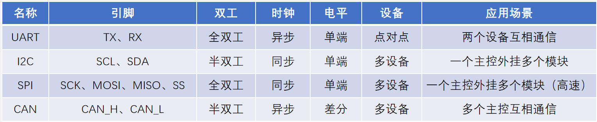

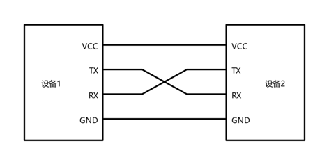

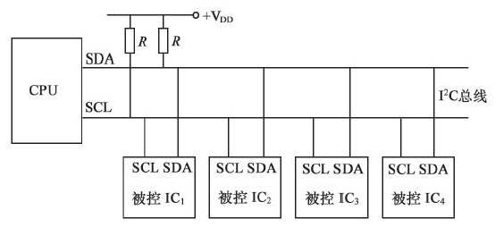

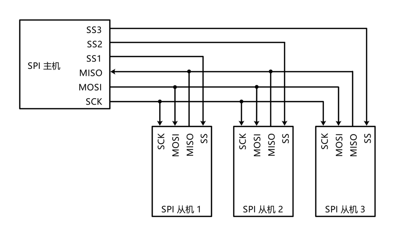

## CAN硬件电路
每个设备通过CAN收发器挂载在CAN总线网络上

CAN控制器引出的TX和RX与CAN收发器相连，CAN收发器引出的CAN_H和CAN_L分别与总线的CAN_H和CAN_L相连

高速CAN使用闭环网络，CAN_H和CAN_L两端添加120Ω的终端电阻

低速CAN使用开环网络，CAN_H和CAN_L其中一端添加2.2kΩ的终端电阻

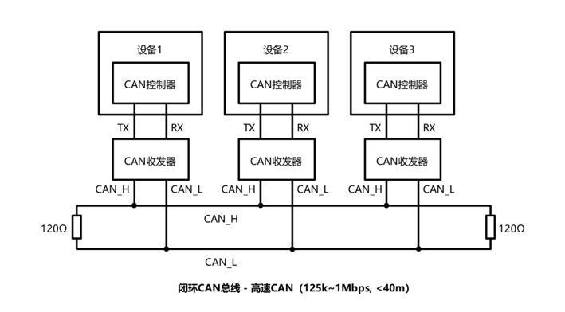

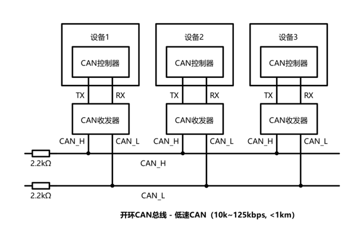

## CAN电平标准
CAN总线采用差分信号，即两线电压差（VCAN_H-VCAN_L）传输数据位

高速CAN规定：

&emsp;&emsp;电压差为0V时表示逻辑1（隐性电平）

&emsp;&emsp;电压差为2V时表示逻辑0（显性电平）

低速CAN规定：

&emsp;&emsp;电压差为-1.5V时表示逻辑1（隐性电平）

&emsp;&emsp;电压差为3V时表示逻辑0（显性电平）

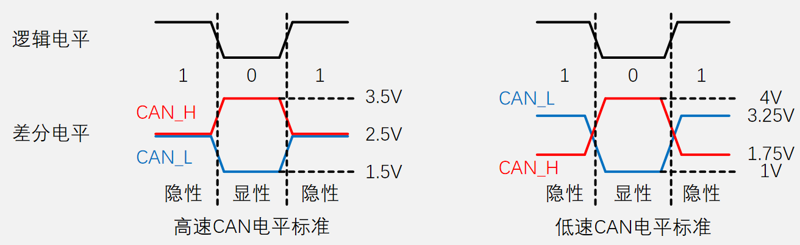

## CAN收发器 – TJA1050（高速CAN）

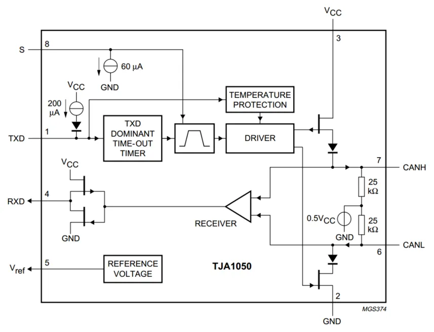

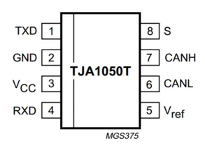

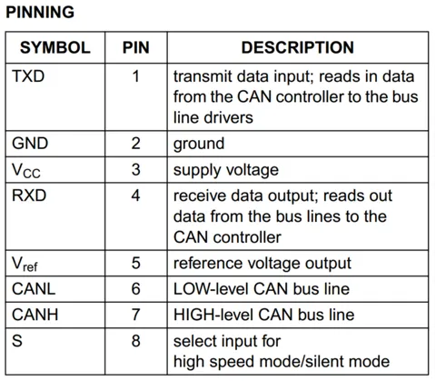

## CAN物理层特性

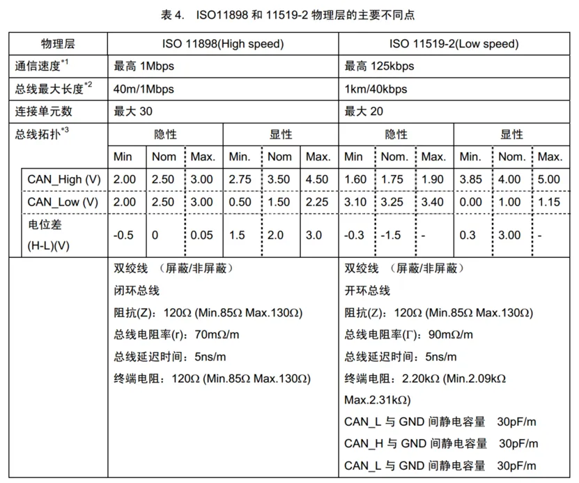