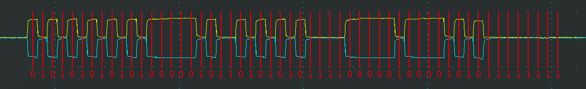
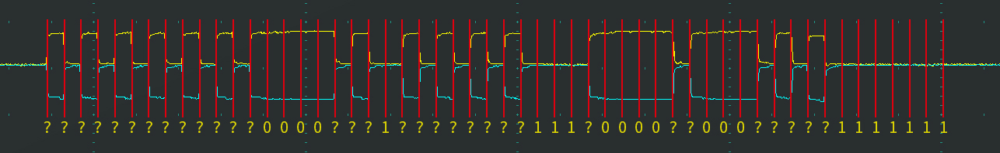
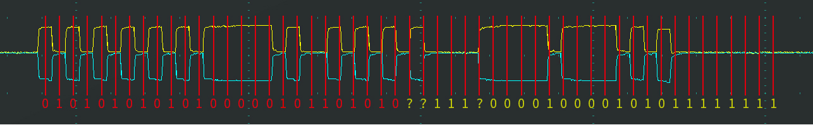
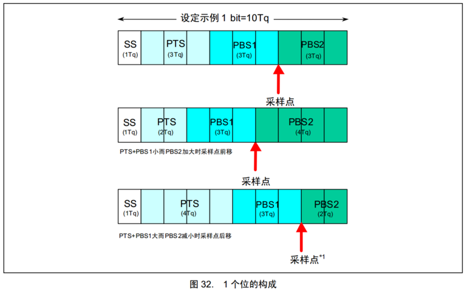
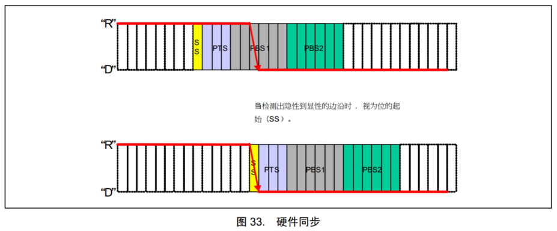
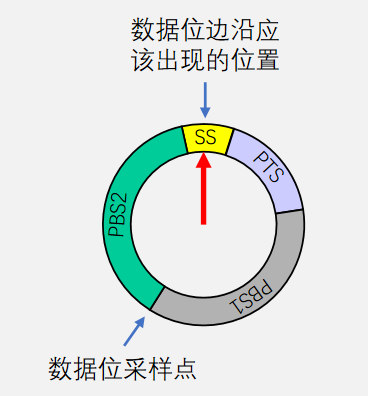
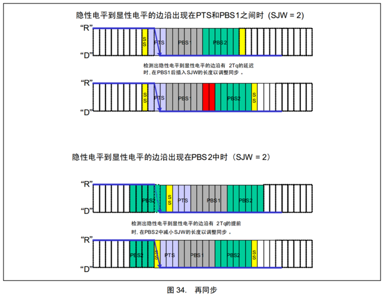
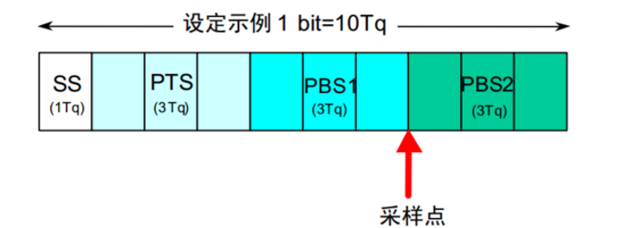

# [1-3]位同步
## 接收方数据采样
CAN总线没有时钟线，总线上的所有设备通过约定波特率的方式确定每一个数据位的时长

发送方以约定的位时长每隔固定时间输出一个数据位

接收方以约定的位时长每隔固定时间采样总线的电平，输入一个数据位

理想状态下，接收方能依次采样到发送方发出的每个数据位，且采样点位于数据位中心附近

## 接收方数据采样遇到的问题
接收方以约定的位时长进行采样，但是采样点没有对齐数据位中心附近

接收方刚开始采样正确，但是时钟有误差，随着误差积累，采样点逐渐偏离

## 位时序
为了灵活调整每个采样点的位置，使采样点对齐数据位中心附近，CAN总线对每一个数据位的时长进行了更细的划分，分为同步段（SS）、传播时间段（PTS）、相位缓冲段1（PBS1）和相位缓冲段2（PBS2），每个段又由若干个最小时间单位（Tq）构成

SS = 1Tq

PTS = 1~8Tq

PBS1 = 1~8Tq

PBS2 = 2~8Tq

## 硬同步
每个设备都有一个位时序计时周期，当某个设备（发送方）率先发送报文，其他所有设备（接收方）收到SOF的下降沿时，接收方会将自己的位时序计时周期拨到SS段的位置，与发送方的位时序计时周期保持同步

硬同步只在帧的第一个下降沿（SOF下降沿）有效

经过硬同步后，若发送方和接收方的时钟没有误差，则后续所有数据位的采样点必然都会对齐数据位中心附近

## 再同步
若发送方或接收方的时钟有误差，随着误差积累，数据位边沿逐渐偏离SS段，则此时接收方根据再同步补偿宽度值（SJW）通过加长PBS1段，或缩短PBS2段，以调整同步

再同步可以发生在第一个下降沿之后的每个数据位跳变边沿

SJW=1~4Tq

## 波特率计算
波特率 = 1 / 一个数据位的时长 = 1 / (TSS + TPTS + TPBS1 + TPBS2)

例如：

SS = 1Tq，PTS = 3Tq，PBS1 = 3Tq，PBS2 = 3Tq

Tq = 0.5us

波特率 = 1 / (0.5us + 1.5us + 1.5us + 1.5us) = 200kbps

👉 **波特率 = 信号变化速度**  
👉 **比特率 = 数据传输速度**