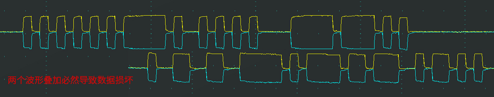
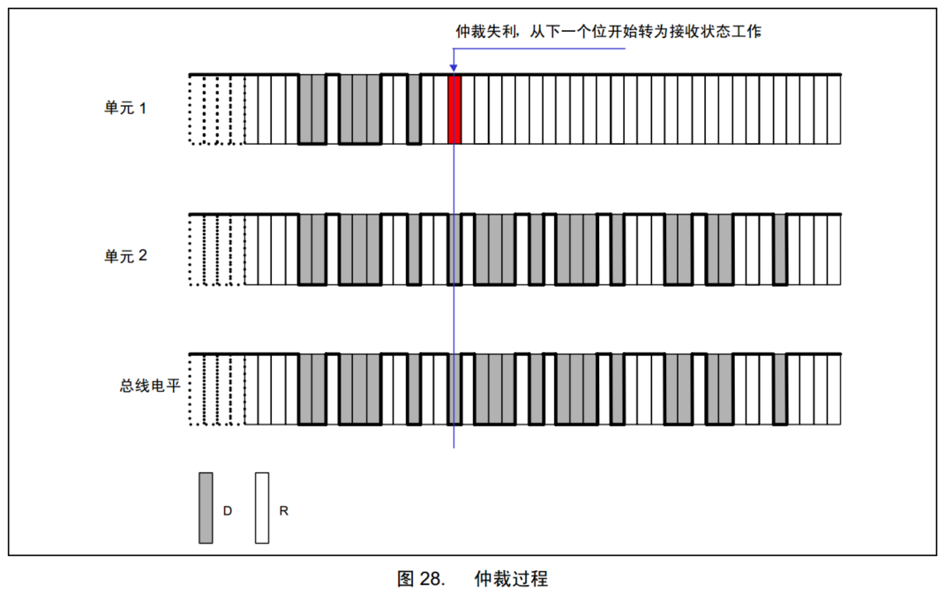
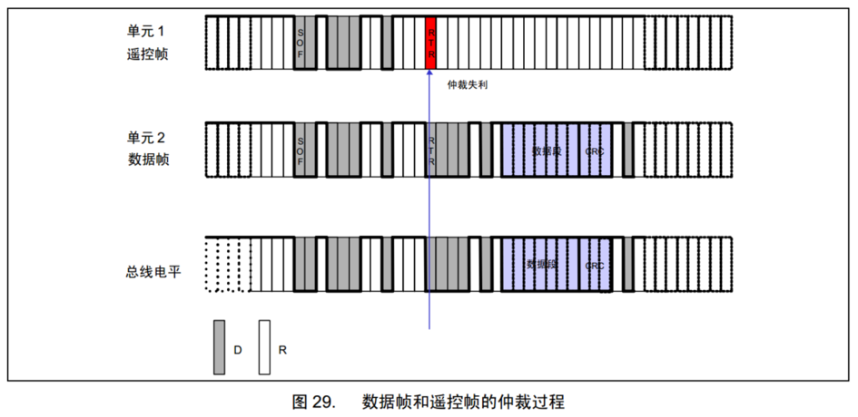
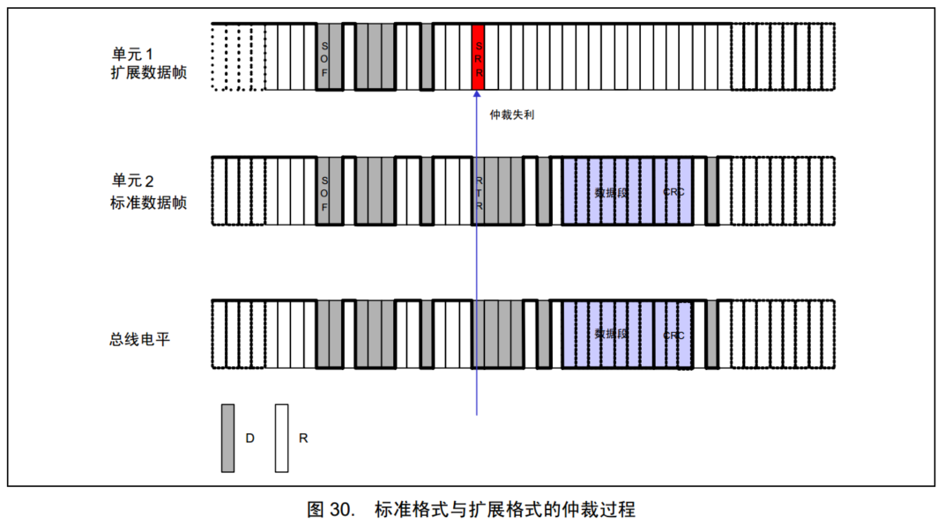

# [1-4]仲裁
## 多设备同时发送遇到的问题
CAN总线只有一对差分信号线，同一时间只能有一个设备操作总线发送数据，若多个设备同时有发送需求，该如何分配总线资源？

解决问题的思路：制定资源分配规则，依次满足多个设备的发送需求，确保同一时间只有一个设备操作总线

## 资源分配规则1 - 先占先得
若当前已经有设备正在操作总线发送数据帧/遥控帧，则其他任何设备不能再同时发送数据帧/遥控帧（可以发送错误帧/过载帧破坏当前数据）

任何设备检测到连续11个隐性电平，即认为总线空闲，只有在总线空闲时，设备才能发送数据帧/遥控帧

一旦有设备正在发送数据帧/遥控帧，总线就会变为活跃状态，必然不会出现连续11个隐性电平，其他设备自然也不会破坏当前发送

若总线活跃状态其他设备有发送需求，则需要等待总线变为空闲，才能执行发送需求

## 资源分配规则2 - 非破坏性仲裁
若多个设备的发送需求同时到来或因等待而同时到来，则CAN总线协议会根据ID号（仲裁段）进行非破坏性仲裁，ID号小的（优先级高）取到总线控制权，ID号大的（优先级低）仲裁失利后将转入接收状态，等待下一次总线空闲时再尝试发送

**实现非破坏性仲裁需要两个要求：**

线与特性：总线上任何一个设备发送显性电平0时，总线就会呈现显性电平0状态，只有当所有设备都发送隐性电平1时，总线才呈现隐性电平1状态，即：0 & X & X = 0，1 & 1 & 1 = 1

回读机制：每个设备发出一个数据位后，都会读回总线当前的电平状态，以确认自己发出的电平是否被真实地发送出去了，根据线与特性，发出0读回必然是0，发出1读回不一定是1

## 非破坏性仲裁过程
数据位从前到后依次比较，出现差异且数据位为1的设备仲裁失利

## 数据帧和遥控帧的优先级
数据帧和遥控帧ID号一样时，**数据帧的优先级高于遥控帧**

## 标准格式和扩展格式的优先级
标准格式11位ID号和扩展格式29位ID号的高11位一样时，**标准格式的优先级高于扩展格式**（SRR必须始终为1，以保证此要求）

