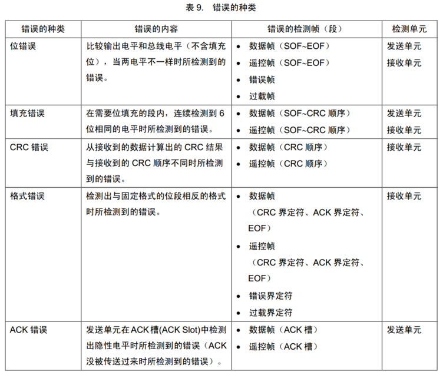
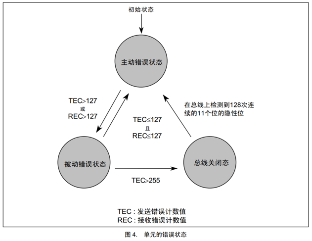
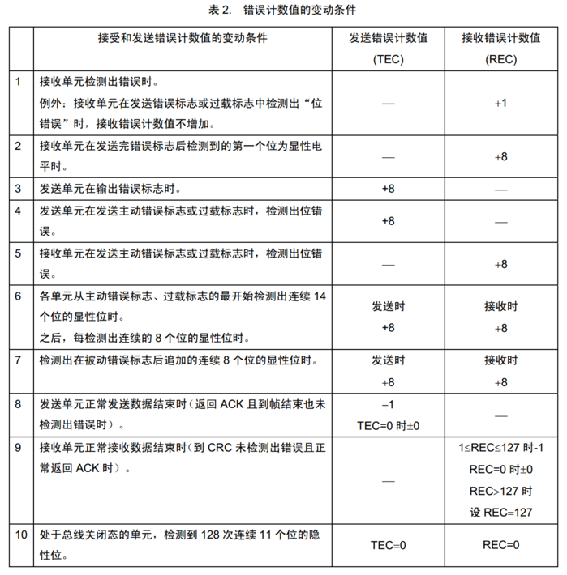
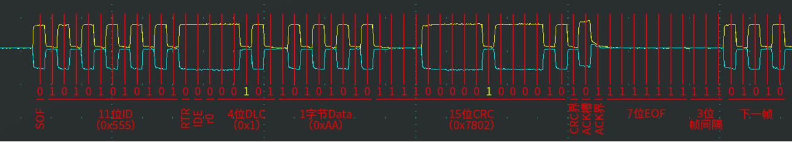
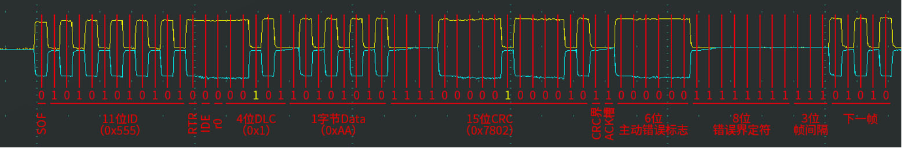
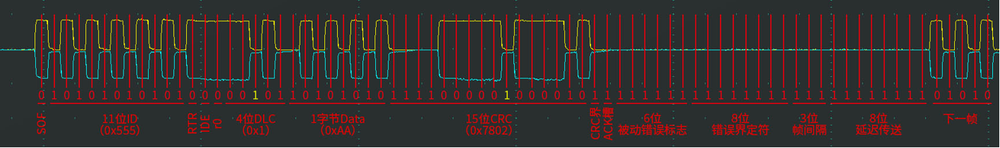

# [1-5]错误处理
## 错误类型
错误共有5种： 位错误、填充错误、CRC错误、格式错误、应答错误

## 错误状态
**主动错误状态**的设备正常参与通信并在检测到错误时发出主动错误帧

**被动错误状态**的设备正常参与通信但检测到错误时只能发出被动错误帧

**总线关闭状态**的设备不能参与通信

每个设备内部管理一个TEC和REC，根据TEC和REC的值确定自己的状态

TEC（Transmit Error Counter）👉 全称是：**发送错误计数器**

**REC（Receive Error Counter）**👉** 全称是：接收错误计数器**

## 错误计数器

## 波形示例
设备处于主动错误状态，发送标准数据帧，正常传输

设备处于主动错误状态，发送标准数据帧，检测到ACK错误

设备处于被动错误状态，发送标准数据帧，检测到ACK错误

