# [2-1]STM32 CAN外设（上）
## STM32 CAN外设简介
STM32内置bxCAN外设（CAN控制器），支持CAN2.0A和2.0B，可以自动发送CAN报文和按照过滤器自动接收指定CAN报文，程序只需处理报文数据而无需关注总线的电平细节

波特率最高可达1兆位/秒

3个可配置优先级的发送邮箱

2个3级深度的接收FIFO

14个过滤器组（互联型28个）

时间触发通信、自动离线恢复、自动唤醒、禁止自动重传、接收FIFO溢出处理方式可配置、发送优先级可配置、双CAN模式

STM32F103C8T6 CAN资源：CAN1

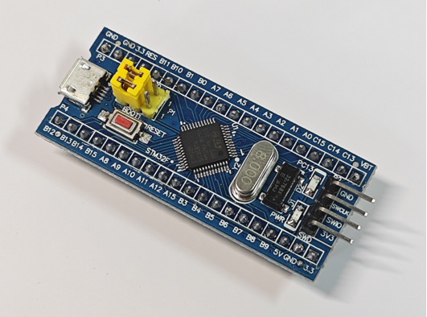

## CAN网拓扑结构

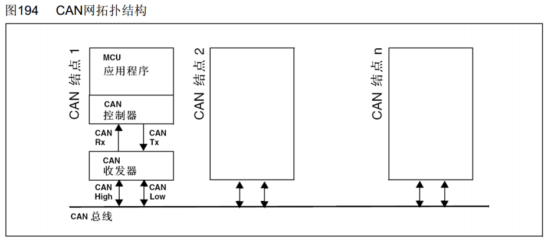

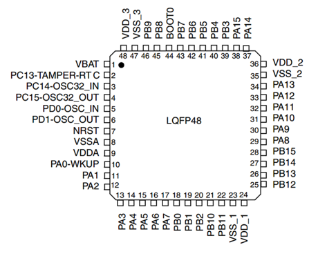

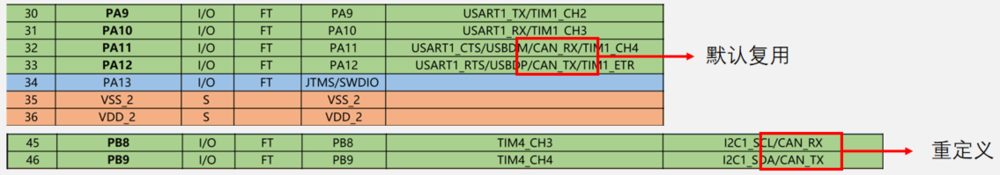

## CAN收发器电路

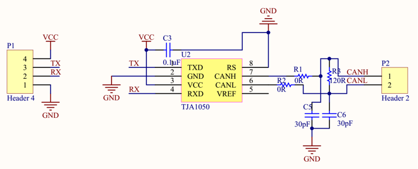

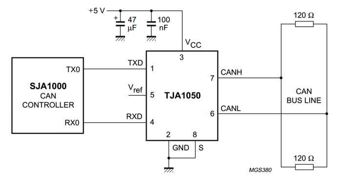

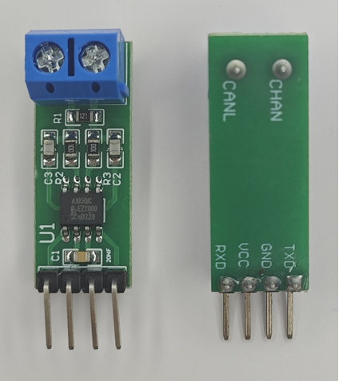

## CAN框图

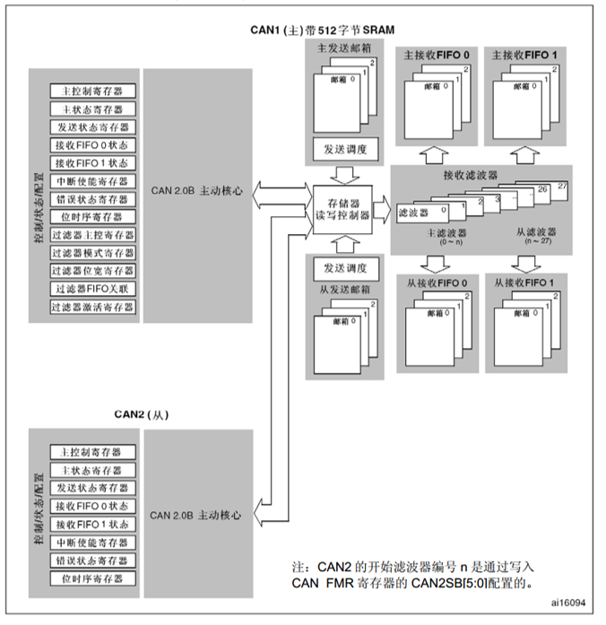

## CAN基本结构

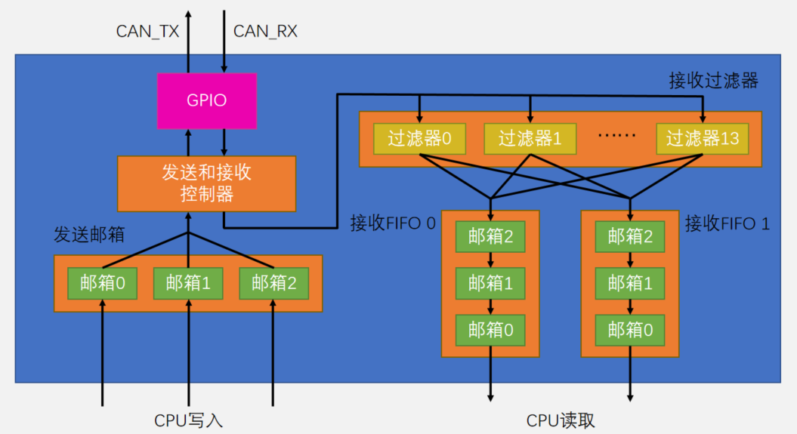

## 发送过程
基本流程：选择一个空置邮箱→写入报文 →请求发送

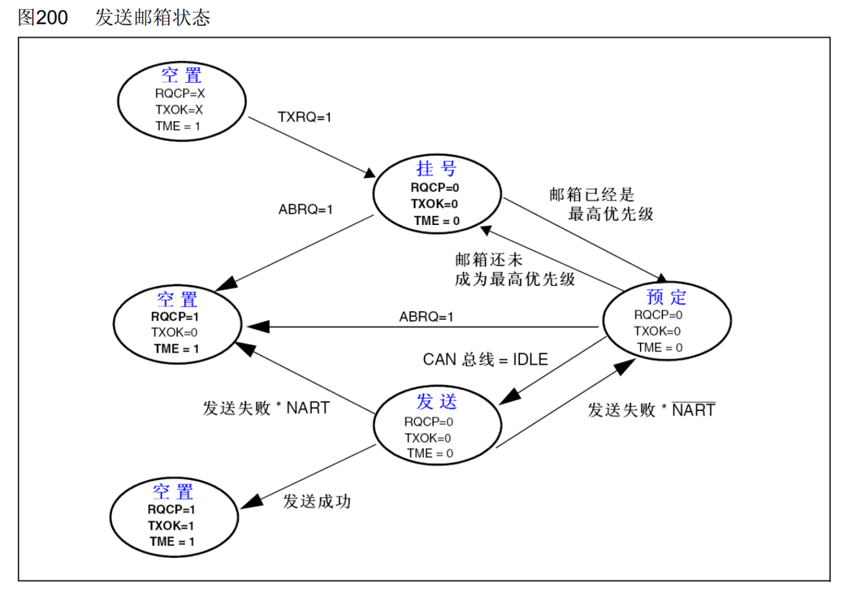

## 接收过程
基本流程：接收到一个报文→匹配过滤器后进入FIFO 0或FIFO 1→CPU读取

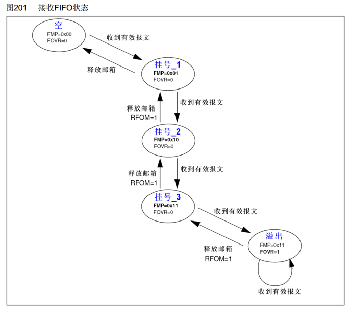

## 发送和接收配置位
NART：置1，关闭自动重传，CAN报文只被发送1次，不管发送的结果如何（成功、出错或仲裁丢失）；置0，自动重传，CAN硬件在发送报文失败时会一直自动重传直到发送成功

TXFP：置1，优先级由发送请求的顺序来决定，先请求的先发送；置0，优先级由报文标识符来决定，标识符值小的先发送（标识符值相等时，邮箱号小的报文先发送）

RFLM：置1，接收FIFO锁定，FIFO溢出时，新收到的报文会被丢弃；置0，禁用FIFO锁定，FIFO溢出时，FIFO中最后收到的报文被新报文覆盖