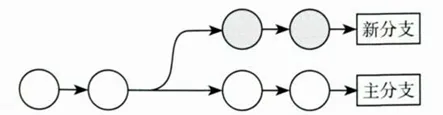
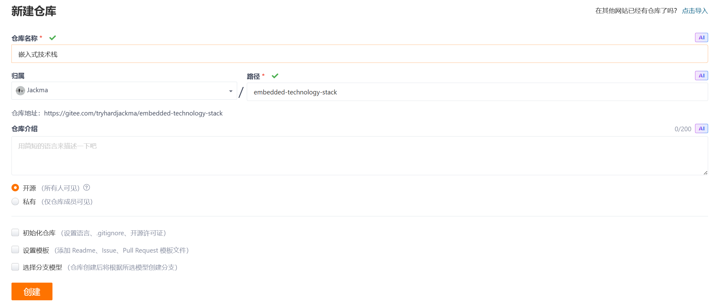
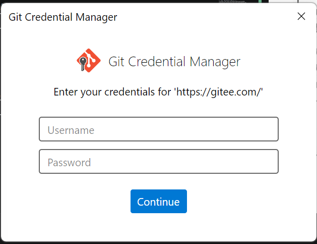

## Git配置和初始化仓库

1.配置Git用户和邮箱
```git
git config --global user.name "Jackma"
git config --global user.email "12345678@qq.com"
```
2.配置默认分支
```git
git config --global init.defaultBranch master
```
3.查看Git配置
```git
git config -l
```
4.初始化仓库
```git
git init
```
5.查看所有文件包括隐藏
```git
ls -a
```

## 提交代码
1.提交1.txt到暂存区
```git
git add src/1.txt
```
2.提交一个目录到暂存区
```git
git add src
```
3.提交当前终端目录所有文件到暂存区
```git
git add .
```
4.将暂存区的所有文件踢出
```git
git reset
```
5.添加src目录到暂存区并且提交
```git
git add src
git commit -m "注释内容"
```
6.查看提交日志
```git
git log
```

## 使用Git忽略文件
0.**创建.gitignore**
```bash
touch .gitignore
```

1.`.gitignore`文件
```git
build/
install/
log/
```
2.提交.gitignore文件

```git
git add .gitignore
git commit -m "提交了.gitignore文件"
```

3.测试.gitignore是否生效

```git
git add .
git commit -m "测试"
```

## Git进阶
1.查看git状态
```git
git status
```

2.查看修改内容
```git
git diff
```

3.查看单个修改内容
```git
git diff 1.txt
```

## Git进阶之学会撤销代码
1.没有提交也没有添加到缓冲区
```git
git cheakout 1.txt
```

2.添加到了缓冲区
```git
git reset 1.txt
git cheakout 1.txt
git status
```

3.提交了
3.1查看提交记录
```git
git log
git reset commit的哈希值
```

## **Git进阶之分支**



1.查看分支

```git
git branch
```

2.创建分支

```git
git branch rolling
```
3.切换分支

```git
git cheackout rolling
```

4.切换和合并分支

```git
git cheackout master
git merge rolling
```

5.删除分支

```git
git branch -D rolling
```

## 将代码托管在Gitee
```
git init                 # 初始化本地仓库
git add .                # 添加所有文件
git commit -m "说明"     # 提交代码
git remote -v            # 查看远程仓库
git remote add gitee 仓库地址   # 添加 Gitee 远程仓库
git push -u gitee main   # 第一次推送到 Gitee
git push                 # 后续直接推送
```

1.创建仓库





2.提交代码
```bash
git init                 # 初始化本地仓库
git add .                # 添加所有文件
git commit -m "说明"     # 提交代码
git remote -v            # 查看远程仓库
git remote add gitee 仓库地址   # 添加 Gitee 远程仓库,这里要登录和注意和github不要冲突
git push -u gitee main   # 第一次推送到 Gitee
git push                 # 后续直接推送
```


## 将代码托管在GitHub
1.创建仓库
👉 在 GitHub 新建仓库（不要初始化 README）
```bash
git init                      # 初始化仓库
git add .                     # 添加文件
git commit -m "first commit"  # 提交代码
```
2.推送本地仓库
```bash
git remote add origin 仓库地址   # 绑定 GitHub 仓库
git branch -M main             # 统一主分支为 main
git push -u origin main        # 第一次推送
```

3.修改代码后再次提交和推送
```bash
git add .                      # 添加修改
git commit -m "update"         # 提交
git push                       # 推送到 GitHub
```
4.使用ssh-keygen生成公私钥
```bash
ssh-keygen -t rsa -b 4096 -C "你的邮箱"   # 生成公私钥
```
👉 一路回车即可
4.1查看公钥
```bash
cat ~/.ssh/id_rsa.pub          # 查看公钥内容
```
👉 复制内容到 GitHub：
`Settings → SSH and GPG keys → New SSH key`
4.2测试 SSH 是否成功
```bash
ssh -T git@github.com
```
出现：
```bash
Hi xxx! You've successfully authenticated
```
说明成功 ✅
