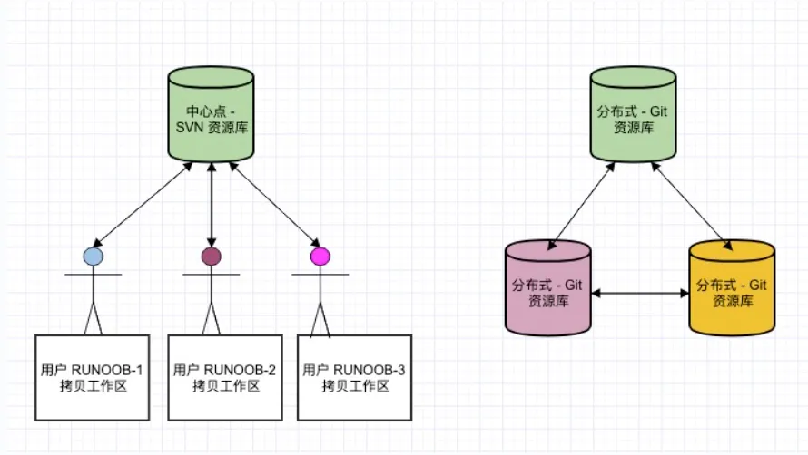

# Git 教程
&emsp;&emsp;Git 是一个开源的分布式版本控制系统，用于敏捷高效地处理任何或小或大的项目。

&emsp;&emsp;Git 是 Linus Torvalds 为了帮助管理 Linux 内核开发而开发的一个开放源码的版本控制软件。

&emsp;&emsp;Git 与常用的版本控制工具 CVS, Subversion 等不同，它采用了分布式版本库的方式，不必服务器端软件支持。

## Git 与 SVN 区别
&emsp;&emsp;Git 不仅仅是个版本控制系统，它也是个内容管理系统(CMS)，工作管理系统等。

&emsp;&emsp;如果你是一个具有使用 SVN 背景的人，你需要做一定的思想转换，来适应 Git 提供的一些概念和特征。

Git 与 SVN 区别点：

1、Git 是分布式的，SVN 不是：这是 Git 和其它非分布式的版本控制系统，例如 SVN，CVS 等，最核心的区别。

2、Git 把内容按元数据方式存储，而 SVN 是按文件：所有的资源控制系统都是把文件的元信息隐藏在一个类似 .svn、.cvs 等的文件夹里。

3、Git 分支和 SVN 的分支不同：分支在 SVN 中一点都不特别，其实它就是版本库中的另外一个目录。

4、Git 没有一个全局的版本号，而 SVN 有：目前为止这是跟 SVN 相比 Git 缺少的最大的一个特征。

5、Git 的内容完整性要优于 SVN：Git 的内容存储使用的是 SHA-1 哈希算法。这能确保代码内容的完整性，确保在遇到磁盘故障和网络问题时降低对版本库的破坏。

## Git 快速入门
&emsp;&emsp;Git 快速入门版本，你可以点击 Git 简明指南(https://www.runoob.com/manual/git-guide/) 查看。

&emsp;&emsp;Git 完整命令手册地址：http://git-scm.com/docs(http://git-scm.com/docs)

&emsp;&emsp;PDF 版命令手册：github-git-cheat-sheet.pdf(https://www.runoob.com/manual/github-git-cheat-sheet.pdf)

## 相关文章推荐
+ 1、Git 五分钟教程(https://www.runoob.com/w3cnote/git-five-minutes-tutorial.html)
+ 2、Git GUI使用方法(https://www.runoob.com/w3cnote/git-gui-window.html)
+ 3、Github 简明教程(https://www.runoob.com/w3cnote/git-guide.html)
+ 5、互联网组织的未来：剖析GitHub员工的任性之源(https://www.runoob.com/w3cnote/internet-organization-github.html)

## 补充
1️⃣ 分布式 vs 集中式（最重要！）

**Git（分布式）**

+  每个人电脑都有**完整仓库（含历史）**
+  可以**离线提交、分支、回滚**
+  推送到远程只是“同步”

**SVN（集中式）**

+  所有代码在**中央服务器**
+  本地只是“工作副本” 
+  必须联网才能提交

👉 一句话总结：  
👉 **Git：每个人都是服务器**  
👉 **SVN：只有一个服务器**

2️⃣ 数据存储方式（理解本质）

**Git：按“快照（snapshot）”存**

+  每次提交 = 整个项目的一个快照 
+  类似“拍一张全景照片”

**SVN：按“文件变化（diff）”存**

+  记录“这个文件改了什么” 
+  类似“记修改记录”

👉 结果：

+  Git 回滚快 
+  Git 更适合分支操作

3️⃣ 分支机制（Git 秒杀 SVN）

**Git 分支**

+  本质是一个**指针**
+  创建分支几乎“0成本” 
+  随便开、随便删

**SVN 分支**

+  本质是**复制目录**
+  重、慢、不灵活

👉 一句话总结：  
👉 **Git 分支 = 轻量指针**  
👉 **SVN 分支 = 复制文件夹**

4️⃣ 版本号机制

**SVN**

+  全局版本号（r1、r2、r3…） 
+  所有人共享一个递增编号

**Git**

+  没有全局版本号 
+  每次提交用 **哈希值（commit id）**

👉 举例：

+  SVN：版本 100 
+  Git：`a3f5c9d...`

👉 好处：

+  Git 更安全（唯一性强） 
+  支持分布式

5️⃣ 数据完整性（Git 更安全）

**Git**

+  使用 SHA-1 哈希（类似指纹） 
+  每个文件、提交都有校验 
+  防篡改能力强

**VN**

+  没有这么强的完整性校验机制

 👉 结果：  
👉 Git 更不容易“仓库损坏”  

现在基本：

+  ✅ 主流：Git（+ GitHub / GitLab） 
+  ❌ SVN：老项目 / 传统公司