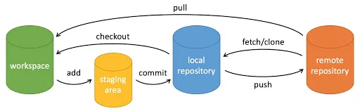

# Git 基本操作
Git 的工作就是创建和保存你项目的快照及与之后的快照进行对比。

本章将对有关创建与提交你的项目快照的命令作介绍。

Git 常用的是以下 6 个命令：**git clone**、**git push**、**git add** 、**git commit**、**git checkout**、**git pull**，后面我们会详细介绍。



**说明：**

+ workspace：工作区
+ staging area：暂存区/缓存区
+ local repository：版本库或本地仓库
+ remote repository：远程仓库

一个简单的操作步骤：

```git
git init    
git add .    
git commit
```

+ git init - 初始化仓库。
+ git add . - 添加文件到暂存区。
+ git commit - 将暂存区内容添加到仓库中。

### 创建仓库命令
下表列出了 git 创建仓库的命令：

| 命令 | 说明 |
| --- | --- |
| [git init](6.1-git-init.md) | 初始化仓库 |
| [git clone](6.2-git-clone.md) | 拷贝一份远程仓库，也就是下载一个项目。 |


## 提交与修改
Git 的工作就是创建和保存你的项目的快照及与之后的快照进行对比。

下表列出了有关创建与提交你的项目的快照的命令：

| 命令 | 说明 |
| --- | --- |
| [git add](6.3-git-add.md) | 添加文件到暂存区 |
| [git status](6.4-git-status.md) | 查看仓库当前的状态，显示有变更的文件。 |
| [git diff](6.5-git-diff.md) | 比较文件的不同，即暂存区和工作区的差异。 |
| [git difftool](6.6-git-difftool.md) | 使用外部差异工具查看和比较文件的更改。 |
| [git range-diff](6.7-git-range-diff.md) | 比较两个提交范围之间的差异。 |
| [git commit](6.8-git-commit.md) | 提交暂存区到本地仓库。 |
| [git reset](6.9-git-reset.md) | 回退版本。 |
| [git rm](6.10-git-rm.md) | 将文件从暂存区和工作区中删除。 |
| [git mv](6.11-git-mv.md) | 移动或重命名工作区文件。 |
| [git notes](6.12-git-notes.md) | 添加注释。 |
| [git checkout](6.13-git-checkout.md) | 分支切换。 |
| [git switch](6.14-git-switch.md)（Git 2.23 版本引入） | 更清晰地切换分支。 
| [git restore](6.15-git-restore.md)（Git 2.23 版本引入） | 恢复或撤销文件的更改。 |
| [git show](6.16-git-show.md) | 显示 Git 对象的详细信息。 |


### 提交日志
| 命令 | 说明 |
| --- | --- |
| [git log](git-init.md) | 查看历史提交记录 |
| [git blame](git-init.md) | 以列表形式查看指定文件的历史修改记录 |
| [git shortlog](git-init.md) | 生成简洁的提交日志摘要 |
| [git describe](git-init.md) | 生成一个可读的字符串，该字符串基于 Git 的标签系统来描述当前的提交 |


### 远程操作
| 命令 | 说明 |
| --- | --- |
| [git remote](git-init.md) | 远程仓库操作 |
| [git fetch](git-init.md) | 从远程获取代码库 |
| [git pull](git-init.md) | 下载远程代码并合并 |
| [git push](git-init.md) | 上传远程代码并合并 |
| [git submodule](git-init.md) | 管理包含其他 Git 仓库的项目 |


## Git 文件状态
Git 的文件状态分为三种：工作目录（Working Directory）、暂存区（Staging Area）、本地仓库（Local Repository）。了解这些概念及其交互方式是掌握 Git 的关键。

### 工作目录（Working Directory）
工作目录是你在本地计算机上看到的项目文件。它是你实际操作文件的地方，包括查看、编辑、删除和创建文件。所有对文件的更改首先发生在工作目录中。

在工作目录中的文件可能有以下几种状态：

+ **未跟踪（Untracked）**：新创建的文件，未被 Git 记录。
+ **已修改（Modified）**：已被 Git 跟踪的文件发生了更改，但这些更改还没有被提交到 Git 记录中。

### 暂存区（Staging Area）
暂存区，也称为索引（Index），是一个临时存储区域，用于保存即将提交到本地仓库的更改。你可以选择性地将工作目录中的更改添加到暂存区中，这样你可以一次提交多个文件的更改，而不必提交所有文件的更改。

+ 使用 `git add <filename>` 命令将文件从工作目录添加到暂存区。
+ 使用 `git add .` 命令将当前目录下的所有更改添加到暂存区。

```git
git add <filename>  # 添加指定文件到暂存区
git add .           # 添加所有更改到暂存区
```

### 本地仓库（Local Repository）
本地仓库是一个隐藏在 `.git` 目录中的数据库，用于存储项目的所有提交历史记录。每次你提交更改时，Git 会将暂存区中的内容保存到本地仓库中。

使用 `git commit -m "commit message"` 命令将暂存区中的更改提交到本地仓库。

```git
git commit -m "commit message"  # 提交暂存区的更改到本地仓库
```

### 文件状态的转换流程
**未跟踪（Untracked）**： 新创建的文件最初是未跟踪的。它们存在于工作目录中，但没有被 Git 跟踪。

```bash
touch newfile.txt  # 创建一个新文件
git status         # 查看状态，显示 newfile.txt 未跟踪
```

**已跟踪（Tracked）**： 通过 `git add` 命令将未跟踪的文件添加到暂存区后，文件变为已跟踪状态。

```bash
git add newfile.txt  # 添加文件到暂存区
git status           # 查看状态，显示 newfile.txt 在暂存区
```

**已修改（Modified）**： 对已跟踪的文件进行更改后，这些更改会显示为已修改状态，但这些更改还未添加到暂存区。

```bash
echo "Hello, World!" > newfile.txt  # 修改文件
git status                          # 查看状态，显示 newfile.txt 已修改
```

**已暂存（Staged）**： 使用 `git add` 命令将修改过的文件添加到暂存区后，文件进入已暂存状态，等待提交。

```bash
git add newfile.txt  # 添加文件到暂存区
git status           # 查看状态，显示 newfile.txt 已暂存
```

**已提交（Committed）**： 使用 `git commit` 命令将暂存区的更改提交到本地仓库后，这些更改被记录下来，文件状态返回为已跟踪状态。

```bash
git commit -m "Added newfile.txt"  # 提交更改
git status                         # 查看状态，工作目录干净
```