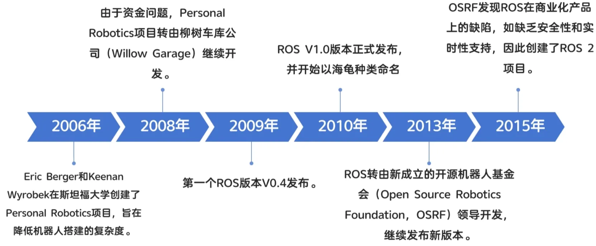
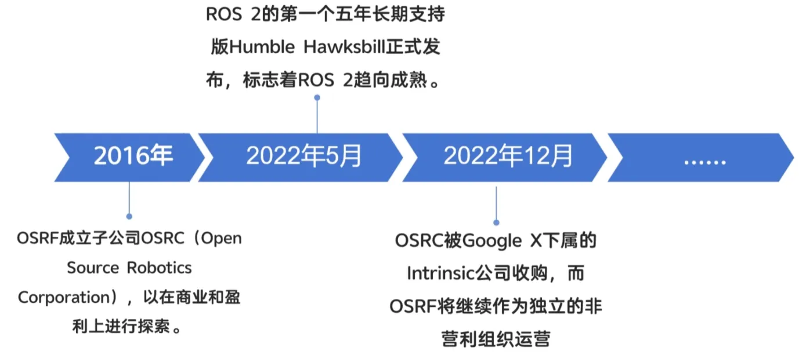
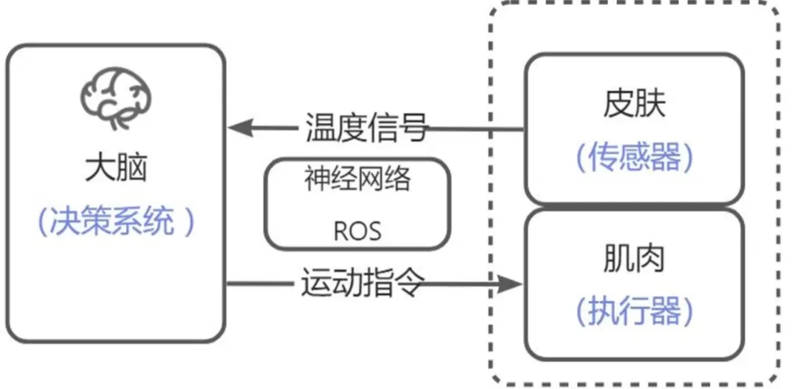
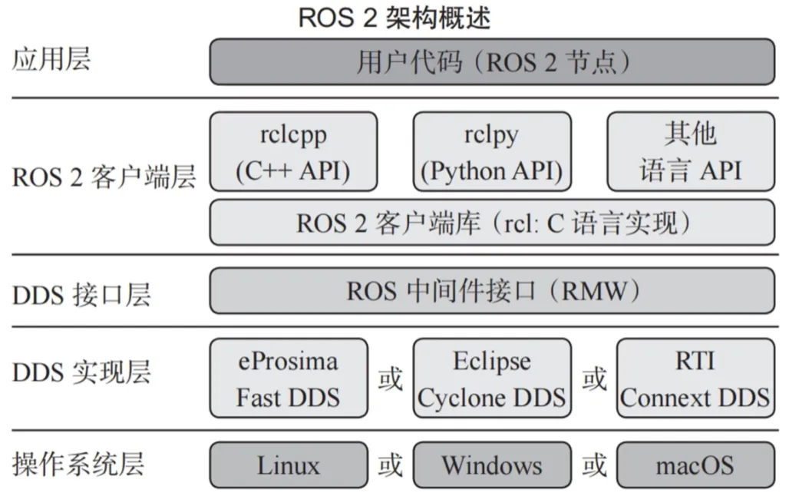

### ROS2发展历程

### 从开发者角度？ROS是什么？

### ROS 本质是什么？
ROS本质上其实就是用于快速搭建机器人的软件库(核心是通信)和工具集。

追求的是:稳定、安全和实时的通信能力!

### ROS2系统架构

### ROS 2机器人开发特色
话题(Topic)：基于发布-订阅模式的通信方式允许节点之间异步交换数据。

服务(Service)：同步通信方式，客户端发送请求，服务端处理并返回结果。

参数(Parameter)：用于机器人参数的设置和读取。

动作(Action)：支持复杂行为的通信方式，服务端可以反馈处理进度，客户端可以取消请求。

### ROS 2机器人开发槽点
机器人操作系统并不是真的操作系统，受操作系统限制!系统BUG也是你的BUG

本身做不到实时性!硬实时还需依赖操作系统

通信速度受内存速度、网速等物理层限制

大而全，注定和小而美此生无缘