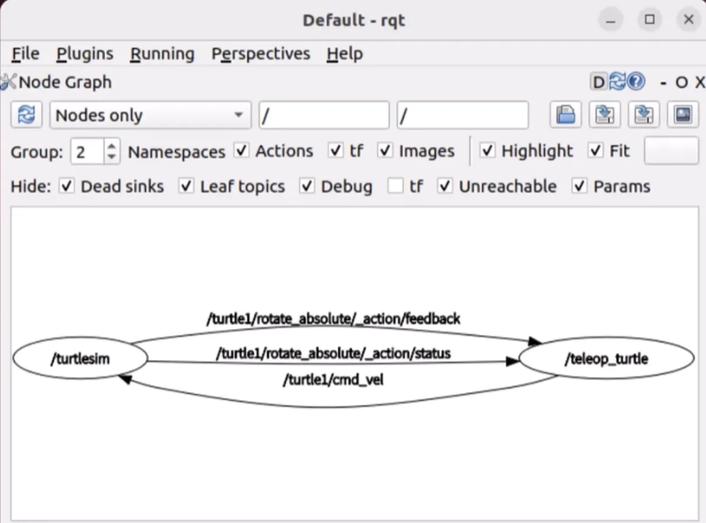

## 1.3 运行你的第一个机器人
`ros2 run turtlesim turtlesim_node`

`ros2 run turtlesim turtle_teleop_key`

### 小海龟例子的简单分析
为什么我们在键盘控制窗口通过按键就可以实现对海龟模拟器窗口的控制呢?

1.打开新终端，输入 rqt

2.工具栏选择 Plugins/introspection/Node Grap

3.单击左上角的刷新按钮，获取当前系统最新的节点关系

