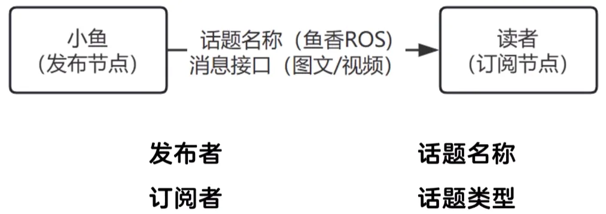

# 第三章 话题
## 3.1话题通信介绍
关键点



查看接口定义
```bash
ros2 run turtlesim turtlesim_node

ros2 run info /turtlesim
```

海龟模拟器话题
```bash
ros2 topic echo /turtle1/pose

ros2 topic info /turtle1/cmd_vel -v
```

使用话题控制机器人

`ros2 topic pub /turtle1/cmd_vel geometry_msg/msg/Twist "{linear:{x: 1.0}}"`