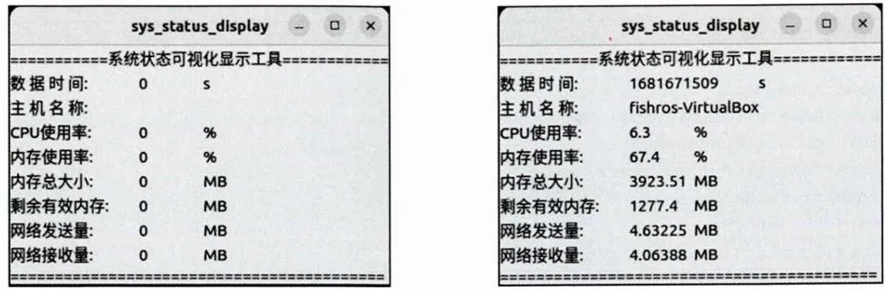

## 3.4.5订阅数据并用Qt显示
```cpp
#include <QApplication>
#include <QLabel>
#include <QString>

#include "rclcpp/rclcpp.hpp"
#include "status_interfaces/msg/system_status.hpp"

// 简化消息类型的别名（方便后续使用）
using SystemStatus = status_interfaces::msg::SystemStatus;

class SysStatusDisplay : public rclcpp::Node {
public:
    // 构造函数：初始化ROS 2节点（节点名"sys_status_display"）
    SysStatusDisplay() : Node("sys_status_display") {
        // 订阅ROS 2话题"sys_status"：
        // - 消息类型为SystemStatus
        // - 队列大小为10
        // - 回调函数：收到消息后更新Qt标签的文本
        subscription_ = this->create_subscription<SystemStatus>(
            "sys_status", 10, [&](const SystemStatus::SharedPtr msg) -> void {
                label_->setText(get_qstr_from_msg(msg));
            }
        );

        // 初始化Qt标签：
        // - 先创建一个空的SystemStatus消息对象，转为QString作为初始文本
        // - 显示标签控件
        label_ = new QLabel(get_qstr_from_msg(std::make_shared<SystemStatus>()));
        label_->show();
    }

    // 工具函数：将SystemStatus消息转换为Qt的QString（用于显示）
    QString get_qstr_from_msg(const SystemStatus::SharedPtr msg) {
        // 定义std::stringstream，用于拼接格式化的字符串
        std::stringstream show_str;
    
        // 拼接系统状态的可视化内容（按格式组装消息字段）
        show_str
            << "=============系统状态可视化显示工具=============\n"  // 标题
            << "数据时间:\t" << msg->stamp.sec << "\t s\n"         // 消息时间戳（秒）
            << "用户名:\t" << msg->host_name << "\t\n"             // 主机名
            << "CPU使用率:\t" << msg->cpu_percent << "\t%\n"       // CPU使用率（百分比）
            << "内存使用率:\t" << msg->memory_percent << "\t%\n"   // 内存使用率（百分比）
            << "内存总大小:\t" << msg->memory_total << "\tMB\n"    // 总内存（MB）
            << "剩余有效内存:\t" << msg->memory_available << "\tMB\n"  // 可用内存（MB）
            << "网络发送量:\t" << msg->net_sent << "\tMB\n"        // 网络发送数据量（MB）
            << "网络接收量:\t" << msg->net_recv << "\tMB\n"        // 网络接收数据量（MB）
            << "===============================================";  // 分隔线
    
        // 将std::stringstream转换为std::string，再转为Qt的QString返回
        return QString::fromStdString(show_str.str());
    }


private:
    // ROS 2订阅器：订阅SystemStatus类型的消息
    rclcpp::Subscription<SystemStatus>::SharedPtr subscription_;
    // Qt标签控件：用于显示系统状态消息
    QLabel* label_;
};

int main(int argc, char* argv[]) {
    rclcpp::init(argc, argv);
    QApplication app(argc, argv);
    
    // 用std::make_shared创建SysStatusDisplay节点的智能指针（自动管理生命周期）
    auto node = std::make_shared<SysStatusDisplay>();

    std::thread spin_thread([&]() -> void { 
        rclcpp::spin(node);  // 启动节点的消息循环，持续处理订阅的消息
    });
    // 分离线程：让线程独立运行，不阻塞main函数后续逻辑
    spin_thread.detach();
    app.exec();
    rclcpp::shutdown();

    return 0;
}
```

`system_status.hpp`是**ROS 2 根据**`.msg`**文件自动生成的 C++ 头文件**，来源是`status_interfaces`包下的`SystemStatus.msg`

CMakeList.txt
```CMake
...
add_executable(sys_status_display src/sys_status_display.cpp)

target_link_libraries(sys_status_display Qt5::Widgets)  # 对于非 ROS 功能包使用 Cmake 原生指令进行链接库

ament_target_dependencies(sys_status_display rclcpp status_interfaces)

install(TARGETS
    hello_qt
    sys_status_display
    DESTINATION lib/${PROJECT_NAME}
)

...
ament_package()
```
