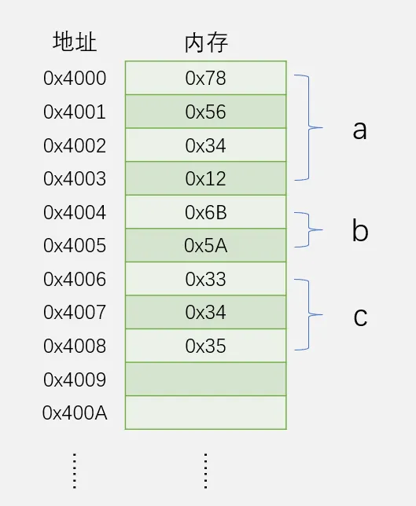
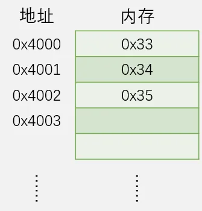

# 指针简介
&emsp;&emsp;指针(Pointer)是C语言的一个重要知识点，其使用灵活、功能强大，是C语言的灵魂

&emsp;&emsp;指针与底层硬件联系紧密，使用指针可操作数据的地址，实现数据的间接访问

# 计算机存储机制
`int a = 0x12345678;`

`short b = 0x5A6B;`

`char c[ ] = {0x33, 0x34, 0x35};`



# 定义指针
&emsp;&emsp;指针即指针变量，用于存放其他数据单元（变量/数组/结构体/函数等）的首地址。若指针存放了某个数据单元的**首地址**，则这个指针指向了这个数据单元，若指针存放的值是0，则这个指针为空指针

定义一个指针变量：

| 数据类型           | 占用字节数 | 指向该数据类型的指针 | 指针占用字节数（x） |
| :---------------- | :--------: | :------------------ | :-----------------: |
| (unsigned) char   | 1字节      | (unsigned) char *    | x字节               |
| (unsigned) short  | 2字节      | (unsigned) short *   | x字节               |
| (unsigned) int    | 4字节      | (unsigned) int *     | x字节               |
| (unsigned) long   | 4字节      | (unsigned) long *    | x字节               |
| float             | 4字节      | float *              | x字节               |
| double            | 8字节      | double *             | x字节               |

16位系统：x=2，32位系统：x=4，64位系统：x=8

# 指针的操作
若已定义：
```c
int a;		//定义一个int型的数据

int *p;		//定义一个指向int型数据的指针
```

则对指针p有如下操作方式：

| 操作方式   | 举例                   | 解释                           |
|------------|------------------------|--------------------------------|
| 取地址     | p=&a;                   | 将数据a的地址赋值给p           |
| 取内容     | *p;                     | 取出指针指向的数据单元         |
| 加         | p++;                    | 使指针向下移动1个数据宽度     |
| 加         | p=p+5;                  | 使指针向下移动5个数据宽度     |
| 减         | p--;                    | 使指针向上移动1个数据宽度     |
| 减         | p=p-5;                  | 使指针向上移动5个数据宽度     |

# 数组与指针
&emsp;&emsp;数组是一些相同数据类型的变量组成的集合，其**数组名即为指向该数据类型的指针**。数组的定义等效于申请内存、定义指针和初始化

例如： 	`char c[ ] = {0x33, 0x34, 0x35};`

等效于：	申请内存
```c
定义 char *c = 0x4000;
等于
char *c;
c = 0x4000;
初始化数组数据
```
利用下标引用数组数据也等效于指针取内容。
```c
例如：	 
c[0];	等效于：	*c;

c[1];	等效于：	*(c+1);

c[2];	等效于：	*(c+2);
```


# 注意事项
&emsp;&emsp;在对指针取内容之前，一定要确保指针指在了合法的位置，否则将会导致程序出现不可预知的错误

&emsp;&emsp;同级指针之间才能相互赋值，跨级赋值将会导致编译器报错或警告


```c
#include <stdio.h>

int main() {
    int a = 10;
    int b = 20;
    int *ptr1 = &a; // ptr1 指向 a
    int *ptr2 = &b; // ptr2 指向 b
    int *ptr3 = NULL; // ptr3 是空指针，未指向任何有效位置

    // 正确的取指针内容操作
    printf("ptr1 points to value: %d\n", *ptr1); // 输出: 10

    // 错误的取指针内容操作
    // 需要确保指针指向合法的内存地址，否则会导致程序崩溃
    if (ptr3 != NULL) {
        printf("ptr3 points to value: %d\n", *ptr3); // 如果ptr3为NULL，将无法取值
    } else {
        printf("ptr3 is NULL, can't dereference it.\n"); // 这里避免了非法操作
    }

    // 同级指针之间的赋值是合法的
    ptr1 = ptr2; // ptr1现在指向b
    printf("ptr1 now points to value: %d\n", *ptr1); // 输出: 20

    // 跨级指针赋值（错误示例）
    // int **ptr4 = &ptr1; // 定义一个指向指针的指针
    //ptr4 = ptr2; // 错误：ptr4是一个指向指针的指针，而ptr2是一个指向int的指针

    return 0;
}
```

# 指针的应用
**传递参数**

&emsp;&emsp;使用指针传递大容量的参数，主函数和子函数使用的是同一套数据，避免了参数传递过程中的数据复制，提高了运行效率，减少了内存占用

&emsp;&emsp;使用指针传递输出参数，利用主函数和子函数使用同一套数据的特性，实现数据的返回，可实现**多返回值**函数的设计

**传递返回值**

&emsp;&emsp;将模块内的公有部分返回，让主函数持有模块的“句柄”，便于程序对指定对象的操作

**直接访问物理地址下的数据**

&emsp;&emsp;访问硬件指定内存下的数据，如设备ID号等

&emsp;&emsp;将复杂格式的数据转换为字节，方便通信与存储

## **传递参数**
```c
#include <stdio.h>

void fun(int param)
{
    printf("%x\n", param);
}

int main(void)
{
    int a = 0x66;
    fun(a);
    return 0;
}
```

```c
#include <stdio.h>

int FindMax(int array[], int Count)
{
    int i, max;
    if(Count <= 0) return 0;  // 添加边界检查
    
    max = array[0];  // 初始化为第一个元素
    for(i = 1; i < Count; i++)
    {
        if(array[i] > max)
        {
            max = array[i];
        }
    }
    return max;
}

int main(void)
{
    int a[] = {13, 2, 3, 5, 4, 38};
    int Max;
    int size = sizeof(a) / sizeof(a[0]);  // 计算数组长度

    Max = FindMax(a, size);  // 正确传递参数

    printf("Max = %d\n", Max);

    return 0;
}
```

`int FindMax(const int array[], int Count)`

定义全局变量

```c
#include <stdio.h>

void FindMaxAndCount(int *max, int *count, const int *array, int length)
{
    int i;
    
    if(length <= 0) {
        *max = 0;
        *count = 0;
        return;
    }
    
    *max = array[0];
    *count = 1;  // 第一个元素就是当前最大值，计数为1
    
    for(i = 1; i < length; i++)
    {
        if(array[i] > *max)
        {
            *max = array[i];
            *count = 1;  // 发现新的最大值，重置计数为1
        }
        else if(array[i] == *max)
        {
            (*count)++;  // 增加相同最大值的计数
        }
    }
}

int main(void)
{
    int a[] = {13, 2, 3, 5, 4, 30};
    int Max;
    int Count;

    FindMaxAndCount(&Max, &Count, a, 6);

    printf("Max = %d\n", Max);
    printf("Count = %d\n", Count);

    return 0;
}
```

可实现多返回值函数的设计

## 传递返回值
| 类型       | 示例                      |
| -------- | ----------------------- |
| 普通值返回    | `result = add(1,2)`     |
| 返回值直接传函数 | `printf("%d", abs(-1))` |
| 指针返回值    | `p = strchr(str,'a')`   |

```c
#include <stdio.h>

int main(void)
{
    char a;
    char s[15];  // 增加到15，与fgets的参数匹配
    FILE *f;//返回一个有效地址（指针）
    
    // 修正文件路径：双反斜杠或单正斜杠
    f = fopen("F:\\test.txt", "r");
    
    // 检查文件是否成功打开
    if (f == NULL) {
        printf("无法打开文件！\n");
        return 1;
    }
    
    // 读取第一个字符
    a = fgetc(f);
    
    // 读取一行字符串（最多14个字符 + 空字符）
    fgets(s, 15, f);//char *fgets(char *str, int n, FILE *stream);
    
    fclose(f);
    
    // 输出结果
    printf("%c\n", a);
    printf("%s", s);
    
    return 0;
}
```
假设文件 F:\test.txt 的内容是：

`Hello World`
输出:
```
Hello World
```

## 直接访问物理地址下的数据
```c
#include <reg51.h>  // 或其他对应的头文件
#include "LCD1602.h"  // 假设有LCD驱动头文件

void main(void)
{
    unsigned char code *p;  // code关键字指示数据存储在程序存储器中
    
    // 初始化LCD
    LCD_Init();
    
    // 显示字符串
    LCD_ShowString(1, 1, "HelloWorld!");
    
    // 修正地址：0xIFF9 应该是 0xFF9 或其他有效地址
    // 假设是 0xFF9，注意：51单片机中0xFF9是特殊功能寄存器区域
    // 通常我们访问的是程序存储器的固定地址
    p = (unsigned char code *)0xFF9;  // 修正地址
    
    // 显示从指定地址开始的7个字节的十六进制值
    LCD_ShowHexNum(2, 1, *p, 2);      // 地址0xFF9的内容
    LCD_ShowHexNum(2, 3, *(p + 1), 2); // 地址0xFFA的内容
    LCD_ShowHexNum(2, 5, *(p + 2), 2); // 地址0xFFB的内容
    LCD_ShowHexNum(2, 7, *(p + 3), 2); // 地址0xFFC的内容
    LCD_ShowHexNum(2, 9, *(p + 4), 2); // 地址0xFFD的内容
    LCD_ShowHexNum(2, 11, *(p + 5), 2); // 地址0xFFE的内容
    LCD_ShowHexNum(2, 13, *(p + 6), 2); // 地址0xFFF的内容
    
    while (1) {
        // 主循环，保持程序运行
    }
}
```
将复杂格式的数据转换为字节，方便通信与存储
```c
#include <stdio.h>
#include <string.h>

// 假设的接收数据函数
void ReceiveData(unsigned char *buffer, int length)
{
    // 这里应该是从串口或其他接口接收数据的实际代码
    // 为了演示，我们模拟接收一些数据
    unsigned char testData[] = {0x41, 0x45, 0x70, 0xA4}; // 12.34的IEEE754表示
    
    if(buffer != NULL && length <= 4) {
        memcpy(buffer, testData, length);
    }
}

// 假设的发送数据函数
void SendData(unsigned char *buffer, int length)
{
    // 这里应该是通过串口或其他接口发送数据的实际代码
    // 为了演示，我们只是打印出来
    printf("发送的数据: ");
    for(int i = 0; i < length; i++) {
        printf("%02X ", buffer[i]);
    }
    printf("\n");
}

int main(void)
{
    // 第一部分：接收浮点数
    {
        unsigned char DataReceive[4];
        float *fp;
        
        ReceiveData(DataReceive, 4);
        
        fp = (float *)DataReceive;
        
        printf("接收到的浮点数: %.3f\n", *fp);
    }
    
    printf("\n-------------------\n\n");
    
    // 第二部分：发送浮点数
    {
        unsigned char i;
        float num = 12.345f;  // 添加f后缀表示float类型
        unsigned char *p;
        
        // 将浮点数的内存表示转换为字节数组
        p = (unsigned char *)&num;
        
        // 发送浮点数的字节表示
        printf("浮点数 %.3f 的字节表示: ", num);
        for(i = 0; i < 4; i++) {
            printf("%02X ", p[i]);
        }
        printf("\n");
        
        SendData(p, 4);
        
    }
    
    return 0;
}
```

你这里主要用了两种指针：
| 指针                | 用途         |
| ----------------- | ---------- |
| `float *`         | 把4字节解释成浮点数 |
| `unsigned char *` | 把浮点数拆成4个字节 |

**一、接收部分：为什么用 `float *fp`**

1.这里：
```c
unsigned char DataReceive[4];
float *fp;
```

先接收4字节
```c
ReceiveData(DataReceive, 4);
```
接收到：

`41 45 70 A4`

这些只是：
```
原始字节
```
计算机还不知道：
是整数
是浮点数
是字符
还是结构体

2.关键来了
```c
fp = (float *)DataReceive;
```
这里意思：
`“把这4个字节，当成 float 来看”`
内存没变
内存还是：
`41 45 70 A4`
原来：`unsigned char[]`是：`一个个字节`
现在：`float *`表示：`这4字节组合起来是一个浮点数`

3.`*fp`是什么意思
`printf("%.3f\n", *fp);`
这里：`*fp`表示：取出 fp 指向地址里的 float 值
即：`把 41 45 70 A4`解释成 IEEE754 浮点数
得到：`12.34`

**二、发送部分更经典**
这里：`float num = 12.345f;`
内存中其实已经有：
`12.345` 的 IEEE754 二进制
比如：`41 45 85 1F`
（实际字节和大小端有关）

为什么转成 `unsigned char *`
这里：`p = (unsigned char *)&num;`
意思：
“不要把它当 float”
“把它当 4 个字节”
这样就能：`p[0]
p[1]
p[2]
p[3]`
逐字节访问。

**三、为什么通信必须这样？**
串口、网络、SPI、CAN 等通信：
本质只能传：字节
不能直接传：float
所以必须：

发送端
```
float
 ↓
拆成4字节
 ↓
发送
```


接收端
```
收到4字节
 ↓
重新解释成 float
```
这其实叫：“类型转换指针”
这里：`(float *)DataReceive`
属于：`强制类型转换`
意思：
同一块内存
换一种解释方式

**四、整个过程的本质图**
发送端
```
num = 12.345

内存:
41 45 85 1F

      ↓
(unsigned char *)

按字节发送
```
接收端
```
收到:
41 45 85 1F

      ↓
(float *)

解释成 float
```