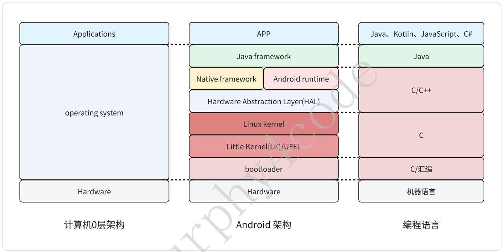
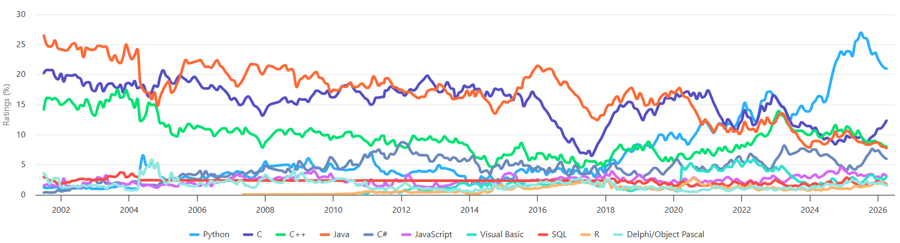
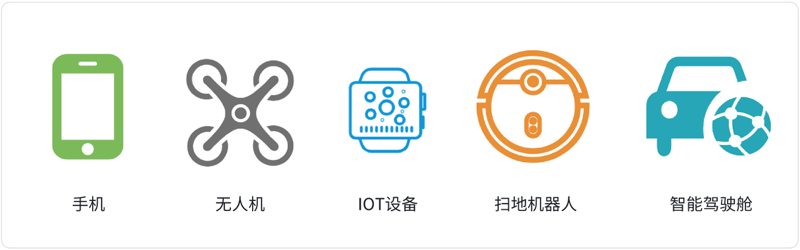
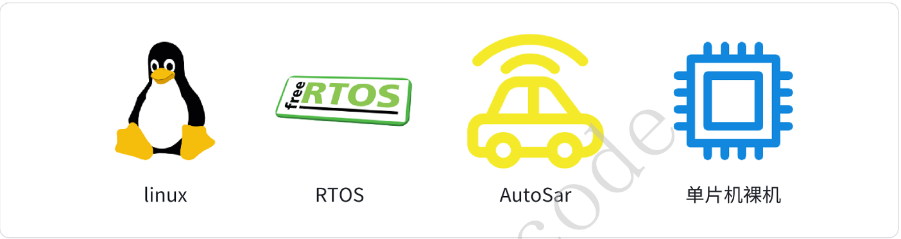

# 一、课程概述

## 1.1-聊⼀聊C语⾔

C语⾔是编程语⾔的常⻘树：⻓年霸榜编程语⾔TOP2（TIOBE：https://www.tiobe.com/tiobe/index/）  

C语⾔是最接近硬件的⾼级语⾔：在智能硬件中⼴泛应⽤

&emsp;&emsp;手机、无人机、IOT、扫地机器人、智能驾驶舱

C语⾔是「嵌⼊式软件开发」的必备⼯具和技能：  

&emsp;&emsp;Linux、RTOS、AutoSar、单片机裸机

