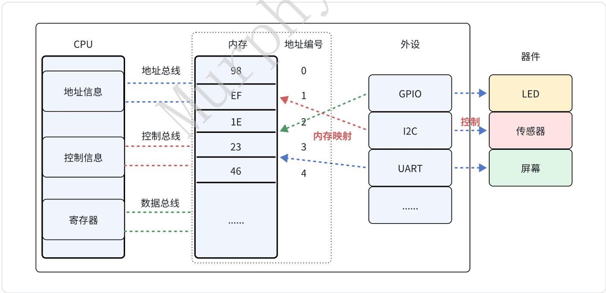
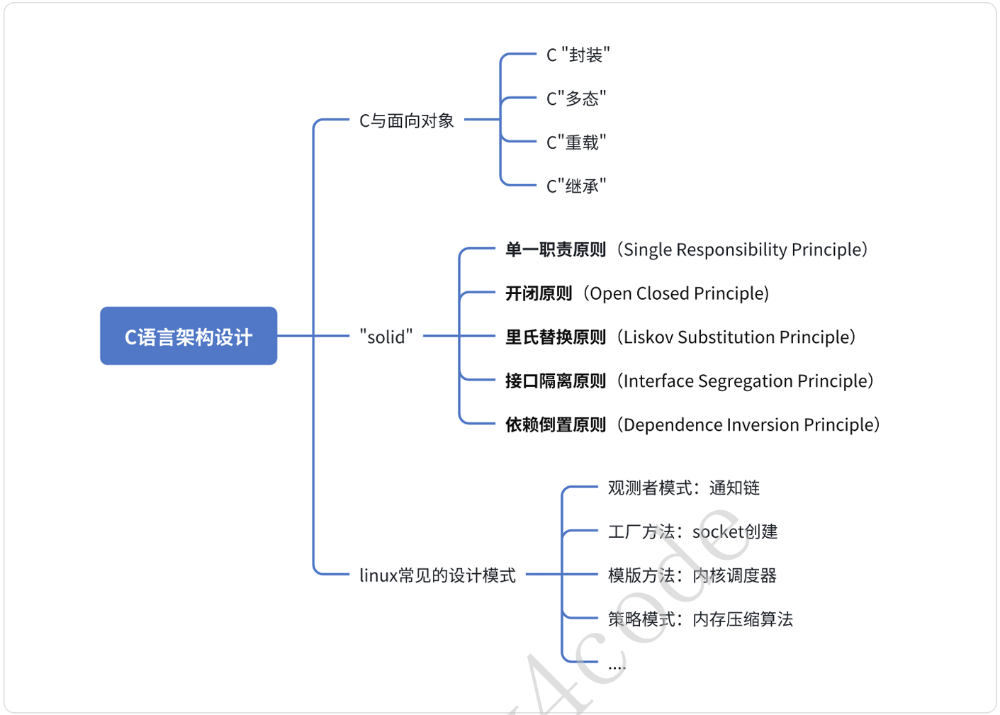

从"三个"视⻆出发，掌握C语⾔设计的底层逻辑。  


 1.「内存（硬件）视⻆」：操作底层最适合的语⾔ 

&emsp;&emsp;C语⾔最核⼼的、最powerful的能⼒：操作内存资源。实际上CPU外设硬件（GPIO、I2C、UART 等等）本质上是内存映射。所以，C语⾔控制硬件本质上是操作内存，学会⽤内存的⻆度看待C语⾔， 实际⼯程中⾯对问题才会得⼼应⼿。  



 2.「函数（架构）视⻆」：程序逻辑、架构设计
 
⾯向过程的语⾔怎么做架构设计？能否借助C++/JAVA⾯向对象思想，写出优秀的代码？ 

a. C语⾔中的”重载“、”继承“、”多态“、”封装“思想 

b. C语⾔程序设计怎么做到满⾜"solid"原则 

c. 内核中常⻅的设计模式有哪些？  



 3.「编译器视⻆」 

&emsp;&emsp;在⼯程中经常会讨论到，这个xx问题可能是编译器带来的。如，volatile防⽌O3编译优化导致的内 存miss问题、宏函数展开没有语法检查，怎么⽤才安全？  

```c
// stm32f103xb.h

#define __O  volatile   /*!< Defines 'write only' permissions */
#define __IO volatile   /*!< Defines 'read / write' permissions */

typedef struct
{
    __IO uint32_t CRL;
    __IO uint32_t CRH;
    __IO uint32_t IDR;
    __IO uint32_t ODR;
    __IO uint32_t BSRR;
    __IO uint32_t BRR;
    __IO uint32_t LCKR;
} GPIO_TypeDef;
```

&emsp;&emsp;利⽤编译器特性做代码设计：__attribute__((packed))、__attribute__(("section")) 等等。官⽹ (https://gcc.gnu.org/onlinedocs/gcc/Common-Function-Attributes.html)  

```c
// cmsis_gcc.h

#define __NO_RETURN        __attribute__((__noreturn__))
#define __USED             __attribute__((used))
#define __WEAK             __attribute__((weak))
#define __PACKED           __attribute__((packed, aligned(1)))
#define __PACKED_STRUCT    struct __attribute__((packed, aligned(1)))
#define __PACKED_UNION     union __attribute__((packed, aligned(1)))
```

```c
// include/linux/init.h

#ifndef MODULE
// 省略

#define module_init(x) __initcall(x);

// 省略

#else

#define module_init(x) __initcall(x);

    // 宏展开过程
    // __initcall(fn) → device_initcall(fn)
    #define __initcall(fn) device_initcall(fn)

    // device_initcall(fn) → __define_initcall(fn, 6)
    #define device_initcall(fn) __define_initcall(fn, 6)

    // 最终展开
    #define __define_initcall(fn, id)                        \
        static initcall_t __initcall_##fn##id __used         \
        __attribute__((__section__(".initcall" #id ".init"))) = fn;

#endif
```
