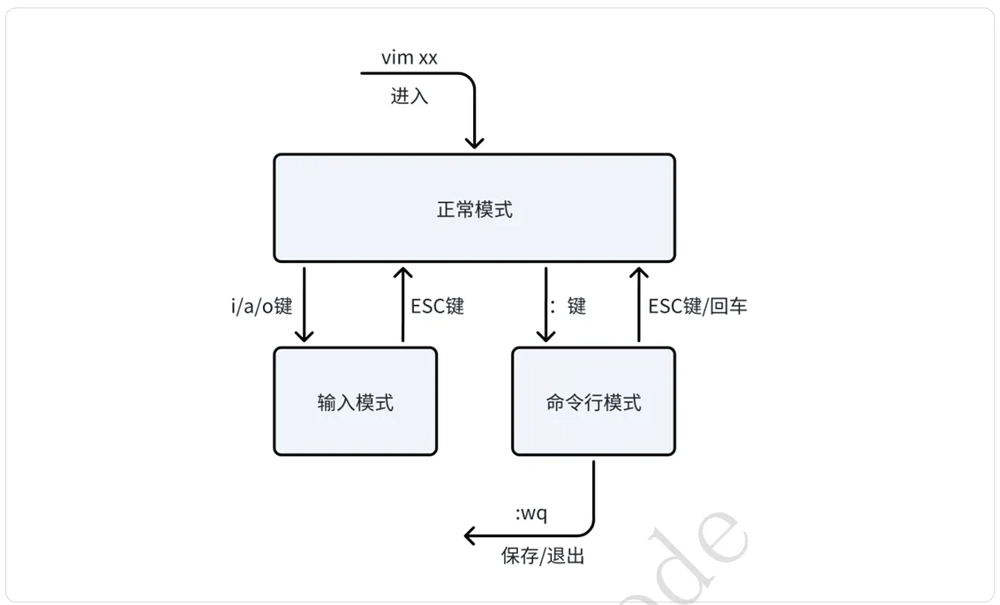

## 2.2-文本编辑器vim

## 强烈建议直接安装VS code书写和调试代码

### 2.2.1 vim简介 
&emsp;&emsp;vim是从vi发展出来的⼀个⽂本编辑器。具有代码补全、快速跳转、查找等功能，在linux中被⼴ 泛使⽤。vim官⽅⽹站(https://www.vim.org/)  

 「正常模式」： 

这个模式下⼀般⽤于阅读、复制粘贴、⽂本替换、⽂本查找等功能。  

 「输⼊模式」： 

这个模式⽤于⽂本编辑输⼊。  

 「命令⾏模式」： 

这个模式⽤于⽂件的保存、退出等功能。  

###  2.2.2 安装vim  
 sudo apt-get install vim  

###  2.2.3 vim增删改查 
通过vim编写⼀个helloworld代码。 

1、输⼊以下命令打开⼀个空的⽂件，此时默认进⼊了正常模式  

 vim hello-world.c  

2、按键盘中的「i」进⼊编辑模式，并输⼊helloworld的代码  

3、在输⼊模式下，按键盘中的「Esc」进⼊正常模式，此时输⼊「/hello」可进⾏查找hello字符  

4、在正常模式下，按键盘中的「:」进⼊命令⾏模式，输⼊「wq」，保存并退出。如果不想保存可以 输⼊「q!」强制退出  

&emsp;&emsp;以上就相当于vim⼊⻔，可以完成⽂本的编辑、查找、保存基础操作。vim是⼀个⼯具，⼤家在学习） 的时候不需要强⾏记忆命令，要学会在使⽤中熟练和记忆。下⾯介绍⼀个vim学习的神器：vimtutor。  

###  2.2.4 vimtutor 

&emsp;&emsp;vimtutor是vim⾃带的⼀个交互式教程程序，通过它你可以轻松掌握vim的基本使⽤⽅法和技巧，在 终端中输⼊：  

 vimtutor zh  