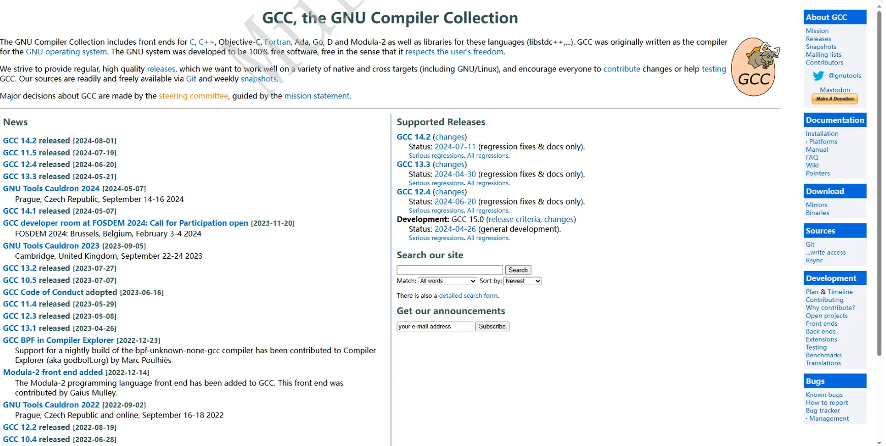

###  2.3.1 gcc简介  
&emsp;&emsp;gcc是GNUCompilerCollection的简称，是GNU(GNU'sNotUnix)开源项⽬的编译器套件。gcc的 初衷是为GNU操作系统专⻔编写的⼀款编译器，⽤于编译C代码。现如今已扩展为可以编译C++、 Java、Objective-C等多种编程语⾔的集合。gcc本⾝也遵循GPL发⾏许可证，⼤名⿍⿍的linux就是基 于gcc搭建的编译系统。gcc官⽅⽹站(https://gcc.gnu.org/)  

###  2.3.2 安装gcc  
sudo apt-get update 

sudo apt-get install build-essential  

输⼊以下命令确认版本号：

gcc -v  

 2.3.3 gcc编译  

 gcc命令的建议格式如下：  

 gcc -o output input -option  

 gcc常⻅命令：  

1. [gcc-E]：预编译 

2. [gcc-S]：⽣成汇编 

3. [gcc-c]：⽣成⽬标⽂件 

4. [gcc-o]：⽣成可执⾏⽂件 

5. [gcc-I]：添加头⽂件⽬录 

6. [gcc-D]：定义宏 

7. [gcc-g]：添加调试信息 

8. [gcc-v]：打印gcc版本信息  