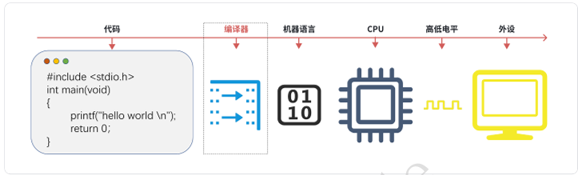
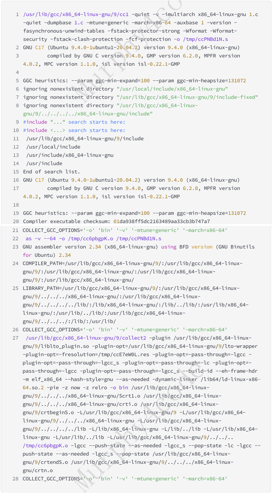
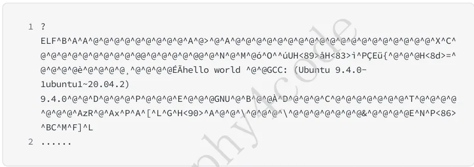
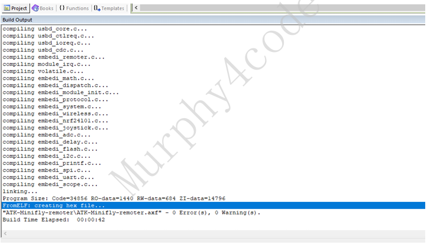

# 三、编译器视⻆

## 3.1 编译过程  
编译器：程序员和计算机之间的翻译官。  



输⼊命令：gcc-obin1.c-v可得到编译全过程的⽇志（重点看紫⾊部分）：）



### 3.1.1 预编译  
 以下⾯这段简单的代码为例：  

```c
#include <stdio.h>
#define ABC 123

int main(void)
{
    int a = ABC;
    printf("hello world \n");

    return 0;
}
```

预编译做需要两个事情：  

包含头⽂件：#include。把需要⽂件包含进来，不仅包含我们⾃⼰⼿动include的，也包含了必需 的系统⽂件。  

宏替换：#define。宏替换的过程是纯⽂本替换，预编译阶段不会检测语法的准确性。如ABC直接 替换成123  

输⼊命令：gcc-E可得到以下预处理后的结果：  

```c
# 1 "1.c"
# 1 "<built-in>"
# 1 "<command-line>"
# 31 "<command-line>"
# 1 "/usr/include/stdc-predef.h" 1 3 4
# 1 "/usr/include/stdio.h" 3 4
# 2 "1.c" 2
# 5 "1.c"
int main(void)
{
 int a = 123;
 printf("hello world \n");
 return 0;
}
```
Q: #include "xx.c" 包含C⽂件可以吗？
A: 可以，但是不建议

###  3.1.2 翻译成汇编  
&emsp;&emsp;编译器调⽤cc1(Ccompiler1)⼯具把C的代码翻译成汇编。  

```bash
/usr/lib/gcc/x86_64-linux-gnu/9/cc1 -quiet -v -imultiarch x86_64-linux-gnu 1.c
-quiet -dumpbase 1.c -mtune=generic -march=x86-64 -auxbase 1 -version
-fasynchronous-unwind-tables -fstack-protector-strong -Wformat -Wformat-security
-fstack-clash-protection -fcf-protection -o /tmp/ccPNBd1N.s
```

以上命令等价为:gcc-S

```bash
gcc -o 1.s 1.c -S -v
```

&emsp;&emsp;打开汇编代码（vim1.s）结果如下（x86平台）。其实就是⼀些指令，这些指令跟具体的体系结构有 关，不同的体系架构，相同的C语⾔，汇编也是不⼀样的。⼤家先建⽴这个认知即可  

```Assembly
......
main:
.LFB0:
    .cfi_startproc
    endbr64
    pushq   %rbp
    .cfi_def_cfa_offset 16
    .cfi_offset 6, -16
    movq    %rsp, %rbp
    .cfi_def_cfa_register 6
    subq    $16, %rsp
    movl    $123, -4(%rbp)
    leaq    .LC0(%rip), %rdi
    call    puts@PLT
    movl    $0, %eax
    leave
    .cfi_def_cfa 7, 8
    ret
    .cfi_endproc
......
```

&emsp;&emsp;不是必须先变成汇编，只是“生成汇编”是一个中间步骤，方便开发、调试和移植，本质上编译器可以直接生成机器码。

###  3.1.3 翻译成机器码  
 编译器调⽤as⼯具把汇编代码翻译成⽬标⽂件(.o)。  

```
as -v --64 -o /tmp/cc6pbgpK.o /tmp/ccPNBd1N.s
GNU assembler version 2.34 (x86_64-linux-gnu) using BFD version (GNU Binutils for Ubuntu) 2.34
COMPILER_PATH=/usr/lib/gcc/x86_64-linux-gnu/9/:/usr/lib/gcc/x86_64-linux-gnu/9/:/usr/lib/gcc/x86_64-linux-gnu/:/usr/lib/gcc/x86_64-linux-gnu/9/:/usr/lib/gcc/x86_64-linux-gnu/
```

以上命令等价于：gcc-c  

```bash
gcc -o 1.o 1.c -c -v
```

&emsp;&emsp;打开⽬标⽂件（vim1.o）结果如下（x86平台）。给⼈第⼀感觉就是，啥都看不懂。看不懂就对了， 这是给机器看的。到这⾥，我们⾃⼰写的代码已经可以让机器看懂了，但想要在机器上跑起来，还需 要系统的⼀些资源（⽐如共享库）。  




###  3.1.4 链接成可执⾏⽂件  
&emsp;&emsp;有了⽬标⽂件，编译器会调⽤collect2⼯具把⽬标⽂件链接成可执⾏⽂件。可以看到，除了我们⾃ ⼰代码编出来的.o，编译器还包含系统很多的.o。所以⼀个简单的helloworld，系统已经帮我们做了 很多事情，才能真正跑起来。  

```bash
/usr/lib/gcc/x86_64-linux-gnu/9/collect2 -plugin /usr/lib/gcc/x86_64-linux
gnu/9/liblto_plugin.so -o bin /tmp/cc6pbgpK.o -lgcc --push-state --as-needed 
lgcc_s --pop-state -lc -lgcc --push-state --as-needed -lgcc_s --pop-state 
/usr/lib/gcc/x86_64-linux-gnu/9/crtendS.o /usr/lib/gcc/x86_64-linux
gnu/9/../../../x86_64-linux-gnu/crtn.o
·····
```

以上命令等价于：gcc-o  

```bash
gcc -o bin 1.o -v

./bin
hello world
```

Q: 链接的优势是什么？
A: 

&emsp;&emsp;链接的本质作用：把多个目标文件和库“拼在一起”，并解决它们之间的依赖关系，生成最终可执行程序。  

&emsp;&emsp;链接的主要优势在于支持模块化开发，提高编译效率，并实现代码复用。它通过符号解析和地址重定位，把多个目标文件和库组合成一个完整的可执行程序。在嵌入式系统中，链接还负责程序的内存布局控制。  

### 3.1.5 格式转换  
&emsp;&emsp;编译过程⼀般到链接就结束了，但这⾥要提⼀下格式转化。单⽚机裸机和操作系统在这⾥有些不 同，可执⾏⽂件（elf或者exe）真正被运⾏起来，还有⼀个⼆进制格式转化过程。对于单⽚机来说，这 个由编译器来做，如stm32中有fromelf⼯具，编译时会把elf转化成hex，最后才下载到单⽚机的flash 中；⽽在linux上，是由elf解析器在加载运⾏时完成。  



单⽚机  

```
Symbol table '.dynsym' contains 7 entries:
   Num:    Value          Size Type    Bind   Vis      Ndx Name
     0: 0000000000000000     0 NOTYPE  LOCAL  DEFAULT  UND 
     1: 0000000000000000     0 NOTYPE  WEAK   DEFAULT  UND _ITM_deregisterTMCloneTab
     2: 0000000000000000     0 FUNC    GLOBAL DEFAULT  UND puts@GLIBC_2.2.5 (2)
     3: 0000000000000000     0 FUNC    GLOBAL DEFAULT  UND __libc_start_main@GLIBC_2.2.5 (2)
     4: 0000000000000000     0 NOTYPE  WEAK   DEFAULT  UND __gmon_start__
     5: 0000000000000000     0 NOTYPE  WEAK   DEFAULT  UND _ITM_registerTMCloneTable
     6: 0000000000000000     0 FUNC    WEAK   DEFAULT  UND __cxa_finalize@GLIBC_2.2.5 (2)
```
linux  

### 3.1.6 常⻅的编译错误
#### 3.1.6.1 预编译错误
1、头⽂件找不到：缺失或者路径不对

```c
#include <stdio.h>
#include "abc.h"

int main(void)
{
    printf("hello world \n");
    return 0;
}
```
```
1.c:2:10: fatal error: abc.h: No such file or directory
    2 | #include "abc.h"
      |          ^~~~~~~
compilation terminated.
```
创建adb.h并添加头⽂件路径：gcc-I

```
#在inc⽬录下增加abc.h
gcc -o bin 1.c -I inc/
```

2、条件编译不成对：#ifdef#endif不成对、#if#endif不成对  

```c
#include <stdio.h>
#include "abc.h"

int main(void)
{
#ifdef ABC      
    printf("hello world \n");
//#endif
    return 0;
}

```
```
1.c:6: error: unterminated #ifdef
    6 | #ifdef ABC
      |
```

#### 3.1.6.2 编译错误
各种语法错误：

 1、缺少；

```c
#include <stdio.h>
int a = 1
int main(void)
{
    printf("hello world \n");

    return 0;
}
```
```
1.c:5:1: error: expected ‘,’ or ‘;’ before ‘int’
    5 | int main(void)
      | ^~~
```

 2、{}、[]等符号不成对  

```c
include <stdio.h>
int main(void)
{
    printf("hello world \n");
    return 0;
```
```
1.c: In function ‘main’:
1.c:7:2: error: expected declaration or statement at end of input
    7 |  return 0
      |
```

#### 3.1.6.3 链接错误
 1、变量或者函数缺少定义

```c
 #include <stdio.h>

 void func(void);

 int main(void)
 {
    func();
    printf("hello world \n");

    return 0;
 }
```
```
 /usr/bin/ld: 1.o: in function `main':
 1.c:(.text+0x9): undefined reference to `func'
 collect2: error: ld returned 1 exit status
```

❌ 链接阶段（ld）——出错
要把所有函数“拼起来”
找不到 func 的实现 → 报错

 2、变量或者函数重复定义  

```c
 #file 1.c
 #include <stdio.h>

 void func(void);

 int main(void)
 {
    func();
    printf("hello world \n");
    return 0;
 }

 #file 2.c
 #include <stdio.h>
 
 void func(void)
 {
    printf("func \n");
 }
```

```
/usr/bin/ld: 2.o: in function `func':
2.c:(.text+0x0): multiple definition of `func'; 1.o:1.c:(.text+0x0): first 
defined here
collect2: error: ld returned 1 exit status
```