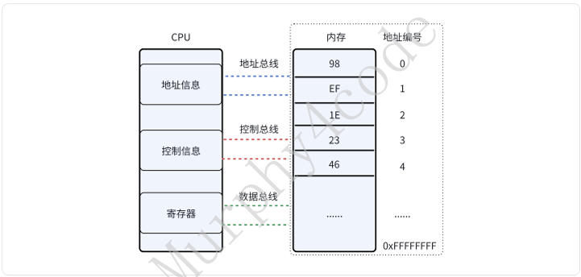

&emsp;&emsp;编译器翻译代码的过程是逐⾏字符解析，所以C语⾔标准⾥⾯预定义了32个有特定意义的"字符 串"，当编译器读到这些字符串就知道程序员想表达的意思。关键字⼤体上可以分成3⼤类：数据类型 关键字、修饰关键字、逻辑关键字。  

### 3.3.1 sizeof关键字  
&emsp;&emsp;sizeof（x）: 编译器给我们查看内存空间容量的⼀个⼯具，在编译时计算并确定出x在内存中所占字节数。  

####  3.3.1.1 sizeof(常量/变量/数据类型)  
sizeof传⼊参数可以是常量、变量、数据类型。  

```c
 #include <stdio.h>

 int main(void)
 {
    int a = 10;

    printf("size of 10 is: %ld \n", sizeof(10));
    printf("size of a is: %ld \n", sizeof(a));
    printf("size of int is: %ld \n", sizeof(int));

    return 0;
 }
 #程序运⾏结果
size of 10 is: 4 
size of a is: 4 
size of int is: 4
```

####  3.3.1.2 sizeof(函数)  
&emsp;&emsp;sizeof传⼊函数时，得到的结果是计算出函数「返回值」的内存空间⼤⼩，函数本⾝不会被调⽤ （侧⾯也反应sizeof是在编译时就计算出空间⼤⼩，⽽不是在运⾏时）。  

```c
#include <stdio.h>

int func(void)
{
    printf("func call \n"); // 这句log不会被打印
    return 0;
}

int main(void)
{
    int a = 10;
    printf("size of func is: %ld \n", sizeof(func()));
    return 0;
}

// 程序运行结果
// size of func is: 4
```


####  3.3.1.3 常被误解成函数  
1、sizeof使⽤时不⼀定要有（），但函数调⽤⼀定要有（）。  

```c
 #include <stdio.h>

 int a = 10;

 int main(void)
 {
    printf("size of a is: %ld", sizeof a);
    return 0;
 };

#程序运⾏结果
size of a is: 4
```

2、翻译成汇编就很清晰看到，sizeof在编译的时候就直接算出内存空间⼤⼩，并没有函数的⼊栈出栈、call操作。可以体会⼀下my_sizeof和sizeof在汇编层⾯上的区别：  

```c
 #include <stdio.h>

 int a = 10;
 int b = 0;
 int c = 0;

 int my_sizeof(int a)
 {
    return sizeof(a);
 }
 int main(void)
 {
    b = sizeof(a);
    c = my_sizeof(a);
    return 0;
 }
```
```c
main:
.LFB1:
    ...
    //b = sizeof(a);
    //编译时，就计算出来b = 4 
    movl    $4, b(%rip)
    //c = my_sizeof(a);
    movl    a(%rip), %eax
    movl    %eax, %edi
    call    my_sizeof
    movl    %eax, c(%rip)
    ···
```

###  3.3.2 数据类型关键字  
&emsp;&emsp;我们知道C语⾔最终是为操作内存资源服务的。那操作内存必然要回答⼀个问题：如何来圈定⼀个 要操作内存的⼤⼩？继续往下看：  



####  3.3.2.1 标准类型  
&emsp;&emsp;C语⾔标准给我们预定义了⼀系列的数据类型，我们逐⼀来思考这些数据类型关键字背后的逻辑是什么  

#####  3.3.2.1.1 char  
&emsp;&emsp;最⼩内存空间的数据类型，也是最适合操作硬件的数据类型。  

&emsp;&emsp;我们知道硬件上最⼩的状态是⾼低电平，对于软件来讲就是0和1状态，那C语⾔中为什么没有bit 这个数据类型关键字呢？因为0-1只有这两个状态，对于内存来讲当然是充分利⽤，但对于CPU来讲处 理效率⾮常低。⽐如要把32（0b100000）这个数据从内存读到CPU内部寄存器，⾄少需要执⾏6个指 令周期（1个指令周期：寻址->发读的控制信息->数据通过数据总线送到寄存器）才能读到0b100000。 所以兼顾CPU性能和内存管理，计算机科学家把操作内存最⼩单位为8bit，也称1byte，也就是char类 型，可以表⽰256种状态。  

&emsp;&emsp;当编译器看到char关键字的时候，就知道圈定的内存⼤⼩是1byte：  

```c
 #include <stdio.h>

 int main(void)
 {
    char a = 9;
    printf("a = %d, size of a is %ld byte \n", a, sizeof(a));
    return 0;
 }
 #程序运⾏结果
 a = 9, size of a is 1 byte
```

<!-- 这是一张图片，ocr 内容为： -->


&emsp;&emsp;所以内存的访问的⽅式分成：标签访问和地址访问。可以这么理解，假设你要去访问你朋友的 家。你朋友带你去就是标签访问，你⾃⼰根据⽬的地导航过去就是地址访问。  

 • 字符空间  

&emsp;&emsp;char类型除了表⽰⼀个具体数字之外，它还可以描述字符空间，即ASCII码。在计算机的世界⾥， 只认识01不认识字符，所以ASCII是⼈为定义的⼀套映射标准(⻅附录7.1)。  

```c
 #include <stdio.h>
 int main(void)
 {
    char a = 'a';
    printf("a = %c, a ASCII = %d \n", a, a);
    return 0;
 }
#程序运⾏结果
a = a, a ASCII = 97
这⾥char a = 'a' 等价于char a = 97
```

#####  3.3.2.1.2 int 
最适合CPU的数据类型，⼤⼩跟编译器有关。  

<!-- 这是一张图片，ocr 内容为： -->


&emsp;&emsp;为了充分发挥CPU的数据处理能⼒，数据总线尽量要充分利⽤，在系统⼀个周期内所能接受的最 ⼤处理单位就是int。所以32位的CPU，int就是32bit（4byte），16位的CPU，int就是16bit （2byte）。对于⼀个数字常量默认就是int的，体会以下代码：  

```c
 #include <stdio.h>
 int main(void)
 {
    int a = 10;

    printf("size of 10 is: %ld \n", sizeof(10));
    printf("size of a is: %ld \n", sizeof(a));
    printf("size of int is: %ld \n", sizeof(int));

    return 0;
 }
 #程序运⾏结果
size of 10 is: 4 
size of a is: 4 
size of int is: 4
```

#####  3.3.2.1.3 short/long 
&emsp;&emsp;short和long关键字本质是修饰int的，只是默认情况下我们⽤short和long类型的时候把int省略 了。⻅名知意，short是减少int的空间，long是加⼤int的空间。具体的⼤⼩，由编译器决定  

```c
 #include <stdio.h>
 int main(void)
 {
    short int a = 1;
    short b = 1;

    long int c = 1;
    long d = 1;
    printf("size, a b: %ld, %ld byte; c d : %ld, %ld byte \n",
        sizeof(a), sizeof(b), sizeof(c), sizeof(d));
    return 0;
 }
 #程序运⾏结果
 size, a b: 2, 2 byte; c d : 8, 8 byte
```

#####  3.3.2.1.4 signed/unsigned 
&emsp;&emsp;这两个关键字⽤于圈定变量的区间范围。signed代表有符号数，最⾼位代表正负（1：代表负， 0：代表正），区间范围从0为⽀点⼀分为半。如，char是8bit，所以signedchar范围[-128,127]， unsigned char范围[0,255]。⼀般情况可以省略signed不写，int、long、short默认就是signed，但 是char在C的标准中，允许定义为signed和unsigned，所以由编译器决定。可以测试⼀下你的机器上 char是否是有符号数：  

```c
 #include <stdio.h>

 int main(void)
 {
    char a = 127;
    if (++a > 127) {
        printf("char is unsigned \n");
    } else {
    printf("char is signed \n");
    }

 return 0;
 }
```

#####  3.3.2.1.5 float/double 
&emsp;&emsp;float和double是浮点类型，即可以表⽰⼩数。float是4字节，double是8个字节。在⼀般的嵌⼊ 式中，浮点的运算相⽐于整形要慢，如果算法没有太⾼的精度要求，建议尽量⽤整形。  

```c
 #include <stdio.h>

 int main(void)
 {
    printf("float：%ld double %ld\n",sizeof(float), sizeof(double));
    return 0;
 }
 #程序运⾏结果
 float：4 double 8
```

&emsp;&emsp;float和double是浮点类型在存储上存在精度，所以不能直接判断是否相等，⽽是⼈为的取⼀个精度，然后判断两个⼩数的模与这个精度的⼤⼩。  

```c
 #include <stdio.h>
 #include <math.h>

 int main(void)
 {
    float a = 1.0;
    float b = 0.1;

    printf("   a = %.10f b = %.10f \n", a, b);
    fabs((a - b) - 0.9) < 0.000001 ?
        printf("   a - b equal 0.9\n") :
        printf("   a - b not equal 0.9 \n");
    return 0;
 }
```

#####  3.3.2.1.6 void 
&emsp;&emsp;void类型不能⽤于定义变量，因为空⼤⼩的内存圈定没有意义。⼀般void⽤于函数占位符、 void*、强制转换防⽌未⽤参数被编译器警告。  

```c
 #include <stdio.h>
 int main(void)
 {
    void a;
    return 0;
 }
 #程序运⾏结果
 1.c: In function ‘main’:
 1.c:5:10: error: variable or field ‘a’ declared void
     5 |     void a;
       |   
```
 占位符：表⽰⽆或者空  

```c
#include <stdio.h>
//表⽰函数没有形参和返回值
 
void main(void)
{
    printf("hello world \n");
}
```

 void *：表⽰数据空间  

```c
#include <stdio.h>
 void data_process(void *data,int len)
 {
    unsigned char* buff = (unsigned char *)data;
    for (int i = 0; i < len; i++) {
        ...
        buff[i];
    }
 }
```

表⽰unused:  

```c
 #include <stdio.h>
 void func(int a)
 {
    int b;
    //解决编译器报警告：参数定义未使⽤
    (void)a;
 }
```

####  3.3.2.2 ⾃定义类型 
&emsp;&emsp;C语⾔默认定义的数据类型，不满⾜实际内存资源分配的。所以C语⾔⽀持在标准类型的基础上， 通过组合来形成新的类型。本质上就是⽀持程序员根据实际需要来圈定内存的⼤⼩。  

<!-- 这是一张图片，ocr 内容为： -->


##### 3.3.2.2.1 struct 
&emsp;&emsp;C语⾔通过struct关键字表⽰新的组合类型，内存表现为累加且对⻬，我们叫这种数据类型为<font style="color:#DF2A3F;">结构体</font>。声明的规则如下：  

```c
struct 名字{
    char b;
    int a;
    ....
 };

Q：下⾯这段代码有分配内存吗？
struct abc {
    int a;
    char b;
};
A:这⾥只是声明，没有分配内存，a和b这⾥代表结构体的成员。
```

结构体的初始化和访问  

```c
#include <stdio.h>
struct abc {
    int a; 
    char b; 
}; 

int main(void)
{
    struct abc c = {
        .a = 1,
        .b = 'c',
    };
    printf("a = %d b = %c \n",c.a, c.b);
    return 0;
}
#程序运⾏结果
a = 1 b = c
```

字节对⻬  

什么是字节对⻬，为什么要字节对⻬？我们来体会⼀下下⾯这个例⼦：  

```c
#include <stdio.h>

struct abc {
    char b;
    int a;  
};

int main(void)
{
    struct abc c = {
        .a = 1,
        .b = 'c',
    };

    printf("int:%zu byte, char:%zu byte, abc:%zu byte\n",
           sizeof(int), sizeof(char), sizeof(struct abc));

    return 0;
}

/*
程序运行结果：
int:4 byte, char:1 byte, abc:8 byte

说明：
结构体大小不是简单相加（1 + 4 = 5），而是变成了 8 byte，
这是因为“内存对齐”机制。

原因：
为了提高 CPU 访问效率（空间换时间），数据需要按对齐边界存储。
例如在 32 位 CPU 中，通常按 4 字节对齐访问。

如果不对齐：
- int 可能跨边界存储
- CPU 需要多次读取再拼接 → 性能下降

对齐后：
- 一次读取完成 → 更高效

Tips1：首地址对齐
结构体的起始地址通常会按最大对齐单位对齐（如 4 字节或 8 字节，依平台而定）

Tips2：边界对齐

1. x86：
   支持非对齐访问（硬件自动处理），但效率较低

2. ARM：
   部分支持非对齐访问（单指令支持，SIMD不支持）

3. MIPS（部分架构）：
   不支持非对齐访问，需要软件处理（异常 + 多次访存），性能更差

总结：
内存对齐是典型的“用空间换时间”的优化策略
*/
```


<!-- 这是一张图片，ocr 内容为： -->


```c
#include <stdio.h>

struct abc1 {
    char b;
    int a;
    short c;
};

struct abc2 {
    char b;
    short c;
    int a;
};

int main(void)
{
    printf("abc1:%zu byte, abc2:%zu byte\n",
           sizeof(struct abc1),
           sizeof(struct abc2));

    return 0;
}

/*
程序运行结果：
abc1:12 byte, abc2:8 byte

问题：
abc1 和 abc2 的内存空间一样吗？

答案：
不一样。

原因：
结构体成员顺序不同，会影响内存对齐和填充字节。
```

attribute((packed)) 

&emsp;&emsp;在数据传输的时候，往往需要知道真实的数据⻓度，这时候可以通过packed属性告诉编译器，不需要做字节对⻬。  

```c
#include <stdio.h>
struct abc {
    char b;
    int a;  
} __attribute__((packed)); 

int main(void)
{
    printf("int:%ld byte, char:%ld byte, abc:%ld byte\n",
        sizeof(int), sizeof(char), sizeof(struct abc));
    return 0;
}
#程序运⾏结果
int:4 byte, char:1 byte, abc:5 byte
```

#####  3.3.2.2.2 union 
&emsp;&emsp;union关键字表⽰新的类型叫联合体，内存表现为：共享⼀份内存(以最⼤数据类型作为分配空间) 和内存的⾸地址。声明的规则如下：  

```c
union 名字
{
    char b;
    int a;
....
};
```

联合体的初始化和访问  

```c
#include <stdio.h>
union abc {
    int a; 
    char b; 
}; 

int main(void)
{
    union abc c = {
        .a = 1,
    };
    printf("a = %d b = %d \n",c.a, c.b);

    c.b = 100;
    printf("a = %d b = %d \n",c.a, c.b);
    return 0;
}

#程序运⾏结果
a = 1 b = 1
a = 100 b = 100
```

<!-- 这是一张图片，ocr 内容为： -->


识别计算机的⼤⼩端  

&emsp;&emsp;⼤⼩端是计算器存储数据的⼀个规则，⼩端是低地址存放低位，⾼地址存放⾼位；⼤端则相反。 ⼀般像x86、arm都是⼩端，51单⽚机是⼤端。两种存储⽅式都是对的，可以通过联合体来判断⼤⼩端 情况。  

<!-- 这是一张图片，ocr 内容为： -->


<!-- 这是一张图片，ocr 内容为： -->


&emsp;&emsp;联合体+结构体设计数据包 在uart、usb、2.4G等等常⻅的数据包传输，会⽤到联合体+结构体的设计，这样的设计拓展性很强，符合开放封闭原则：拓展是开放的，修改是封闭的。可以体会⼀下下⾯这个例⼦：  

```c
 #include <stdio.h>

 struct abc {
    int a;
    short b;
    long c;
 } __attribute__((packed));
 //拓展的数据结构
 
struct efg {
    char e;
    float f;
    int g;
 } __attribute__((packed));

 #pragma anon_unions
 struct package {
    unsigned char id;
    union {
        unsigned char payload[24];
        struct abc a;
        //拓展的数据结构
        struct efg b; 
    };
};

 void send_package(void* data, int len)
 {
    struct package *p = (struct package *)data;

    uart_send(p->id);
    for (int i = 0; i < len; i++) {
        uart_send(p->payload[i]);
    }
 }
```
&emsp;&emsp;可以看到，拓展的数据结构efg,不影响数据传输的功能，即send_package不需要修改。理论上⽀持⽆限制的类型拓展。
#####  3.3.2.2.3 enum  
&emsp;&emsp;enum关键字表⽰的类型叫枚举类型，内存表现为：内存根据定义值的⼤⼩默认选择整数常量⼤⼩ （int），如果超出int⼤⼩，编译器会选择更⼤的整型类型，⽐如long，所以内存⼤⼩不是固定的。 声明的规则如下：  

```c
enum 名字{
    A = 200,
    B = 300,
    C = 321
 };
```

enum的初始化和访问  

```c
 #include <stdio.h>
 enum abc {
    A = 0,
    B = 1,
    C = 3,
    D
 };
 enum efg {
    E = 0x123456789,
    F,
    G
 };
 
int main(void)
 {
    printf("a = %d, b = %d, c = %d, d = %d\n",A, B, C, D);
    printf("size of a = %ld, abc = %ld\n",sizeof(A), sizeof(enum abc));
    printf("size of E = %ld, abc = %ld\n",sizeof(E), sizeof(enum efg));
    return 0;
 }
 #程序运⾏结果
 a = 0, b = 1, c = 3, d = 4
 size of a = 4, abc = 4 //int
 size of E = 8, efg = 8 //long int
```

 enum在C语⾔中只是⼀个建议性关键字  

```c
 #include <stdio.h>

 enum abc {
    A = 0,
    B = 1,
    C = 3,
    D
 };

 enum abc func(void)
 {
    return 10;
 }

 int main(void)
 {
    enum abc a = func();

    printf("a = %d \n", a);
    return 0;
 }
 #程序运⾏结果
 a = 10
 Tips: 在C++ 11这会编译报错。
```

enum和宏的差别  

```c
 #define A 0
 #define B 1
 #define C 3
 #define D 4

 enum abc {
    A = 0,
    B = 1,
    C = 3,
    D
 };

在C语⾔中，对于上⾯这段代码使⽤上⼏乎等价。
```

####  3.3.2.3 地址（指针）类型  
&emsp;&emsp;C语⾔中，地址类型也称指针类型，圈定的内存⽤来存放地址编号的值。指针类型的内存表现跟<font style="color:#DF2A3F;">编译器有关或者说跟CPU的地址总线有关</font>。在32位的系统中，指针类型占⽤4byte，在64位的系统中， 指针类型占⽤8byte。  

<!-- 这是一张图片，ocr 内容为： -->


声明的规则如下：  

`数据类型 *  `

指针变量初始化和访问  

```c
#include <stdio.h>
 int main(void)
 {
    int a = 10; 
    int *p = &a;
    
    printf("symbol visit：a = %d, addr visit：a = %d\n", a, *p);
    return 0;
 }
 #程序运⾏结果
 symbol visit：a = 10, addr visit：a = 10

1、⾸先，p也是⼀个变量（没啥神秘的），这本质上也是圈定⼀块内存，内存的⼤⼩跟编译器有关，p是这块内存的标签。到这⾥p和a的在变量的视⻆中⼀摸⼀样
2、然后，p的特殊性在于，它圈定的那块内存，存放的不是⼀般的值⽽是⼀个地址编号。所以除了通过标签p读出这个地址编号外，C语⾔还提供⼀种直接访问这个地址编号的⽅法，那就是在p前⾯加⼀个*号。

举⼀个形象的例⼦：
你要去访问A朋友家，第⼀种是直接让A带你去，第⼆种是P知道A家的地址，通过P带你去。a 和 *p就是这种感
```

<!-- 这是一张图片，ocr 内容为： -->


指针类型的内存⼤⼩跟数据类型没有关系

```c
 #include <stdio.h>

 struct abc {
    int a;
    int b;
    float c;
 };

 int main(void)
 {
    char *p1; 
    int *p2 ;
    struct abc *p3;
    printf("size of p1:%ld, p2:%ld, p3:%ld\n", sizeof(p1), sizeof(p2), sizeof(p3));
    return 0;
 }
#程序运⾏结果
size of p1:8, p2:8, p3:8
```

后续会有专⻔的⼀part来介绍指针的使⽤，⼤家先了解指针类型的基本思想。  

####  3.3.2.4 typedef  
&emsp;&emsp;typedef关键字是给数据类型起⼀个别名，让程序的可读性更⾼，特别是复杂的类型（如函数指针类型），做到⻅字知意。使⽤的规则如下： 

`typedef 数据类型 别名  `

```c
 #include <stdio.h>
 typedef struct abc {
    int a;
    int b;
    float c;
 } abc_t;
 
 typedef int len_t;
 typedef unsigned char uint8_t;
 typedef void (func*)(void);
 func p;

 int main(void)
 {
    len_t a = 0; 
    uint8_t b;
    abc_t c;

    return 0;
 }
```

```c
#include <stdio.h>

typedef void (*func)(void);

void hello()
{
    printf("Hello\n");
}

int main()
{
    func f;   // 定义函数指针
    f = hello;

    f();      // 调用函数

    return 0;
}
```

```plain
f = hello;
```

👉 本质是：

**函数名 **`hello`** 在这里会“退化”为函数地址（指针）**

所以：

```plain
f = hello;
```

等价于：

```plain
f = &hello;
```

`f()`; // 写法1=`(*f)()`; // 写法2

体会typedef和#define的区别  

```c
 #include <stdio.h>

 #define uint8 unsigned char
 typedef unsigned char uint8_t;

 int main(void)
 {
 uint8 a = 'c';
 uint8_t b = 'c';

 printf("a = %c, b = %c \n", a, b);
 return 0;
 }

#程序运⾏结果
a = c, b = c
```

```c
 #include <stdio.h>

 #define uchar_p unsigned char *
 typedef unsigned char * uint8_p;

 int main(void)
 {
    uchar_p a, b;
    uint8_p c, d;

    a = "hello";
    b = "hello";//这⾥b是unsigned char，不是unsigned char * 
    c = "hello";
    d = "hello";
    
    return 0;
 }

#程序运⾏结果
 1.c: In function ‘main’:
 1.c:12:7: warning: assignment to ‘unsigned char’ from ‘char *’ makes integer 
 from pointer without a cast [-Wint-conversion]
      12 |    b = "hello";//
         | 

 #宏展开后的结果：
 typedef unsigned char * uint8_p;

 int main(void)
 {
    unsigned char * a, b;//b 是unsigned char 
    uint8_p c, d;

    a = "hello";
    b = "hello";
    c = "hello";
    d = "hello";
    
    return 0;
 }

```

### 3.3.3 修饰关键字
&emsp;&emsp;我们知道数据类型关键字的作⽤是告诉编译器圈定内存的⼤⼩。但实际⼯程应⽤中，只有⼤⼩的限制是不够的。想⼀想，我们的内存空间这么⼤（32位系统为例，有4G的内存寻址空间），该从哪个地⽅圈定内存呢？是全部区域都可以吗？分配给你的内存空间，要不要有些操作做限定呢？这些都是需要修饰关键字来告诉编译器该怎么来做。

#### 3.3.3.1 auto
&emsp;&emsp;关键字是最⽆感的存在。编译器在默认缺省的情况下，所有变量都是auto的。你就当做它不 存在，不曾来过。  

#### 3.3.3.2 register 
&emsp;&emsp;register关键字是⼀个建议性关键字。设计的初衷是想要定义的变量放到cpu的寄存器中，但是往 往编译器看到这个关键字的时候，发出⼀句呐喊：⾂妾做不到啊。寄存器相对于内存，cpu在访问速度 上更快，但也很稀缺，不是说想放就放的。所以编译器只能尽量的去做，它不保证⼀定能做得到，⼤ 家也就不要奢望了。但值得注意的是加上register修饰后的变量，⽆法通过&来取地址。即使⼤概率放进寄存器会失败，但编译器就不给你寻址，万⼀成功了呢？编译器还是有梦想的。  

```c
 #include <stdio.h>
 int main(void)
 {
    register char a = 1;
    printf("a = %d , addr of a:%p", a, &a);

    return 0;
 }

 #程序运⾏结果
 
 1.c: In function ‘main’:
 1.c:6:5: error: address of global register variable ‘a’ requested
     6 |     printf("a = %d , addr of a:%p", a, &a);
       |     ^~~~~~
```

####  3.3.3.3 static 
&emsp;&emsp;在C语⾔中static关键字有两个作⽤：1、变量的内存从静态全局数据区分配；2、限定变量或函数的作⽤域 

##### 3.3.3.3.1 修饰变量 
&emsp;&emsp;⽣命周期：不管是修饰局部变量还是全局变量，最后都在静态全局数据区分配。这意味着变量在整 个程序的⽣命周期内都是有效合法的。  

```c
 #include <stdio.h>

 static int a = 20;
 int func(void)
 {
    static int b = 10;
    return ++b;
 }

 int main(void)
 {
    printf("a = %d , b = %d ,b = %d \n", a, func(), func());
    return 0;
 }
 #程序运⾏结果
 a = 20 , b = 12 ,b = 11
```

&emsp;&emsp;限定范围：限定全局变量只在当前定义的⽂件可⻅，其他⽂件即使加上extern修饰，也⽆法引⽤。 会编译报错  

```c
 //1.c
 #include <stdio.h>

 static int a = 20;

 int main(void)
 {
    printf("a = %d\n", a);
    return 0;
 }

 //2.c
 extern int a;
 int func(void)
 {
    return ++a;
 }

#程序运⾏结果
 
/usr/bin/ld: 2.o: in function `func':
2.c:(.text+0xa): undefined reference to `a'
/usr/bin/ld: 2.c:(.text+0x13): undefined reference to `a'
/usr/bin/ld: 2.c:(.text+0x19): undefined reference to `a'
collect2: error: ld returned 1 exit status
```

#####  3.3.3.3.2 修饰函数  
&emsp;&emsp;限定范围：限定函数在当前定义的⽂件可⻅，其他⽂件不可引⽤，但可以实现相同名字的函数(也需要⽤static修饰)，互不影响。感受⼀下下⾯这个例⼦：  

```c
//1.c
 #include <stdio.h>

 static int a = 20;
 static int func(void)
 {
    return ++a;
 }

 int main(void)
 {
    printf("a = %d\n", func());
    return 0;
 }

 //2.c
 static int a = 10;
 static int func(void)
 {
    return ++a;
 }
 #程序运⾏结果 
 a = 21
```

#### 3.3.3.4 extern  
&emsp;&emsp;extern⽤来声明⼀个没有被static修饰的变量或者函数  

```c
 //1.c
 #include <stdio.h>

 extern int func(void); 
 int main(void)
 {
    func();
    return 0;
 }

 //2.c
 #include <stdio.h>
 int func(void)
 {
    printf("func call \n");
 }
 #程序运⾏结果
 func call
```

在架构设计中尽量不要⽤extern，会导致代码耦合度⾮常⾼⽽且不太可控。建议参考如下⽅案：  

```c
//1.c
 #include <stdio.h>
 #include "2.h"

 int main(void)
 {
    set_a(20);
    printf("a = %d\n", read_a());
    return 0;
 }

 //2.h
 void set_a(int value);
 int read_a(void);

 //2.c
 static int a = 10;
 void set_a(int value)
 {
    mutex_lock();
    a = value;
    mutex_unlock();
 }
 int read_a(void)
 {
    return a;  
 }
```

&emsp;&emsp;extern "C"，⽤C++的编译器（g++）按照C的规则进⾏编译。C++和C语⾔在编译规则上有很多不同，所以在C++中想完全复⽤C写的代码，就可以⽤extern"C"来修饰。这种在C++使⽤C的lib库的时候⽐较常⻅。另外，⾯试也很喜欢问这个。

```c
#include <stdio.h>
 void func(void)
 {
    printf("func call \n");
 }
//FPIC ⽣成的so库跟绝对代码位置⽆关，可以在任意位置被引⽤
//-shared 共享库
gcc -o libfunc.so 2.c -fPIC -shared
```

```c
 #include <stdio.h>

 #if defined(__cplusplus)
 extern "C" {
 #endif
 void func(void);
 #if defined(__cplusplus)
 }
 #endif

 int main(void)
 {   
    func();
    return 0;
 }

 export LD_LIBRARY_PATH=$LD_LIBRARY_PATH:./
 g++ -o bin 1.c -lfunc -L.
 ./bin
 #程序运⾏结果 
 func call
```

为什么定义两个`#if defined(__cplusplus)`  ？

其实不是“写了两次判断”，而是**一对“开括号 / 关括号”保护**，作用非常关键👇  

####  3.3.3.5 const  
&emsp;&emsp;const是constant的缩写，是恒定不变的意思，被修饰的变量经常被⼈误解成常数或者常量。这个 理解不太准确，准确的理解应该是readonly。本质上还是变量，编译器只能尽量的不让你去修改，但 是实际上总有⼀些⽅法可以做到修改const修饰变量的值，往往都是⼀些异常的操作导致（⽐如数组越 界、指针越界访问、栈溢出等等）。我们要建⽴⼀个正确的编程理念：const修饰的变量技术上能改， 但是不要去改。  

```c
const 数据类型 变量名 or 数据类型 const 变量名

 #include <stdio.h>

 int main(void)
 {
 const int a = 10;
 int const b = 20;
 //a = 20;//编译错误,编译不给修改
 
 printf("a = %d, b = %d\n", a, b);
 return 0;
 }
```

修改const修饰的变量  

```c
 #include <stdio.h>

 int main(void)
 {
    int a = 1234568;
    const int b = 11111111;
    int *p = &a;

    p[1] = 22222222;
    printf("b = %d \n", b);
    return 0;
 }
```

const 修饰指针  

&emsp;&emsp;很多同学对const修饰指针变量，有时候分不清楚是修饰指针变量还是限定指针指向的内容。今天 教⼤家⼀个⽅法，叫"<font style="color:#DF2A3F;">近⽔楼台先得⽉</font>"： 

```c
 #include <stdio.h>

    const int * a;  //-> const * a ->靠近*，所以地址指向的内容（*a）不能变
    int const * b;  //-> const * b ->靠近*，所以地址指向的内容（*d）不能变
    int * const c;  //-> * const c ->靠近c，所以c指针变量不能变
    const int * const d; //-> const * const d ->靠近 * ⼜靠近c，所以d和*d都不能变

int main(void)
 {
    //下⾯5个语句编译器会报错拦截
    *a = 1;
    *b = 1;
    c = 1;
    *d = 1;
    d = 1;

    return 0;
 }

 //
编译器报错
 
 1.c: In function ‘main’:
 1.c:11:8: error: assignment of read-only location ‘*a’
     11 |     *a = 1;
        |        ^
 1.c:12:8: error: assignment of read-only location ‘*b’
     12 |     *b = 1;
        |        
        ^
 1.c:13:7: error: assignment of read-only variable ‘c’
     13 |     c = 1;
        |       
        ^
 1.c:14:8: error: assignment of read-only location ‘*d’
     14 |     *d = 1;
        |        
        ^
 1.c:15:7: error: assignment of read-only variable ‘d’
     15 |     d = 1;
        |        
        ^
```

&emsp;&emsp;使⽤const可以提⾼运⾏效率：如果⽤const修饰，编译器会直接把⽴即数200赋值给变量a，⽽没有 const修饰的则每次都需要读取内存中ABC值。这样⽤const修饰时，执⾏效率就⽐较⾼（我们知道 读取内存是相对慢的操作）。  

```c
 #include <stdio.h>

 const int ABC = 200;

int main(void)
 {
    int a = ABC; 
    return 0;
 }

 //int a = ABC;
 movl    ABC(%rip), %eax //把内存中ABC的值读到寄存器中去
 movl    %eax, -4(%rbp)

 //const int a = ABC;
 movl    $200, -4(%rbp)
```

const和宏的区别 

const设计的初衷就是为了代替宏，消除它的缺点，继承它的优点。 

1. 编译器处理⽅式：define宏是在预处理阶段展开；const变量是编译运⾏阶段使⽤ 

2. 安全检查：define宏不做任何类型检查，仅仅是展开；const变量编译阶段会执⾏类型检查 

3. 内存位置：define宏在代码段；const常量可以在静态全局数据段、栈中  

####  3.3.3.6 volatile 
&emsp;&emsp;volatile关键字⽤于告诉编译器，被声明为volatile的变量的值可能在程序的控制之外发⽣变化， 因此编译器不应该对其进⾏某些优化。主要⽤于处理硬件寄存器、中断服务程序和多线程等情况：下⾯如果buff变量是uart的DR寄存器映射，即使代码中没有地⽅更新buff的值，也应该告诉编译器不要优化，如果有地⽅读取buff的值的时候，都需要从内存中读取，因为外部uart会触发更新。  

```c
 #include <stdio.h>

 volatile unsigned char buff;

 int main(void)
 {    
    while (buff) {//等待buff不为0 
            //do something
    }
    return 0;
 }
```

<!-- 这是一张图片，ocr 内容为： -->


体会⼀下下⾯这个例⼦：  

```c
 #include <stdio.h>
 #include <stdlib.h>
 #include <unistd.h>
 #include <pthread.h>

 static volatile int wait = 1;

 void* function(void* arg)
 {
    while (1) {
        sleep(1);
        wait = 0;
        printf("flag wait = %d in thread \n", wait);
    }
    return NULL;
 }
 int main(void)
 {
    pthread_t tid;
    pthread_create(&tid, NULL, function, NULL);

    while(wait);
    printf("flag wait = %d in main \n", wait);
    return 0;
 }

 gcc -o bin 1.c -lpthread -O3
 ./bin
 #程序运⾏结果

 当wait不加volatile时，程序出现死循环
//不加volatile时，while(wait)
        movl    wait(%rip), %eax
        testl   %eax, %eax
        je      .L6

.L7:
        jmp     .L7

//加volatile时，while(wait)
.L6:
        movl    wait(%rip), %eax  
        testl   %eax, %eax
        jne     .L6

```

###  3.3.4 逻辑关键字  
&emsp;&emsp;在cpu的眼⾥很单纯，程序指针（PC）指到哪⾥就执⾏哪⾥，默认情况下顺序往下执⾏，⽽逻辑关键字作⽤就是改变PC指针的指向，这个最基本的思想就构成了程序⾥各种逻辑设计（条件、选择、 跳转、循环）。  

<!-- 这是一张图片，ocr 内容为： -->


####  3.3.4.1 条件：if、else  
 条件逻辑关键字，判断条件表达式是否为真，为真后停⽌判断并进⼊处理对应逻辑。  

```c
if (条件表达式)
    xx;
//表达式为真，进来此分⽀
 
else if(条件表达式)
    yy;
....
else
    zz;
```

```c
 #include <stdio.h>

 int main(void)
 {
    int a = 2;

    if (a == 1) {
        printf("hello 1 \n");
    } else if (2 == a) {
        printf("hello 2 \n");
    } else {
        printf("hello a = %d \n", a);
    }
    return 0;
 }
 #程序运⾏结果
 hello 2
```

####  3.3.4.2 选择：swtich、case、default 
选择逻辑关键字基于某个表达式的值选择不同的执⾏路径。它的基本语法如下：  

```C
switch (表达式 整形数字) {
    case 值1:
        // 当表达式等于值1时执⾏的代码
        break;
    case 值2:
        // 当表达式等于值2时执⾏的代码
        break;
 //....
    default:
        // 如果表达式的值与所有case不匹配时执⾏的代码
}
```

```C
 #include <stdio.h>

 int main(void)
 {
    int a = 2;

    switch (a) {
    case 1:
        printf("hello 1 \n");
        break;
    case 2:
        printf("hello 2 \n");
        break;
    default:
        printf("hello a = %d \n", a);
    }
    return 0;
 }

 #程序运⾏结果
 hello 2
 
 Tips：
1、每个case块末尾都需要有break语句，否则将继续执⾏后⾯的case块，直到遇到break或者switch结束。
2、switch条件不能是浮点数.

#程序运⾏结果
1.c: In function ‘main’:
1.c:7:13: error: switch quantity not an integer
    7 |     switch (1.1) {
      | 
```

#### 3.3.4.3 循环：do、while、for
do-while循环是C语⾔中的⼀种循环结构，它的基本语法如下：

```C
 while (条件) {
 // 循环体
};

do {
// 循环体
 // 这⾥的代码⾄少会执⾏⼀次
 } while (条件);

 do-while与while循环不同的是，do-while循环会先执⾏⼀次循环体，然后检查条件，如果条件为真，循环将继续执⾏，这确保循环体⾄少被执⾏⼀次。
```
```C
 #include <stdio.h>

 int main() 
 {
    int number;
    do {
        printf("please enter a positive number: ");
        scanf("%d", &number);

        if (number <= 0) {
            printf("ensure positive number entered \n");
        }
    } while (number <= 0);
    printf("positive number：%d\n", number);
    return 0;
 }
 #程序运⾏结果
 please enter a positive number: 1
 positive number：1
```
for 也是另⼀种循环结构，它的基本语法如下：

```C
for (初始化;  条件表达式; 条件更新) {
 //循环体->条件表达式为真时进来
}
 Tips：养成好的习惯，条件的更新不要在循环体⾥进⾏更新，容易出现死循环
```

```C
#include <stdio.h>

int main() 
{
    for (int i = 0; i < 5; i++) {
        printf("i = %d \n", i);
    }
    return 0;
}
#程序运⾏结果
i = 0 
i = 1 
i = 2 
i = 3 
i = 4 
```
do-while 和for怎么选

⼀般是：某个条件不满⾜时退出循环，⽤do-while或者while，⽽靠计数结束退出循环，⽤for。

```C
#include <stdio.h>

void main() 
{
    while(1) {
    }

    for(;;) {

    }
}

单⽚机中有两种死循环的写法？你⼀般⽤哪种？
(不⽤纠结，⽤哪种都可以，基本没有什么区别)
```

####  3.3.4.4 跳转：continue、break、return、goto 
&emsp;&emsp;continue、break⼀般结合循环来⽤：continue跳过以下的循环体，进⾏下⼀轮循环，break提前 结束循环。  

```C
 #include <stdio.h>
 int main() 
 {
    for (int i = 0; i < 5; i++) {
        if (i == 1) {
            continue;
        } else if (i == 4) {
        break;
        }

        printf("i = %d \n", i);
    }
    return 0;
 }
 #程序运⾏结果
i = 0 
//i = 1 不打印是因为continue跳过了
i = 2 
i = 3 
//i = 4 不打印是因为break直接结束循环了
 
```

return 结束本次的函数执⾏，⾄多可带⼀个数值返回。  

```C
 #include <stdio.h>

 int func(void)
 {
    for (int i = 0; i < 5; i++) {
        if (i == 4) {
            return i;
    }
    printf("i = %d \n", i);
    }
    printf("func end\n");
 }
 int main()
 {
 printf("value:%d of func return \n", func());
 return 0;
 }
 #
程序运⾏结果
 
i = 0 
i = 1 
i = 2 
i = 3 
//i = 4 
和
 func end 
不打印是因为
return
直接结束了
func 
value:4 of func return 
```

&emsp;&emsp;goto：直接跳转到对于label位置执⾏。尽管在许多编程⻛格中，使⽤goto被视为不推荐的实践， 因为它可能导致代码不易理解和维护，但有时候它可以⽤于⼀些特殊的控制流需求（linux的源码中 有⼤量的使⽤）。建议是在同⼀个函数内⽤，不要在不同函数直接跳，程序会把你逼疯的。它的基 本语法如下：  

<!-- 这是一张图片，ocr 内容为： -->


<!-- 这是一张图片，ocr 内容为： -->


<!-- 这是一张图片，ocr 内容为： -->
