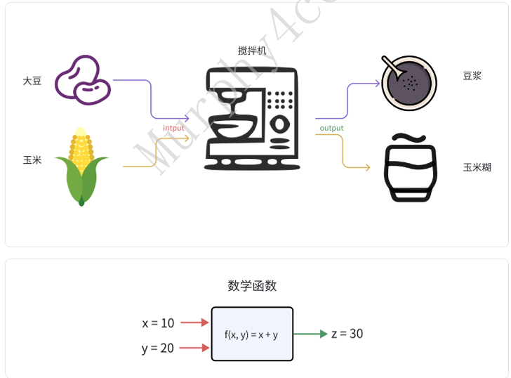

&emsp;&emsp;希望⼤家养成⼀个好的编程"洁癖"：Don't Repeat Yourself，不要写重复的代码。所以当别⼈问你函数有什么⽤时，你就可以这么回答他。C语⾔是⼀个⾯向过程的语⾔，即⾯向⽅法（函数）编程 （C++/Java是⾯向对象编程），所以理解和应⽤函数的重要性不⾔⽽喻。  

```c
//取绝对值的逻辑
if (a < 0) 
    a = -a;
else
    a = a; 

int abs(int a)
{
    if (a < 0) 
        a = -a;
    else
        a = a; 
    return a;
```

&emsp;&emsp;啥是函数？函数的英⽂是"function"，翻译过来就是功能。所以函数字⾯意思就是：封装⼀些逻 辑，实现⼀个功能。举⼀个例⼦：  



###  4.1.1 函数三⼤属性  
&emsp;&emsp;把上⾯那个例⼦进⾏抽象，就可以得到函数的三⼤属性：输⼊参数、返回值、函数名。  

```c
1. 函数名（地址）
2. 输⼊参数(可多个)
3. 返回值（⾄多⼀个）

输出: 函数名: 输⼊
int function(int,char)
{
    xxx
}

Tips：编译器只要看到有这三到属性，就判定为函数（即使函数体是空的）
```

函数名本质上是⼀个地址标签。如果知道函数的地址，就可以直接⽤()调过去

```c
#include <stdio.h>

int function(int a, int b)
{
    return (a + b);
}

void main(void)
{
    function(1, 2);
}

通过命令：objdump -d bin > bin.s 进行反汇编到：

0000000000001129 <function>:
    1129:   f3 0f 1e fa             endbr64
    112d:   55                      push   %rbp
    112e:   48 89 e5                mov    %rsp,%rbp
    1131:   89 7d fc                mov    %edi,-0x4(%rbp)
    1134:   89 75 f8                mov    %esi,-0x8(%rbp)
    1137:   8b 55 fc                mov    -0x4(%rbp),%edx
    113a:   8b 45 f8                mov    -0x8(%rbp),%eax
    113d:   01 d0                   add    %edx,%eax
    113f:   5d                      pop    %rbp
    1140:   c3                      retq

0000000000001141 <main>:
    1141:   f3 0f 1e fa             endbr64
    1145:   55                      push   %rbp
    1146:   48 89 e5                mov    %rsp,%rbp
    1149:   be 02 00 00 00          mov    $0x2,%esi
    114e:   bf 01 00 00 00          mov    $0x1,%edi
    1153:   e8 d1 ff ff ff          callq  1129 <function>
    1158:   90                      nop
    1159:   5d                      pop    %rbp
    115a:   c3                      retq
    115b:   0f 1f 44 00 00          nopl   0x0(%rax,%rax,1)
```

```c
 //函数名本质上是⼀个地址，体会下⾯的例⼦
 #include <stdio.h>
 #include <stdlib.h>
 #include <string.h>
 //extern int printf (const char *__restrict __format, ...)
 int (*show)(const char *, ...);
 void func(void)
 {
    show = printf;
    show("func call \n");
 }

 int main(void)
 {
    func();
    return 0;
 }
 #
程序运⾏结果：
 
func call
```

###  4.1.2 参数传递
####  4.1.2.1 参数传递的本质  
&emsp;&emsp;调⽤函数时，需要传⼊和返回参数。传⼊和返回的参数过程本质上是：<font style="color:#DF2A3F;">内存拷⻉</font>。既然是拷⻉， 那⼀定存在两个对象：⽬的地（dest），源（src）。在C语⾔中，传⼊参数时，⽬的地叫<font style="color:#DF2A3F;">形参</font>、源叫<font style="color:#DF2A3F;">实参</font>；返回参数时，⽬的地和源都叫返回值。 

```c
 #include <stdio.h>
 int show(int a) //a 是形参，传递过程，就把num的值拷⻉给了a 
 {
    printf("%d \n", a);
    a++;

    return a;//a此时是返回值
 }

 void main(void)
 {
    int num = 10086;
    int ret = 0;
    
    //num 是实参
    ret = show(num); // show函数返回a的值会拷⻉给ret 
 }
```

####  4.1.2.2 值传递  
&emsp;&emsp;因为存在拷⻉的机制，值传递的时，不会对调⽤者的源数据进⾏破坏，所以值传递对数据起到保护和隔离的作⽤。体会⼀下下⾯的例⼦：  

```c
 #include <stdio.h>
 int show(int a)
 {
    a++;
    printf("a in show %d \n", a);
    return a;
 }

 void main(void)
 {
    int num = 10086;//源数据
    int ret = 0;//返回值
    
    ret = show(num); 
    printf("a in main %d ,ret = %d \n", num, ret);
 }
#程序运⾏结果：
a in show 10087 
a in main 10086 ,ret = 10087
```

&emsp;&emsp;另外，⼤家要养成⼀个思维习惯：当函数结束时，函数⾥的局部变量（形参也是局部变量）都会 被"销毁"，即使内存中原来的值还存在，但已经不受到系统保护，数据随时可能被覆盖、改写等等。 所以当我们要返回⼀个局部变量的指针时，需要考虑指针指向的内存的⽣命周期。  

&emsp;&emsp;恢复栈中的局部变量：在分析crash问题的时，通常需要分析调⽤栈，可以通过保存之前的栈针地址，查看原来内存的值。可参考：  

```c
 #include <stdio.h>
 static unsigned long addr = 0;
 void show(void)
 {   
    int a = 10086;
    int b = 10010;
    
    asm volatile("movq %rbp, addr(%rip)");
 }

 void main(void)
 {
    show();

    int *p = (int*)addr;
    printf("show bp = 0x%lx, a = %d, b = %d \n",addr, p[-1], p[-2]);
 }
#程序运⾏结果：
show bp = 0x7fffff2cacb0, a = 10010, b = 10086
```

#### 4.1.2.3 地址传递
&emsp;&emsp;地址传递本质上跟值传递⼀样，只不过这个值有特殊的含义：代表了⼀个地址编号。地址传递⼀般⽤于返回结果和连续空间传递。

#####  4.1.2.3.1 形参当做返回值  
```c
 #include <stdio.h>

 int func(void)
 {   
    return 100 * 2;
 }

 void main(void)
 {
    int ret;

    ret = func();
    
    printf("ret = %d \n", r1);
 }
#程序运⾏结果：
ret = 200
```

#####  4.1.2.3.2 多值返回 
&emsp;&emsp;我们知道，函数返回return后⾯只能带有⼀个值，所以如果有多个值需要返回的需求，可以利⽤地址传递来做，⽐如，可以这样设计：  

```c
 #include <stdio.h>

 int func(int *r1, int* r2)
 {  

    if (!r1 || !r2) {
        return -1;
    }

    *r1 = 100 * 2;
    *r2 = 200 * 2;

    return 0;
 }

 void main(void)
 {
    int ret, r1, r2;

    ret = func(&r1, &r2);
    printf("ret = %d, a = %d, b = %d \n",ret, r1, r2);
 }
#程序运⾏结果：
ret = 0, a = 200, b = 1000
Tips: 在这种情况下，这⾥的返回值ret代表的是func运⾏是否存在异常
（linux 中0 代表正常，⾮零代表异常），⼤家可以借鉴这个设计思想。
```

#####  4.1.2.3.3 连续空间传递  
&emsp;&emsp;因为参数传递是内存拷⻉，所以如果传⼊的参数是⼀⽚连续的空间，那每次调⽤都会进⾏冗余的内存分配，造成内存不必要的浪费。所以连续空间，⼀般都是传这⽚空间的⾸地址。  

```c
 #include <stdio.h>

 struct abc {
 int a;
 int b;
 int c;
 };

 int func(struct abc *p, int b[])
 {   
    printf("a = %d, b = %d, c = %d \n", p->a, p->b, p->c);
    printf("%d, %d,\n", b[0], b[1]);
    return 0;
 }

 void main(void)
 {
    int ret = 0;
    struct abc a = {
        .a = 1,
        .b = 2,
        .c = 3,
    };
    int b[2] = {4,5};
    
    ret = func(&a, b);
 }

#程序运⾏结果：
a = 1, b = 2, c = 3 
4, 5
```

1. ⾮字符空间  

&emsp;&emsp;对于⾮字符空间，在函数设计的时候，需要传⼊连续地址的⻓度，否则默认为是返回结果的设计。  

```c
 #include <stdio.h>

 int func(int *p, int len)
 {   
    int i;

    for(i = 0;i < len ; i++) {
        printf("%d ", p[i]);
    }
    return 0;
 }

 void main(void)
 {
    int ret;
    int arr[2] = {1,2};
    
    ret = func(arr, 2);
 }
#程序运⾏结果：
1 2 
#系统函数
void *memcpy(void *dest, const void *src, size_t n);
```

2. 字符空间  

&emsp;&emsp;在C语⾔中，字符空间的结束符是'\0'，所以默认情况下，传⼊字符空间可以不⽤传⼊字符传的⻓ 度。如：  

```c
 #include <stdio.h>

 int func(const char *s)
 {   
    int i = 0;
    while (s[i] != 0) {
        printf("%c", s[i]);
    i++;
    }
    printf("\n");
    return 0;
 }

 void main(void)
 {
    int ret = 0;
    ret = func("hello world");
 }
#程序运⾏结果：
hello world

#系统函数
char *strcpy(char *dest, const char *src);
size_t strlen(const char *s)
```